# 使用熊猫简化数据集清理

> 原文：<https://towardsdatascience.com/simplify-your-dataset-cleaning-with-pandas-75951b23568e?source=collection_archive---------3----------------------->


Photo by [Markus Spiske](https://unsplash.com/@markusspiske?utm_source=medium&utm_medium=referral) on [Unsplash](https://unsplash.com?utm_source=medium&utm_medium=referral)

我听到很多分析师/数据科学家说他们花了大部分时间清理数据。你可能已经看过很多清理数据集的教程，但你可能已经知道:它永远不会是 100%干净的，在继续阅读本文之前，你必须理解这一点。所以我实话实说:我不会给你一个神奇的方法来解决你的数据集可能存在的所有数据问题。清理规则取决于您正在处理的域和项目的上下文。本文中的例子来自我自己在现实世界中处理数据的经验。

我已经处理了本文中详述的所有问题/过程。有时问题可能来自数据源本身，您必须清理它，有时只是您的同事或经理要求最终文件中的某些特定字段。欢迎在评论中分享你从经历中看到的主要问题。

# 开始前你需要什么

## 计算机编程语言

您需要最新的 Python 版本:3.7+。我推荐使用 [Anaconda 发行版](https://www.anaconda.com/distribution/)来获得 Python、Pandas 和 Jupyter。如果您已经安装了 Anaconda，请忽略以下两个命令。

## **Seaborn**

```
pip install seaborn
```

## 熊猫

```
pip install pandas
```

## Jupyter 笔记本

```
pip install jupyter
```

# 开始工作

让我们从我在 [Kaggle](https://www.kaggle.com/eliasdabbas/search-engine-results-flights-tickets-keywords) 上找到的一个基本数据集开始。这个数据集是在 Google 上搜索“航班”和“机票”的搜索结果报告。当你在谷歌上搜索一个查询时,“有机的”结果会在搜索结果页面中排名，在这个数据集中每个查询只列出 10 个。正如您所猜测的，我们可能会在某些字段中遇到重复项。

我们将讨论以下主题:

1.  **删除无用字符**
2.  **从系列中提取相关内容**
3.  **检查 NaN 值**
4.  **更改系列的类型**

打开新的 Jupyter 笔记本并导入数据集:

```
import os
import pandas as pddf = pd.read_csv('flights_tickets_serp2018-12-16.csv')
```

我们可以使用 3 个神奇的函数快速检查数据集的外观:

*   。info():显示行数和类型

```
df.info()
```

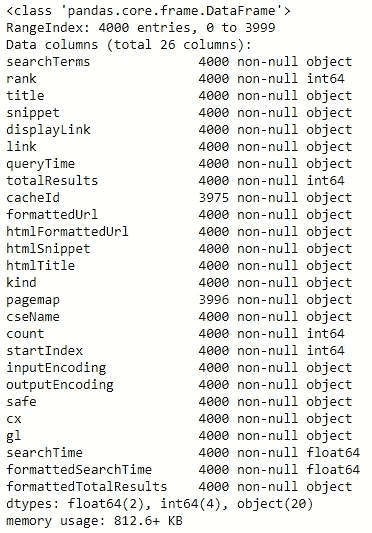

*   。describe():显示数据集中每个数字列的主要统计信息

```
df.describe()
```

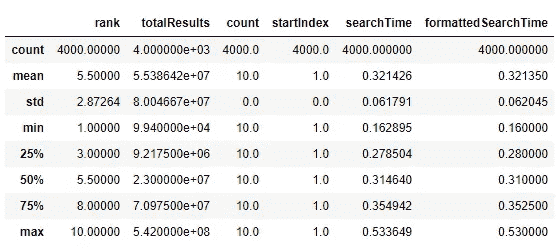

*   。head():显示数据集的前 5 行(可以通过传递一个整数作为参数来更改这个数字)

```
df.head()
```

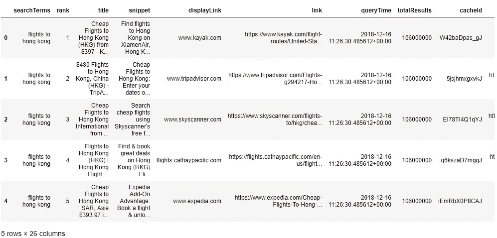

我们甚至可以显示列名，因为我们有太多的列名，它们不适合显示在屏幕上:

```
df.columns
```

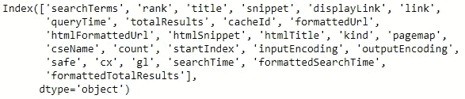

现在我们对我们正在处理的事情有了更好的认识。从这一点出发，根据你公司的环境和你的目标，你不会寻找同样的东西。此外，如果这个数据集将被用来为机器学习算法提供训练，或者如果你需要为你的经理运行分析，你的输出数据帧看起来不会一样。但这不是这里的主题。我们继续第一个话题。

# 1.删除无用字符

为什么我们要删除充满数据的数据集中的字符？嗯，数据集并不总是为你的个人用例而构建的，而是为多种用途而构建的。同样，根据你的项目，你的关注点会有所不同。

在你从事 NLP(=自然语言处理)项目的情况下，你需要让你的文本非常干净，去掉那些不改变意思的不常见的字符。如果我们仔细看看“标题”一栏，

```
df['title']
```

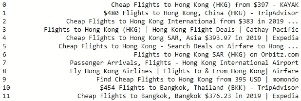

First 10 values in the “title” column

我们可以看到几个要删除的特殊字符，比如:**，。()[ ] + | -**

为了安全起见，可以使用特殊字符的完整列表，并使用循环删除它们:

```
spec_chars = ["!",'"',"#","%","&","'","(",")",
              "*","+",",","-",".","/",":",";","<",
              "=",">","?","@","[","\\","]","^","_",
              "`","{","|","}","~","–"]for char in spec_chars:
    df['title'] = df['title'].str.replace(char, ' ')
```

现在你不应该在你的*标题*栏中有这些字符。因为我们用加号替换了特殊字符，所以在某些标题中，我们可能会以双*空格*结束。

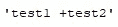

String example before removing the special character

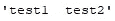

String example after removing the special character which creates an extra space

让我们通过使用*空格*拆分每个标题并使用*连接*再次重新连接单词来删除它们。

```
df['title'] = df['title'].str.split().str.join(" ")
```

我们完成了这个专栏，我们删除了特殊字符。注意，我没有包括货币字符和点“.”在上述特殊字符列表中。原因是一些结果标题包含他们正在销售的机票的价格(例如“514.98 美元”)，在下一部分中提取这些信息可能会很有意思。

# 2.从系列中提取相关内容

使用数据集时，重要的是使数据集更加清晰、易读。你的数据集可能最终被摄入机器学习管道，也就是说，这个想法是从这个数据集中提取大量信息。我将展示一个例子，但是您将提取的信息的粒度取决于您的目标。

假设您想从结果标题(即*标题*列)中提取所有以美元表示的价格。我们使用一个正则表达式函数来完成这个任务。如果你愿意，你可以在这里用你的正则函数[做一些测试。](https://regex101.com)

```
df['dollar_prices'] = df['title'].str.extract('(\$\.d*\.?\d*)')
```

我们现在已经在*标题*列中提取了所有以美元为单位的价格。

我们现在显示结果列的唯一值:

```
df['dollar_prices'].unique()
```

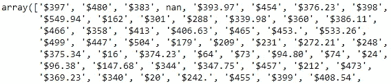

正如你所看到的，我们有一些 NaN(=非数字)值(上面数组中的第四个位置)。有些图书没有美元价格，所以 regex 规则找不到它，取而代之的是“nan”。我们将在下一节看到如何处理 NaN 值。

# 3.检查 NaN 值

大多数情况下，一个大型数据集将包含 NaN 值。如何处置他们？我们应该离开他们吗？绝对不行！你不能离开他们，因为你可能要在数字列上执行计算，或者仅仅是因为你将来要为一个数据科学团队建模。对于那些了解机器学习的人来说，或多或少，你知道你的特征/变量/预测器在训练一个模型之前应该是数值型的。出于所有这些原因，我们希望修复 NaN 值。我不会花太多时间讨论不同的策略，有很多文章解释不同的策略。您可以做什么:

*   **移除相应的行:**只有在移除行不影响数据集中的分布或者它们不显著时，才可以这样做。如果在您的 1M 数据集中只有 3 行具有一些 NaN 值，那么删除这些行应该是安全的。否则，您可能不得不采用下一个选项。
*   **用统计量替换它们(在数值列中):**可以用列的平均值替换 NaN 值。小心，你不想歪曲数据。查看另一个列(如分类列)并根据每个类别的平均值替换 NaN 值可能更合适。让我解释一下。例如，在泰坦尼克号的数据集中，每一行代表一名乘客。*票价*列中的一些值丢失(NaN)。为了用更准确、更接近实际的值来替换这些 NaN:例如，您可以用同一*票种*的各行*票价*的平均值来替换它们。你这样做是假设买同一种票的人支付的价格大致相同，这是有道理的。
*   **否则:**试着了解你的领域，你的背景，这将帮助你知道如何以一种安全的方式替换丢失的变量。如果您不会在机器学习管道中使用该数据集，您可以用另一个值来替换 NaN，如字符串(在字符串类型列的情况下)“None”或“NoData”，任何与您和将使用该数据集的人相关的值。

关于处理 NaN 值的更多例子，我推荐阅读一篇关注这一点的文章。

关于我们的数据集，让我们使用名为 *seaborn* 的可视化库来看看 NaN 值的比例是多少。您可以直接使用 Pandas 函数，但我认为最好先使用可视化方式，以便了解您的数据:

```
sns.heatmap(df.isnull(), cmap='viridis')
```

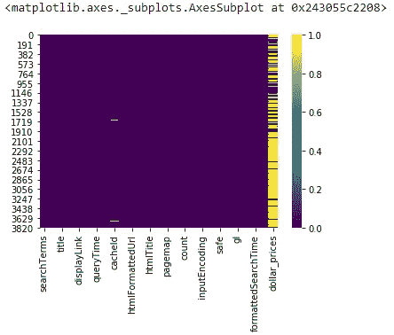

在这张热图中，您可以看到每列中的 NaN 值为黄色(取决于您使用的 *cmap* ，但我的是黄色)。这并不意味着没有黄色的列没有任何 NaN，它只是在热图的顶部或底部有一些 NaN，所以它们与热图的图形边框相混淆(这是由于笔记本中打印的图像的分辨率)。无论如何，不要犹豫使用*显示原始数据。isnull()* 熊猫功能。

在我们的例子中，我们将只保留在*标题*中有*美元价格*的行，因此我们将只保留在*美元价格*列中有值的行:

```
df = df.dropna(subset=['dollar_prices'])
```

得到的 DataFrame 只包含 *dollar_price* 有值的行，其他的都被删除了。

# 4.更改系列的类型

在这个数据集中，我们可能没有太多的类型变化要做。这取决于你的背景和数据集的质量。如果您对我们在 *df.info()* 中看到的列类型感到满意，那很好。

输入文件可能来自您的一位同事，他将数据保存到 Excel 文件(.xlsx)。在这种情况下，这是因为 Excel 在这方面很糟糕，您的列的格式可以更改，特别是对于您的 Ids 列。我所说的“Id”是指一个列，它代表您所列出的实体之一的 Id。例如，如果您正在操作一个包含产品库存的数据集，那么其中可能会有一个 *ProductId* 列。无论如何，Excel 中的数字 id 可以被解释为数字列或文本列，老实说，我不知道 Excel 何时选择其中之一。

对于您的数据操作，这取决于您希望如何处理脚本中的 id，您希望操作文本(*字符串*)还是数值(*整数*)？这取决于你，但是在你的脚本中要保持一致，如果你需要连接两个数据帧，例如，基于一个 Id 列，首先以相同的格式转换它们(*字符串*或*整数*，但是你必须选择一个)。

让我们回到我们的数据集。在第二部分中，我们创建了一个包含美元价格的新列。在这一点上，我们知道有美元，对不对？因为关于货币的信息在列名中。也就是说，我们可以去掉美元字符:

```
df['dollar_prices'] **=** df['dollar_prices'].str.replace('$', '')
```

最后一步是检查这个列的类型。我们应该有一个字符串，因为我们用 regex 规则提取了数据作为*字符串*:

```
df.dtypes
```

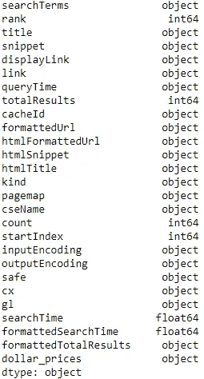

这里我们的*美元价格*是一个*对象*，实际上意味着一个 s *字符串*。我们真的想把我们的价格当成字符串吗？对于价格，我们更喜欢使用 *floats* ，我们只需要转换列类型。

```
df['dollar_prices'] = pd.to_numeric(df['dollar_prices'], errors='coerce')
```

如果您再显示一次 *dtypes* ，您会注意到 *dollar_prices 列*不再是一个对象，而是一个 float64 类型。

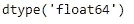

# 结论

我希望你能找到一些你可能问过自己的问题的答案。正如我在开始时所说的，没有统一的方法来清理数据集，一些检查必须完成，例如 NaN 值。剩下的真的要看项目需要什么水平的质量了？要提取哪些相关数据？

此外，请记住，您可以从数据集(第 2 节)中提取的所有内容可能对可视化专家非常有帮助，他们将使用您的数据集作为源来构建仪表板。

Jupyter 笔记本可以在我的 [GitHub](https://github.com/UPetit) 这里[找到](https://github.com/UPetit/Medium-articles/tree/master/Simplify%20your%20Dataset%20Cleaning%20with%20Pandas)。

不要犹豫写评论和问题。