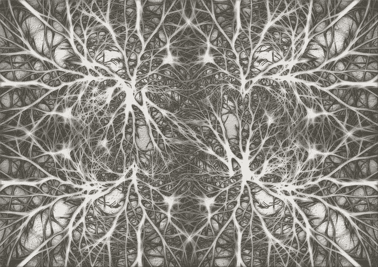
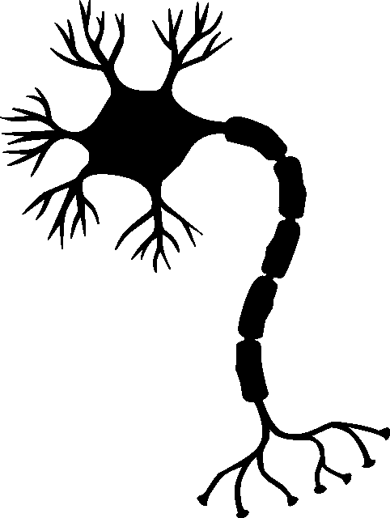

# 深度学习完全初学者指南:人工神经网络

> 原文：<https://towardsdatascience.com/simply-deep-learning-an-effortless-introduction-45591a1c4abb?source=collection_archive---------2----------------------->

## 深度学习入门！在 15 分钟内攻克人工神经网络的基础知识

*本文是* [*深度学习*](/intro-to-deep-learning-c025efd92535) *系列完整初学者指南的一部分。*

Image by Lolame via [Pixabay](http://pixabay.com)

## 什么是深度学习？

这是**从例子中学习**。差不多就是这么回事！

在非常基础的层面上，深度学习是一种机器学习技术。它教会计算机通过层层过滤输入，以学习如何预测和分类信息。观察可以是图像、文本或声音的形式。

深度学习的灵感来自人脑过滤信息的方式。它的目的是模仿人类大脑如何工作来创造一些真正的魔法。

GIF via [GIPHY](https://media.giphy.com/media/9N2UvCx7wXLnG/giphy.gif)

**深度学习试图模仿新大脑皮层中神经元层的活动。**

*这是一个名副其实的人工神经网络*。

在人脑中，大约有 1000 亿个神经元。每个神经元都与大约 10 万个相邻的神经元相连。这就是我们试图创造的，但是在某种程度上是为机器服务的。

Image by geralt on [Pixabay](https://pixabay.com/)

这对神经元、轴突、树突等意味着什么？神经元有一个体，树突和一个轴突。来自一个神经元的信号沿着轴突传递到下一个神经元的树突。信号传递的连接被称为突触。

Image by mohamed_hassan on [Pixabay](https://pixabay.com/)

神经元本身是没用的。但是当你有很多这样的人时，他们会一起创造出一些真正的奇迹。这就是深度学习算法背后的想法！你从观察中获得输入，然后把你的输入放到一个层中。该层创建一个输出，该输出又成为下一层的输入，依此类推。这种情况反复发生，直到你的最终输出信号！

因此神经元(或**节点**)获得一个或多个信号(**输入值**)，这些信号通过神经元。该神经元传递**输出信号**。把输入层想象成你的感官:例如，你看到的、闻到的和感觉到的东西。这些是一次观察的独立变量。这些信息被分解成数字和计算机可以使用的二进制数据位。(您需要标准化或规范化这些变量，以便它们在相同的范围内。)

那么突触呢？每个突触都被分配了权重，这对人工神经网络至关重要。重量是人工神经网络学习的方式。通过调整权重，人工神经网络决定信号传递的程度。当你训练你的网络时，你决定如何调整权重。

## 人工神经网络是如何学习的？

有两种不同的方法可以让程序做你想做的事情。首先，有特别指导和硬编程的方法。在这种方法中，您确切地告诉程序您想要它做什么。然后还有**神经网络**。在神经网络中，你告诉你的网络输入和你想要的输出，让它自己学习。通过允许网络自己学习，我们可以避免输入所有规则的必要性。对于神经网络，你可以创建架构，然后让它去学习。一旦它训练好了，你可以给它一个新的图像，它将能够区分输出。

Photo by [Annie Spratt](https://unsplash.com/@anniespratt?utm_source=medium&utm_medium=referral) on [Unsplash](https://unsplash.com?utm_source=medium&utm_medium=referral)

有不同种类的神经网络。一般分为**前馈**和**反馈**网络。

前馈网络是一个包含输入、输出和隐藏层的网络。信号只能单向传播(向前)。输入数据传递到执行计算的层。每个处理元件基于其输入的加权和进行计算。新值成为新的输入值，用于下一层(前馈)。这将贯穿所有层，并决定输出。前馈网络通常用于例如数据挖掘。

一个**反馈网络**(例如，一个递归神经网络)有反馈路径。这意味着它们可以使用环路双向传输信号。神经元之间所有可能的连接都是允许的。由于这种类型的网络中存在环路，因此它成为一个非线性动态系统，不断变化直到达到平衡状态。反馈网络通常用于优化问题，其中网络寻找相互关联的因素的最佳安排。

大多数现代深度学习架构都是基于人工神经网络(ann)的。它们使用多层非线性处理单元进行特征提取和转换。每个后续层使用前一层的输出作为其输入。他们所学的形成了概念的层次结构。在这个层次结构中，每一级都学会将其输入数据转换成越来越抽象和复合的表示。

Image by ahmedgad on [Pixabay](http://pixabay.com)

这意味着，例如，对于一幅图像，输入可能是像素矩阵。第一层可以对边缘进行编码并组成像素。下一层可能构成边缘的排列。下一层可能编码鼻子和眼睛。下一层可能会识别出图像包含人脸，等等。

**神经元**内部发生了什么？输入节点接收数字形式的信息。信息以激活值的形式呈现，每个节点都有一个编号。数字越高，激活程度越大。

基于连接强度(权重)和传递函数，激活值传递到下一个节点。每个节点对其接收的激活值求和(它计算**加权和**)，并基于其传递函数修改该和。接下来，它应用一个激活函数。激活函数是应用于这个特定神经元的函数。由此，神经元知道是否需要传递信号。激活通过网络运行，直到它到达输出节点。然后输出节点以我们可以理解的方式给我们信息。您的网络将使用成本函数来比较输出和实际预期输出。模型性能由代价函数来评价。它表示为实际值和预测值之间的差值。您可以使用许多不同的成本函数，查看网络中的误差。你在努力减少功能损失。(本质上，损失函数越低，就越接近你想要的输出)。信息返回，神经网络开始学习，目标是通过调整权重来最小化成本函数。这个过程被称为**反向传播**。

*有兴趣了解更多关于成本函数的知识吗？查看* [*神经网络中使用的成本函数列表，以及堆栈交换上的应用*](https://stats.stackexchange.com/questions/154879/a-list-of-cost-functions-used-in-neural-networks-alongside-applications)

*在前向传播中，信息被输入到输入层，并通过网络向前传播，以获得我们的输出值。我们将这些值与我们的预期结果进行比较。接下来，我们计算误差并反向传播信息。这允许我们训练网络并更新权重。反向传播允许我们同时调整所有的权重。在这个过程中，由于算法的结构，你可以同时调整所有的权重。这使您可以看到神经网络中的每个权重对错误的哪一部分负责。*

**渴望更多？你可能想读一下 Yann LeCun 等人的* [*高效反向投影*](http://yann.lecun.com/exdb/publis/pdf/lecun-98b.pdf) *，以及 Michael Nielsen 的* [*神经网络和深度学习*](http://neuralnetworksanddeeplearning.com/) *。**

*当您将重量调整到最佳水平后，您就可以进入测试阶段了！*

## *什么是加权和？*

*神经元的输入可以是来自训练集的特征，也可以是来自前一层神经元的输出。两个神经元之间的每个连接都有一个独特的突触，并附有独特的权重。如果你想从一个神经元到下一个神经元，你必须沿着突触行进，并支付“通行费”(重量)。然后，神经元将激活函数应用于来自每个传入突触的加权输入的总和。它将结果传递给下一层的所有神经元。当我们谈论更新网络中的权重时，我们谈论的是调整这些突触上的权重。*

*一个神经元的输入是前一层所有神经元的加权输出之和。每个输入都乘以与将输入连接到当前神经元的突触相关联的权重。如果在前一层中有 3 个输入或神经元，则当前层中的每个神经元将具有 3 个不同的权重:每个突触一个。*

*那么什么是激活函数呢？*

*简而言之，一个节点的激活函数定义了该节点的输出。*

*激活函数(或传递函数)将输入信号转换成输出信号。它在 0 到 1 或-1 到 1 的范围内映射输出值。这是一个抽象概念，代表细胞内动作电位发放的速率。这是一个数字，代表细胞被激发的可能性。最简单的，函数是二元的:**是**(神经元触发)或**否**(神经元不触发)。输出可以是 0 或 1(开/关或是/否)，也可以是范围内的任何值。例如，如果您使用映射范围在 0 和 1 之间的函数来确定图像是一只猫的可能性，输出 0.9 将显示您的图像实际上是一只猫的概率为 90%。*

**

*Photo by minanafotos on [Pixabay](https://pixabay.com/)*

*我们有什么选择？有许多激活函数，但以下是四个非常常见的函数:*

*   ***阈值函数**这是一个阶跃函数。如果输入的合计值达到某个阈值，该函数将传递 0。如果它等于或大于零，那么它将传递 1。这是一个非常严格，简单，是或不是的函数。*

**

*Example threshold function*

*   ***Sigmoid 函数**:该函数用于逻辑回归。与阈值函数不同，它是一个从 0 到 1 的平滑渐进过程。它在输出层非常有用，并且大量用于线性回归。(线性回归是统计学和机器学习中最知名的算法之一)。*

**

*Example sigmoid function*

*   ***双曲正切函数**这个函数非常类似于 sigmoid 函数。与从 0 到 1 的 sigmoid 函数不同，该值从-1 到 1 变到 0 以下。虽然这不是生物学中发生的事情，但这个函数在训练神经网络时会给出更好的结果。神经网络有时会在使用 sigmoid 函数进行训练时“卡住”。当有很多强烈的负面输入使输出接近于零时，就会发生这种情况，这会扰乱学习过程。*

**

*Example hyperbolic tangent function (tanh)*

*   ***整流函数**这可能是神经网络宇宙中最流行的激活函数。这是最有效的，也是生物学上最合理的。尽管它有一个扭结，但在 0°扭结后，它是平滑和渐变的。举例来说，这意味着你的输出要么是“否”，要么是“是”的百分比这个函数不需要标准化或其他复杂的计算。*

**

*Example rectifier function*

**想潜得更深吗？查看 Xavier Glorot 等人的* [*深度稀疏整流器神经网络*](http://proceedings.mlr.press/v15/glorot11a/glorot11a.pdf)*

**比如说，你想要的值是二进制的。你在寻找一个“是”或“否”。你想使用哪个激活功能？从上面的例子中，你可以使用阈值函数，或者你可以使用 sigmoid 激活函数。sigmoid 函数可以给你一个肯定的概率。**

****

**Photo by [rawpixel](https://unsplash.com/@rawpixel?utm_source=medium&utm_medium=referral) on [Unsplash](https://unsplash.com?utm_source=medium&utm_medium=referral)**

****那么，权重究竟是如何调整的呢？****

**你可以使用蛮力方法来调整权重，并测试数千种不同的组合。即使是最简单的只有五个输入值和一个隐藏层的神经网络，你也会得到 10⁷⁵可能的组合。在世界上最快的超级计算机上运行这个程序需要的时间比迄今为止宇宙存在的时间还要长。**

****

**Photo by skorchanov on [Pixabay](https://pixabay.com/)**

**然而，如果您使用**梯度下降**，您可以查看权重的倾斜角度，并找出它是正还是负，以便继续向下倾斜，在您寻求达到全局最小值的过程中找到最佳权重。**

**如果你使用**梯度下降**，你可以查看重物的倾斜角度，并找出它是正还是负。这允许你继续下坡，在你寻求达到全局最小值的过程中找到最佳权重。**

****梯度下降**是一种求函数最小值的算法。你会一遍又一遍地看到类似的情况，有人被困在山顶，试图下来(找到最小值)。大雾使她看不清路，所以她使用梯度下降法到达山脚。她看了看她所在的山的陡峭程度，然后向最陡的下坡方向走去。你应该假设陡度不会立即变得明显。幸运的是，她有一个工具可以测量陡度。不幸的是，这个工具需要很长时间。她想尽可能少地使用它，以便在天黑前下山。真正的困难是选择她使用工具的频率，这样她就不会偏离轨道。在这个类比中，人就是算法。山的陡度是该点误差面的斜率。她走的方向是该点误差曲面的梯度。她使用的工具是微分(误差表面的斜率可以通过对该点的平方误差函数求导来计算)。在进行另一次测量之前，她行进的速率是算法的学习速率。这不是一个完美的类比，但它让你很好地理解了梯度下降是怎么回事。机器正在学习模型应该采用的梯度或方向，以减少误差。**

****

****随机梯度下降****

**梯度下降要求代价函数是凸的，但如果不是呢？**

****

**正常梯度下降将卡在局部最小值而不是全局最小值，从而导致网络不合格。在正常梯度下降中，我们将所有行插入同一个神经网络，看一看权重，然后调整它们。这被称为批量梯度下降。在随机梯度下降中，我们一行接一行，运行神经网络，查看成本函数，调整权重，然后移动到下一行。实际上，您正在调整每一行的权重。**

**随机梯度下降有更高的波动，这允许你找到全局最小值。它被称为“随机的”,因为样本是随机混合的，而不是作为一个单独的组或当它们出现在训练集中时。它看起来可能会慢一些，但实际上更快，因为它不必将所有数据加载到内存中，并在数据一起运行时等待。批量梯度下降的主要优势在于它是一种确定性算法。这意味着，如果你有相同的起始重量，每次运行网络，你会得到相同的结果。随机梯度下降总是随机工作。(您也可以运行小批量梯度下降，您可以设置行数，一次运行那么多行，然后更新您的权重。)**

**已经提出并使用了对基本随机梯度下降算法的许多改进，包括隐式更新(ISGD)、动量法、平均随机梯度下降、自适应梯度算法(AdaGrad)、均方根传播(RMSProp)、自适应矩估计(Adam)等等。**

**喜欢这个吗？你可能想看看安德鲁·特拉斯克 ***和迈克尔·尼尔森*的** [*神经网络和深度学习*](http://neuralnetworksanddeeplearning.com/)**

***因此，这里有一个用随机梯度下降训练人工神经网络的快速演练:***

*   ***1:将权重随机初始化为接近 0 的小数字***
*   ***2:将数据集的第一个观测值输入到输入图层中，每个要素位于一个输入结点中。***
*   ***3: **前向传播**——从左到右，神经元的激活方式是每个神经元的激活受到权重的限制。你传播激活，直到你得到预期的结果。***
*   ***4:比较预测结果和实际结果，测量产生的误差。***
*   ***5: **反向传播** —从右到左，误差反向传播。根据权重对误差的影响程度来更新权重。(学习率决定了我们更新权重的程度。)***
*   ***6: **强化学习**(重复步骤 1-5，每次观察后更新权重)**或** **批量学习**(重复步骤 1-5，但只在一批观察后更新权重)。***
*   ***7:当整个训练集已经通过 ANN 时，这是一个时期。重复更多的纪元。***

***就是这样！你现在知道了在人工神经网络中发生的事情背后的基本思想！***

******

***Photo by [Sam Mathews](https://unsplash.com/@sammathews?utm_source=medium&utm_medium=referral) on [Unsplash](https://unsplash.com?utm_source=medium&utm_medium=referral)***

*****还跟我在一起？** [**过来看第三部**](/wtf-is-image-classification-8e78a8235acb) **！*****

***和往常一样，如果你对这些信息做了什么酷的事情，请在下面的回复中留下评论，或者随时联系 LinkedIn[@ annebonnerdata](https://www.linkedin.com/in/annebonnerdata/)！***