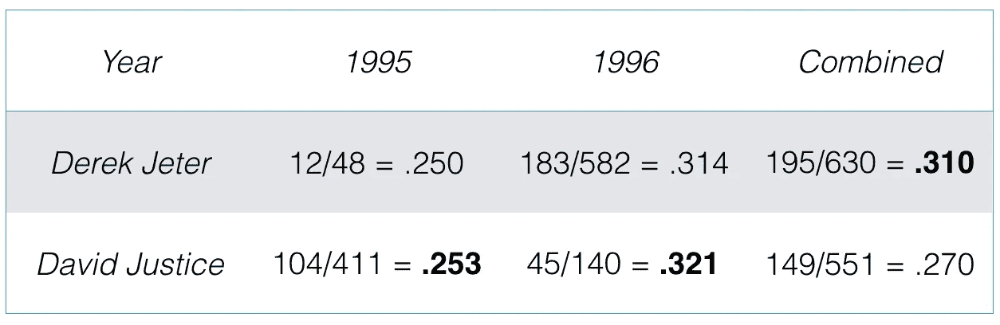
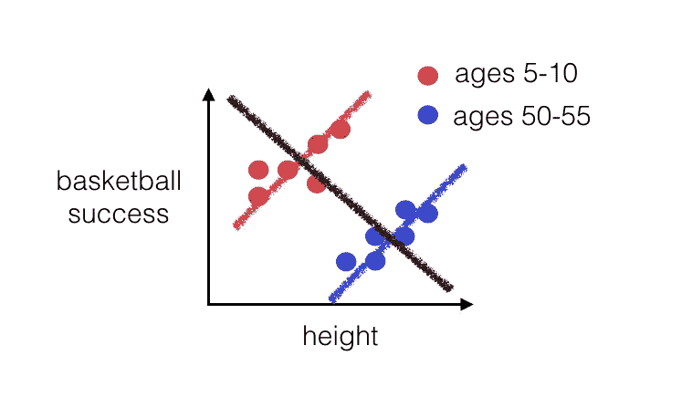
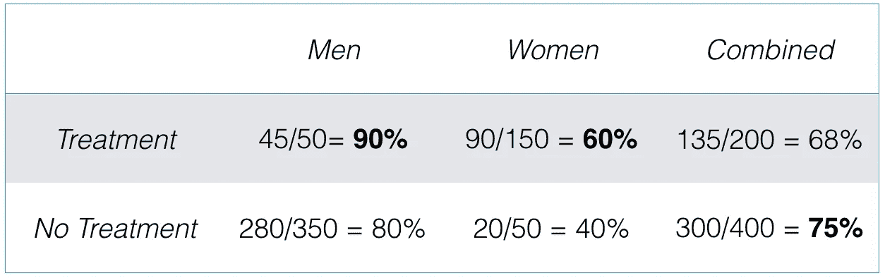
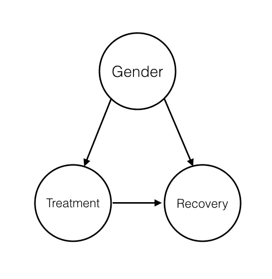
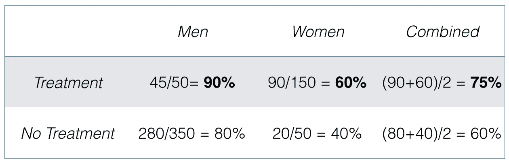
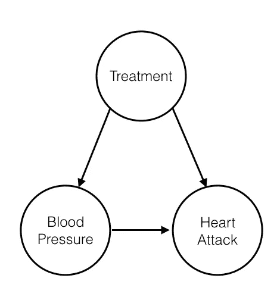
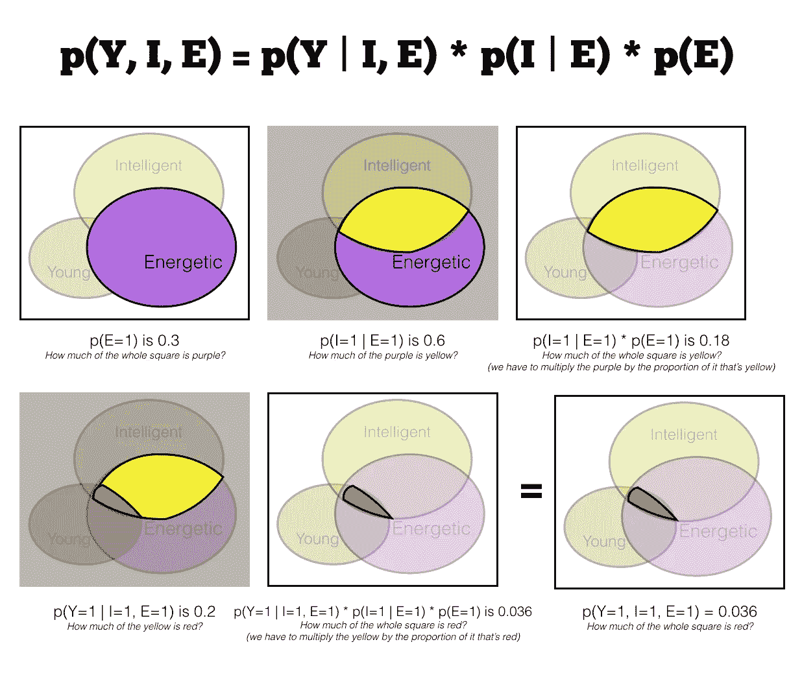
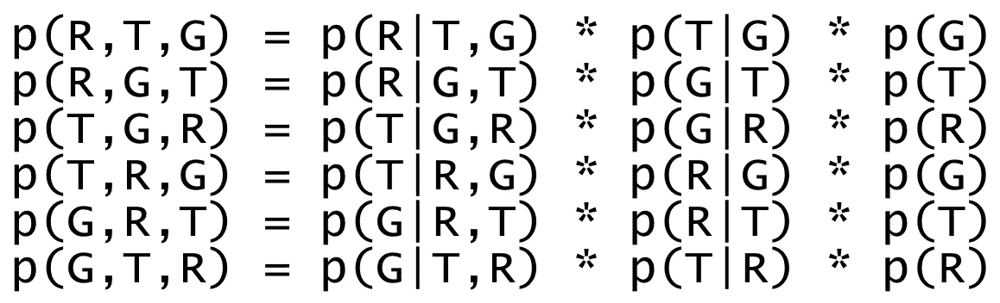
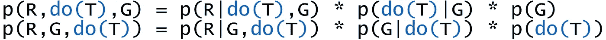

# 辛普森悖论导论

> 原文：<https://towardsdatascience.com/simpsons-paradox-d2f4d8f08d42?source=collection_archive---------8----------------------->

辛普森悖论是一个迷人的现象，说明了因果关系在推理中的重要性。如果你还没有读过这本书，你应该去看看[为什么](http://bayes.cs.ucla.edu/WHY/)的书——这是这十年来最重要的书之一。

我认为辛普森悖论很好地介绍了因果推理的价值。在这篇文章中，我将通过几个例子来阐明它是如何产生的，以及我们如何开始形式化我们对它的思考。

# 击球率

肯·罗斯是辛普森悖论的一个常见例子。他指出，当观察德瑞克·基特和大卫·贾斯蒂斯的击球率时，一个奇怪的矛盾出现了:

David Justice has a better batting average every year, but Derek Jeter has a better batting average overall!

**德瑞克·基特每个赛季的平均打击率都更差，但总的来说却有更好的平均打击率！**

如果我们盯着这一点看一会儿，随着一些事情的突出，原因就变得很清楚了。第一年，德里克和大卫的分数都很低；第二年他们都得了高分。最重要的是，德里克的低分仅仅来自于几次击球，因此对他的总体平均得分影响不大。另一方面，大卫恰恰相反——他的较低分数占了他击球尝试的绝大部分。即使大卫在没有加权的两年**中做得稍好，当我们把蝙蝠的这种不平衡与它们在分数上类似的巨大差异结合起来时，我们得到了这个结果。辛普森悖论告诉我们，总体统计数据的适当加权平均值可能与我们在每个子组中看到的趋势相矛盾。**

下面是另一个简单的例子——这次是图形化的。比方说，非常年轻的人(往往比成年人矮)经常打篮球，而且打得很好。比方说，年纪大的人(往往更高)停止练习，通常实际上很不擅长投篮。

现在，假设我们测量他们的投篮表现，希望最终证明高个子更擅长篮球。我们得到的是这样的:

A graphical example of Simpson’s paradox. Taller kids and taller adults are both better at basketball, but in general being tall makes you worse!

又一个难题！对于每个年龄段的人来说，个子高意味着你是一个更好的篮球运动员。总的来说，个子高会让你变得更糟！

我们都知道个子高会让你变得更优秀，解释这个结果的正确方法是用年龄来分隔，而不是用总体人口。但是为什么以及我们是如何知道的呢？我们如何将经验法则推广到更复杂的情况？

# 因果推理

这里有一个更难的例子，它反映了现实生活中的一项医学研究。假设你生病了，给你开了一种药，对以前的病人有如下效果:

Uh oh. The drug is good for men, good for women, and bad for people.

你没看错。如果你是男性，这种药物会增加你康复的机会；如果你是女性，这也会增加你康复的几率。但如果你是一个人，它更有可能伤害你。你吃这种药吗？

值得庆幸的是，上述说法在逻辑上是不连贯的，是错误的。但是很容易阅读数据并以这种方式看待它。我们如何解决这个问题？

## 答案

我们知道，这里有三个因素给了我们辛普森悖论。有(1)患者的性别，(2)药物的有效性，以及(3) **患者有多大可能属于治疗或非治疗组**。请记住，这是组的不平衡，使整体平均加权可能不同于每个子组的趋势。

那么问题就变成了，因果关系在哪里？可以肯定地说，你的性别不会因为你的治疗或康复而改变。另一方面，性别**似乎会影响你选择治疗的可能性——女性在 75%的情况下选择治疗，而男性只有 12%。**

鉴于我们以这种方式检查数据，我们清楚地相信性别可能会影响恢复。最后(也很明显)，治疗会影响你康复的机会，而不是相反。我们可以画一个漂亮的因果图来总结我们所有的因果知识。

A simple causal diagram of what’s going on. Gender alters the likelihood of accepting treatment. We also expect the likelihood of recovery to be a function of both receiving treatment AND gender.

哪里出了问题？希望很清楚，图表中“受性别影响的治疗选择”部分——将性别与治疗联系起来的箭头——是导致我们悖论的原因。

我们不希望那个信息改变我们的决定。一个人选择的可能性有多大？这种治疗并不能告诉我们这种治疗最终对他们有多有效。为了准确了解这种药物对整个人类的疗效，我们必须消除这种联系。换句话说，我们应该平均每个组的百分比，而不是根据大小来加权。这消除了两性治疗选择不均衡的影响。

Simpson’s paradox is resolved!

# 它概括了吗？

在上面的例子中，信任子组而不是整体平均值是有意义的。其他情况下，**可以反过来**。

举一个例子(这个例子来自 Judea Pearl 的书)，我们研究了一种用于预防心脏病发作的药物，并评估了它对低血压和高血压患者的影响。我们看到了类似的问题——这种药物减少了低血压和高血压患者的心脏病发作，但总体上增加了心脏病发作！我们该怎么办？在这种情况下，当我们绘制因果图时，它可能看起来像这样:

Causal Diagram for our second example. In this case, the blood pressure is a mediating variable in the path from treatment to heart attack, and thus we should trust the overall statistic.

这看起来非常类似于我们的第一个例子，但它不是。仔细看。我们小组的位置和治疗方法都变了。

在第一个病例中，我们的亚组(性别)**影响了接受治疗的**。在第二个例子中，我们的亚组(血压)**受到接受治疗的**的影响。

在这种情况下，心脏病发作的风险和患者的血压都是治疗的因果下游，所以我们应该**而不是**按血压细分。血压是治疗发挥作用的一种机制——它是从治疗到心脏病发作风险之间因果关系的中介变量。

与之前的案例形成对比，在之前的案例中，治疗和恢复之间的关系受到性别的影响。性别是治疗选择和恢复的上游；为了了解治疗和康复之间的真正关系，我们不得不以此为条件。**当处理没有图形双亲时，我们不需要辅助变量。当它发生时(并且该母公司有一个“后门路径”来影响利息)，我们会这样做。**

# 另一种方法

思考辛普森悖论的另一种方式是通过纯统计的语言。首先，让我们稍微绕一圈，回顾一下基础知识。

联合概率可以很容易地分解成条件的乘积。这里有一个有趣的例子——你有了一只新狗，你对它的个性很感兴趣！有些狗很年轻，有些很聪明(有些不聪明)，有些则很有活力。

下面是代表狗的性格概率分布的方框。我们把正方形的面积设为 1。放下一个别针，它所代表的狗就会有下面的性格特征。

在所有可能的狗中，你可以看到一些是年轻的，一些是聪明的，一些是精力充沛的，还有一些是三者兼而有之。一只随机的狗具有一些特定特征组合的可能性可以很容易地被分解——下面是一个简单的例子来说明当我们寻找年轻、聪明和精力充沛的狗时(Y=1，I=1，E=1)。

Factoring a joint probability into the product of conditionals.

为什么你会想把一个关节放入这样的条件句中呢？在辛普森悖论的背景下，我们将通过重温上面的第一个例子来回答这个问题。

在那个例子中，我们在看(T)治疗、(G)性别和(R)康复的联合概率。我们想询问在给定其他性别和治疗组合的情况下，R=1(成功康复)的可能性。让我们将关节分解，这样我们就可以使用它:

All possible ways to rewrite that joint as a product of conditioned variables.

有六种方法可以分解三个变量的结合。然而，在这种情况下，我们试图用**观察关系**(在这种情况下，可以说‘假设某人成功康复，他是一个男人的概率’之类的话)，而不是用**询问他们之间的因果关系**(‘如果我们强迫治疗的概率等于 1，一个男人的康复会怎么样？’).**T5 这里我们介绍珍珠的 **do-operator** 。**

代替 p(R|T)，一个关于治疗和恢复之间相关性的*观察*，我们实际上关心 p(R |**do(**T**)**)——给定我们因果干预和强制治疗(通过意志力设定 T=1)的恢复概率。do 运算符限制了我们如何分解关节，因为我们*必须将* do(T)保持在关于恢复的条件线的右侧，以回答关于治疗如何影响恢复的因果问题。

所以我们对 **p(R|G，do(T))** 感兴趣。这给了我们两个选择:

在第二个选择中，我们发现 p(G|do(T))是一个无意义的关系。我们现在认为*是一种因果关系，这个术语回避了一个问题“如果你接受治疗，你的性别改变的可能性有多大？”如果当我们改变(T)时性别不变，我们就不能在因果关系中连贯地使用这样一个术语。*

*另一方面，第一个等式没有逻辑缺陷。我们注意到 p(do(T)|G)正好是 1——我们在任何理性条件下的 do(T)概率将是 1，因为这是 do 运算符的定义。我们可以去掉这个术语，简化我们的表述。*

*另一种说法是，基于性别接受治疗的可能性是*而不是*我们想要的影响我们对治疗成功概率的评估的东西，所以这个术语必须删除。我们知道这个术语是坏消息，因为我们有因果直觉。我们的条件必须遵循我们的因果本能，匹配我们的因果图，使得子节点的概率总是(并且仅仅)取决于它们的父节点。*

*我们只剩下 **p(R | do(T)，G) * p(G)** 。它向我们展示了康复的可能性与该性别人群的比例有关，而不是与总人口有关。这通过一个更正式的过程给了我们和我们的因果图一样的答案。*

# *现实生活，伙计*

*辛普森悖论可能出现在现实生活中——就像加州大学伯克利分校众所周知的有争议的性别偏见问题。然而，它真正的美妙之处在于阐释和介绍了统计学中因果推理背后的基本原理。*

*我们所做的一切在标准统计学的背景下都没有意义，但确实有意义。我希望这篇关于辛普森悖论的介绍让你对如何开始形式化你的因果逻辑有所体会。*

*长期以来，统计学缺乏讨论因果推理和关系的语言。谢天谢地，统计世界似乎正在积极转变。随之而来的将是科学的一大福音。*