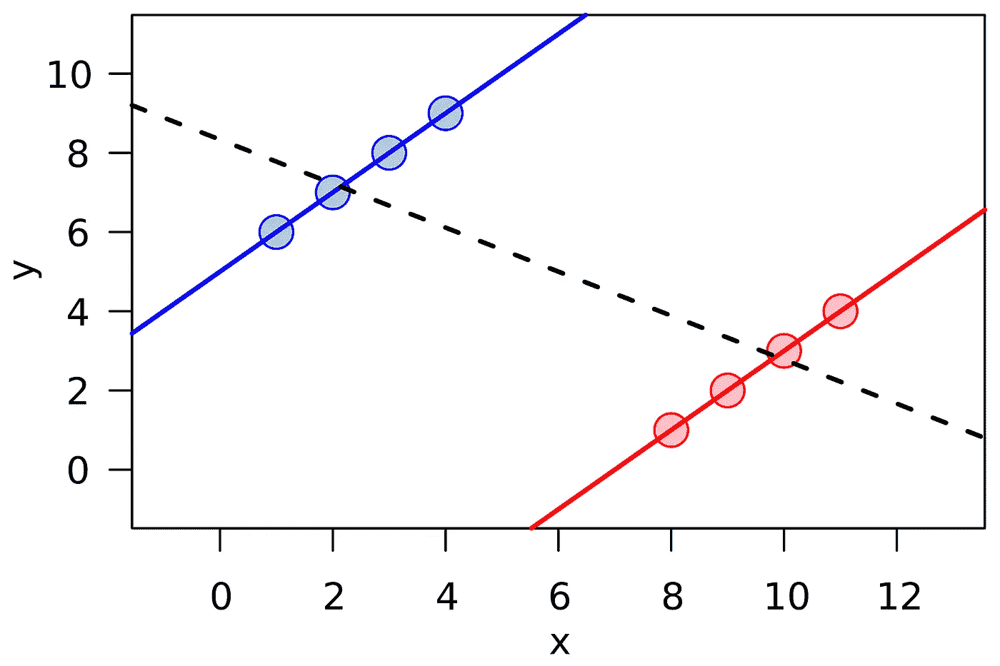
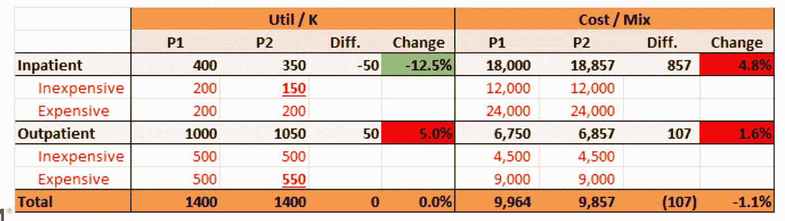
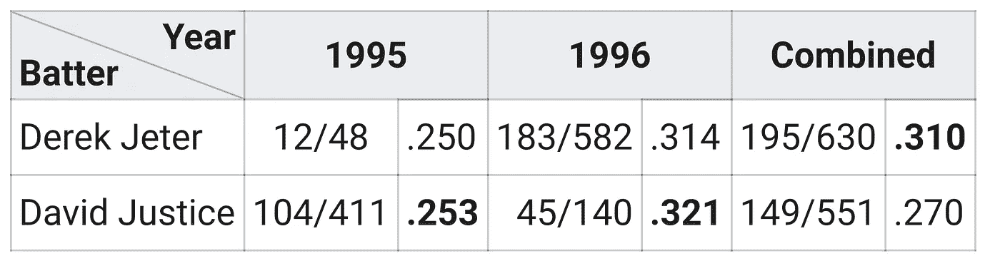

# 辛普森悖论

> 原文：<https://towardsdatascience.com/simpsons-paradox-decae6a4de88?source=collection_archive---------12----------------------->

## 理解统计错觉

辛普森悖论是一个封闭的术语，指的是在全球层面分析时，群体层面的趋势被隐藏或逆转的情况。这些都是需要思考的 fum 例子，是混合效果模型的主要候选对象，这也是我上一篇文章的主题。

## 说明

下面是一个来自[维基百科文章](https://en.m.wikipedia.org/wiki/Simpson%27s_paradox)的例子:蓝色和红色组有明显的积极趋势，然而用一条线回归这两个组会产生消极趋势。

在分析医疗保健索赔趋势时，通常会出现类似的情况(当然也可以扩展到其他行业)。下图显示了 4 种医疗服务——两种住院服务，由于需要多日住院，因此费用更高，还有两种门诊服务。一项常见的健康计划计划旨在将低强度/低成本的住院服务转移到门诊服务中:这样做可以为会员节省大量的自付额/共同保险费用。这产生了一个有趣的趋势，因为相对于其他低强度的门诊服务，低强度的住院服务通常强度更高。

这两个部分分别代表每年每千人的利用率(分析利用率时调整成员增长/衰退的常用指标)和单位成本(通常称为“成本/混合”,因为字段的聚合可以隐藏基础服务利用率的变化，而单位成本不会发生任何变化。

随着图表从第 1 期(P1)移动到第 2 期(P2)，50 个单位的廉价住院治疗转移到门诊，在那里它们相对更贵。每项服务的单位成本不变。总的来说，这 50 个单位现在的价格是 9000 美元，而以前的价格是 12000 美元，但是潜在的趋势是骗人的。由于每个时段中高成本服务的比例较高，这两种单位成本趋势都有所增加。住院病人利用趋势下降，被门诊病人抵消。在 IP/OP 级别，该计划看起来像一场灾难！总体水平与现实相符:利用率没有变化，但一些服务现在成本更低了。

## 技术

如果你发现辛普森悖论的存在，就很容易解决它。在我的混合效应模型文章中，我们通过测试数据的同质性和分析残差图来确定这一点。在上面的维基百科图片中，你可以注意到，随着 x 轴从左向右移动，每组的残差从负值变为正值——残差中的这种相关性是一个好迹象，表明你错过了一些东西。

这强调了数据可视化和解释性数据分析的重要性。我们可以在这篇文章的结尾指出，虽然一张图片胜过千言万语，但有些图片需要千言万语的解释——这就是数据科学家和分析专业的价值。

