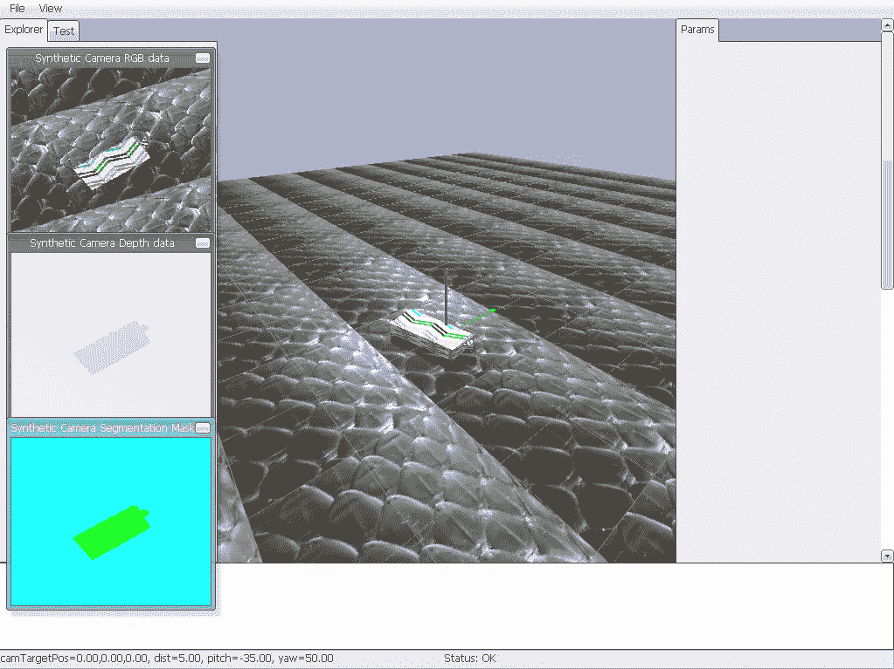
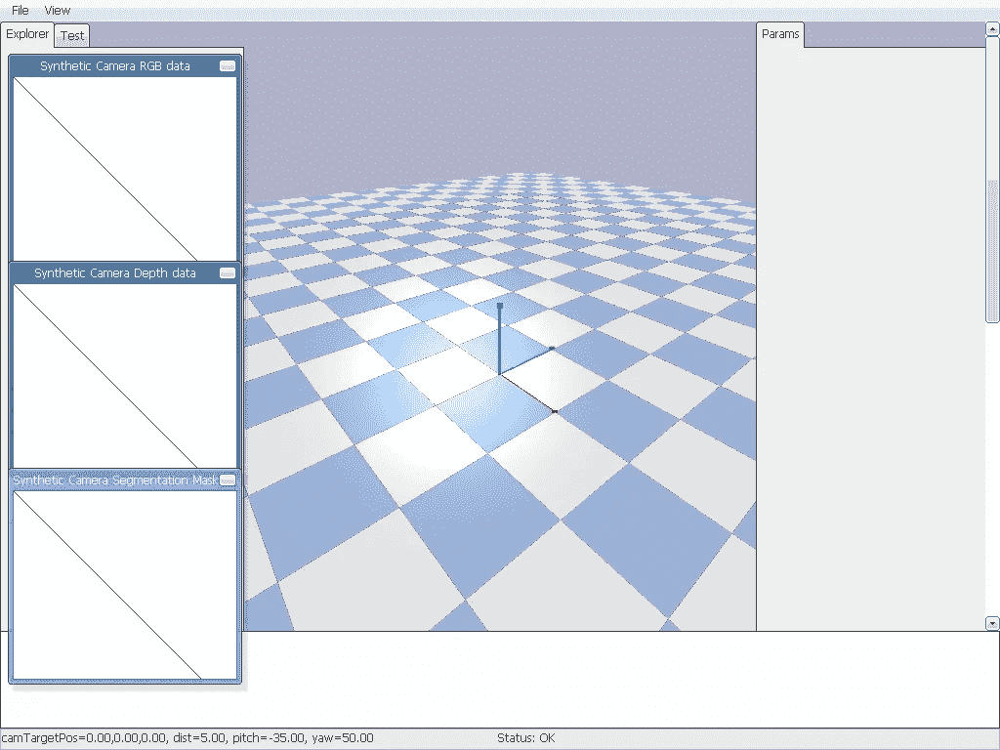
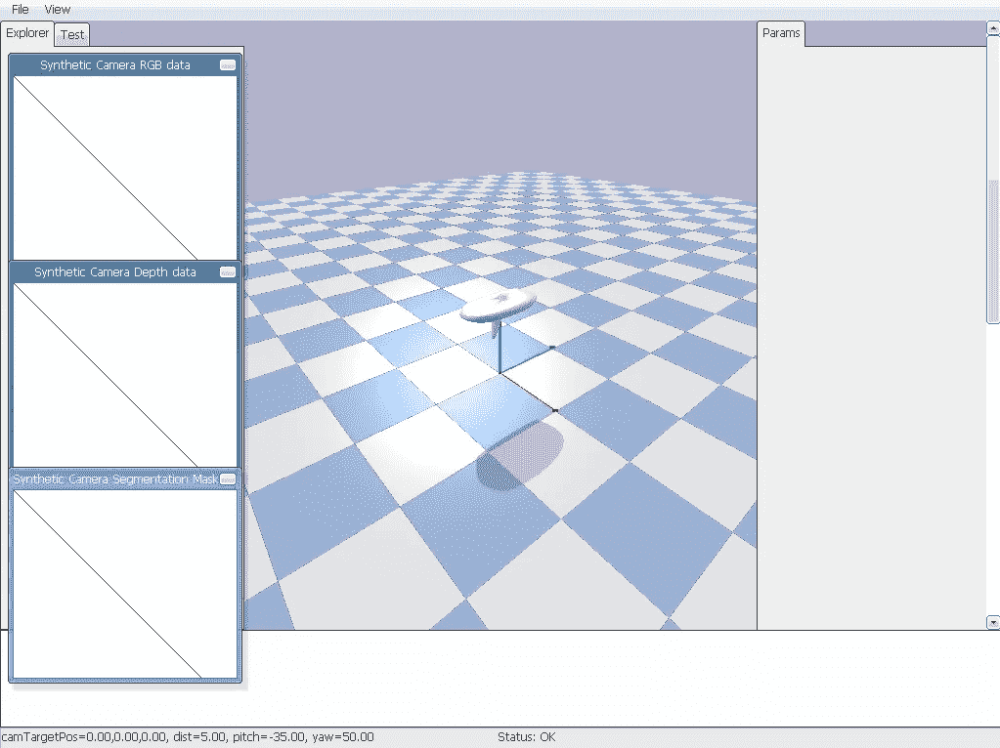
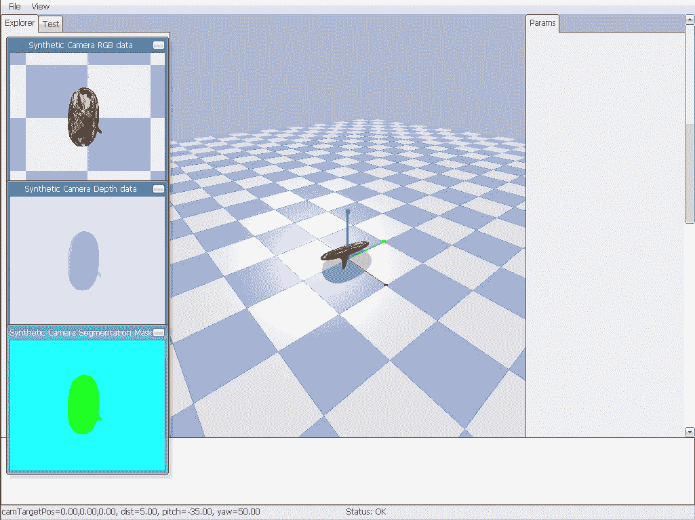

# 在 PyBullet 中模拟 ML 的图像——快速简单的方法

> 原文：<https://towardsdatascience.com/simulate-images-for-ml-in-pybullet-the-quick-easy-way-859035b2c9dd?source=collection_archive---------6----------------------->



当将深度强化学习(RL)应用于机器人时，我们面临一个难题:当深度学习需要数十万甚至数百万个样本时，我们如何训练机器人来完成一项任务？为了在从未见过的物体上实现 96%的抓取成功率，谷歌和伯克利的研究人员通过 580，000 次真实世界的抓取尝试训练了一个机器人代理。这项壮举花费了七个机器人和几个星期来完成。如果没有谷歌资源，对于一般的 ML 从业者来说，这似乎是没有希望的。我们不能指望使用物理机器人轻松地运行数十万次迭代训练，这容易磨损，需要人工监督，两者都不便宜。如果我们能够预先训练这种 RL 算法，以大幅减少现实世界中所需的尝试次数，这将更加可行。

随着深度学习的出现，RL 技术已经成熟，但对数据的需求也越来越大。为了弥合这一差距，许多研究人员正在探索训练数据的*合成生成*，利用 3D 渲染技术来制作任务环境的模型。虽然这种技术在模拟环境中产生了奇迹，但它并不能很好地推广到现实世界。任何与深度学习密切合作的人都知道，利用训练数据中的细微差别来“欺骗”任务是多么有效。在实践中，对于这些经过模拟训练的模型来说，真实世界是样本外的，因此不出所料，它们会失败。

[最近的研究](https://ai.googleblog.com/2017/10/closing-simulation-to-reality-gap-for.html)致力于减少“现实差距”，即真实世界和 3D 渲染传真之间的显著差异，以在模拟中预先训练机器人代理，从而大幅减少所需的真实世界训练量。通过积极地随机化模拟的[外观](https://arxiv.org/pdf/1703.06907.pdf)和[动态](https://openai.com/blog/generalizing-from-simulation/)，模型学习理论上应该推广到现实世界的特征。根据最近的研究，这甚至可以将训练机器人所需的训练次数减少 99% [。对于产生数十万甚至数百万训练图像不可行的计算机视觉任务，这种方法非常有吸引力。](https://arxiv.org/abs/1812.07252)

# 这个概念

比方说，我们希望生成合成训练数据来预训练一个分类器，该分类器可以区分一组小对象。我们希望选择一个对象，将其放入一个虚拟的“垃圾箱”，并呈现一个屏幕截图。理想情况下，我们希望随机重复这个过程数千次，以创建一个丰富的对象图像数据集。为此(受到 OpenAI 和 T2 谷歌所做工作的启发)，我最近开始了为自己的应用程序生成训练数据的旅程。这让我想到了 [PyBullet](https://pybullet.org/wordpress/) ，这是一个基于子弹物理 SDK 为机器人和机器学习应用程序设计的 Python 模块。

与 Maya 或 Blender 等其他 3D 渲染解决方案不同，PyBullet 专注于机器人技术，并具有关节、动力学模拟、正向和反向运动学等概念的原生实现。此外，它可以很容易地与包管理器一起安装，允许您将其他 Python 包，如 NumPy 和 TensorFlow，无缝集成到您的模拟中。虽然类似于专有的物理模拟软件 [MuJoCo](http://www.mujoco.org/index.html) ，PyBullet 既免费又易于安装，因此对于希望进行模拟和机器人实验的人来说，它是一个很好的选择。本指南旨在为那些希望生成训练图像的人提供介绍，但是[官方 PyBullet 快速入门指南](https://docs.google.com/document/d/10sXEhzFRSnvFcl3XxNGhnD4N2SedqwdAvK3dsihxVUA/)可以在这里找到。请注意，本教程假设您使用的是 Python 版本 3.6 以上(如果您使用的是旧版本，请尝试为本教程创建一个虚拟环境)。

# 装置

首先，我们将在 Python 环境中安装 PyBullet。

```
pip install numpy
pip install pybullet
```

请注意，首先安装 NumPy 是可选的，但在渲染图像时建议这样做，因为在 C/C++和 Python 之间复制图像缓冲区的开销很大。

# 入门指南

现在您已经成功安装了所有的东西，让我们直接进入 PyBullet 会话。PyBullet 依赖于客户端-服务器模型，其中您的 Python 会话从模拟服务器发送和接收数据。主要有两种类型的服务器:直接和图形用户界面。顾名思义，GUI 允许您在 GUI 中查看物理模拟。“直接”对于无标题渲染非常有用，可用于在没有 GPU 的情况下进行高效渲染。当我们准备渲染成千上万的图像作为训练数据时，直接将是选择的模式，但现在我们将选择 GUI。让我们从初始化 PyBullet 服务器开始。首先启动一个 python 交互式会话，然后输入以下内容:

```
import pybullet as pb
physicsClient = pb.connect(pb.GUI)
```

这一步是必要的，因为它实例化了您将使用的世界模拟。physicsClient 变量包含该服务器的唯一 ID。这使得 PyBullet 可以运行多个服务器，甚至跨多台机器，并通过跟踪这些 id 从单个脚本管理它们。PyBullet 中的许多实体都用它们的 id 来指代，包括对象、碰撞器和纹理。

# 装载飞机

现在，您应该会看到一个模拟窗口弹出。太好了！这意味着你的模拟在起作用。您应该会看到一个主视口，其中包含用于 RGB、深度和分段数据的附加窗口。世界应该是完全空的。让我们首先为我们的模拟创建一个平面。这架飞机带有 *pybullet_data* 包，可以很容易地加载到任何模拟中。

```
import pybullet_data
pb.setAdditionalSearchPath(pybullet_data.getDataPath())
planeId = pb.loadURDF(‘plane.urdf’)
```

这有几个作用。首先，它加载另一个名为 *pybullet_data* 的模块，其中包含许多有用东西的占位符 URDFs。这被添加到路径中，这样当我们最终调用 *loadURDF* 时，它知道在哪里可以找到‘plane . urdf’并将其加载到我们的场景中。现在我们应该有一个平面横跨我们的场景。



# 加载要渲染的对象

PyBullet 中最受支持的文件格式是 URDF、SDF 和 MJCF。这些格式很容易加载和配置，并有自己的专门加载功能。然而，我们在网上找到的许多 3D 模型都是简单而流行的波前 OBJ 文件格式。加载这些是可能的，但是需要知道更多关于 PyBullet 中模型的具体细节，所以我们将*咬紧牙关*学习用 OBJ 文件加载我们自己的模型。

我们将使用程序生成的对象数据集进行模拟任务。这套包括 1000 个 OBJ 文件，其中包括相应的对撞机，材料和 URDF 版本。在这里下载那些[，并把它们解压到你的项目文件夹中的一个名为“random_urdfs”的文件夹中。](https://masonmcgough-data-bucket.s3-us-west-2.amazonaws.com/procedural_objects.zip)

物理模拟中的每个典型 3D 对象都由一个描述对象出现方式的*视觉网格*和一个描述对象物理尺寸以及它将如何与世界交互的*碰撞器网格*组成，例如它如何与其他物理对象碰撞。碰撞器网格，或简称为碰撞器，通常是我们视觉网格的简化表示，用它来计算碰撞要便宜得多。同时使用这两种类型的网格使我们的物理模拟能够高效运行，同时仍然具有视觉吸引力。

## 视觉形状

让我们从使用 *createVisualShape* 函数加载一个对象的可视形状开始。我们可以从程序生成的对象数据集中的一个对象开始。

```
visualShapeId = pb.createVisualShape(
    shapeType=pb.GEOM_MESH,
    fileName='random_urdfs/000/000.obj',
    rgbaColor=None,
    meshScale=[0.1, 0.1, 0.1])
```

第一个参数 *shapeType* 告诉 PyBullet 我们正在加载哪种形状。这些包括球体、长方体、圆柱体、平面、胶囊和网格。在我们的例子中，我们希望加载 OBJ 文件中描述的自定义网格。您还可以描述 RGB 颜色(作为描述红色、绿色、蓝色和 alpha 通道的长度为 4 的列表)，我们在这里将其设置为 *None* 。我们稍后将替换对象的纹理。最后，OBJ 文件本质上没有单位，所以我们可能需要指定一个网格比例，以确保我们的对象不会太大或太小。

## 碰撞形状

现在我们有了一个视觉形状来参考我们的对象，但是没有物理形状。让我们使用 *createCollisionShape* 函数来加载它。

```
collisionShapeId = pb.createCollisionShape(
    shapeType=pb.GEOM_MESH,
    fileName='random_urdfs/000/000_coll.obj',
    meshScale=[0.1, 0.1, 0.1])
```

类似于 *createVisualShape* 函数，我们需要使用 *shapeType* 指定我们想要的网格，以及在哪里找到带有*文件名*的网格数据。我们可以也应该指定网格比例，这样碰撞器就有了和视觉形状一样的形状。

## 多体

在这一点上，我们有一个视觉形状和一个碰撞器的参考，但这两个没有连接，我们还没有对象。这就是*创建多体*的用武之地。这个函数将这两者结合起来，并创建一个对象的实例。

```
multiBodyId = pb.createMultiBody(
    baseMass=1.0,
    baseCollisionShapeIndex=collisionShapeId, 
    baseVisualShapeIndex=visualShapeId,
    basePosition=[0, 0, 1],
    baseOrientation=pb.getQuaternionFromEuler([0, 0, 0]))
```

我们将碰撞器的 id 和可视形状传递给 *createMultiBody* 来创建一个新的物体。这个物体需要一个*位置*和*方向*来知道它在物理世界中的位置，还需要一个*质量*来知道它应该如何与其他物体交互。用长度为 3 的 *x、y、z* 坐标列表设定位置。为了简单起见，我们现在将质量设置为 1.0。

方向有点复杂，需要我们在一个长度为 4 的四元数列表中指定。四元数是三维空间中旋转的一种有用的四维表示，在 Blender、Maya 和 Unity 等计算机图形软件中非常重要，用于避免旋转伪影，如*万向节锁*。PyBullet 有一个方便的函数，叫做*getquaternonfromeuler*，可以让我们用绕 x、y、z 轴的旋转来描述旋转，人类更容易可视化和理解。这种旋转的表示被称为*欧拉角。*



注意:如果收到类似“不支持的纹理图像格式[random_urdfs/000/000.png]”的消息，那么忽略它。无论如何，我们将在下一步覆盖默认纹理。

# 将纹理应用到对象

成功！我们已经生成了一个物理对象，并将其放置在我们的世界中。回想一下之前我们想要随机化 3D 模型的*外观*和*动态*。让我们从外观开始，在这里下载并提取[可描述纹理数据集](https://www.robots.ox.ac.uk/~vgg/data/dtd/)。这包含了 47 个纹理类别的成千上万的图像。将这些内容提取到一个名为“dtd”的文件夹中。让我们随机选择一个纹理，并将其应用到我们的模型中。

```
import os, glob, randomtexture_paths = glob.glob(os.path.join('dtd', '**', '*.jpg'), recursive=True)
random_texture_path = texture_paths[random.randint(0, len(texture_paths) - 1)]
textureId = pb.loadTexture(random_texture_path)
pb.changeVisualShape(multiBodyId, -1, textureUniqueId=textureId)
```

此代码片段递归地获取文件夹“dtd”中所有纹理的路径列表，扩展名为“”。jpg”并随机抽取一个样本。然后将它传递给函数 *loadTexture* 来加载纹理并创建一个 ID。然后，它使用 *changeVisualShape* 函数将带有 textureId 的纹理应用于带有 multiBodyId 的对象。现在你的物体应该已经应用了纹理。如果愿意，也可以应用相同的方法将纹理附加到平面上。

注意-1 对于必需的参数 *jointIndex* 是必需的，该参数指定了您想要应用纹理的*链接*。链接对于创建具有运动部件层次的对象非常有用，例如具有许多关节的机器人。这是 PyBullet 中的一个重要概念，但超出了本教程的范围，所以我们提供了一个值“-1”来告诉它将它应用于基本对象而不是任何链接。

# 开始我们的模拟

到目前为止，我们已经创建了我们的模拟，但没有什么是移动的。这有几个原因。首先，我们没有对场景应用任何重力，所以我们的对象是漂浮在空间中的。让我们尽快做到这一点。

```
pb.setGravity(0, 0, -9.8)
```

这给场景中的物体施加了-9.8 米/秒的向下负加速度，就像我们在地球表面经历的一样。然而，你的物体仍然没有像你预期的那样下落。这是因为模拟没有步进。

有两种方法可以逐步完成你的模拟:手动调用 *stepSimulation* 进行一个时间步长的模拟，或者调用 *setRealTimeSimulation* 进行实时渲染。出于演示的目的，我们将使用后者，但是一旦我们开始在一个循环中渲染一批对象，你可能会希望使用 *stepSimulation* 。

```
pb.setRealTimeSimulation(1)
```

设置为“1”可启用，设置为“0”可禁用。现在你的物体应该下落并落地。顺便说一下，默认的时间步长是 1/240 秒，但是如果需要，您可以使用 *setTimeStep* 函数来覆盖这个默认值。

# 如何渲染你的图像

我们现在有一个方法来加载一个平面，在我们的平面上放置一个 OBJ 文件，对对象应用纹理，并渲染场景。拼图的最后一块是渲染我们的对象的图像。本质上，我们希望在我们的对象上放置一个虚拟相机，将其向下指向我们的对象，并拍摄照片。

无论我们是要解决分类还是分割任务，PyBullet 都通过 *getCameraImage* 函数使我们的模拟拍照变得相当简单，该函数同时渲染一个 RGB 图像、一个分割蒙版和一个深度缓冲区。然而，我们需要首先指定相机的*外部*和*内部*属性，这个过程比看起来要复杂一些。

相机外在属性本质上描述了我们的相机在世界中的位置，比如它的方向和位置。相机固有属性描述相机本身的属性，例如视野(FOV)和其传感器的纵横比(例如 4:3、16:9 等。).在 PyBullet 中，我们分别用*视图矩阵*和*投影矩阵*来描述这些属性。PyBullet 快速入门指南链接到一个很棒的资源，可以了解更多关于相机的[外在](http://ksimek.github.io/2012/08/22/extrinsic/)和[内在](http://ksimek.github.io/2013/08/13/intrinsic/)属性及其对应矩阵的信息。

## 视图矩阵

摄像机视图矩阵是一个复杂的 4x4 矩阵，但用最简单的术语来说，它描述了摄像机的位置和指向。有一些有用的辅助函数可以通过更直接地指定位置和旋转来创建这个矩阵。函数 *computeViewMatrix* 可以创建这个矩阵来交换三个向量。

```
viewMatrix = pb.computeViewMatrix(
    cameraEyePosition=[0, 0, 3],
    cameraTargetPosition=[0, 0, 0],
    cameraUpVector=[0, 1, 0])
```

顾名思义， *cameraEyePosition* 描述了摄像机在 **x** 、 **y** 、 **z** 坐标中的物理位置。我们将把它放在平面正上方 3 个单位处，以我们的对象为中心。接下来我们描述我们希望相机面对的点 *cameraTargetPosition* 。我们想让它直视我们的物体，所以我们让它指向原点。最后，我们需要描述摄像机的方向。我们用*camera uvector*来做这个，它是一个指向我们相机顶部的向量。我们沿着 y 轴指出这一点。我们的相机现在应该指向正下方，这样它渲染的图像平面就与我们生成的平面完全平行了。

## 投影矩阵

投影矩阵很像视图矩阵，可以使用一些辅助函数来创建。在这种情况下，*computeProjectionMatrixFOV*函数以最简单、最贴切的方式描述了我们相机的固有属性。

```
projectionMatrix = pb.computeProjectionMatrixFOV(
    fov=45.0,
    aspect=1.0,
    nearVal=0.1,
    farVal=3.1)
```

*fov* 参数以度为单位指定摄像机 fov。它描述了相机的视野有多“宽”,原则上类似于真实相机的焦距。*纵横比*参数描述了摄像机的纵横比，为了简单起见，我们在这里将其设置为 1.0。 *nearVal* 和 *farVal* 参数分别描述了摄像机渲染对象的最小和最大距离。由于我们的相机在平面上方 3 个单位，我们将 farVal 设置为 3.1，以包含该平面。这些参数在 OpenGL 文档中有定义，你可以在这里阅读关于它们的更多信息[。](https://learnopengl.com/Getting-started/Coordinate-Systems)

## getCameraImage

我们已经描述了相机的属性，现在准备渲染一些图像。让我们用 *getCameraImage* 来做这件事。

该函数返回三个图像缓冲区:rgbImg、depthImg 和 segImg。 *rgbImg* 是一个 uint8 图像，带有相机视觉效果的红色、绿色、蓝色和 alpha 通道。depthImg 是一种浮点灰度图像，描述单个渲染像素与相机的距离。它可以用于模拟真实世界深度传感器的视野，如 Microsoft Kinect。最后， *segImg* 是图像的分割掩模，其中每个像素包含具有对象 id 的唯一整数。这些对于训练机器人智能体的分割算法来说是非常宝贵的，例如需要识别物体以分类到各自的箱子中的机械臂，或者需要识别行人、街道标志和道路的无人驾驶汽车。

```
width, height, rgbImg, depthImg, segImg = pb.getCameraImage(
    width=224, 
    height=224,
    viewMatrix=viewMatrix,
    projectionMatrix=projectionMatrix)
```



一旦调用了这个函数，您应该会在查看器的三个窗口中看到您渲染的图像。如果是这样的话，那么恭喜你！您已经渲染了您的第一个对象。您可能希望将这些图像缓冲区转换为 NumPy 矢量，并用图像库(如 PIL 或 imageio)保存它们。

# 结论

PyBullet 使我们创建虚拟场景以生成训练图像的任务变得相当简单。利用本教程中讨论的概念，您应该能够生成自己的数据集用于分类或分割。额外的增强可能值得探索，例如向相机和渲染对象的位置和方向添加噪声。人们也可能希望用你希望训练的真实世界环境的模型来代替飞机。希望这篇教程是你开发自己的机器学习物理模拟的坚实起点。