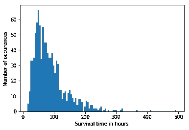

# 模拟故障

> 原文：<https://towardsdatascience.com/simulating-failure-e93ab24cbcec?source=collection_archive---------20----------------------->

## 一百万次泵故障为什么不再多一次？如何模拟制造领域的故障？


Photo by [Elijah O’Donnell](https://unsplash.com/photos/t8T_yUgCKSM?utm_source=unsplash&utm_medium=referral&utm_content=creditCopyText) on [Unsplash](https://unsplash.com/search/photos/fake?utm_source=unsplash&utm_medium=referral&utm_content=creditCopyText)

在制造业领域，我最常被问到的一个问题是，这台机器什么时候会出故障。在化学工程领域，机器常常是泵。许多过程和可靠性工程师根据行业图表和多年的泵工作经验来估算。但是很少有人能告诉我，在我们的工作区域内，泵的正常寿命是多少。因为这些泵不会经常出故障。

这就引出了一个问题，“我怎样才能更好地理解这种泵模式？”

在这种情况下，我经常使用的算法是蒙特卡罗模拟。正如您将看到的，这种风格将帮助我们建立一个基线，让我们更好地了解什么时候可能会发生失败。

**我们将要谈论的:**

*   如何建立蒙特卡洛模拟？
*   如何模拟泵故障(或任何有明确数据的过程)？
*   如何获得工程团队的信任？

让我们开始吧。下面我们设置了一些虚拟数据来输入我们的算法。

```
import numpy as np# Generate positive portions of the distribution. positive_num = np.random.randint(low=0, high=100, size = 200)#Generate negative portions of the distribution.negative_num = np.random.randint(low=-100, high=0, size = 300)#Joining the positive and negative datasets together.pump_pressure_changes = np.concatenate([negative_num, positive_num], axis = 0)
```

在上面的代码中，我们使用 numpy 生成了一些随机数据。这个数据集的负值比正值多。您可以将这些点中的每一点视为泵压的正变化和负变化。事实上，在现实世界的问题中，你应该只取泵压读数的第一个差值，就可以得到与你的问题相似的数据。

现在让我们来构建工作马函数。我们将一步步地了解这段代码的每一部分。

```
####################################################################
#Monte Carlo Simulation
####################################################################
def Base_Monte_Carlo(current_pressure, final_pressure, max_threshold, iterations, data):

    hour_distribution = np.empty(shape=(1,0))
    for i in np.arange(iterations):
        print("Iteration number: {}".format(i))
        hours_til_failure = 0
        psi_left =  current_pressure
        not_done = True
        while(not_done):       
            sample_chunk = np.random.choice(data)
            print('Sample drawn: {}'.format(sample_chunk))
            hours_til_failure += 1
            psi_left += sample_chunk
            print('psi left {}'.format(psi_left))
            # Check if the predefined cutoff has been hit
            if psi_left <= final_pressure:
                # This is where the Late-Stopping or hope would be added.
                hour_distribution = np.append(hour_distribution, hours_til_failure)
                not_done = False
            if psi_left > max_threshold:
                print("print had a spike reseting back to normal")
                psi_left = max_threshold
                print(psi_left)
    return(hour_distribution)
```

在此功能中，参数的含义如下

current_pressure =你的泵现在所处的压力，或者你想要模拟的压力。

最终压力=泵出现故障或在产品中产生不良结果的压力。例如，在化学领域，这可能意味着你的产品开始燃烧，因为它在管道中移动变慢了。在真正的解决方案中，这是你需要向熟悉你的流程的人询问的事情。

max_threshold =机械有物理可能的极限。例如，如果你将一杯水倒入水槽，排水管很容易跟上，但如果你将消防水管放入同一个水槽，水就会溢出。我们必须尽可能模拟这些物理障碍，这就是上限的原因。

迭代次数=这是我们想要运行模拟的次数。

现在让我们来看看这个函数在做什么。

```
hour_distribution = np.empty(shape=(1,0))
```

这一行代码只是给我们一个地方来存储每次模拟达到“失败”状态所花费的时间。在这个例子中，我们假设样本中的每个数据点都是以一个小时为间隔采集的。

```
for i in np.arange(iterations):
        print("Iteration number: {}".format(i))
        hours_til_failure = 0
        psi_left =  current_pressure
        not_done = True
```

这段代码是模拟开始的地方。它会为您想要的每次迭代生成一个模拟。然后，它让我们知道我们在打印语句的模拟中进行了多远。

hours_til_failure 和 psi_left 是我们在每次迭代开始时重置的两个变量。hours_til_failure 实际上记录了我们的泵在每次迭代中运行了多长时间而没有出现故障。psi_left 是一个变量，我们稍后将根据 final_pressure 对其进行验证，以查看我们是否满足故障标准。

```
while(not_done):       
            sample_chunk = np.random.choice(data)
            print('Sample drawn: {}'.format(sample_chunk))
            hours_til_failure += 1
            psi_left += sample_chunk
            print('psi left {}'.format(psi_left))
```

这里，当我们的“not_done”变量为真时，这段代码将从我们的数据集中随机抽取一个样本，给泵已经运行的时间加上一个小时，并从泵的当前压力中加上或减去适当的量。

```
if psi_left <= final_pressure:
                hour_distribution = np.append(hour_distribution, hours_til_failure)
                not_done = False
if psi_left > max_threshold:
     print("print had a spike resetting back to normal")
     psi_left = max_threshold
```

第一个 if 语句检查我们是否低于我们的 final_pressure。如果是这种情况，那么模拟运行的小时数被附加到 hour_distribution，模拟重新开始。

第二个 if 语句检查我们的压力是否超过了允许的最大值。如果发生这种情况，它会将压力调整回可能的范围。

让我们试着用一些虚构的压力和限制来运行 1000 次。

```
distribution = Base_Monte_Carlo(current_pressure=1000, 
                                final_pressure=200, 
                                max_threshold=1500, 
                                iterations=1000, 
                                data=pump_pressure_changes)
```

最后，该函数返回我们的泵在所有迭代中持续的小时分布。我们可以使用 matplotlib.pyplot hist 函数对此进行图形化。

```
from matplotlib import pyplot as plt
# Plotting the histogram.
plt.hist(x = distribution, bins = 100)
plt.xlabel('Survival time in hours')
plt.ylabel('Number of occurences')
```



在本例中，我们可以看到泵在运行 90 小时左右最频繁地达到其故障状态。然而，我们也看到，假设它曾经运行了将近 500 个小时。

最后一点要注意的是，一定要从你的数据集中去掉任何异常事件，例如，机器的启动，或者像自然灾害这样的外部事件引起的意外停机。

现在，我发现当试图为过程工程师或可靠性工程师运行这些模型时，通常最好从更广泛的变量开始作为模型的输入。例如，如果他们告诉你，“我们知道在每小时 200 磅的压力下，我们的化学物质开始燃烧”。将您的模型设置为 150 失败，这样，如果您在不同的操作条件下遇到挑战，您可以说您对机器的运行时间能力持乐观态度。一旦建立了信任，您就可以将模型磨练成精确的运行参数。

我们在本帖中讨论了以下内容:

*   如何建立蒙特卡洛模拟？
*   如何模拟泵故障(或任何有明确数据的过程)？
*   如何获得工程团队的信任？

有很多有趣的方法，你可以调整这个模型，你可以真实地模拟任何改变状态的过程。另一个使用它的例子是一个进程的能量消耗。同样，这是一个基线模型，有助于理解该过程。

我希望听到你的反馈和建设性的想法。