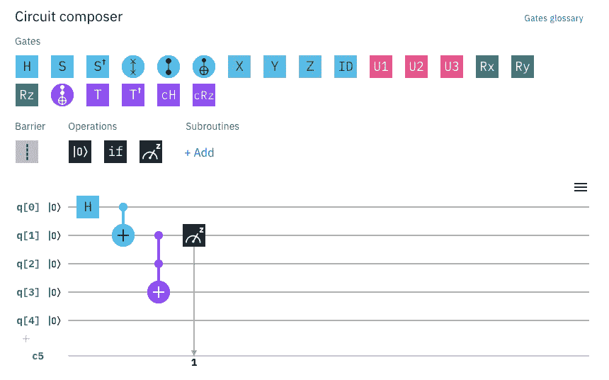
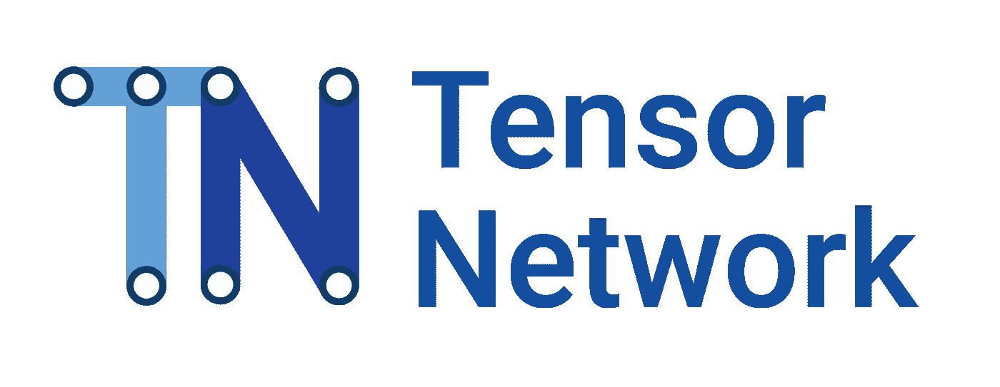
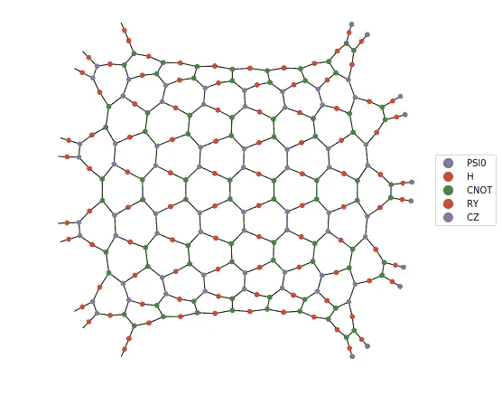

# 用张量网络模拟量子电路

> 原文：<https://towardsdatascience.com/simulating-quantum-circuits-with-tensor-networks-77e079919823?source=collection_archive---------23----------------------->

## [奇点研究](https://towardsdatascience.com/tagged/the-singularity-research)

## 用物理学改进机器学习模型

在本文中，我们将讨论用于模拟量子电路的开源软件 [Quimb](https://quimb.readthedocs.io/en/latest/index.html) 。Quimb 如此有趣和有用的原因之一是它能够用张量网络进行计算。如果你不熟悉张量网络，我们会在这里谈一点，但你也可以看看我在 Medium " [黑洞机器学习](https://medium.com/@thesingularity.research/black-hole-machine-learning-d7387a4bd30e)"上的另一篇文章，在那里我讨论了张量网络在物理学中的历史，以及它们在机器学习和人工智能中的用途。如果你仍然好奇并喜欢钻研一点代码，你也可以看看我的 Quimb 教程的 Github repo。

## 量子电路

Quantum Circuit using IBM’s Quantum Circuit Composer

量子电路是与音乐家使用的五线谱非常相似的图表。你从左到右读它们，就像音乐一样，五线谱上的每一个方框都代表了在被称为*门*的量子位上执行的一个矩阵操作。这些线代表量子位在时间中运行，通过这些门。在电路的最右侧，我们通常会看到小的测量符号，类似于汽车中的速度计，或者自行车打气筒上显示气压的仪表。它们表示量子位的测量值，并及时返回该量子位的状态向量。由于量子物理的概率性质，这些测量通常要进行多次。每次测量都将返回不同的值，有可能处于两种状态之一。这是量子计算机与经典计算机真正不同的一点。它们天生具有概率性，量子位不像笔记本电脑或手机中的经典二进制位那样简单地以 0 或 1 的形式存在。在上面由 [IBM 的量子计算电路合成器](https://quantum-computing.ibm.com/)制造的量子电路中，我们看到一个*哈达玛门*，由一个带有“**H”**的小盒子表示，它对单个量子位 q[0]进行操作。接下来是一个' *CNOT'* 门，它对前两个量子位 q[0]和 q[1]进行操作。电路中的第三个是三个量子位 q[1]、q[2]和 q[3]上的算子，由一个 8x8 矩阵表示。最后，对量子位 q[1]进行测量。你可以在 IBM 注册一个免费账户，在云中的实际 IBM 量子计算机上创建和运行你自己的量子电路。

## 张量网络

假设你有一个可以在经典计算机上有效模拟的量子电路(这并不总是可能的，因为在许多情况下经典计算机很难模拟计算)。有效模拟一些量子电路的一种方法是使用张量网络。张量网络是张量的图形表示，可以认为是多维数组。一个秩为 0 的张量仅仅是一个标量。秩为 1 的张量是一个矢量。一个*秩为 2 的张量*是一个矩阵，以此类推到秩为 3 后变得难以可视化的更高维数组。

## [谷歌的 TensorNetwork 库](https://github.com/google/TensorNetwork)

Google’s TensorNetwork Library Logo

谷歌最近发布了一个以其著名的 TensorFlow 作为后端运行的库。由于 TensorFlow 的流行和广泛使用，在 TensorFlow 上建立一个库是一个巨大的优势，但 TensorNetwork 库本身目前并不是最用户友好的，对新手来说可能有点令人生畏。如果您还不熟悉 TensorFlow，并且还没有扎实的编程背景，那么在尝试执行基本张量网络构造和操作之外的任何操作时，对抛出的一些错误进行故障排除可能会令人头疼。据说这个库在 Github 页面上是稳定的，但根据代码作者的说法，它在很大程度上仍处于 alpha 版本。取决于在这个项目上投入了多少努力，这个库可能还需要一段时间才能像 TensorFlow 一样在研究之外被广泛采用。

## 一个用户友好的选择…Quimb

Quimb Logo

Quimb 是一个开源软件，用于执行量子电路仿真和构建张量网络，在张量网络上执行操作，使用张量网络开发算法，以及为机器学习训练张量网络。它为那些已经熟悉量子力学和量子计算的人提供了出色的文档，对于那些不熟悉的人，我正在创建一个 Github 教程库，解释代码背后的数学和物理知识，并提供许多额外的示例和解释。第一个例子，查看第一个教程的[笔记本。Quimb 更出色的地方在于，它使用了](https://github.com/The-Singularity-Research/Quimb-Tutorials/blob/master/Quimb_tutorial1.ipynb) [NetworkX](https://networkx.github.io/) ，一个用于创建、操作和研究复杂网络的结构、动态和功能的 *Python 包*，来创建漂亮的张量网络图可视化:

Tensor Network using NetworkX in Quimb

## 张量网络和机器学习

那么，除了量子物理学之外，张量网络还有什么用途呢？它们可以在机器学习中用作深度神经网络中的层。这弥合了经典机器学习和量子机器学习新领域之间的差距，量子机器学习使用量子变分电路作为量子神经网络。在许多情况下，使用张量网络模拟这种量子神经网络可以显著提高机器学习算法的性能。因此，即使你不打算很快钻研量子计算，如果你正在使用神经网络和机器学习，你仍然可以通过将它们集成到你当前的机器学习模型中来受益于量子计算技术的使用。