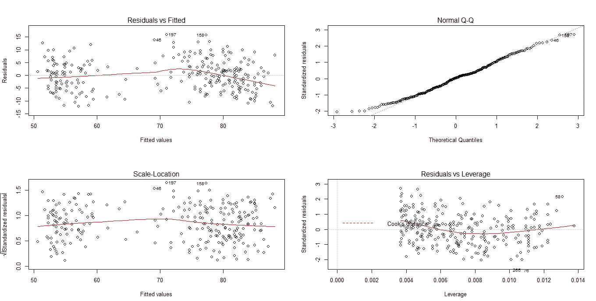
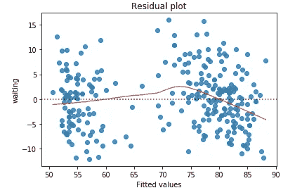
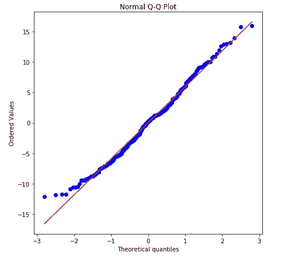
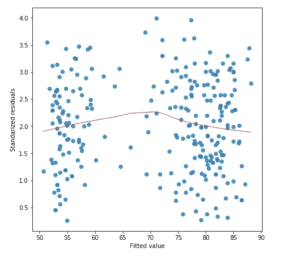

# 使用 sklearn 在 Python 中模拟(复制)R 回归图

> 原文：<https://towardsdatascience.com/simulating-replicating-r-regression-plot-in-python-using-sklearn-4ee48a15b67?source=collection_archive---------7----------------------->

当谈到数据科学和机器学习工作负载时，R 和 Python 是最流行和最强大的语言。Python 通常被视为具有易于理解的语法的通用语言，而 R 则用于统计分析，有大约 12000 个可用的包。

有几十篇文章从主观角度比较了 Python 和 R。在这里，我不会厚此薄彼。

在本帖中，我们将讨论使用 sklearn 在 Python 中对 R 回归图的**复制。**

大多数 R 的功能可以很容易地直接在 Python 中转换，但是如果不使用自定义函数，有些功能很难找到对等的功能。例如，**R 中用于回归模型的 plot ()** 函数在 Python 中并不具有所有绘图的直接等价物。

让我们用 r 中可用的**忠实**数据集来讨论一下，该数据集包含两个变量 ***喷发*** (喷发时间分钟)和*(等待下一次喷发的时间)的 272 个观测值。该数据集揭示了美国怀俄明州黄石国家公园老忠实间歇泉的喷发间隔时间和喷发持续时间。*

*现在，让我们将 R 中的简单线性回归模型拟合到该数据集，以根据喷发时间预测等待时间。*

**

*对于验证线性假设，上述每一个图都有其自身的重要性。我们不打算在这里深究。让我们关注 Python 代码来拟合相同的线性回归模型。*

*导入所有必要的库并加载所需的数据。*

*现在让我们使用 sklearn.linear_model 在 ***faithful*** 数据集上拟合一个线性回归模型。*

*现在让我们使用 sklearn 逐一关注所有的回归图。*

1.  ***剩余剧情***

*这是由 R 中的 **plot()** 函数生成的第一个图，有时也被称为残差与拟合图。通过绘制拟合值和残差之间的散点图，它有助于验证线性假设。*

*如果该图描述了任何特定或规则的模式，则假设目标变量和预测值之间的关系在本质上是非线性的，即存在非线性。并且曲线中没有图案是所选特征和目标变量之间线性的标志。*

*使用 Seaborn 中的 residplot()函数可以获得 Python 中的相同绘图。这里，第一个和第二个参数分别指向拟合(预测)值和目标变量。lowess=True 确保绘制 lowess(平滑)回归线，并使用 line_kws 参数自定义该线的属性。*

**

***2。QQ 剧情***

*该图描述了残差(误差)是否正态分布。如果这些点靠近法线，那么残差被假设为正态分布。*

*在 Python 中，使用 seaborn 中可用的 probplot()函数可以实现相同的绘图。这里，残差作为参数传递给函数。*

**

***3。比例位置图***

*通常，它用于猜测残差的同方差。它是标准化残差与拟合值的平方根图。如果它没有描述特定的模式，那么拟合的回归模型支持同质性假设。*

*使用 Seaborn 中的 regplot()函数可以获得 Python 中的相同绘图。这里，第一个和第二个参数分别指向拟合值和平方根标准化残差。*

**

***4。杠杆图***

*通常，它用于猜测异常值对回归拟合的影响。目前，我不知道如何在 Python 中为基于 sklearn 的合身模型绘制相同的内容。一旦我能够弄清楚，我会更新相同的。使用 statsmodels 很容易使用内置的杠杆图绘制，但我不打算在这里讨论它。*

*如果你已经知道如何为基于 sklearn 的拟合模型绘制相同的图。在评论里告诉我，我会加进去的！*