# 使用几何布朗运动在 Python 中模拟股票价格

> 原文：<https://towardsdatascience.com/simulating-stock-prices-in-python-using-geometric-brownian-motion-8dfd6e8c6b18?source=collection_archive---------1----------------------->

## 对几何布朗运动的动力学和主要驱动因素的高级描述，并附有示例 Python 代码

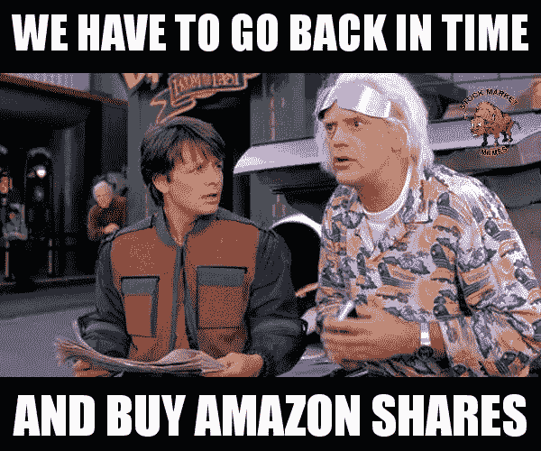

The picture was taken from [@StockMarketMeme](https://twitter.com/stockmarketmeme)

# 介绍

如果我们能准确预测股票价格在近期或远期的变化，那就太好了。我们会很富有，但几乎不可能做出准确的预测。股票价格的变动涉及太多难以建模的因素。人类心理学就是其中之一。当然，投资者是根据经验证据和股市指标做出决策的。然而，他们还是人类。不同的人会对数据做出不同的解读，这是因为他们的风险偏好和当时的情绪。当一个国家的突发新闻导致一个投资者买入一只股票时，它会导致另一个投资者卖出同样的股票。因此，预测股票价格是一项困难的工作，但我们仍然有有价值的工具，可以帮助我们了解股票价格在某种程度上的运动。

在本文中，我们将讨论如何使用 Python 构建几何布朗运动(GBM)模拟。在构建脚本时，我们还探索了 GBM 模型背后的直觉。我将不会进入它的推导的理论背景。这超出了本文的范围。我更关心对 GBM 需要什么参数、它的组件是什么以及它如何创建预测的高层次理解。我将尝试一种自下而上的方法，从组件开始构建 GBM 的逻辑。我们在这里开发的仿真模型是一个离散时间模型。因此，这里讨论的所有数学都是连续随机过程的几何布朗运动的离散时间类比。在本文的最后，我们将学习如何使用 GBM 创建模拟，您将拥有完整的代码。

# 内容

1.  GBM 做什么
2.  GBM 模拟需要什么输入参数
3.  GBM 的组成部分:漂移和扩散
4.  建立离散时间 GBM 模型
5.  做预测

## 1。GBM 做什么

在解释相关概念时，我在整篇文章中使用 E.ON 的股票价格作为例子。E.ON 是一家位于德国的电力公司，也是欧洲最大的电力公司之一。我通过 Quandl 的 Python 包从 Xetra Exchange 检索它的股票价格(以欧元计)。这里有一个可以显示股票价格的链接:【Investing.com 链接

为了能够使用 Quandl，你需要注册并从其网站获得授权令牌，还需要安装***【Quandl】***Python 包。假设您已经完成了这些步骤，您可以使用下面的代码来提取股票价格数据。

几何布朗运动被广泛用于金融中的股票价格建模，人们选择它是有原因的。在下面的线图中，x 轴表示 2019 年 1 月 1 日至 2019 年 7 月 31 日之间的天数，y 轴表示以欧元为单位的股价。我希望你只关注图中主要的、持续时间较长的趋势，忽略小的波动。你会意识到股票价格是波动的。它从 1 月到 4 月增加，然后到 5 月中旬减少，接着是另一个增加系列，直到 6 月中旬，最后到 7 月底减少。现在，我要你关注短期波动。我们来调查一下七月。你可以说大势下行，但股价不只是平稳下跌。在它到七月底的旅程中，它不断上升和下降，这表明在这个运动中没有一个可解释的模式。

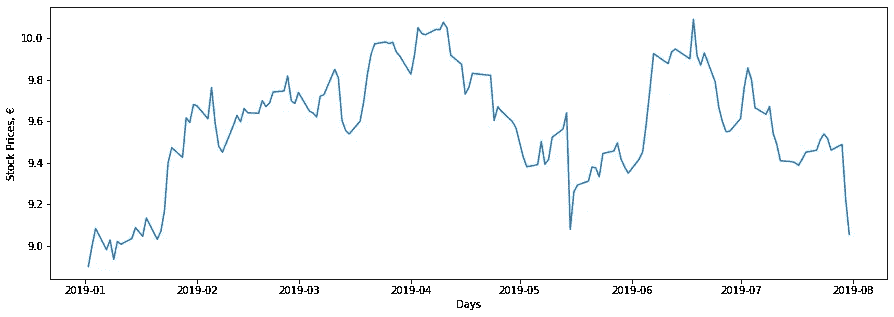

E.ON stock prices in the 1st half of 2019

因此，我们已经确定了股票价格运动的两个组成部分。七月，

1.  E.ON 的股价往往会下跌，而
2.  每天都有随机的冲击导致股价下跌，形成不规则的线图。

因此，我们需要一个合适的模型来考虑股票价格的两种类型的运动。这就是几何布朗运动发挥作用的地方。GBM 有两个组件来完成这项工作。一个组件包含长期趋势，而另一个组件应用随机冲击。我们将在后面的章节中讨论这些。

## 2.GBM 模拟需要什么输入参数

以下是我们的 GBM 模拟模型将采用的输入参数。我们将逐一详细讨论它们。为了这篇文章，我将使用 E . ON 7 月份的股票价格来预测 8 月份的情况。另外，你应该注意到，当我用日期解释事情时，我说的是交易日。我们假设一周只由工作日组成，这意味着周五之后是周一。因此，我希望大家在阅读输入参数时记住这些内容。

我们检索从 ***开始日期*** 到 ***结束日期*** 之间的历史股票价格。然后使用我们的 GBM 模型，我们将得到我们的模拟直到 ***pred_end_date*** 。我们可以玩这些变量，创建不同的设置。

```
Date        Close 
0 2019-07-01  9.612 
1 2019-07-02  9.761 
2 2019-07-03  9.856 
3 2019-07-04  9.800 
4 2019-07-05  9.664Date        Close 
18 2019-07-25  9.517 
19 2019-07-26  9.460 
20 2019-07-29  9.488 
21 2019-07-30  9.226 
22 2019-07-31  9.054
```

注意，只检索交易日的股票价格，从上面的数据可以看出这一点。

***1。所以***

这是初始股价。远期股票价格模拟的根源就是这个初始股票价格值。我们将这个初始值乘以一些表达式，得到八月份每个交易日的预测值。在我们这里， ***所以*** 就是 2019 年 7 月 31 日的收盘价。

```
9.054
```

***2。dt***

这是我们模型中的时间增量。它意味着我们假设的时间单位。请记住，我们有每个交易日股票的收盘价，那么我们模型中的时间增量是 1 天。请注意 ***dt*** 遵循历史数据中的时间步长。如果股票价格数据每 7.2 小时发布一次，那么 ***dt*** 将是 0.3，因为它对应于 7.2 小时(= 0.3 天)。

```
1
```

***3。T***

***T*** 表示我们预测时间范围的长度。在指定 ***T*** 和 ***dt*** 的值时，我们应该小心并保持一致。例如，在我们的例子中， ***T*** 应该是 22 天，因为我们希望预测 8 月份的 22 个交易日，当给 ***dt*** 赋值时，根据我们对 ***T*** 的声明，我们应该记住 ***dt*** 必须用天数来表示。这两个参数的时间单位必须相同。现在，看一个不同的例子，假设我们的数据中每个交易日有两个股票价格值，我们知道我们将对八月份的 22 个交易日进行预测。在这个设置下，我们的时间增量将是 0.5 天，我们将 0.5 分配给 ***dt*** 。因此，在应用 GBM 后，我们将有 44 个预测，8 月的每个交易日有两个预测。

还记得上一部分中的例子吗？我们假设股票价格数据每 7.2 小时发布一次。如果我们希望我们的预测时间范围是 72 小时( ***T*** = 72)，那么合适的 ***dt*** 本身就是 7.2 小时，而不需要将其转换为 0.3 天。所以，最后，我们会有 72 / 7.2 = 10 个预测，每个预测之间间隔 7.2 小时。

如果你在构建和使用 GBM 模型时遵循这一思路，那么在不同环境下对不同股票使用你的模型就会变得容易得多。这让许多人感到困惑，这就是为什么我在这里试图将它标准化:)我们试图达到的最终目的是正确计算*(在下一部分解释)。它是在我们的预测时间范围内的时间点的数量，在时间增量大小方面应该与我们的历史数据一致。我知道这是一件简单的事情，但建立一条推理路线总是一个好主意，以防止将来我们代码的不同应用中的潜在混淆。*

*我们可以使用本节开始时声明的变量***【pred _ end _ date】***来推断八月份的交易日数。使用下面的代码，我们可以通过计算( ***end_date*** + 1 天)和 ***pred_end_date*** 之间的工作日，提取我们的模型将预测股票价格的交易日数。在我们的案例中，我们需要的是 2019 年 8 月 1 日至 2019 年 8 月 31 日之间的交易天数。*

```
*22*
```

****4。*n***

*该参数在 ***dt*** 和 ***T*** 赋值后自动出现。它是预测时间范围内的时间点数量。在我们的例子中，我们的时间增量是 1 天，我们将得到 22 个交易日的预测。这意味着，我们有 22 个不同的时间点(天),最终我们将有 22 个预测。*

```
*22.0*
```

****5。t****

*这是一个数组，我们在其中显示了模型中的时间进程。它就像一个计时器，我们通过计算经过的时间点来测量时间。建筑数组 ***t*** 由 ***N*** 计算而来。记住我们有 22 个时间点(天)来做预测。这就是为什么数组 ***t*** 从 1 开始，一直到 22。当我们使用数组 ***t*** 中的一个元素时，它的意思是，模型中过去了那么多时间点。随着我们的预测距离 ***的日期越来越远，因此*** (起始日)，随着时间点的推移，它们会因这个数组 ***t*** 而波动得更大。在我们的例子中， ***t*** 将是我们模型下面的数组。*

```
*[ 1 2 3 4 5 6 7 8 9 10 11 12 13 14 15 16 17 18 19 20 21 22]*
```

*其他一些例子:*

****一、*** 如果 ***dt*** 是 0.5 天(每天两个股票价格) ***T*** 是 22 天，那么 ***t*** :*

```
*[1 2 3 4 5 6 7 8 9 10 ... 44]*
```

****二世。*** 如果 ***dt*** 是 7.2 小时而 ***T*** 是 72 小时，那么 ***t*** :*

```
*[1 2 3 4 5 6 7 8 9 10]*
```

*我们之所以可以使用数组 ***t*** 作为一个正整数序列，直到 ***N*** 的原因是，我们在时间尺度上以同样的方式对待历史股价数据和我们的预测。我的意思是，历史数据中的 1 天和我们预测的 1 天是一样的。在网上的一些其他文章中，你可能会遇到这样的情况，数组 ***t*** 被缩小，上升到 1。在这些情况下，预测时间范围的 1 天变化的意义和我们的输入参数 ***mu*** 、 ***sigma、*** 和数组**必须被缩放以说明时间-尺度差异。在本文中，我们对历史数据和预测使用相同的时间尺度，以使 GBM 模型更具解释性。***

******6。穆******

***这是所选历史日期范围内股票价格的平均回报。在我们的例子中，我们选择 7 月的交易日作为历史数据，我们应该使用 7 月的股票价格计算*。在计算 ***mu*** 之前，我们要计算每个交易日的收益。计算如下。****

****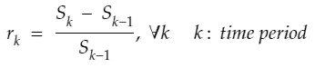****

****Return calculation for time point k****

```
****[0.015501456512692377, 0.00973260936379476, -0.005681818181818097, -0.013877551020408265, -0.0032077814569537026, 0.00384096335513348, -0.013340227507755901, -0.005554973273241884, -0.008326306913996506, -0.0004251248804337693, -0.0005316321105793732, -0.0013829787234042447, 0.0030893789283050936, 0.0036108751062020944, 0.0010582010582012237, 0.0052854122621563355, 0.002944269190326022, -0.0022017194380374075, -0.0059892823368707165, 0.0029598308668074727, -0.0276138279932545, -0.018642965532191694]****
```

****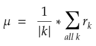****

****Mean return of the historical stock prices****

****在计算了七月份所有日子的收益之后，我们需要使用这些收益计算算术平均值，以获得 ***mu*** 。然后我们将使用*进行我们的 ***漂移*** 分量的计算。它会对股价的长期走势产生影响。此外，正如您在下面看到的， ***mu*** 为~ -0.3 %，这表明 7 月份的平均回报率为负，我们应该在计算 8 月份的远期预测时考虑到这一点。*****

```
**-0.0026705996693330543**
```

****需要注意的一点是，我们不需要用一个数字乘以平均回报率来进行调整。我们忠于历史数据的时间增量，并以历史数据存在的方式创建预测序列。我们已经在上面讨论了这个问题，但是为了更详细地说明，假设我们每 7.2 小时检索一次股票价格数据，并且我们有过去 72 小时的数据。此外，我们还想预测接下来的 36 个小时。当我们从历史数据中计算平均回报时，该平均回报占 7.2 小时的相关时间步长(两个数据点之间有 7.2 小时)。在进行预测时，遵循我们对历史和未来时间尺度的一致性规则，我们将 7.2 小时分配给 ***dt。*** 这导致 5 个时间点(36/7.2)，它们之间有 7.2 小时，我们的数组 ***t*** 变成了*【1 2 3 4 5】*。这意味着我们可以在我们的模型中使用 mean return 作为 ***mu*** 而无需对其进行调整。****

*******7。西格玛*******

****这是 7 月份股票价格收益的标准差。**西格玛很重要，因为，它将有助于把随机冲击纳入我们的预测。还记得上面 E .关于股票价格的线图吗，股票价格一天比一天持续上涨和下跌。还有，这个小运动的幅度和方向似乎是随机的。在这里，***∑***将帮助我们确定运动的幅度。 ***sigma*** ，本身并没有给模型增加我们需要的随机性。当选取随机值时，我们将使用标准的正态随机变量。*西格玛将通过缩放随机冲击的幅度做出贡献，以便根据股票价格的历史波动性出现小波动。我们不希望任何不相关的随机值来自标准正态分布。下面，你可以看到 ***sigma*** 是如何计算的。*******

****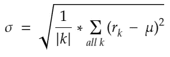****

****The volatility of the historical stock prices****

```
**0.009362443851856311**
```

****记得我们说过，我们不会将 ***mu*** 与任何数字相乘进行调整，因为我们在进行预测时会忠于历史数据中的时间步长。同样的逻辑也适用于此，我们也不需要调整*。*****

*******8*。b********

****这个数组是我们在模型中添加随机性的数组。这里重要的是 ***scen_size*** 变量。由于这是一个模拟模型，我们希望在预测时间范围内有许多股票价格的假设路径。将 2 赋给 ***scen_size*** 意味着，最终我们会有 2 个不同的股价序列。每个场景的逻辑都是一样的。因此，我将讨论我们是否只创建一个预测系列。还记得在 ***t*** 的讨论中，我们声明了一个计算经过时间点的时间推进数组。这里，数组 ***b*** ，对于每个相应的预测时间点，存储来自标准正态分布的随机数。这些随机数会给模型增加随机冲击，这一点我们从文章开始就一直在讨论。这就是为什么我们将使用 *numpy.random.normal()* 从标准正态分布中生成随机值。同样，我们不将这个随机值与任何数字相乘进行调整，遵循与**和*相同的推理。*******

*****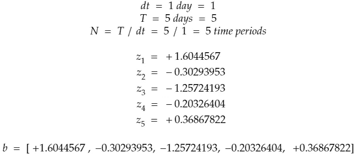*****

*****Creating random shocks*****

*****在上面的例子中，我们假设我们的历史股票价格数据是每日的，这就是为什么我们将 1 分配给 ***dt*** 。同样，我们想要 5 天的预测，这意味着 ***T*** 的值是 5。接下来， ***N*** 被计算为 5 个时间点(5 个 1 天周期)。因此，对于每个时间点，我们使用 *numpy.random.normal()* 方法生成一个来自标准正态分布(mean=0，std=1)的随机数。这些随机值最终组成了我们的数组 ***b*** 。*****

****在我们的例子中， ***T*** 应该是 22 天。下面的代码中，我们为两种不同的场景创建了两个长度为 22 的随机值数组。****

```
**{'1': array([ 1.37139893, -1.60468185,  0.84629302,  0.84599139,  0.1392499 ,        -0.23658454,  0.66158754,  1.44276449,  0.25582332, -0.00432083,         1.39636253,  0.21584903,  0.15232219,  1.41902316,  0.15672926,        -0.76728718,  0.26303217,  1.61346848,  0.16319213,  1.08515534,        -1.43681955, -1.89643601]),'2': array([-1.19967538, -0.66905682, -1.31963702, -0.04374916,  1.36622513,         0.39133558, -0.05713623, -1.16944076,  0.51635002, -0.53486539,         1.864583  , -1.2722681 ,  0.06091857, -0.86510476,  0.1338046 ,         0.76766205, -0.00538846,  0.92632565, -0.13265282, -0.12242566,         0.4031829 ,  0.74874924])}**
```

*******9。w*******

*******【W】***是布朗路径，它决定了股票价格从开始时间点( ***So*** )到另一个时间点 ***t*** )如何波动。你要区分 ***b*** 和 ***W*** 。在下一节中，它们之间的区别将会更加清楚，但我还是想在这里简单提一下。 ***b*** 是在预测下一个时间点的股价时，被施加到一个时间点股价上的随机冲击。所以，假设，在时间点 3，股价是 S_3。当预测时间点 4 时，***b***【4】作为随机冲击应用于 S3。 ***W*** 则相反，是路径。这意味着它包括了自预测时间范围开始以来所有随机冲击的影响。是随机性并入 ***所以*** (初始股价)直到我们关注的特定时间点的总效应。假设我们预测时间点 4。我们需要将所有随机冲击应用到时间点 4 到 ***，因此*** 。所以我们用索引小于等于 4 的数组 ***b*** 元素的累积和***【W】***【4】代替***b***【4】。下面是上一部分中我们讨论数组 ***b*** 的例子的延续。****

****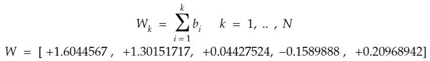****

****Creating the Brownian paths****

```
**{'1': array([ 1.37139893, -0.23328292,  0.6130101 ,  1.45900149,  1.59825139,         1.36166685,  2.02325439,  3.46601888,  3.72184221,  3.71752138,         5.11388391,  5.32973294,  5.48205514,  6.9010783 ,  7.05780756,         6.29052038,  6.55355255,  8.16702103,  8.33021316,  9.4153685 ,         7.97854894,  6.08211294]),'2': array([-1.19967538, -1.8687322 , -3.18836922, -3.23211838, -1.86589325,        -1.47455767, -1.5316939 , -2.70113466, -2.18478464, -2.71965004,        -0.85506704, -2.12733514, -2.06641657, -2.93152133, -2.79771673,        -2.03005468, -2.03544314, -1.10911749, -1.24177031, -1.36419597,        -0.96101307, -0.21226383])}**
```

****以上是我们案例的代码。继上一部分的数组 ***b*** 计算之后，我们根据上面的 ***W*** (k)表达式取累加和，创建数组 ***W*** 。****

****我们对 GBM 模型输入参数的讨论到此结束。我们通过例子理解了它们背后的原因，在接下来的部分中，我们将从它的组件中构建 GBM 模型。这将使本节中的输入参数对您更有意义。****

## ****3.GBM 的组成部分:漂移和扩散****

****记得在第一节，我们已经确定了几何布朗运动的两个组成部分。一个是股票价格的长期趋势，另一个是短期的随机波动。现在，我们将为它们命名。我们称长期趋势为漂移，称短期波动为扩散。在本节中，我希望你假设我们在一个特定的时间点(k-1)，我们将预测时间点(k)。然而，我们在上一节中谈到的相同假设仍然有效。提醒一下:****

*******假设 1:***(k-1)和(k)之间的时间段长度，也就是 dt，符合历史数据频率。****

*******假设 2:*** 我们模拟中的时间是通过计算时间段来进行的。****

****这些假设使我们忽略了将 ***mu*** ，***【sigma】***， ***z*** (k)与一个时间长度值相乘进行调整，我们可以组成我们的数组 ***t*** 作为一个时间点计数器*【1 2 3…】*。****

****我们继续吧。我们在一个时间点(k-1)。在这个时间点的股票价格需要服从股票价格的长期趋势，同时当我们使用它来创建时间点(k)的预测时，暴露于随机冲击。因此，我们需要将 GBM 的两个组成部分应用到股票价格中。****

****让我们用数学术语来看看这些组件是什么:****

*******1。*漂移******

****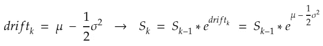****

****Drift for time point k****

*******漂移*** 反映股票价格的长期趋势。大家可以回忆一下上一节，我们已经知道了 ***mu*** 和 ***sigma*** 。它们是从 7 月份的历史股价数据中计算出来的常量值。因此，我们的 ***漂移*** 是一个常数值，如果我们假设不存在随机冲击，我们可以将其应用于时间点(k-1)的股价，如上面的表达式所示。如果我们继续应用 ***漂移*** 而没有任何随机冲击，那么如果*漂移为正，股价就会平稳上升；如果 ***漂移*** 漂移为负，股价就会下跌。你应该注意到股票价格永远不会变成 0，因为 ***漂移*** 是通过指数函数应用的。这就是 ***漂移*** 的故事。现在，让我们用**扩散*移动*扩散**。*****

*******2。*扩散******

****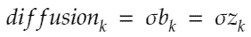****

****Diffusion for time point k****

*****扩散反映短期波动。从第 2 节可以回忆起，数组 ***b*** 存储了我们需要的随机冲击信息，它从标准正态随机变量 ***z*** 中检索随机冲击信息。在计算扩散分量时，我们将随机值 ***z*** (k)乘以***∑***。在这里，您可以注意到随机性是如何融入 GBM 模型的。另外， ***扩散*** 组件使得创建不同的股票价格预测场景成为可能。 ***漂移*** 分量不变。我们不能从中创建不同的场景，但 ***扩散*** 组件帮助我们创建尽可能多的场景，因为它涉及维纳过程(它创建独立、平稳和正态分布的随机冲击)。*****

****因此，当考虑到时间点(k-1)的股票价格对时间点(k)进行预测时，我们需要将这两个因素的影响相加。总的组合效应为我们提供了对时间点(k)的预测。如果只有 ***漂移*** 成分，我们总是知道股票价格在下一个时间点会变成什么，但是 ***扩散*** 成分通过引入随机冲击来破坏这种平滑性。因此，我们没有观察到股票价格的单调上升或下降趋势。下面是总组合效应如何应用于时间点(k-1)的股价。****

****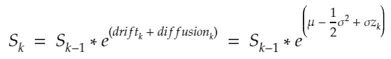****

****Adding drift and diffusion for 1 time point ahead prediction****

## ****4.建立离散时间 GBM 模型****

****到目前为止，我们学习了为什么我们需要 GBM，离散时间 GBM 模型的参数是什么，以及如何提前 1 个时间点进行预测。现在，我们建立一般的闭合形式的方程的几何布朗运动调整为离散时间的背景。在上一节中，我们展示了如何通过将 ***S*** (k-1)乘以 *exp(* ***漂移*** *+* ***扩散*** *)* 来预测 ***S*** (k)。作为此的延续，我们将尝试预测 ***S*** (k)使用 ***So*** (已知的初始股价)。****

****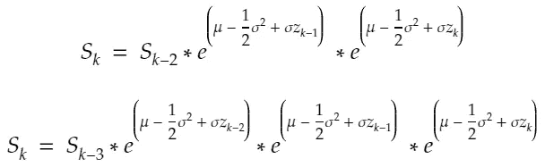****

****为此，我们首先将 ***S*** (k-1)替换为****

*******S***(k-2)*exp(****漂移***(k-1)*+****扩散*** (k-1) *)。*****

****然后我们将****S***(k-2)*替换为******

********S***(k-3)exp(**漂移** (k-2) + **扩散** (k-2) *)* 。*****

****如果我们继续这样做，最后，我们将有 ***所以*** 乘以许多指数项。您可以在下面的步骤结束时看到我们获得的结果。****

****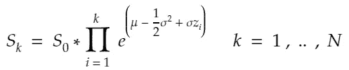****

****之后，我们扩展上面的等式，这次分别表示*和 ***扩散*** 项。*****

****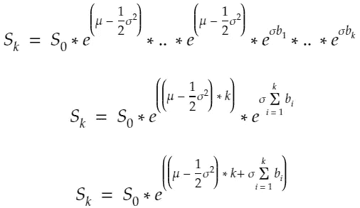****

****以上是倒数第二个方程式为 ***S*** (k)。这意味着，我们可以从 ***预测 ***S*** (k)所以*** 通过添加 k 个 ***漂移*** 和累积*直到 k 的组合效应记住从上一节开始， ***漂移*** 不会从一个时间点变化到另一个时间点。这就是为什么，要预测前方 k 个时间点，我们只需多次添加 ***漂移*** k。这与 ***扩散*** 不同。在第 2 节讨论 ***W*** 时，我们了解到它是布朗路径。你可以回忆一下那部分。基于该讨论，为了预测 k 个时间点，我们应该考虑在路径上遇到的所有随机冲击的总效应。在建立等式的最后一步，我们通过替换下面的等式来修改上面的等式。*****

****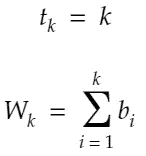****

****然后，它给出了方程的最终形式，其中的参数我们都很熟悉，我希望我们在第 2 节中进行的所有讨论现在能帮助您理解我们为什么以这种方式创建这些参数。****

****我们知道**所以**我们知道 ***mu*** 我们知道 ***sigma*** 我们知道数组 ***t*** 我们知道数组 ***W*** 。我们可以一步轻松地为预测时间范围内的所有时间点创建预测。我们将在下一节中完成这项工作。****

****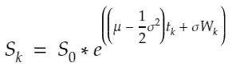****

****Geometric Brownian Motion equation****

## ****5.做预测****

****这是我们文章的最后一部分，也是最有趣的部分。我们现在可以创建预测。首先要做的是计算预测时间范围内所有时间点的 ***漂移*** 。你已经记住了**阵列*t*。我们只需将它与 ***漂移*** 相乘，就可以得到一个 ***漂移*** 的数组。该 ***漂移*** 数组包含预测时间范围内所有时间点的总 ***漂移*** 。******

****关于 ***扩散*** ，我们将有一个 ***扩散*** 数组用于每一个场景。记住，我们使用变量 ***scen_size*** 来控制我们想要多少场景。现在，对于这个问题，我们只有两种情况。你想涨多少就涨多少。这就是为什么你会看到 2 个不同的*阵列，分别标有*‘1’*和*‘2’*。但是，对他们每个人来说，这是同样的逻辑。我们将布朗路径(数组 ***W*** )乘以 ***【西格玛】*** 。*****

```
**drift:
[-0.00271443 -0.00542885 -0.00814328 -0.01085771 -0.01357214 -0.01628656  -0.01900099 -0.02171542 -0.02442985 -0.02714427 -0.0298587  -0.03257313  -0.03528756 -0.03800198 -0.04071641 -0.04343084 -0.04614526 -0.04885969  -0.05157412 -0.05428855 -0.05700297 -0.0597174 ]diffusion: 
{'1': array([ 0.01283965, -0.0021841 ,  0.00573927,  0.01365982,  0.01496354,         0.01274853,  0.01894261,  0.03245041,  0.03484554,  0.03480509,         0.04787845,  0.04989933,  0.05132543,  0.06461096,  0.06607833,         0.05889464,  0.06135727,  0.07646328,  0.07799115,  0.08815086,         0.07469872,  0.05694344]),'2': array([-0.01123189, -0.0174959 , -0.02985093, -0.03026053, -0.01746932,        -0.01380546, -0.0143404 , -0.02528922, -0.02045492, -0.02546257,        -0.00800552, -0.01991706, -0.01934671, -0.0274462 , -0.02619347,        -0.01900627, -0.01905672, -0.01038405, -0.011626  , -0.01277221,        -0.00899743, -0.00198731])}**
```

****以下是预测。因为我们有两个场景，所以作为下面操作的结果，我们将有两个股票价格预测序列。第一行代码就是我们在上一节中推导出的最终 GBM 方程。第二行只是将 ***So*** 添加到预测序列中，因为它是起点，我们可能希望在我们的图中看到它。****

```
**[[9.054      9.1461394  8.98533403 9.03226024 9.07940588 9.06660652   9.02202324 9.05347139 9.15171815 9.14879651 9.12362735 9.21862966   9.21223827 9.2003776  9.29815157 9.28656346 9.19509744 9.19278238   9.30740419 9.29636703 9.36583938 9.21564323 9.02891936][9.054      8.92860643 8.84880033 8.71645344 8.6892655  8.77726795   8.78560531 8.75710402 8.63826721 8.65659865 8.59000918 8.71758658   8.59101135 8.57261126 8.48040716 8.46802049 8.50598079 8.48249529   8.53318693 8.49949308 8.46674294 8.47572541 8.51221286]]**
```

****作为最后要做的事情，我们现在创建我们的预测的情节。正如你在下面看到的，我们有两个股票价格预测场景。一个上升，另一个下降。我们问题中的 ***漂移*** 是负的，你可以从 ***漂移*** 数组中观察到。这意味着股票价格的长期趋势是下降的(记住我们只考虑 7 月份的历史数据。我是在这个基础上说的！).然而，尽管有一个负的 ***漂移*** ，我们有一个向上的预测。这是由于随机冲击。记住，我们使用标准的正态随机变量来创建它们。在价格上涨的情况下，很明显，这些随机冲击超过了 ***漂移*** 效应，导致了这样一个系列。****

****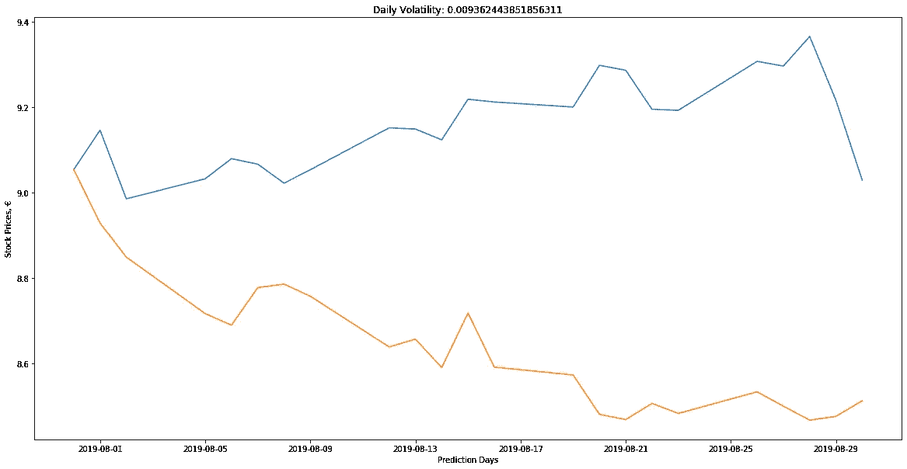****

****Two different scenarios for August stock prices****

# ****结论****

****在本文中，我们学习了如何在离散时间环境中使用几何布朗运动来构建股票价格的模拟模型。下面是完整的代码。当您在注册后从 Quandl 获取授权令牌并安装所需的 Python 包时，您可以立即使用代码。在每次运行中，你会得到不同的股价情景。是因为我们使用 *np.random.normal()* 没有设置种子。每次我们运行模型，我们将有一个不同的数组 ***W*** ，这将导致不同的预测。****

****几何布朗运动帮助我们看到股票价格可能遵循的路径，并让我们为即将到来的事情做好准备。当然，预测准确的未来是不可能的，但是这些统计方法给了我们创造可靠的交易和对冲策略的机会。****