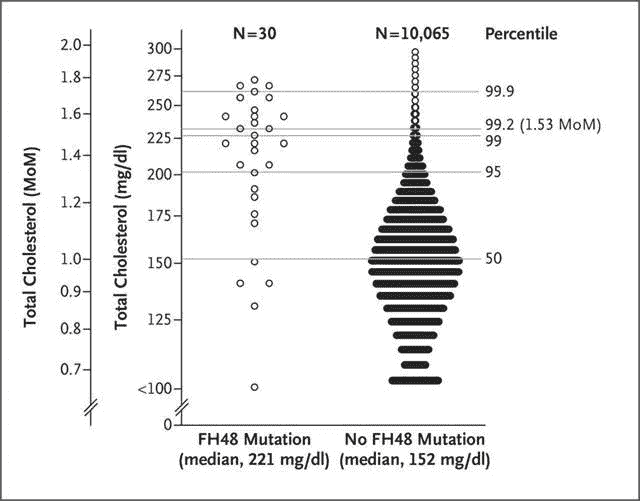
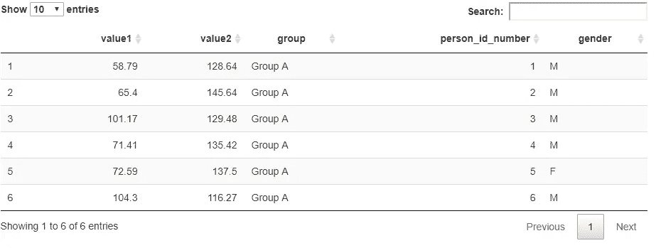
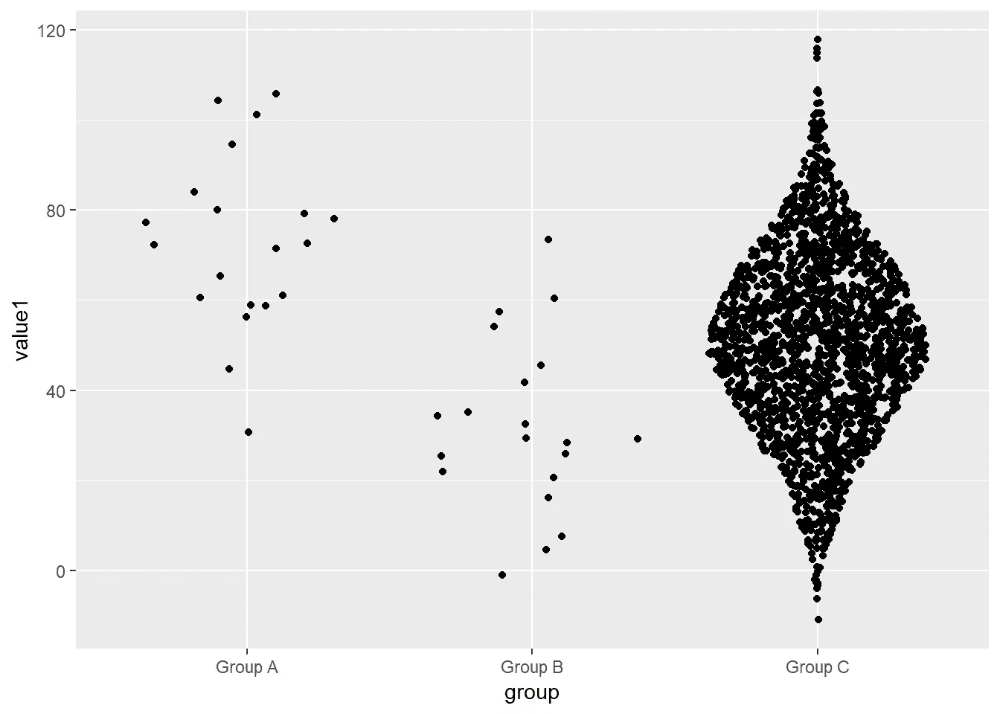
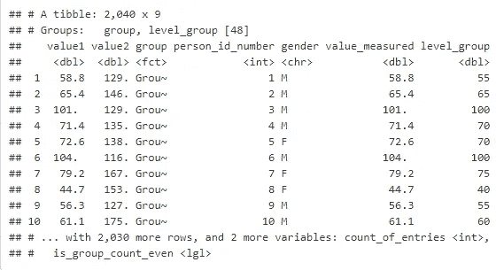
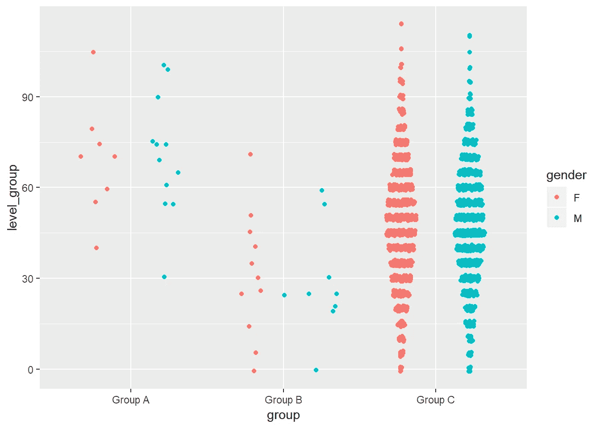
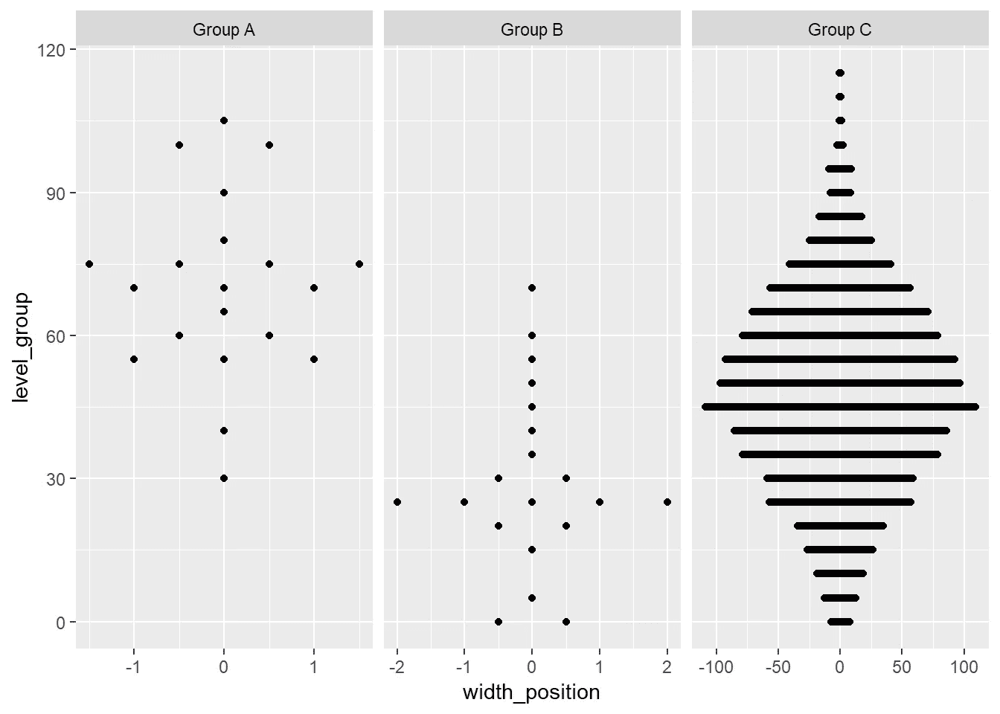
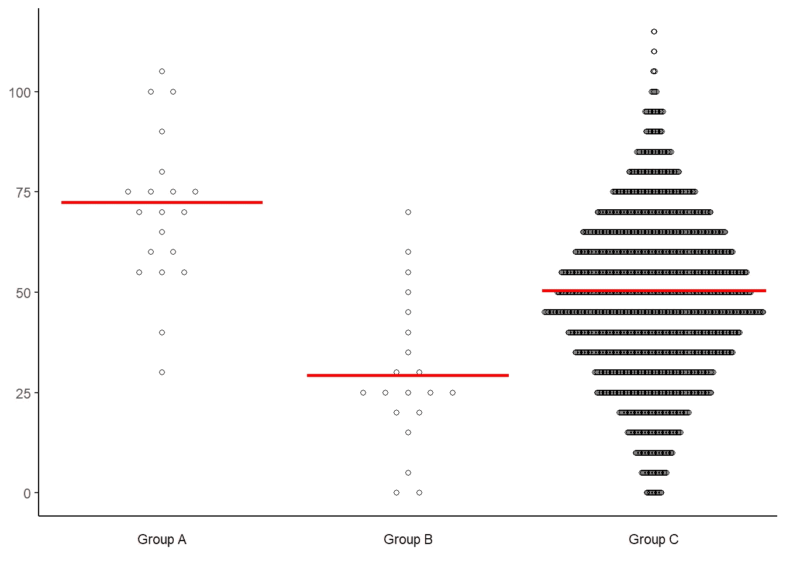
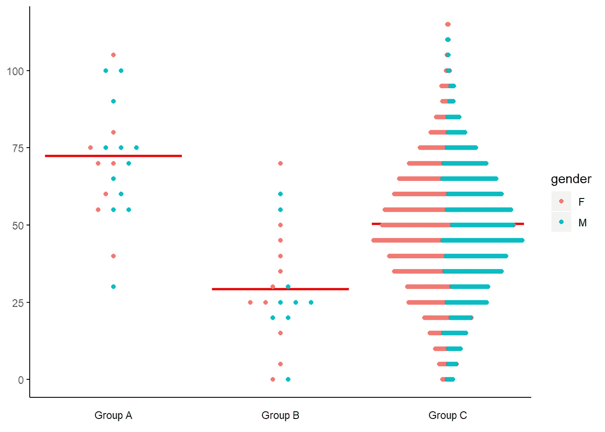
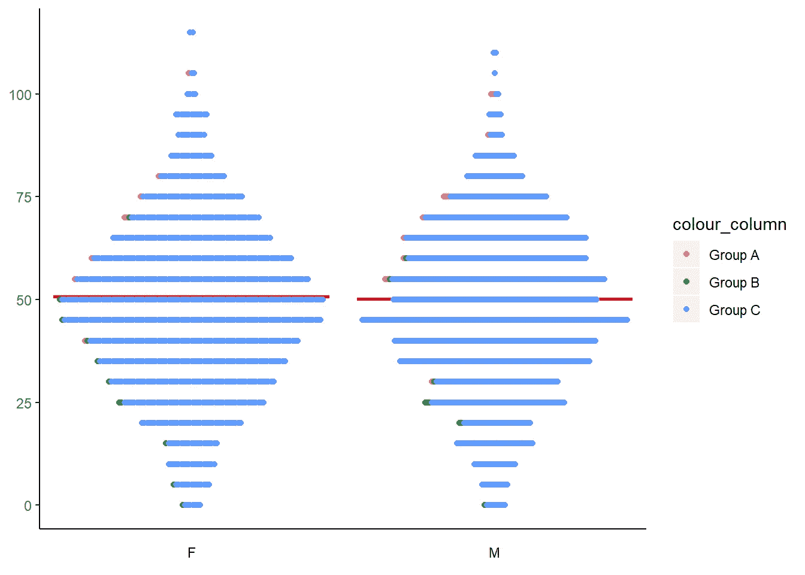
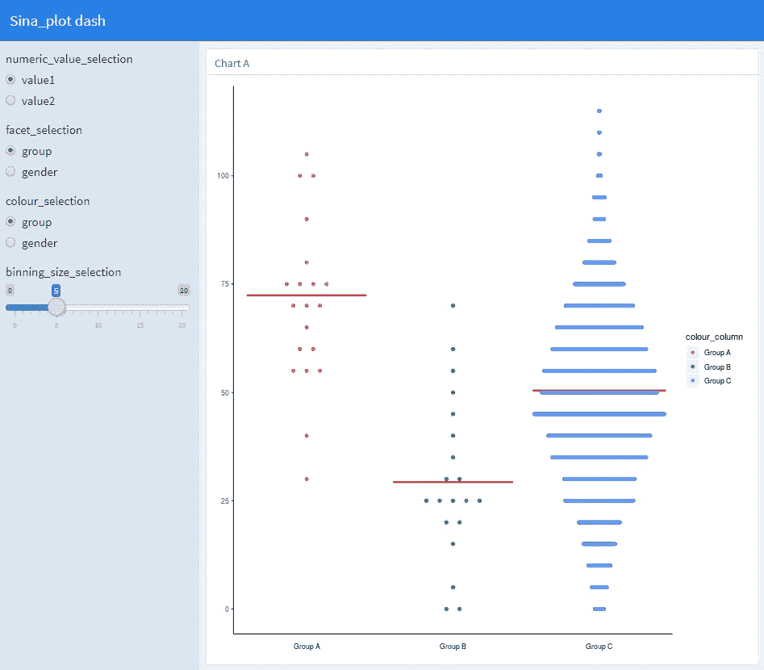

# 新浪 _ 剧情娱乐与 ggplot

> 原文：<https://towardsdatascience.com/sina-plot-recreation-afcfdef028ac?source=collection_archive---------23----------------------->

## 我最近被要求重新创建一个 ggplot 图表。

```
knitr::include_graphics("images/image002.jpg")
```



通过查看它，我能够确定一些虚拟数据，让自己开始…

```
*# dummy data*

small_group_size <- 20
large_group_size <- 2000

set.seed(123)

small_sample_1 <- 
  tibble(value1 = rnorm(small_group_size, 70, 20), 
         value2 = rnorm(small_group_size, 150, 20),
         group = "Group A") 

small_sample_2 <- 
  tibble(value1 = rnorm(small_group_size, 30, 20),
         value2 = rnorm(small_group_size, 180, 20),
         group = "Group B")

control <- 
  tibble(value1 = rnorm(large_group_size, 50, 20), 
         value2 = rnorm(large_group_size, 220, 20),
         group = "Group C")

*# let's put it all together and add a gender column, as well*

data_collected <- bind_rows(
  small_sample_1, 
  small_sample_2,
  control) %>% 
  mutate(person_id_number = row_number()) %>% 
  mutate_at(c("value1", "value2"), round, 2) %>% 
  mutate(gender = sample(c("M", "F"), n(), replace = T)) %>% 
  mutate(group = factor(group, levels = c("Group A", "Group B", "Group C")))

*# and tidy things up (if you want... object nuking, everying but)*
rm(list = setdiff(ls(), "data_collected"))
```



我发现在 ggforce 包里也有类似的东西，叫做 sina_plot。相似但不完全…来看看开箱的新浪 _ 剧情吧

```
data_collected %>% 
  ggplot() +
  aes(x = group, y = value1) +
  ggforce::geom_sina()
```



我看到的图表中有一些有趣的特征，是直线 sina_plot 没有给我的。首先，y 轴值被分类，刻度是某种形式的对数。加上 x 轴抖动是一个不规则的。让我们看看我们能否实现这一点…

```
given_levels <- data_collected %>% 
  mutate(value_measured = value1,
         level_group = (value1 %/% 5) * 5,
         level_group = pmax(level_group, 0)) %>% 
  group_by(group, level_group) %>% 
  mutate(count_of_entries = n(),
         is_group_count_even = count_of_entries %% 2 == 0)
```



现在，让我们用颜色来看看。

```
given_levels %>% 
  ggplot() +
  aes(x = group, y = level_group) +
  ggforce::geom_sina()
```



因此，看起来我必须确定数据准备中的 x 轴和 y 轴位置，并为不同的组使用一个面…并使用 geom_point 图表…稍后再担心颜色。

```
given_levels_and_width_values <- given_levels %>% 
    mutate(count_of_entries = n(),
         width_of_group = count_of_entries %/% 2,
         width_position = row_number() - width_of_group - 1) %>% 
  mutate(width_position = if_else(is_group_count_even & width_position == 0, width_of_group, width_position)) %>% *# this is tricky... Basically, if there's an even number, we want to relocate that x=0 point somehow...by putting it at the end... this is actually going to cause us problems later :-)*
  mutate(width_position = case_when(is_group_count_even & width_position > 0 ~ width_position - 0.5,
                                    is_group_count_even & width_position < 0 ~ width_position + 0.5,
                                    TRUE ~ width_position))
```

让我们现在画出来

```
given_levels_and_width_values %>% 
  ggplot() +
  aes(width_position, level_group) +
  geom_point() +
  facet_grid(. ~ group,
             scales = "free_x")
```



太棒了。稍微整理一下…

```
distance <- 5

unique_grouping_levels <- unique(given_levels_and_width_values$group)

dummy_data <- tibble(column_to_group = rep(unique_grouping_levels, 2),
                       width_position = c(rep(-distance, length(unique_grouping_levels)), 
                                          rep(distance, length(unique_grouping_levels))),
                       level_group = rep(NA_integer_, length(unique_grouping_levels)*2))

median_lines <- given_levels_and_width_values %>%
  group_by(group) %>%
  summarise(level_group = median(value_measured, na.rm = T),
            to = max(width_of_group, na.rm = T) + distance/2,
            from = -to) %>%
  gather(key, width_position, -1, -2) %>%
  select(-key)

break_steps <- seq(min(given_levels_and_width_values$level_group, na.rm = T), max(given_levels_and_width_values$level_group, na.rm = T), 25)                                         

nearly_finished_plot <- given_levels_and_width_values %>% 
    ggplot() + 
    aes(x = width_position, y = level_group) +
    geom_point(shape = 1) +
    geom_blank(data = dummy_data) +
    labs(x = NULL,
         y = NULL) +
    scale_y_continuous(breaks = break_steps) +
    facet_grid(. ~ group, 
               scales = "free_x",
               **switch** = "both") +
  theme(axis.text.x =  element_blank(),
        axis.ticks.x = element_blank(),
        panel.background = element_blank(),
        axis.line = element_line(colour = "black"),
        strip.background = element_rect(fill = "white"),
        strip.placement = "outside",
        panel.spacing.x = unit(0, "lines")) +
  geom_line(data = median_lines, colour = "red", size = 1)  

nearly_finished_plot
```



我们可能还想看到由另一列着色的点…

```
only_colour_points <- given_levels_and_width_values %>% 
  filter(!is.na(gender)) %>% 
  arrange(gender) %>% 
  mutate(count_of_entries = n(),
         width_of_group = count_of_entries %/% 2,
         width_position = row_number() - width_of_group - 1) %>% 
  mutate(width_position = if_else(is_group_count_even & width_position == 0, width_of_group, width_position)) %>% *# this is tricky... Basically, if there's an even number, we want to relocate that x=0 point somehow...by putting it at the end... this is actually going to cause us problems later :-)*
  mutate(width_position = case_when(is_group_count_even & width_position > 0 ~ width_position - 0.5,
                                    is_group_count_even & width_position < 0 ~ width_position + 0.5,
                                    TRUE ~ width_position))

nearly_finished_plot +
  geom_point(data = only_colour_points, aes(colour = gender)) *# these colour points are actually being overlayed over the original points, and loaded in from the left... this is beneficial because it allows you to see proportions (roughly) of each group (and even NA values, if there are any)*
```



好吧，这一切都很好。我们已经制定了数据准备步骤和所有的小 ggplot 添加…从这里，让我们把这些步骤变成函数。(1)分配宽度组(箱)(2)分配宽度位置(3)如果适用，通过颜色变量分配宽度位置(4)绘制！

现在，让我们尽可能的动态化…这样 y 轴和 faceting(分组)变量可以在函数调用中指定。

```
assign_width_groups <- **function**(data, column_to_group, column_to_bin, min_value_to_plot, bin_size) {

  column_to_bin <- rlang::enquo(column_to_bin)
  column_to_group <- rlang::enquo(column_to_group)

data %>% 
  mutate(value_measured = !! column_to_bin,
         column_to_group = !! column_to_group,
         level_group = ((!! column_to_bin) %/% bin_size) * bin_size,
         level_group = pmax(level_group, min_value_to_plot)) %>% 
  group_by(column_to_group, level_group) %>% 
  mutate(count_of_entries = n(),
         is_group_count_even = count_of_entries %% 2 == 0)
}assign_width_positions <- **function**(data) {

  data %>% 
  mutate(count_of_entries = n(),
         width_of_group = count_of_entries %/% 2,
         width_position = row_number() - width_of_group - 1) %>% 
  mutate(width_position = if_else(is_group_count_even & width_position == 0, width_of_group, width_position)) %>% 
  mutate(width_position = case_when(is_group_count_even & width_position > 0 ~ width_position - 0.5,
                                    is_group_count_even & width_position < 0 ~ width_position + 0.5,
                                    TRUE ~ width_position))
}plotting_function <- **function**(data, distance = 5, colour_selection = NULL) {

  colour_selection <- rlang::enquo(colour_selection)

  unique_grouping_levels <- unique(data$column_to_group)

  dummy_data <- tibble(column_to_group = rep(unique_grouping_levels, 2),
                       width_position = c(rep(-distance, length(unique_grouping_levels)), 
                                          rep(distance, length(unique_grouping_levels))),
                       level_group = rep(NA_integer_, length(unique_grouping_levels)*2))

  median_lines <- data %>%
    group_by(column_to_group) %>%
    summarise(level_group = median(value_measured, na.rm = T),
              to = max(width_of_group, na.rm = T) + distance/2,
              from = -to) %>%
    gather(key, width_position, -1, -2) %>%
    select(-key)

  break_steps <- seq(min(data$level_group, na.rm = T), max(data$level_group, na.rm = T), 25)

  plot <- data %>%
    ggplot() +
    aes(x = width_position, y = level_group) +
    geom_point(shape = 1) +
    geom_blank(data = dummy_data) +
    labs(x = NULL,
         y = NULL) +
    scale_y_continuous(breaks = break_steps) +
    facet_grid(. ~ column_to_group,
               scales = "free_x",
               **switch** = "both") +
    theme(axis.text.x =  element_blank(),
          axis.ticks.x = element_blank(),
          panel.background = element_blank(),
          axis.line = element_line(colour = "black"),
          strip.background = element_rect(fill = "white"),
          strip.placement = "outside",
          panel.spacing.x = unit(0, "lines")) +
    geom_line(data = median_lines, colour = "red", size = 1)

  *# we also need to add a final step for when a colour component is selected, as well.*

  **if** (!is.null(colour_selection)) {

    only_colour_points <- data %>% *# this is the data after both steps of the data-prep...*
      mutate(colour_column = !! colour_selection) %>% 
            filter(!is.na(colour_column)) %>%
      arrange(colour_column) %>%
      assign_width_positions()

    plot <- plot +
      geom_point(data = only_colour_points, aes(colour = colour_column))

    }

  plot

}
```

现在，只需几行代码就可以将它们组合在一起

```
data_collected %>% 
  assign_width_groups(gender, value1, 0, 5) %>% 
  assign_width_positions() %>% 
  plotting_function(colour_selection = group)
```



中线也很棘手。首先，它落在彩色点的后面(这很容易修复)，其次，它是从实际值而不是入库值计算出来的(这就是为什么它不完全在某个显示点上或之间)。

还有一个小问题，但我认为它不会被注意到，直到我能费心去解决它(这不是对数刻度…我认为没有它看起来更好)。

不管怎样，所有这些功能都准备好了，我们现在可以把它们放入一个漂亮的小 flexdashboard 中…

[看看吧](https://juliantagell.shinyapps.io/sina_plot_flexdashboard/)



# 结论

天啊，这花了很长时间才解决。与 Tableau 相比，在 ggplot / R 中定制的(和可定制的)图表会花费很长时间…但是现在我知道怎么做了..小心世界:-)实现下一次将是一个 sinch。