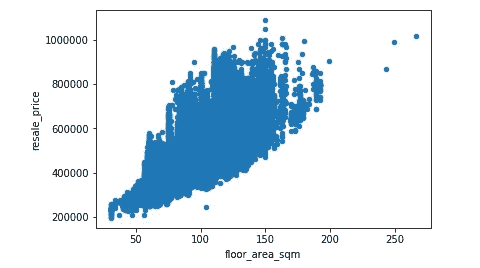
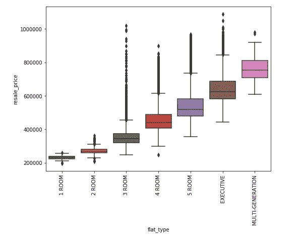
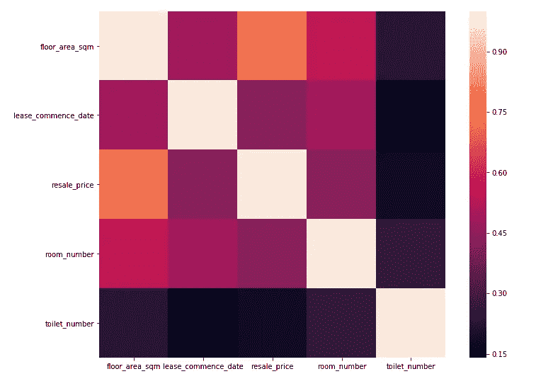
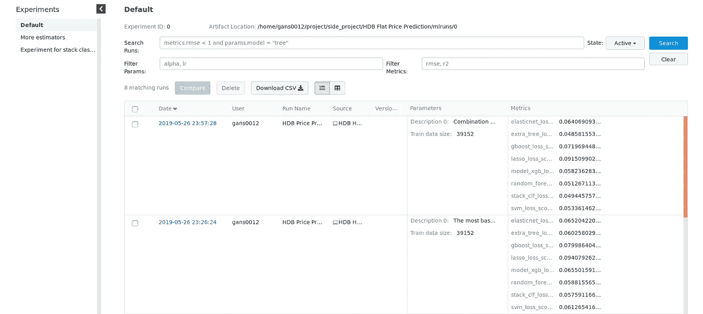
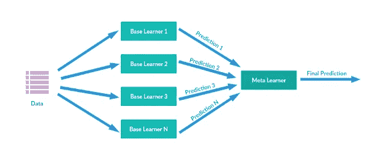
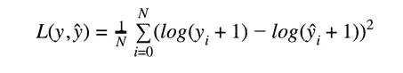
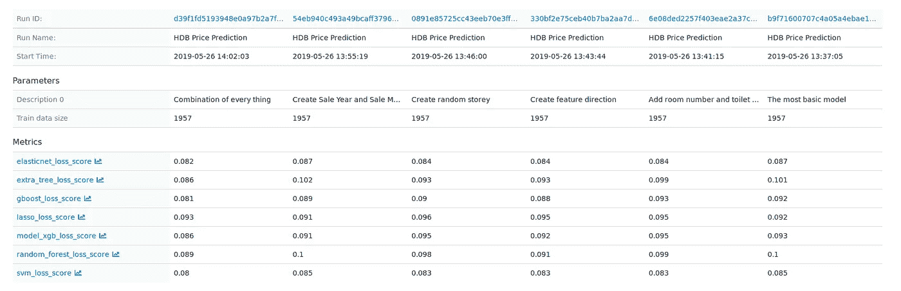

# 新加坡统一价格预测器

> 原文：<https://towardsdatascience.com/singapore-flat-price-predictor-6f74ed8da311?source=collection_archive---------21----------------------->

## 用机器学习预测新加坡房价


Photo by [Peter Nguyen](https://unsplash.com/@peterng1618?utm_source=medium&utm_medium=referral) on [Unsplash](https://unsplash.com?utm_source=medium&utm_medium=referral)

新加坡连续第五年被经济学人信息部选为最昂贵的国家之一。作为世界上最昂贵的城市之一，住宿占了很大一部分费用。

为了给新加坡普通民众提供负担得起的住房，新加坡政府一直在新加坡提供一些公共住房选择，更普遍的说法是 **HDB 公寓**。

对于这个附带项目，我已经采用了 [HDB 转售价格数据](https://data.gov.sg/dataset/resale-flat-prices)，并训练了一个机器学习模型来预测新加坡的统一转售价格。

根据智能国家倡议，新加坡政府在网上[发布了大量新加坡数据](https://data.gov.sg/)，公众可以访问。此外，有一些很好的 API 可供开发人员集成到他们的应用程序中。

# 概观

这篇文章被分成几个部分。以下是我所涉及的部分的概述:

1.  将数据可视化
2.  特征创建
3.  训练/测试分割
4.  实验
5.  创建机器学习模型
6.  全体
7.  韵律学
8.  结果
9.  结论

事不宜迟，让我们深入了解一下如何自己创建一个统一价格预测器！

# 将数据可视化

在开始一个机器学习项目之前，我们执行一些标准的可视化程序来理解我们的数据是很重要的。只有了解我们的数据，我们才能知道清理和预处理数据的正确方法。

以下是该数据中可用的列:

```
'month', 'town', 'flat_type', 'block', 'street_name', 'storey_range', 'floor_area_sqm', 'flat_model', 'lease_commence_date', 'resale_price'
```

转售价格将是这个项目的目标标签，其余的列将形成我们的特征矩阵。让我们继续画一些图表。



Distribution Plot for Floor Area against Resale Price

我们可以从图表中推断出，建筑面积越高，公寓的转卖价格就越高。通过绘制分布图，我们可以发现是否有任何异常值，如果它们看起来太不寻常，就将其删除。

除此之外，我们还可以使用**箱线图**来了解我们的数据分布。下面是一个简单的箱线图，它有助于向我们展示给定特定特征的目标标签的分布。


Image from [Flowingdata](https://flowingdata.com/2008/02/15/how-to-read-and-use-a-box-and-whisker-plot/)

在我们的项目中，boxplot 可以帮助我们了解不同公寓类型中的公寓价格分布。



另一个有助于我们理解特征的重要可视化工具是**关联矩阵:**



Correlation matrix of different flat’s features

那么，从这个矩阵中能得到什么呢？建筑面积和转售价格之间的颜色是其他组合中最浅的。这意味着建筑面积和转售价格高度正相关——更高的建筑面积，更高的转售价格。

相比之下，厕所数量和转售价格的相关性非常低，这意味着厕所数量在预测公寓的转售价格方面可能不是很有用。

# 特征创建


Photo by [Kelly Sikkema](https://unsplash.com/@kellysikkema?utm_source=medium&utm_medium=referral) on [Unsplash](https://unsplash.com?utm_source=medium&utm_medium=referral)

该数据集中可用的特征相当小。但是，没有什么能阻止我们创造更多！

拥有更多功能肯定会帮助机器学习模型学习数据集的模式。

一些我认为有用的功能:

1.  **方向**。这套公寓所在的城镇在这个数据集中给出了。我们如何改进这一功能？我创建了一个新特征，将城镇映射到下面列出方向/区域之一:

```
"NORTH_EAST","EAST""WEST","NORTH","CENTRAL"
```

2.**房间号&卫生间号**。根据给定的公寓类型，我从 HDB 网站上查看，找出房间和厕所的数量，并创建了两个新功能。

3.**层高**。数据中提供的楼层范围要素是字符串格式:4 到 6，7 到 9，我认为这是次优的，因为如果您的要素是序数，您应该将要素转换为数字。

原因在于，楼层 7 低于楼层 9，将特征建模为数字将有助于模型了解这种关系。如果我们将特征保留为字符串而不进行任何处理，模型将会错过这些重要的信息。

所以我创建了一个随机生成器，它将在数据集中给定的最低楼层和最高楼层之间生成一个数字。请看下面的例子，以便更好地理解:

```
# Example, :
4 To 6 - The generator output: 4 or 5 or 6
7 TO 9 - The generator output: 7 or 8 or 9
```

4.**销售年度&月。**数据集中最初给出的月份是这样的格式:**2018–4**，因此通过将它们分解为“年”和“月”将允许模型选取序数关系。

新创建的功能在提高模型性能方面的效果如何？我将运行多个实验，并与基本模型进行一些比较。我将在**结果**的后面部分介绍这一点。

# 训练/测试分割

在将模型投入生产之前，我们需要将数据分为训练集和测试集，以验证模型的准确性。创建我们的训练测试集时需要注意的一些重要事项:

1.  **训练和测试集的分布应该类似**。训练和测试集的一个不好的例子是，训练集中的单元都来自东部地区，而测试集中的单元都来自西部地区。显然，在这种条件下训练的模型不会非常有效。
2.  **测试集的分布和现实生活中的数据应该是相似的**。测试集是一个安全的评估，让您在投入生产之前了解系统的性能。如果你的测试集没有捕捉到真实生活数据的分布，那么你从测试集中得到的结果不会给你多少信心。您的系统很有可能在生产中表现不佳。

为了产生一个好的训练和测试数据集，我们可以使用**分层抽样。**在我们进行分层抽样之前，我们需要确定一个重要的关键特征，并确保您的训练和测试集分布基于该特征是相似的。

例如，在我们的项目中，我选择位置作为分层抽样的关键特征。就位置而言，列车和测试设备中的单元具有相似的分布是一个好主意。也就是说，如果您的列车组在中部有 50%的平坦度，在西部有 30%的平坦度，在东部有 20%的平坦度，那么您应该在测试组中保持这个比例。

# 实验


数据科学的很大一部分是关于进行实验的。创建新功能、更改模型、调整超参数等等。所有这些活动的有效性需要通过运行大量的实验来衡量。

在这一部分，我将介绍一些技巧和工具，它们可以帮助你更有效地进行实验。

**MLflow**

Mlflow 是一个帮助您简化机器学习开发的平台。MLflow 下有多个子项目，例如:

1.  **MLflow Tracking** —帮助您跟踪实验的参数、结果和指标，并通过交互式用户界面进行比较
2.  **MLflow 项目**s——帮助您通过 Docker 和 Conda 将代码打包成可重复运行的代码
3.  **MLflow 模型** —帮助您打包模型，以便您可以轻松地与他人共享

在这个项目中，我使用 MLflow 来跟踪我的实验，并在训练后记录模型，以便我可以很容易地与他人分享我的结果。下面的代码片段显示了 MLflow 提供的交互式 UI:



MLflow UI

对于您在实验中所做的任何更改或额外处理，留下一些描述是一个很好的做法。这将有助于您稍后分析结果。

**使用较小的样本量进行实验**

我从一位了不起的教练那里学到了这个建议——杰瑞米·霍华德。他是 fastai 的创始人，该公司的使命是让人工智能教育对任何人免费开放。

这是一门非常棒的关于机器学习的免费在线课程。如果你有兴趣亲自动手，并开始你的机器学习之旅，一定要去看看他们的课程。

那么这实际上意味着什么呢？在前面的部分中，我们已经解释了训练测试分割过程，这样我们就可以为我们的模型获得一些反馈。现在，我们可以更进一步，从我们的训练集中创建一个更小的样本，用于实验。

我们为什么要这么做？当我们设计模型或添加新功能时，我们希望从我们正在进行的所有活动中获得快速反馈。等待 5-10 分钟去做一件事是不会有成效的。因此，拥有更小的样本量，你可以更快地运行你的实验，获得反馈并做出改变。

样本量应该有多小？经验法则——它应该很小，但足够有代表性，可以帮助你在不到 20 秒的时间内完成实验，并获得对结果的粗略估计。

# 创建我们的机器学习模型

Sklearn 提供了许多方便的库，帮助我们轻松地创建模型。您可以创建多个模型，并在一个实验中运行所有模型，请参考下面的代码:

```
elasticnet = make_pipeline(RobustScaler(), ElasticNet(alpha =0.00001, random_state=1))svm = make_pipeline(RobustScaler(),SVR(C=140))lasso = make_pipeline(RobustScaler(), Lasso(alpha =0.0005, random_state=1))GBoost = GradientBoostingRegressor(loss='huber',min_samples_split=10,n_estimators=200)experiment_description = [
   'Add in sale year and sales month feature',
   'Add more data from 2015'
]run_experiment([elasticnet,svm,lasso,GBoost],experiment_description)
```

代码可能看起来非常简单，但是它需要大量的知识来理解这些模型背后的理论。例如，你需要知道模型背后的数学理论是什么，超参数是什么，何时何地我们应该使用这个模型。

每一个模型都值得用一整篇文章来彻底解释其背后的理论和机制。在网上查找资源，那里有大量有用的资料。

# 全体


Photo by [Debby Hudson](https://unsplash.com/@dhudson_creative?utm_source=medium&utm_medium=referral) on [Unsplash](https://unsplash.com?utm_source=medium&utm_medium=referral)

这是机器学习中非常有用的技术，可以提高你的整体模型的准确性。它所做的是创建一堆不同的分类器(例如:random forest、elasticnet、xgboost)，并集成这些分类器的结果以改善结果。

我们可以使用的一种简单而常见的集成技术是简单地对每个分类器的预测进行平均。

你可能想知道它有什么帮助？背后的基本原理是，不同的分类器从不同的角度学习数据集的模式。通过收集和平均结果，我们可以看到一些性能提升。

## 堆垛

我在这里使用的整体技术是堆叠。与平均模型相比，这是一种稍微先进的技术。然而，它在引擎盖下做的事情非常简单！下面是堆叠的简单架构:



Image from [Wikimedia commons](https://commons.wikimedia.org/wiki/File:Stacking.png)

我们有多个分类器对数据进行学习，并输出许多不同的预测。我们没有对预测进行平均，而是将其发送给元学习器，元学习器是另一个机器学习模型，可以给我们最终的预测。

元学习者决定不同分类器所做预测的权重。一些分类器可能比其他分类器表现更好，因此元学习器将优化并找到最佳组合。

虽然整个过程听起来令人生畏，但这实际上只需要很少的代码，因为繁重的工作是由我们出色的 sklearn 库完成的！

# 韵律学

是时候看看结果了！但是在分析结果之前，我们首先需要了解指标是什么。

我们这里使用的指标是均方根对数误差(RMSLE)。我相信你们大多数人都听过和学习过均方根误差(RMSE)。这两个指标的区别在于，在计算均方根之前，我们对目标值和预测值应用对数。参见下面的等式:



Equation of root mean square logarithmic error

为什么我们用 RMSLE 而不是 RMSE？通过做对数，我们只查看实际值和预测值之间的相对差异/百分比差异。


Comparison between RMSE and RMSLE

如果目标值和预测值之间的差异在数值上很大，RMSE 会给予很大的惩罚。但 RMSLE 正在研究百分比差异，并对两种情况给出相同的损失分数。

在我们的项目中，不同公寓的价格在不同的水平上变化，我们希望所有的误差都以百分比为基础来处理，这是使用 RMSLE 的主要原因。

# 结果



Comparison of results between the effects of feature creation

损失分数越低，目标值和预测值之间的差异越小，因此意味着更好的结果。通过以上比较，我们可以知道，在所有的特征创建中，创建平面位置到区域的映射是最有帮助的。

通过组合我们创建的所有额外功能，总体改进是非常显著的。您可以比较第一列和最后一列的结果，以观察损失分数的改善情况。

我们用于执行所有这些实验的数据大小只是数据的一个非常小的子集。我们可以运行完整的实验(使用所有的训练数据)并比较“最基本的模型”——**模型 A** 和“具有所有额外特征的模型”——**模型 B** ，以验证我们的特征创建实际上是有帮助的。请参见下面的结果:


Comparison between most basic models and models with all extra features

在我们使用的所有型号中，型号 B 的表现要好得多。所以功能创建肯定很有帮助！

我想强调一下这两个模型中性能最好的模型，即堆叠分类器。模型 B 的堆积分类器的损失分数比模型 A 低 15%,这是一个惊人的改进。

# 结论

简而言之，我已经强调了从零开始构建统一价格预测器的整个过程。你可以从这个 GitHub [库](https://github.com/huai99/Singapore-Flat-Price-Prediction)下载源代码。

除了机器学习代码，我还创建了一个 web 应用程序来执行实时预测。

web 应用程序代码在同一个存储库中，如果您觉得对您的用例有用，可以参考它们。