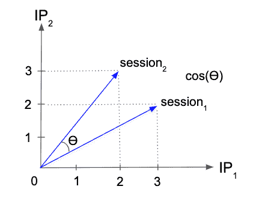

# 使用 GraphX 跨设备为匿名用户匹配单个用户标识

> 原文：<https://towardsdatascience.com/single-userid-matching-for-anonymous-users-across-devices-with-graphx-72fe111ac44b?source=collection_archive---------15----------------------->


Public domain image, [Pxhere](https://pxhere.com/en/photo/1444327)

有可能你正在阅读这篇文章，因为你有一个数字营销的用例。 [Gartner](https://www.gartner.com/en/marketing/insights/articles/pay-attention-to-these-6-marketing-technologies-in-2018) 称之为**跨设备识别(XDID)** 数字营销人员需要关注的新兴技术。此外，当前对 cookie 管理的监管变化进一步增加了概率模型和数据科学在单个用户匹配中的重要性。

但是数字营销并不是唯一可以从单一用户 ID 中获益的用例。其他有价值的用例围绕着推荐系统和个性化，并且与行业无关。

识别用户的不同选项有:

**账户登录**:一种高度确定性的用户识别方式。这种形式的身份识别的质量是以注册和登录用户数量通常较少为代价的。因此，并非所有返回的用户都必须被识别为单个用户。对于拥有多个帐户的用户也是如此。

**Cookie 标识**:通常是一种高质量的标识形式，但不能跨设备工作。cookie 许可管理和 cookie 寿命的法规变化也带来了越来越多的问题。

**设备指纹**:一种识别用户身份的概率方法，但在设备指纹的使用方面受到越来越多的监管和技术限制。此方法也不能跨设备工作。

**IP 匹配**:识别单个用户的较低质量的概率选项。然而，IP 是跨设备可用的。与 3G/4G 网络或公共 Wifi 一样，动态共享 IP 也存在问题。无论如何，IP 是最可行的选择。(尽管根据 GDPR，知识产权是“个人身份信息”。)


Mozilla Lightbeam, public domain image, [Wikimedia](https://commons.wikimedia.org/wiki/File:Screengrab_of_Mozilla%27s_%27Lightbeam%27_(addon_for_FireFox)_on_141127_showing_100_trackers_on_the_%27abovetopsecret%27_website.png)

在 Zoopla，消费者可以浏览我们的房源列表并发送线索。但是，我们在这个过程中对用户注册和登录只有相对较弱的激励。因此，许多 Zoopla 用户实际上是匿名的，并且通常使用多种设备。为了创建一个强大的个性化路线图，我们必须找到一种方法来创建单个用户 id，它可以跨设备工作，也可以处理匿名流量。在 Zoopla 每天超过 200 万次会话的规模上，这是一个有趣的数据科学问题，也是一个困难的数据工程挑战。

这篇博文展示了我们如何使用点击流数据创建一个概率性的单用户 ID。值得注意的是，用户在我们的过程中保持匿名。我们的目标不是用户的个人身份，而是更好地理解他们与我们产品的交互。

# 步骤 1:创建候选图

当匿名消费者使用 Zoopla 的酒店门户时，我们会像其他网站一样生成一个会话 ID。我们的目标是找到一个数据点，我们可以使用它将最有可能来自同一个用户的潜在会话 id 链接在一起。我们的目标是链接会话 IDs)跨设备以及(2)随着时间的推移。

我们用于链接会话 id 的数据是来自点击流的 IP 地址和时间戳:


我们使用时间戳等数据为 ML 模型创建附加功能。例如，我们在模型中使用时间戳的方式:

*   在数据准备中，过滤我们在特定时间窗口内观察到的 IP 和会话，以减少我们的数据总量，同时提高我们模型的质量
*   为了创建额外的功能，我们将图形嵌入与机器学习模型相结合。

第一步是创建我们的图形顶点。每个顶点是一个会话，对应的 IP 特征向量总结了我们在每个会话中看到的相关 IP，包括我们在会话中观察到的时间范围:

```
val vertices =
  preparedClickstreamData
  .groupBy("session_id", "ip")
  .agg(
    count("*").alias("ip_count"),
    //Additional ts aggregations etc
  )
  .withColumn(“ip_count_struct”, struct("ip", "ip_count”))
  .groupBy("session_id")
  .agg(
    //Spark SQL 2.4 
    map_from_entries(“ip_count_struct”).alias("ip_vector"),
    //Additional ts aggregations etc
  )
```


the vertices data model

我们还需要共享至少一个 IP 地址的候选会话图的边:

```
val udfFunc = udf((r: Seq[String]) => r.combinations(2).toSeq)val edges =
  preparedClickstreamData
  .groupBy("ip")
  .agg(
    collect_set("session_id").alias("session_id_set"),
    //Additional ts aggregations
  )
  .withColumn("session_edges", explode(udfFunc($"session_id_set")))
  .withColumn("src_session_id", col("session_edges")(0))
  .withColumn("dst_session_id", col("session_edges")(1)) 
```


the edge data model


这已经为我们提供了一个相当有用的用户图表，其中包含了有见地的数据。为了保持简单并保持在 Spark 环境中，我们将使用 GraphX 作为我们的图形分析引擎。

虽然 Spark SQL 和 Dataframes 非常适合我们的数据准备，但 GraphX 使用 Spark RDDs。以下代码为我们的顶点和边属性创建数据模型，并为 GraphX 创建相应的 rdd:

```
import org.apache.spark.graphx._
import org.apache.spark.rdd.RDDcase class VertexAttributes(...)
case class EdgeAttributes(...)val vertexIdEncoder = (s: String) => java.util.UUID.fromString(s).getMostSignificantBits()
val udfVertexIdEncoder = udf(vertexIdEncoder)val vertexRdd: RDD[(VertexId, NodeAttributes)] = vertices
    // handle collisions in production
    .withColumn("vertexid", udfVertexIdEncoder(col("session_id")))
    .rdd
    .map(row => (row.getAs("vertexid"), VertexAttributes(
        session_id=row.getAs("session_id"),
        ...
    )))val edgeRdd: RDD[Edge[EdgeAttributes]] = edges
    // handle collisions production
    .withColumn("srcVertexId", udfVertexIdEncoder(col("src_session_id")))
    .withColumn("dstVertexId", udfVertexIdEncoder(col("dst_session_id")))
    .rdd
    .map(row => Edge(
        row.getAs("srcVertexId"), row.getAs("dstVertexId"),
        EdgeAttributes(
            ip=row.getAs("ip"),
            ...
        )
    ))val graph = Graph(vertexRdd, edgeRdd)
graph.triplets.take(1)
```

我们可以遍历该图，并遍历具有相应顶点和边属性的所有图三元组:


这实现了我们的候选图。

# 步骤 2:过滤候选图

下一步，我们过滤候选图。根据您的使用情形和数据质量，这可能需要:

*   处理 vertexIdEncoder()函数中由长类型顶点 ID 转换引起的顶点 ID 冲突。
*   根据时间戳或会话/ ip 计数属性过滤顶点和边，例如潜在的公共 wifi 热点，以减少误报等。
*   从机器人和爬虫中移除顶点，即通过查看顶点度数。此外，顶点度数是机器学习模型的一个重要特征。使用 GraphX outerJoinVertices()用度数信息更新顶点属性，如下所示:

```
val vertexDegrees: VertexRDD[Int] = graph.degrees
val degreeGraph = graph.outerJoinVertices(vertexDegrees) { 
    (id, oldVertexAttr, vertexDegOpt) =>
    vertexDegOpt match {
        //Return a new vertex attribute case class with additional degree data
        case Some(vertexDegOpt) => newVertexAttr(degree=vertexDegOpt, ...)
        //No degree means zero edges
        case None => newVertexAttr(degree=0, ...)
    }
}
```

# 步骤 3:计算概率会话相似性



在最后一步中，我们计算候选图中会话顶点之间的相似性度量。

会话相似性的直接度量是相关会话 IP 向量的余弦相似性。假设 id1 和 id2 是两个给定的会话 id，具有以下观察到的 IP:

```
id1 ->  [ip1, ip1, ip1, ip2, ip2]
id2 ->  [ip1, ip1, ip2, ip2, ip2]
```

考虑到<ip1 ip2="">空间，我们可以将 IP 向量及其相似性表示为:</ip1>

```
id1 -> v1 = (3, 2)
id2 -> v2 = (2, 3)
cosine_sim(v1, v2) = cos(ϴ) = v1.v2 / (|v1||v2|)
cosine_sim(v1, v2) = 0.92
```

捕获顶点度数后，我们可以选择折叠共享多个 IP 的会话中的重复边。这些只会创建具有相同余弦相似性的三元组。这移除了冗余的图形三元组，并加速了顶点相似性计算:

```
val dedupedGraph = graph.groupEdges(
    (edgeAttr1, edgeAttr2) => newEdgeAttr(...)
)
```

为了通过余弦会话相似性过滤我们的候选图，我们使用 GraphX 子图()来过滤边三元组。首先，我们为组合的 IP 向量空间实现余弦相似度:

```
object CosineSim {
  def dotProduct[A](l: Map[A, Long], r: Map[A, Long]): Long = {
    val k = (l.keySet ++ r.keySet).toSeq
    val v1 = k.map(l.getOrElse(_, 0L))
    val v2 = k.map(r.getOrElse(_, 0L))
    (v1 zip v2).map { case (x, y) => x * y }.sum
  }
  def vectorNorm[A](v : Map[A, Long]): Double =  Math.sqrt(dotProduct(v, v))
  def cosineSim[A](l: Map[A, Long], r: Map[A, Long]): Double = {
    val d = dotProduct(l, r)
    val n1 = vectorNorm(l)
    val n2 = vectorNorm(r)
    if (n1 == 0 || n2 == 0)
      0.0
    else
      d.toDouble / n1 / n2
  }
}
```

并且简单地过滤余弦相似度高于期望阈值的图形三元组:

```
val cosineFilteredGraph = graph.subgraph(
    epred = triplet => CosineSim.cosineSim(triplet.srcAttr.ip_vector, triplet.dstAttr.ip_vector) > threshold
)
```

通过这些简单的步骤，你就有了第一个版本的概率单用户 ID 图。为了访问单个用户连接的会话，我们从图中提取连接的组件:

```
val singleUserGraph = cosineFilteredGraph.connectedComponents()
val singleUserComponents = singleUserGraph.vertices
```

我们可以查找单个会话 ID:

```
// Lookup a single user ID in the graph for a session
val sessionId = “fa199794-0c60-4088-bccd-858c67a954ed”
val vertexId = vertexIdEncoder(sessionId)
val singleUserId: VertexId = singleUserComponents.filter {
    case (id, component) => id == vertexId
}.map(_._2).collect().head
// Get all other sessions connected to this single user ID
singleUserComponents.filter {
    case (id, component) => component == singleUserId
}.map(_._1).collect
```

或者收集整个数据集用于进一步处理:

```
// Collect the data
singleUserComponents.aggregateByKey(Seq[VertexId]())(
    (accum:Seq[VertexId], v:VertexId) => accum :+ v, 
    (v1:Seq[VertexId], v2:Seq[VertexId]) => v1 ++ v2
)
```

GraphX 是一个非常高效的图形分析框架，适用于单跳类型的问题，比如计算我们的余弦相似度。但是对于更复杂的查询和图形，例如从图形中提取连接的组件，性能会迅速下降。下面的 DAG 是 Spark 程序，用于创建本文中讨论的单个用户 id:


用新数据逐步更新图表也不是一个简单的问题。但这为我们提供了一个批量解决方案来改进我们的推荐系统，并提供了一个丰富的数据模型来为各种批量 ML 模型创建功能。

# 信用


Zoopla 的数据科学是一个伟大的团队努力，我站在巨人的肩膀上。特别感谢 Zoopla 的高级数据科学家 [Behzad Behzadan](https://www.linkedin.com/in/behzad-behzadan-46702827/) ，他对我们的用例进行了最初的研究工作，并且是这个项目的主要个人贡献者。


Jan 是公司数据转型方面的成功思想领袖和顾问，拥有将数据科学大规模应用于商业生产的记录。他最近被 dataIQ 评为英国 100 位最具影响力的数据和分析从业者之一。

**在领英上连接:**[https://www.linkedin.com/in/janteichmann/](https://www.linkedin.com/in/janteichmann/)

**阅读其他文章:**[**https://medium.com/@jan.teichmann**](https://medium.com/@jan.teichmann)