# Python 中的奇异值分解示例

> 原文：<https://towardsdatascience.com/singular-value-decomposition-example-in-python-dab2507d85a0?source=collection_archive---------1----------------------->


[https://www.pexels.com/photo/woman-writing-on-a-whiteboard-3862130/](https://www.pexels.com/photo/woman-writing-on-a-whiteboard-3862130/)

奇异值分解(SVD)有着广泛的应用。这些包括降维、图像压缩和数据去噪。本质上，SVD 表明一个矩阵可以表示为其他三个矩阵的乘积。用数学术语来说，SVD 可以写成如下形式:

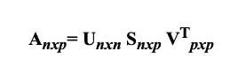

其中 ***n*** 为行数(即样本数) ***p*** 代表维数。

假设我们有一个矩阵 ***一个*** 。

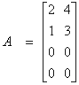

为了确定关联的*矩阵，我们必须先求出矩阵*的特征向量乘以矩阵*的转置。***

***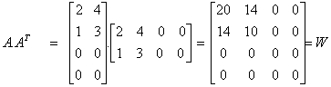***

***因为***

******

***回想一下特征向量和特征值的定义:***

***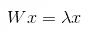***

***后者也可以表示为:***

***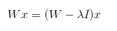***

***因此，回到我们的例子:***

***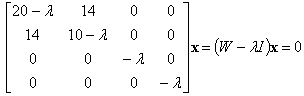***

***我们得到了一个四次多项式。***

***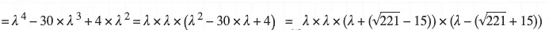******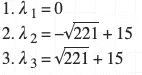******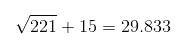******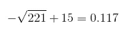***

***求解后，我们用其中一个特征值代替λ。***

***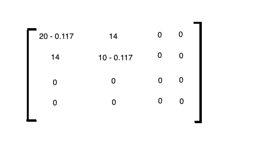******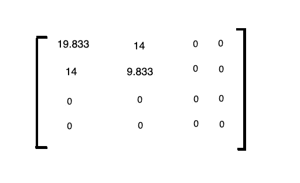***

***在将矩阵乘以向量 ***x*** 之后，我们得到如下:***

**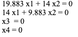**

**在解方程时，我们得到:**

**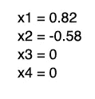**

**我们把特征向量代入**的列。****

**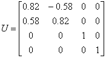**

**然后，我们对矩阵*乘以矩阵*的转置重复同样的过程。****

***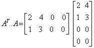***

***求解后，我们得到了 ***V*** 的表达式。***

**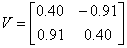**

**最后， ***S*** 是一个对角矩阵，其值是任一个的特征值的平方根**

**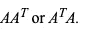****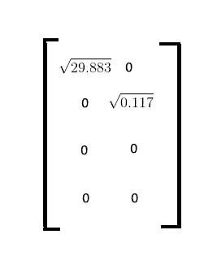****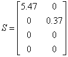**

**这就是事情变得有趣的地方。我们知道所有三个矩阵的乘积等价于左边的矩阵。**

**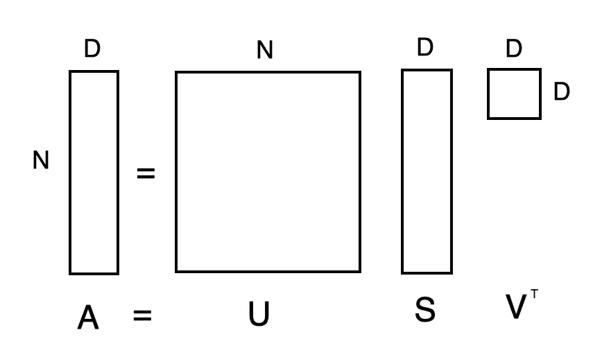**

**我们可以排除特征，但仍然保持原始矩阵的近似值。假设矩阵*是组成图像的列和行或像素的数据集，我们可以在理论上使用新形成的矩阵来训练模型，并达到相当的(如果不是更好的话)(由于维数灾难)精确度。***

***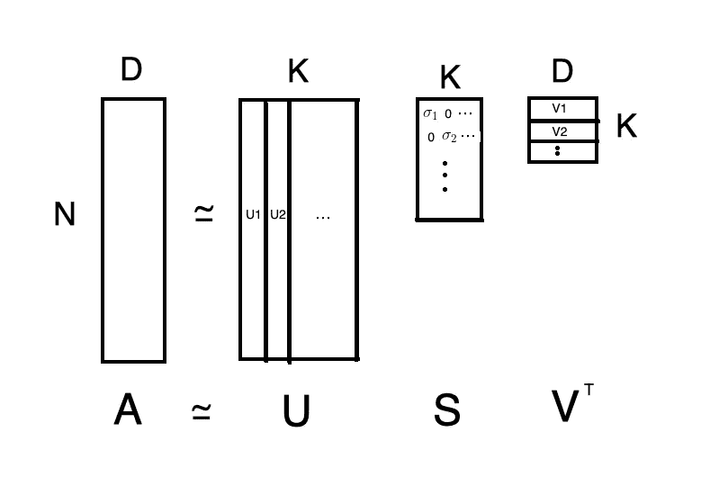******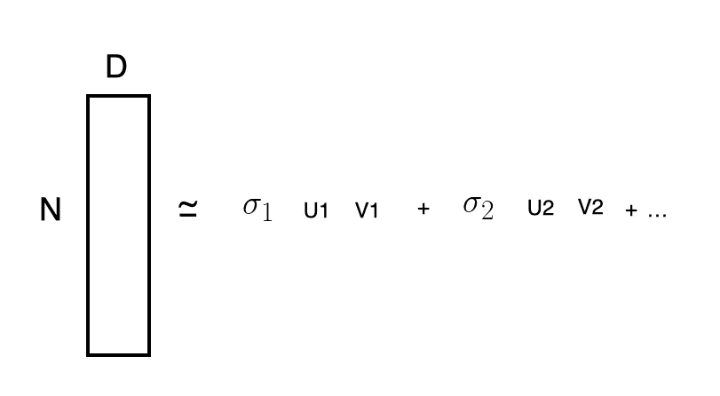***

# ***密码***

***让我们看看如何在 Python 中应用奇异值分解。首先，导入以下库。***

```
***import numpy as np
from sklearn.datasets import load_digits
from matplotlib import pyplot as plt
from sklearn.decomposition import TruncatedSVD
float_formatter = lambda x: "%.2f" % x
np.set_printoptions(formatter={'float_kind':float_formatter})
from sklearn.ensemble import RandomForestClassifier***
```

***在接下来的教程中，我们将尝试对手写数字进行分类。幸运的是，`scikit-learn`库提供了一个包装器函数，用于将数据集导入我们的程序。***

```
***X, y = load_digits(return_X_y=True)***
```

***该数据集包含 1797 幅 8×8 的图像。如果你指定了`return_X_y=True`,这个函数将把像素作为一维数组返回。***

```
***X.shape***
```

***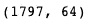***

******y*** 包含每个数字的标签。***

```
**y**
```

**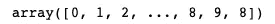**

**让我们来看看第一个数字。正如我们所看到的，它只是一个长度为 64 的数组，包含像素亮度。**

```
**image = X[0]**
```

**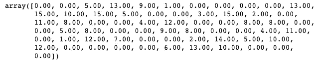**

**如果我们想使用`matplotlib`查看图像，我们必须首先重塑数组。**

```
**image = image.reshape((8, 8))plt.matshow(image, cmap = 'gray')**
```

**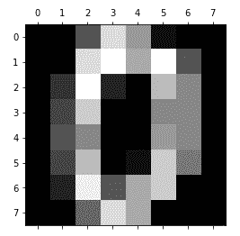**

**接下来，我们将使用奇异值分解来看看我们是否能够仅使用每行的两个特征来重建图像。函数返回的 **s** 矩阵必须使用`diag`方法转换成对角矩阵。默认情况下，`diag`将创建一个相对于原始矩阵为 *n x n* 的矩阵。这导致了一个问题，因为矩阵的大小不再遵循矩阵乘法的规则，其中一个矩阵中的列数必须与另一个矩阵中的行数相匹配。因此，我们创建一个新的 *m x n* 矩阵，并用对角矩阵填充它的第一个 *n x n* 部分。**

```
**U, s, V = np.linalg.svd(image)S = np.zeros((image.shape[0], image.shape[1]))S[:image.shape[0], :image.shape[0]] = np.diag(s)n_component = 2S = S[:, :n_component]
VT = VT[:n_component, :]A = U.dot(Sigma.dot(VT))print(A)**
```

**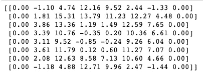**

```
**plt.matshow(A, cmap = 'gray')**
```

**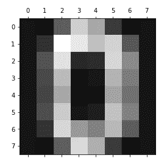**

**我们可以通过取 **U** 和 **S** 矩阵的点积得到缩减的特征空间。**

```
**U.dot(S)**
```

**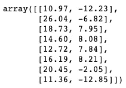**

## **原始与缩减的特征空间**

**让我们比较随机森林模型在使用原始手写数字训练时和使用从奇异值分解获得的缩减特征空间训练时的准确性。**

**我们可以通过查看公开得分来衡量模型的准确性。如果你对 OOB 的概念不熟悉，我鼓励你看看兰登森林的这篇文章。**

```
**rf_original = RandomForestClassifier(oob_score=True)rf_original.fit(X, y)rf_original.oob_score_**
```

**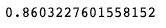**

**接下来，我们用 2 个组件创建并装配一个`TruncatedSVD`类的实例。值得一提的是，与前面的例子不同，我们使用的是 2/64 特性。**

```
**svd = TruncatedSVD(n_components=2)X_reduced = svd.fit_transform(X)**
```

**精简数据集中的每个图像(即行)包含 2 个特征。**

```
**X_reduced[0]**
```

**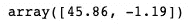**

**看一看图像，很难区分图像由什么数字组成，它很可能是 5 而不是 0。**

```
**image_reduced = svd.inverse_transform(X_reduced[0].reshape(1,-1))image_reduced = image_reduced.reshape((8,8))plt.matshow(image_reduced, cmap = 'gray')**
```

**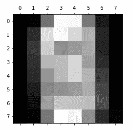**

**在精简的数据集上训练随机森林分类器后，我们获得了 36.7%的微弱准确率**

```
**rf_reduced = RandomForestClassifier(oob_score=True)rf_reduced.fit(X_reduced, y)rf_reduced.oob_score_**
```

**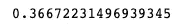**

**我们可以通过取`explained_variance_ratio_`属性的和得到总方差解释。我们通常希望达到 80%到 90%的目标。**

```
**svd.explained_variance_ratio_.sum()**
```

****

**让我们再试一次，只是这一次，我们使用 16 个组件。我们查看包含在 16 个特征中的信息量。**

```
**svd = TruncatedSVD(n_components=16)X_reduced = svd.fit_transform(X)svd.explained_variance_ratio_.sum()**
```

**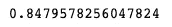**

**我们获得了与使用原始图像训练的模型相当的准确度，并且我们使用了 16/64=0.25 的数据量。**

```
**rf_reduced = RandomForestClassifier(oob_score=True)rf_reduced.fit(X_reduced, y)rf_reduced.oob_score_**
```

**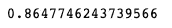**