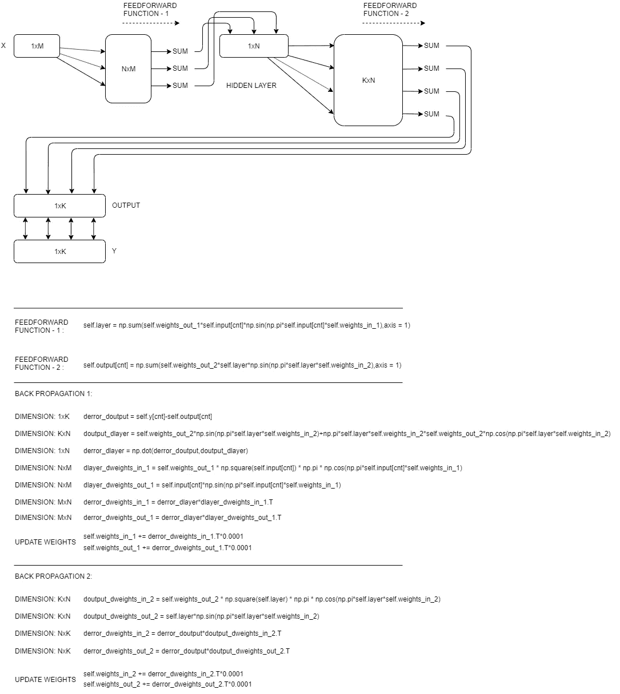
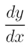

# 用于数字分类的正弦神经网络

> 原文：<https://towardsdatascience.com/sinusoidal-neural-networks-for-digit-classification-bd2b14e57ad8?source=collection_archive---------23----------------------->

## 一种正弦基函数的隐层神经网络

我在之前的帖子里讲过正弦基函数的神经网络([正弦基函数的神经网络](/neural-networks-with-sine-basis-function-c5c13fd63513))。这是具有正弦基函数的神经网络的基本实现。此后，我将把具有正弦基函数的神经网络称为“正弦神经网络(SNN)”。这篇文章假设你了解神经网络及其工作原理。如果你不知道，有惊人的故事来学习什么是媒体中的神经网络。


A fancy image by [Gertrūda Valasevičiūtė](https://unsplash.com/@skraidantisdrambliukas?utm_source=medium&utm_medium=referral) on [Unsplash](https://unsplash.com?utm_source=medium&utm_medium=referral)

今天，我将介绍为数字分类而实现和训练的 SNNs。数字分类是神经网络应用的一个众所周知的领域。但是，对新结构进行首次评估是一个很好的主题。

另一个不同的主题，我也将谈到的是实现 SNN 与隐藏层。当我从零开始实现神经网络架构时，我严重地遇到了很多矩阵维数的问题，尤其是哪些矩阵应该在哪些维数上才能进行正确的计算。每当我试图实现带有隐藏层的神经网络时，我都会对此感到困惑。既然我终于自己说清楚了，那我也帮你理解一下 NNs 中的维数，矩阵及其乘法。您还将认识到，snn 不需要任何激活函数来创建线性，因为它们本身就是非线性函数。

## Python 代码中的架构、维度和公式



Sinusoidal Neural Networks — Structure and Formulas

前馈操作非常简单。我们只是将矩阵相乘并求和(点积。)

反向传播是令人头疼的问题。你可能也猜到了，我们将在反向传播中使用链式法则。问题是矩阵的维数。每个输出应该有哪个维度？我一时无法回答这个问题。我终于明白了，恭喜我，:D

## 矩阵的维数

*在这一节中，dy_dx 表示 y 相对于 x 的导数。因此，要注意变量的命名，以理解正在发生的事情。*



derivative of y with respect to x

derror_doutput 具有我们的输出变量的维数，(1xK)。

doutput_dlayer 通常需要与我们的隐藏层具有相同的维度。但是，我们不会让它发生。我们将把它保留为 KxN，因为这个变量将进入一个带有 derror_doutput 的操作。此操作的输出应该与隐藏层具有相同的维度。

derror_dlayer 具有我们隐藏层的维度。(详见上文。)

dlayer _ dweights_in_1 将与 weights _ in _ 1 具有相同的尺寸。因为 weights_in_1 矩阵中的每个变量都应该变化。

derror_dweights_in_1 将具有 weights_in_1 矩阵的转置维数。当我们更新权重时，我们把它固定回来(转置它)。

doutput _ dweights_in_2 将与 weights _ in _ 2 具有相同的维度。因为 weights_in_2 矩阵中的每个变量都应该改变。

derror_dweights_in_2 将具有 weights_in_2 矩阵的转置维数。当我们更新权重时，我们把它固定回来(转置它)。

我没有写 weights_out_1 和 weights_out_2，因为它们的维数与 weights_in_1 和 weights_in_2 相同。

# 哦，终于实现了…

## 构建神经网络类:

```
import numpy as npclass NeuralNetwork:
    #DEFINE INITIALS
    def __init__(self, x, y):
        self.input      = x
        self.y          = y
        self.layer = np.zeros((1,32))

        #weights connecting to hidden layer
        self.weights_in_1 = np.random.uniform(-1, 1,(self.layer.shape[1],self.input.shape[1]))
        self.weights_out_1 = np.random.uniform(-1, 1,(self.layer.shape[1],self.input.shape[1]))

        #weights connecting to output.
        self.weights_in_2 = np.random.uniform(-1, 1,(self.y.shape[1],self.layer.shape[1]))
        self.weights_out_2 = np.random.uniform(-1, 1,(self.y.shape[1],self.layer.shape[1]))

        self.output     = np.random.uniform(-1, 1,self.y.shape)
        print('Output:',self.output)
        print('Y:',self.y)
        #DEFINE FEEDFORWARD
    def feedforward(self,cnt):
        self.layer = np.sum(self.weights_out_1*self.input[cnt]*np.sin(np.pi*self.input[cnt]*self.weights_in_1),axis = 1) #forwarding to hidden layer

        self.output[cnt] = np.sum(self.weights_out_2*self.layer*np.sin(np.pi*self.layer*self.weights_in_2),axis = 1) #forwarding to output

    #function for derivative of output with respect to hidden layer.
    def doutput_dlayer_func(self): 
        return self.weights_out_2*np.sin(np.pi*self.layer*self.weights_in_2)+np.pi*self.layer*self.weights_in_2*self.weights_out_2*np.cos(np.pi*self.layer*self.weights_in_2)

    #function for derivative of hidden layer with respect to weights on first level.
    def dlayer_d_weights_func(self,cnt):
        doutput_dweights_in = self.weights_out_1 * np.square(self.input[cnt]) * np.pi * np.cos(np.pi*self.input[cnt]*self.weights_in_1)
        doutput_dweights_out = self.input[cnt]*np.sin(np.pi*self.input[cnt]*self.weights_in_1)
        return doutput_dweights_in,doutput_dweights_out #function for derivative of output with respect to weights on second level.
    def doutput_d_weights_func(self):
        doutput_dweights_in = self.weights_out_2 * np.square(self.layer) * np.pi * np.cos(np.pi*self.layer*self.weights_in_2)
        doutput_dweights_out = self.layer*np.sin(np.pi*self.layer*self.weights_in_2)
        return doutput_dweights_in,doutput_dweights_out#DEFINE BACKPROPAGATION
    def backprop(self,cnt):
        error = np.square(self.y[cnt]-self.output[cnt])
        print(cnt,'___',np.sum(error))
        derror_doutput = self.y[cnt]-self.output[cnt]
        #print('___',cnt,'___',derror_doutput)

        #calculate update amount for weights_in_1 and weights_out_1
        #application of chain rule for weights on first level.
        doutput_dlayer = self.doutput_dlayer_func()
        derror_dlayer = np.dot(derror_doutput,doutput_dlayer)
        dlayer_dweights_in_1,dlayer_dweights_out_1 = self.dlayer_d_weights_func(cnt)
        derror_dweights_in_1 = derror_dlayer*dlayer_dweights_in_1.T
        derror_dweights_out_1 = derror_dlayer*dlayer_dweights_out_1.T

        #application of chain rule for weights on first level.
        doutput_dweights_in_2, doutput_dweights_out_2 = self.doutput_d_weights_func()
        derror_dweights_in_2 = derror_doutput*doutput_dweights_in_2.T
        derror_dweights_out_2 = derror_doutput*doutput_dweights_out_2.T

        self.weights_in_1 += derror_dweights_in_1.T*0.0001
        self.weights_out_1 += derror_dweights_out_1.T*0.0001
        self.weights_in_2 += derror_dweights_in_2.T*0.0001
        self.weights_out_2 += derror_dweights_out_2.T*0.0001

    #PREDICT THE TEST DATA
    def feedforward_test(self,test_data):
        self.layer = np.sum(self.weights_out_1*test_data*np.sin(np.pi*test_data*self.weights_in_1),axis = 1)
        test_output = np.sum(self.weights_out_2*self.layer*np.sin(np.pi*self.layer*self.weights_in_2),axis = 1)
        return test_output

    def predict(self,input_):
        predictions = []
        for elm in input_:
            #print('___',elm)
            predictions.append(self.feedforward_test(elm).tolist())
        return np.array(predictions)

    #SAVE WEIGHTS
    def save_weights(self,dir_in_1 = './weights_in_1.npy',dir_out_1 = './weights_out_1.npy',
                     dir_in_2 = './weights_in_2.npy',dir_out_2 = './weights_out_2.npy'):
        np.save(dir_in_1,self.weights_in_1)
        np.save(dir_out_1,self.weights_out_1)
        np.save(dir_in_2,self.weights_in_2)
        np.save(dir_out_2,self.weights_out_2)

    #IMPORT WEIGHTS
    def import_weights(self,dir_in_1 = './weights_in_1.npy',dir_out_1 = './weights_out_1.npy',
                       dir_in_2 = './weights_in_2.npy',dir_out_2 = './weights_out_2.npy'):
        self.weights_in_1 = np.load(dir_in_1)
        self.weights_out_1 = np.load(dir_out_1)
        self.weights_in_2 = np.load(dir_in_2)
        self.weights_out_2 = np.load(dir_out_2)
```

## 测试:

```
from sklearn.datasets import load_digits
from sklearn import preprocessinglb = preprocessing.LabelBinarizer() #create label binarizer
digits_object = load_digits()
images = digits_object.data
images = (images/np.max(images))+0.01
labels = digits_object.target.reshape((1797,1))
lb.fit(labels) # fit your labels to a binarizing map.
labels = lb.transform(labels) #binarize your labels (example: from [0,3,2] to [[1,0,0,0,0,0,0,0,0,0],[0,0,0,1,0,0,0,0,0,0],[0,0,1,0,0,0,0,0,0,0]])#split your data-set
x = images[0:1500]
test_x = images[1500:-1]
y = labels[0:1500]
test_y = labels[1500:-1]#create neural network instance.
nn = NeuralNetwork(x,y)#TRAIN NETWORK FOR 1000 TIMES (EPOCH = 1000).
for gen_cnt in range(1000):
    for cnt in range(1500):
        print('Epoch: {}'.format(gen_cnt))
        nn.feedforward(cnt)
        nn.backprop(cnt)#PREDICT THE TEST DATA
predictions = nn.predict(test_x)
error = np.around(predictions,decimals = 2)-test_y#CHECK BELOW
```

## 结果和结论:

我不知道为什么在神经网络中不常用正弦基函数。因为结果其实是令人满意的。我刚刚使用了 1 个隐藏层，得到了相当好的结果。我们不需要为选择不同类型的激活函数而感到困惑。非线性已经位于正弦基函数之下。我们的神经网络应该做的唯一一件事就是选择要求和的正弦函数。

编辑:我修改了预测函数，以便能够看到准确性。您可以在下面找到新功能:

```
def predict(self,input_):
        predictions = []
        for elm in input_:
            #print('___',elm)
            result_local = self.feedforward_test(elm)
            result_temp = np.zeros(result_local.shape)
            result_temp[np.argmax(result_local)] = 1
            predictions.append(result_temp.tolist())
        return np.array(predictions)
```

在运行预测函数后也添加这个脚本。

```
accuracy = 1-((np.count_nonzero(predictions-test_y)/2)/predictions.shape[0])
print('Accuracy is {}'.format(accuracy*100))
```

## 我在 1000 次迭代后检查了准确度。准确率为 86.82%。这可以通过添加更多的隐藏层或通过用更多的纪元训练网络来改善。(训练集:[0，1500]，测试集:[1500，1797])