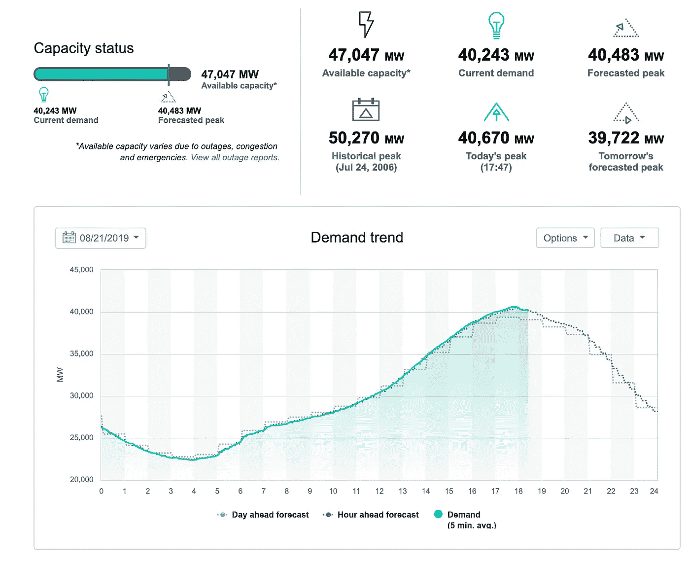
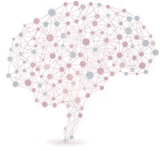

# 每位数据科学家将面临的六大挑战以及如何克服这些挑战

> 原文：<https://towardsdatascience.com/six-challenges-every-data-scientist-will-face-and-how-to-overcome-them-2d7ccd6e88c4?source=collection_archive---------21----------------------->

Supplements for thought? Image made by author.

信息时代给人类带来了有史以来最大的科技类工作爆炸之一。虽然优步、脸书、AirBnB 和亚马逊等成功大公司背后的强大力量是他们的独创性和对消费者的便利，但他们的成功也可以归功于对数据的利用——而且是大量数据。不可否认，数据现在是大家趋之若鹜的新资源。甚至像可口可乐和百事可乐这样的公司也在利用消费者数据来制定更好的营销活动和产品战略决策。这导致数据被称为“新石油”，这句话最初是由数学家克莱夫·亨比说的，后来被经济学家*轰动一时。虽然许多人在字面上和比喻上都不同意这种说法，但重点是显而易见的:数据具有非凡的价值，并且在未来只会变得更有价值。理解如何在充满数据的世界中导航对于维护人类和地球其他部分的社会、经济、环境和身体健康至关重要。数据科学家可以通过将大量与数据相关的模糊方面分解成清晰的术语来简化这一过程。因此，我想了一些方法来提高所有人的数据科学意识，同时坚持真正的科学。*

***1。)数据是补充，不是饭。***

*数据是有价值的，可以提供大量的信息。这些信息可以以多种方式用于澄清或混淆当今世界的许多问题。例如，在可再生能源的日常运营中，独立服务运营商(ISOs)进行预测，以预测在假设的天气条件下某一天将使用多少能源。这有助于运营商更好地管理电力资源，并提供一个清晰的估计，即一天需要多少能源，以及它将来自哪里。然而，天气条件可能会快速变化，在许多情况下，这些预测成为最佳估计，更多的能源最终被使用或取自原本不会像它们那样被利用的来源。*

**

*Image captured from the California ISO webpage ([http://www.caiso.com/TodaysOutlook/Pages/default.aspx](http://www.caiso.com/TodaysOutlook/Pages/default.aspx))*

*这种情况下的数据被用作理解感知条件的手段，但它不是实际情况。因此，为什么数据应该用于做出更好的决策，但不应该完全依赖于整个故事。在复杂系统中尤其如此，在复杂系统中，元素可以被迅速改变，结果也可以被彻底改变。对于数据科学家来说，培养对手头问题的良好直觉和本能仍然是很好的实践。重要的是要知道复杂系统的模型只有在 95–99%的置信度下才是好的。有必要采取适当的措施来应对不确定性。*

***2。)了解生态系统***

*许多数据科学家喜欢一头扎进问题中，认为因为他们对模型有很好的理解，他们可以在任何领域产生有意义的结果。这一点与前者有关。数据科学家实际了解他们研究领域的理论和概念知识是非常重要的。如果你是一名训练有素的数据科学家，对空气动力学一无所知，但你接受了一份在飞机上创建模型检查机翼应力数据的工作，你将很多人置于危险之中。围绕航空学和航空学有太多的知识。您可能认为您正在构建一个不错的模型，但实际上您只是通过一个基于感知器的算法来输入变量并产生随机结果。你不会真的知道如何有效地传达你从模型中得到的信息。*

**

*Perceptron does not equate to instant weather forecasting. Image created by the author.*

*关键要点是，数据科学家是充满活力的个体，但我们需要彻底了解我们将要工作的生态系统。如果你要建立一个雷暴预测的模型，与你要建立一个股票市场萧条和繁荣的模型相比，你需要一个完全不同的概念工具集。这迫使有抱负和漫游的数据科学家成为世界上最大的自学者。*

***3。)仅仅因为数据可用就使用它不是一个好主意。***

*可以理解。你已经在办公桌前用拳头敲打木头台面好几天了，因为你找不到任何数据来完善你的模型。当你感到希望的机会慢慢溜走，就像刚炸好的鸡肉上的油脂一样，你在谷歌上找到了一个看起来最理想的数据库。你下载数据集，并做你通常的探索技术。散点图、箱线图、相关矩阵和一个微小的线性判别分析测试之后，您决定这是您唯一的机会，您将在您的模型中使用它。问题是，你后来发现数据集是由大卫·杜伊(David Duey)制作的，他是一位虚构的私人顾问，他对另一个不完整的数据集应用了一种“转换算法”，从而产生了你一直在搜索的数据集。显然，这其中的问题是众多而明显的。这个数据集很可能是无用的，如果它曾经服务于任何目的，它就不应该在产生后被传播。*

*这里的一个关键提示是，不管你的数据来自哪里，总是要问数据本身无法回答的问题。数据是从哪里来的？数据是谁做的？数据是怎么做出来的？该数据库公开多久了？还有谁在自己的研究中使用了这些数据？问这些问题不仅会让你的模型更好，而且从长远来看，会让你成为一名更好的数据科学家。*

***4。)一种模式不适合所有人。***

*虽然数据确实可以以多种方式使用，但没有一种模式适合所有情况。是的，只要假设得到满足，数据得到正确处理，方法就可以应用于不同的数据集。然而，使用一种先验算法完全是浪费时间，而这种算法对于预测杂货店的销售模式是非常准确的，例如降雨模式。首先，杂货店的“*定律”*与热力学定律的运作方式不同。仅仅因为你的模型显示买牛奶的人倾向于买黄油，并不意味着仅仅因为天气热，一天的晚些时候就会下雨。还有许多其他变量可以用来预测降雨事件。*

*远离毁灭的建议，总是在数据集上测试不同模型的功效。可以制作基线模型来测量它们与旧模型相比的准确性。如果您发现精度和准确性有任何妥协，或者如果您怀疑大量的准确性，这可能是一个好迹象，表明您的模型不是最适合您的数据。*

***5。)要知道你的大脑是可以忽悠你的。***

**

*Do you see a pattern here? I don’t. Image taken from google.*

*很容易犯这个错误。你得到数据并对其进行测试，你似乎已经发现了一些关于你所研究的东西的关键信息。在某些情况下，这可能是一个实际的结果，但在大多数情况下，你可能会欺骗自己相信你已经找到了一个不存在的模式。人类的大脑想要找到模式，并以此为生。整天看着曲线、线条、点和像素是欺骗自己相信你发现了一个实际上并不存在的模式的快速方法。在庆祝之前，一定要反复运行你的模型，彻底检查你的数据是否有任何问题。你可能会意识到你错过了一条重要的信息。*

***6。)总是质疑结果。***

*不管 p 值或模型预测的准确性如何，您都应该对最终结果持怀疑态度。这也应该在你的报告或对结果的讨论中表现出来。即使您的结果似乎始终如一地为您提供信息，改进您正在尝试改进的系统的某个方面，但重要的是要认识到随机性仍然存在，并可能导致您的输出出现严重偏差。你应该小心信息的内容，以及它如何在更广泛的受众手中被歪曲。采取这一步骤可确保您对您的数据做出符合道德的决定，并防止以后对整个社会造成灾难性事件。*

**

*Question data and the results they provide. Image taken from google.*

*记住这些提示，我认为数据科学领域内外的个人都可以获得关于数据的新观点。即使你不直接处理数据，问一些很少有人会问的关于给定数据集的结果的问题也是很重要的。如果你是一名数据科学家，重要的是要问清楚你的模型及其结果将如何影响那些可能错误解读或出于个人原因歪曲信息的人的行动。数据是有价值的，在未来几年，它将继续在我们的生活中发挥重要作用。让每个人更多地意识到它的局限性、优点和缺点，对于创造一个更实际的社会是很重要的。*