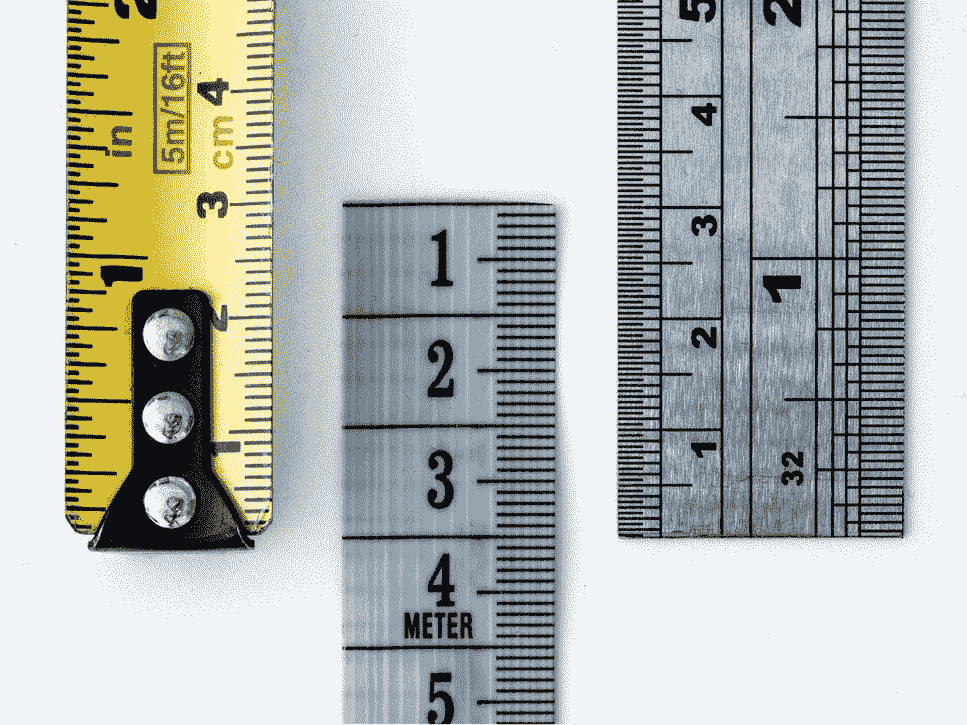
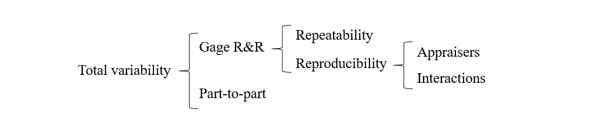
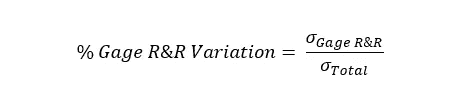
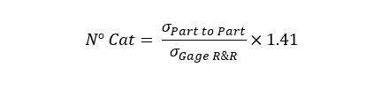
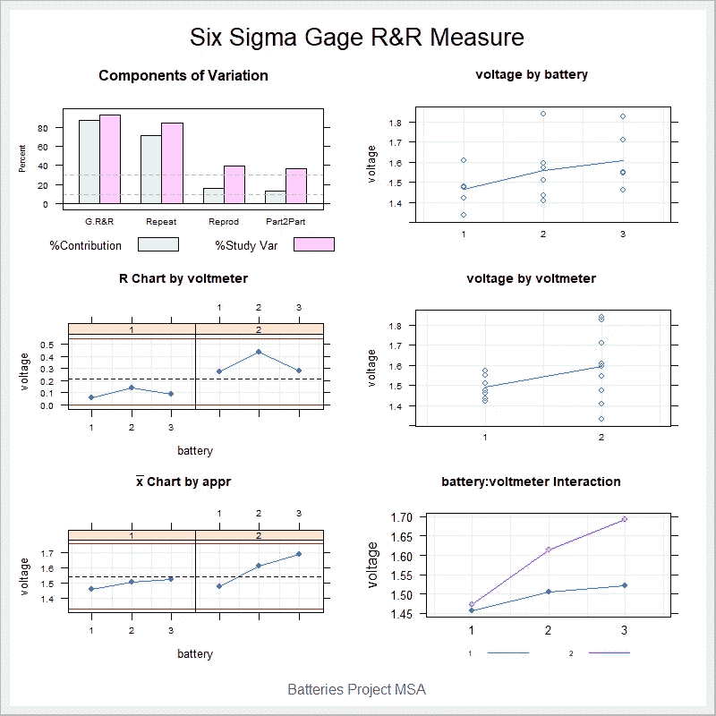

# 六适马盖奇 R&R 分析与 R

> 原文：<https://towardsdatascience.com/six-sigma-gage-r-r-analysis-with-r-8a1eff6ed94b?source=collection_archive---------20----------------------->

## r 代表工业工程师

## 探索“六西格玛”R 包

Image by William Warby available at [Unsplash](https://unsplash.com/photos/WahfNoqbYnM)

# 测量系统分析

测量系统分析(MSA)，也称为量具 R&R(重复性和再现性)，是 DMAIC 循环中*测量*阶段最重要的活动。它识别并量化影响测量系统的变异源。测量系统的可变性不受控制的过程是无法改进的。一个好的测量系统只有随机可变性，这是由于被测项目的固有变化，而不是由评估者(操作员、机器等)产生的。)、零件、时间或其他因素。与此主题相关的一些重要术语包括以下概念:

*   **精度**:在规定条件下获得的独立测试结果之间的一致程度。
*   **重复性**:重复性条件下的精度(在短时间间隔内，由同一操作人员使用同一设备，在同一实验室对同一检测项目使用同一方法获得的独立检测结果)。
*   **再现性**:再现性条件下的精度(不同实验室不同操作员使用不同设备对相同项目使用相同方法获得测试结果)。

总之，可重复性可定义为测量系统的固有可变性(在类似条件下)，再现性可定义为不同条件(组)下的可变性，例如操作员、机器或任何其他因素。

Variability decomposition

# 评估测量系统

为了使测量系统准确，量具 R&R 可变性对总可变性的贡献应低于 10%。介于 10%和 30%之间的值被认为是可接受的。然而，大于 30%的值代表低效的测量系统。

为了评估这一事实，使用了可变性的平方根(即标准偏差)。然后计算每个变异源在整个研究中的贡献 Var:

同样，另一个有用的度量是不同类别的数量。它使用下面的公式计算，并舍入到最接近的较低整数(如果小于 1，则为 1)。

不同类别的数量应大于或等于 4。该值测量测量系统引起的可变性和固有可变性之间的关系。如果低于 4，则与固有可变性相比，计量器 R&R 可变性较大。否则，可以认为两个可变性之间的关系是适当的。

来自 *SixSigma* R 包的 *ss.rr* 函数自动执行量具 R & R 研究。对于下面的例子，让我们考虑这样一种情况，电池制造商用两个不同的电压表(评估员)，三个不同的时间(重复)测量三个不同电池(部件)的电压。我们来看看 R 代码！

Six Sigma Gage R&R R Code

Charts for MSA of battery example

根据 MSA 的结果，由 R&R 引起的%StudyVar 为 93.13%。不同类别的总数为 1。这种结果组合(即类别数量少，可变性百分比大)代表了测量系统的最坏情况。

**图表解读**

*   左上角的图表显示了每个组成部分对总方差的贡献。其目的是检测测量问题是来自重复性还是再现性。
*   中间和左下角的图表代表均值控制图和极差控制图，其相应的控制限适用于 R&R 研究。在均值控制图中，所有点都应在控制极限之外，因为该图代表了零件与零件之间的差异(相同的操作员，相同的原型)。否则，测量系统将被认为是不充分的。另一方面，在范围控制图中，所有点都应位于控制界限内。
*   右上方和中间的图表显示了图表中的每个测量点。在右上方的图表中， *x-* 轴代表电池，而绘制的线条连接了每个原型的平均值。在右中图中， *x-* 轴分别代表电压表。
*   右下角的图表显示了两个因素之间的相互作用:操作符和原型。成对电池*电压表的平均值用点表示，用线连接。好的图表有助于检测操作者和原型之间是否有任何交互，或者操作者之间是否有差异。

根据图表结果，很明显测量系统没有正常工作。这个例子中的主要问题是电压表(鉴定人)。

# 总结想法

测量是质量保证中的一项重要任务。错误测量的数据可能导致错误的决策，从而导致不充分的结果。因此，MSA 应作为任何六个适马项目的初始阶段进行。MSA 允许工程师分析数据，确定来源和变化。有了这些信息，他们就可以继续规划和开发*改善*活动，以期获得更高的收益。 *SixSigma* R 包是一个很棒的工具，它只需要几行代码就可以执行 gage R & R 分析。非常鼓励工业、过程和质量工程师利用这一工具，以高质量和高效率的标准满足客户的要求。

*—*

*如果你觉得这篇文章有用，欢迎在* [*GitHub*](https://github.com/rsalaza4/R-for-industrial-engineering/blob/master/Six%20Sigma/Gage%20R%26R%20Analysis.R) *上下载我的个人代码。你也可以直接在 rsalaza4@binghamton.edu 给我发邮件，在*[*LinkedIn*](https://www.linkedin.com/in/roberto-salazar-reyna/)*上找到我。有兴趣了解工程领域的数据分析、数据科学和机器学习应用的更多信息吗？通过访问我的媒体* [*简介*](https://robertosalazarr.medium.com/) *来探索我以前的文章。感谢阅读。*

*——罗伯特*