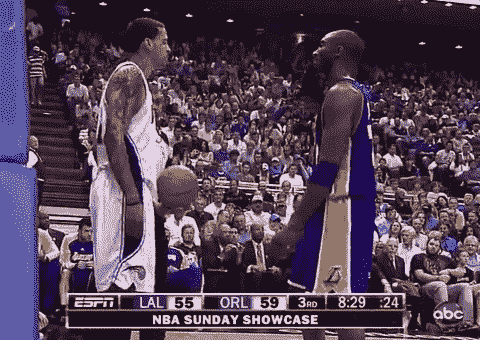
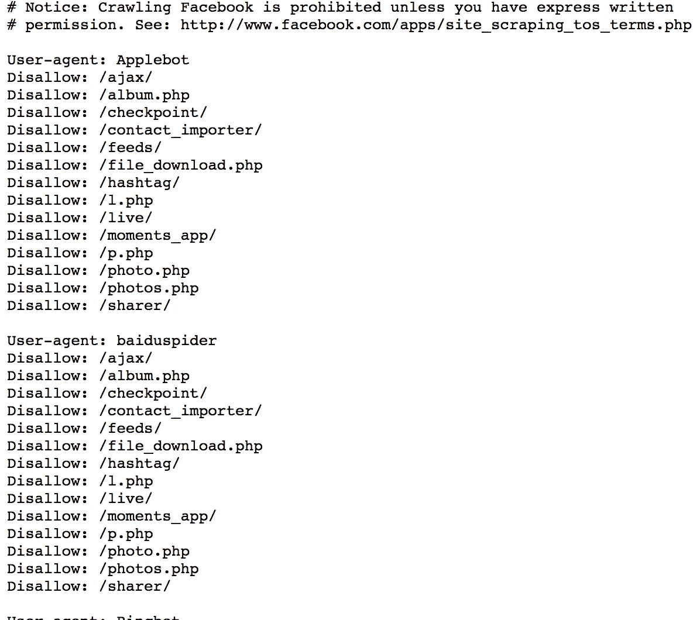
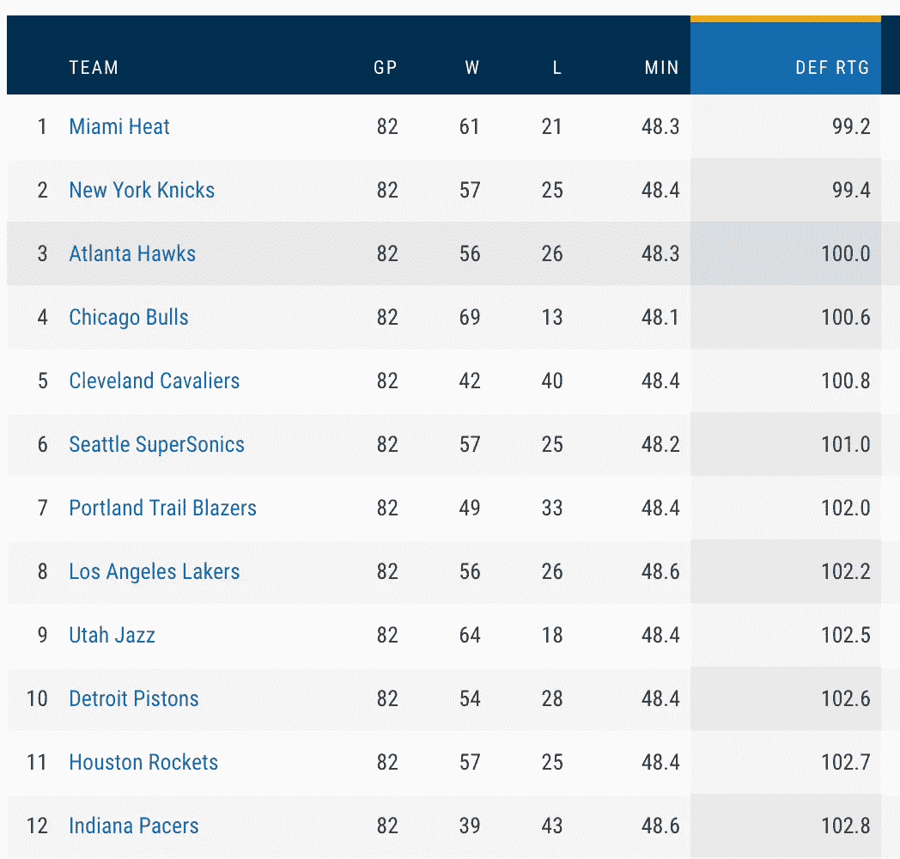
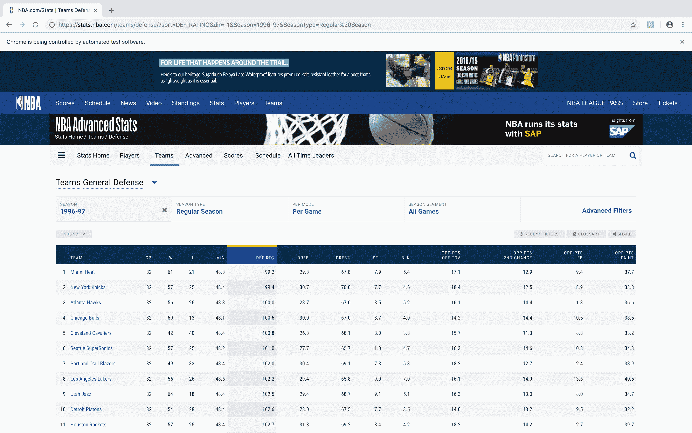
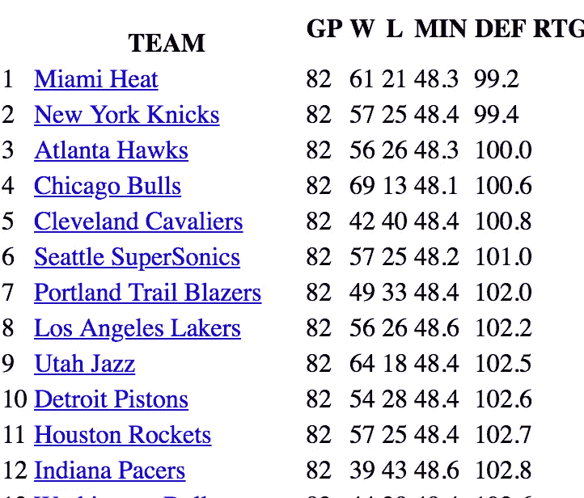
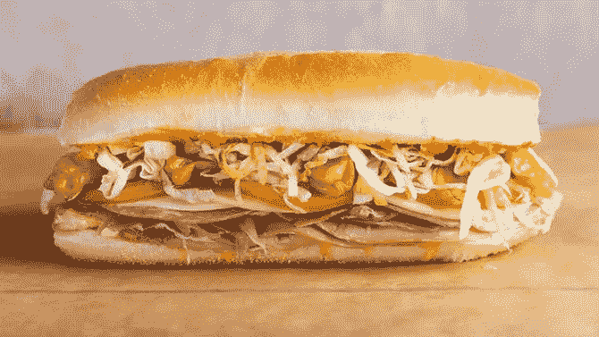
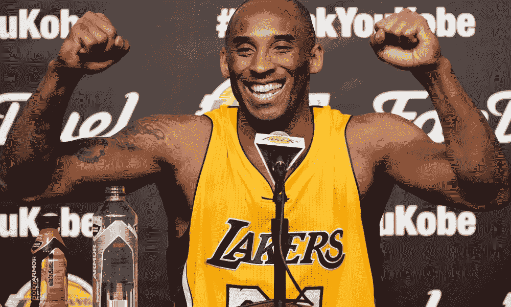

# 年度第六人:数据采集

> 原文：<https://towardsdatascience.com/sixth-man-of-the-year-data-acquisition-9eff37541dd8?source=collection_archive---------20----------------------->

我所有的鸡蛋目前都放在数据科学篮子里，因此我会尽可能多花时间从那些已经从事数据科学一段时间的人那里收集一些小建议。毕竟，比起我自己的错误，我更愿意从别人的错误中学习，这样我就可以犯更严重的错误。有一条建议被许多不同的专业人士打得死去活来。如果你每天都与数据科学家打交道，我敢肯定你听说过这个小技巧:“数据科学实际上是 80%的数据收集和清理，而只有 20%是性感的机器学习和分析。”因此，这里有另一篇文章强调数据采集的重要性，但我希望展示一个足够有趣的例子，让这篇文章更有吸引力。

When another professional tries to scare you away with the 80/20 split

最近，我和几个同学合作举办了一场 Kaggle 比赛，我们试图预测科比投篮的成败。Kaggle 提供的数据集由科比职业生涯中的每一次投篮组成，其中包括投篮的信息，如离篮筐的距离，时间，在地板上的投篮位置，投篮类型(扣篮，跳投等)。)，对手，比赛日期等等。

在很早的时候，我和我的合作伙伴能够利用我们的领域知识来观察数据中缺少的一个关键变量。科比在 NBA 打了 20 个赛季，在这段时间里，他看到了许多球队竞争力水平的上升和下降，除了尼克斯。因此，知道科比在对勇士的比赛中投篮并不能告诉我们太多信息，因为这可能是一个伟大的勇士防守，也可能是一个糟糕的勇士防守。一个训练有素的模型也许能够了解某个时代的某些对手更好或更差。这将会要求很多，并且可能会导致模型有太多的差异。我们想确定另一种方式来说明对手有多有天赋(特别是在防守方面)，因为我们假设这将是一个需要考虑的重要特征。

我们决定获得这些信息的最好方法是掌握科比职业生涯中每支 NBA 球队的防守等级和排名。防守评分指的是一个球队在 100 次控球中平均得分多少。我们把防守排名简单地定义为一个球队在防守排名列表中的顺序位置。我们使用这两个指标，因为防守等级提供了一个在所有年份都一致的指标，而防守排名将对手的技术放在当年联盟的其他比赛中。

# 数据采集

负责任的第一步是确保我们希望从中获取数据的网站没有禁止自动抓取数据。一些网站会要求人们只在特定时间(当他们预计人流量较少时)抓取网站，另一些网站会将抓取限制在每秒一定量的请求，还有一些网站会明确禁止任何抓取。

Facebook’s robots.txt, for example

我们将要使用的网站，[https://stats.nba.com/](https://stats.nba.com/)，很慷慨地收集并免费展示了所有这些数据，而且很容易访问。我们赶紧看了看他们的 [robots.txt](https://stats.nba.com/robots.txt) 。在这里，我们可以看到网站更喜欢什么样的自动访问。幸运的是，这个网站没有要求任何限制。我们有兴趣收集的具体统计数据可以在[这里](https://stats.nba.com/teams/defense/?sort=DEF_RATING&dir=-1&Season=1996-97&SeasonType=Regular%20Season)找到。

Example from the 1996–97 season

这一过程中最大的障碍是这些网站由动态 HTML 组成，这意味着使用来自网站的典型 get 请求无法检索我们想要的实际数据。该网站有 javascript，仅当该网站在浏览器中打开时才被执行。

手动访问和保存 20 个不同网站的 HTML 不会太费时间。然而，一位教授曾经告诉我，永远不要让计算机获胜，我试图编写可以根据需要进行扩展的代码。

我决定使用[Selenium](https://www.seleniumhq.org/)——一种用于通过浏览器自动访问网页的工具。Selenium 有很多非常酷的应用，不幸的是，我们将尽可能以最基本的方式使用它。正如我前面提到的，典型的 get 请求是不够的，因为如果没有浏览器，统计表就不会被填充。用 Selenium 连接到网页会强制填充该表，然后我们就能够提取 HTML 并将其保存在本地。

All the code needed to use Selenium

This is what temporarily pops up on your monitor while the data is being collected

The local HTML after sucking it down with Selenium

# 自动化流程

前面几段概述了当你知道一年的网址的过程。再说一次，为了复制 20 个 URL 而点击 20 个页面也不算过分，但是我们不是穴居人，我们可以做得更好。

幸运的是，url 包含一个季节参数，因此对于 1996–1997 季节，URL 有*Season = 1996–97。这个逻辑很好地遵循了余下的季节，所以我们可以遍历感兴趣的季节的所有 URL，并应用前面的函数。*

Selenium 并不是最快速的工具，但是一旦代码自动迭代了这么多年，我就可以运行它，去做和吃一个三明治，当我回来的时候，所有的 HTML 都已经收集好了。

Disclaimer: Sandwich looked more like the one on the right

# 让数据变得有用

虽然我们已经获得了数据，但是仅仅拥有一个装满 HTML 文件的文件夹是没有用的。使用库 Beautiful Soup，我们可以解析 HTML 以提取我们感兴趣的统计表。

从那里我们可以将统计表加入到 Kaggle 的原始数据中，在那里赛季和球队列相匹配，现在我们有了更多关于科比那晚的对手的信息。

# 评估结果

经历这一过程是数据采集方面的一个很好的练习，但它真的有帮助吗？如果 80%的数据科学是收集和清理数据，那它一定是有用的，对吗？剧透:如果结果是无用的，我不会写这篇博客。

我们在 Kaggle 的原始数据上训练了一个随机森林分类器，并加入了防御评级/排名。随机森林有很好的能力来评估哪些变量在预测射击成功方面最有效。我们的模型发现，最大的预测因素是科比离篮筐的距离，但第二大预测因素是防守得分。我们欣喜若狂地发现，我们的模型发现这个外部数据源是有用的。

对这种做法有一个合理的批评，如果我们希望用我们的模型来帮助科比决定投篮的话，也许使用这个功能是不切实际的。这是真实的，有两个原因:首先，防守评级是基于整个赛季的统计数据，防守评级在 NBA 赛季开始时会非常零星。第二，如果科比那天晚上打了一场防守大战，我们的模型会建议不要对他们出手，但这对科比来说是不可能的。

虽然如果湖人队雇佣了我的球队的模型，额外的信息可能并不完全有用，但这些信息确实有助于在这场比赛中进一步优化我们的指标(对数损失)。

# 结论

对于这个项目，我们得到了一个干净的，难以收集的数据的大规模数据集。尽管如此，我们仍然发现我们做出的最有影响力的决定之一是获取更多的数据。

项目结束后，我和我的团队坐下来讨论如何进一步改进我们的模型。一致的答案与更好的建模实践无关；我们认为最有帮助的事情是确定一些量化指标来描述科比的投篮有多有争议(也许是科比到最近的防守者的距离)，以及防守科比的人的个人防守评分。尽管已经为这个问题添加了一些真正有用的数据，我们仍然认为还有更多数据可以显著改进我们的模型。

我打开这个博客说，80/20 分裂已经被我交谈过的专业人士打死了，但在这个项目之后，我真的理解为什么。好的模型是好的，调整超参数是重要的，但我不相信任何改进的算法能够与向数据添加有用的特征所带来的边际增长相匹配。

数据采集不太能获得一个 NBA 首发球员的荣耀；很少有人对讨论数据采集感到兴奋，数据采集永远不会领导新泽西销售或 PPG 的团队。然而，将良好的数据采集实践添加到已经很有天赋的机器学习过程中，可能是团队获得冠军的缺失部分。正是因为这个原因，我认为数据采集应该成为官方数据科学年度第六人。

