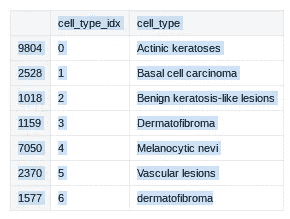
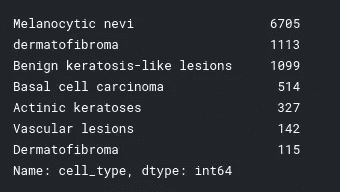
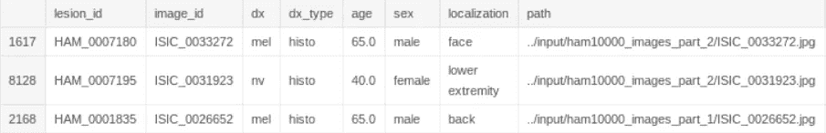
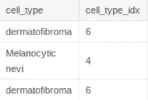

# 基于机器学习的皮肤癌分类

> 原文：<https://towardsdatascience.com/skin-cancer-classification-with-machine-learning-c9d3445b2163?source=collection_archive---------14----------------------->

皮肤癌是美国最常见的皮肤癌。美国每年诊断出 400 多万例皮肤癌。

这是巨大的！每年可能有 400 万人死于皮肤癌。想想这有多疯狂。

现在那些人都快死了，但是你猜怎么着！这些人中大约有一半，也许更多，甚至在可以预防的早期阶段不去看医生。

即使人们出现了症状，他们仍然不想去看医生。这太疯狂了。特别是因为皮肤癌在早期阶段更容易治疗，而且它生长得超级快。

现在我不能神奇地让人去看医生。或者我可以…


Is this me?

不，你抓住我了。我不是巫师。但是我能做的是让人们在家自己检测皮肤癌。你所需要的只是一台笔记本电脑和几行代码。

# 皮肤癌分类

正如我所说，皮肤癌是美国乃至全世界的一大杀手。但问题是，在早期这是可以预防的，但人们只是不想去看医生。

所以，我用机器学习想出了一种方法，让人们能够在自己家里舒适地检查自己是否患有皮肤癌。

# 我是如何做到的

**数据集:**

我用 PyTorch 编码了这个。首先，你需要**导入数据集。**

对于这一部分，我使用了这个[内核](https://www.kaggle.com/kmader/dermatology-mnist-loading-and-processing)中的一些代码，里面有所有的数据。

```
base_skin_dir = os.path.join('..', 'input')

imageid_path_dict = {os.path.splitext(os.path.basename(x))[0]: x
                     for x **in** glob(os.path.join(base_skin_dir, '*', '*.jpg'))}

lesion_type_dict = {
    'nv': 'Melanocytic nevi',
    'mel': 'dermatofibroma',
    'bkl': 'Benign keratosis-like lesions ',
    'bcc': 'Basal cell carcinoma',
    'akiec': 'Actinic keratoses',
    'vasc': 'Vascular lesions',
    'df': 'Dermatofibroma'tile_df = pd.read_csv(os.path.join(base_skin_dir, 'HAM10000_metadata.csv'))
tile_df['path'] = tile_df['image_id'].map(imageid_path_dict.get)
tile_df['cell_type'] = tile_df['dx'].map(lesion_type_dict.get) 
tile_df['cell_type_idx'] = pd.Categorical(tile_df['cell_type']).codestile_df[['cell_type_idx', 'cell_type']].sort_values('cell_type_idx').drop_duplicates()
```



那么您应该得到如下所示的输出。正如你所看到的，我们对地面实况数据有一个很好的概述。我们唯一需要的部分是“cell_type_idx”列，因为这些数据是我们进行模型定型所需要的。

尽管只有一列是我们真正需要的，但了解每一列的含义仍然是一个好主意。所以让我们快速看一下我们表格中的其他肿瘤在数据集中出现的频率。

```
tile_df['cell_type'].value_counts()
```

输入该代码后，您应该会得到如下所示的输出:



如你所见，黑色素细胞痣的发生率是皮肤纤维瘤的 58 倍。可能发生的是，与皮肤纤维瘤相比，黑色素细胞痣在预测中是优选的。一种解决方案是在培训中更多地显示不太频繁的课程。但这不是一个需要马上解决的大问题，没有它我们也能做得很好。

让我们看一下完整的表格:

```
tile_df.sample(3)
```



上表可用于通过路径获取输入数据。对应的基本事实标签已经由列“cell_type_idx”在同一行中给出。稍后，我们将创建几个已加载图像的输入批次 X 和由相应地面实况标签给出的相应地面实况值 y。

但是，在此之前，我们需要先做些别的事情。**选择型号。**

# 选择培训模型

PyTorch 有一个特性，它有成熟的模型。这些模型可选地已经在 ImageNet 数据集上被训练，使得训练时间通常更短。

所以，我们加载一个预训练的 ResNet50，稍微调整一下最后一层。

```
import torchvision.models as models
model_conv = models.resnet50(pretrained=True) 
        Downloading: "https://download.pytorch.org/models/resnet50-          
        19c8e357.pth" to /tmp/.torch/models/resnet50-19c8e357.pth 100%
       ██████████| 102502400/102502400 [00:01<00:00, 83469977.65it/s]print(model_conv)
     ResNet(
  (conv1): Conv2d(3, 64, kernel_size=(7, 7), stride=(2, 2), padding=(3, 3), bias=False)
  (bn1): BatchNorm2d(64, eps=1e-05, momentum=0.1, affine=True, track_running_stats=True)
  (relu): ReLU(inplace)
  (maxpool): MaxPool2d(kernel_size=3, stride=2, padding=1, dilation=1, ceil_mode=False)
  (layer1): Sequential(
    (0): Bottleneck(
      (conv1): Conv2d(64, 64, kernel_size=(1, 1), stride=(1, 1), bias=False)
      (bn1): BatchNorm2d(64, eps=1e-05, momentum=0.1, affine=True, track_running_stats=True)
      (conv2): Conv2d(64, 64, kernel_size=(3, 3), stride=(1, 1), padding=(1, 1), bias=False)
      (bn2): BatchNorm2d(64, eps=1e-05, momentum=0.1, affine=True, track_running_stats=True)
      (conv3): Conv2d(64, 256, kernel_size=(1, 1), stride=(1, 1), bias=False)
      (bn3): BatchNorm2d(256, eps=1e-05, momentum=0.1, affine=True, track_running_stats=True)
      (relu): ReLU(inplace)
      (downsample): Sequential(
        (0): Conv2d(64, 256, kernel_size=(1, 1), stride=(1, 1), bias=False)
        (1): BatchNorm2d(256, eps=1e-05, momentum=0.1, affine=True, track_running_stats=True)
      )
    )
    (1): Bottleneck(
      (conv1): Conv2d(256, 64, kernel_size=(1, 1), stride=(1, 1), bias=False)
      (bn1): BatchNorm2d(64, eps=1e-05, momentum=0.1, affine=True, track_running_stats=True)
      (conv2): Conv2d(64, 64, kernel_size=(3, 3), stride=(1, 1), padding=(1, 1), bias=False)
      (bn2): BatchNorm2d(64, eps=1e-05, momentum=0.1, affine=True, track_running_stats=True)
      (conv3): Conv2d(64, 256, kernel_size=(1, 1), stride=(1, 1), bias=False)
      (bn3): BatchNorm2d(256, eps=1e-05, momentum=0.1, affine=True, track_running_stats=True)
      (relu): ReLU(inplace)
    )
    (2): Bottleneck(
      (conv1): Conv2d(256, 64, kernel_size=(1, 1), stride=(1, 1), bias=False)
      (bn1): BatchNorm2d(64, eps=1e-05, momentum=0.1, affine=True, track_running_stats=True)
      (conv2): Conv2d(64, 64, kernel_size=(3, 3), stride=(1, 1), padding=(1, 1), bias=False)
      (bn2): BatchNorm2d(64, eps=1e-05, momentum=0.1, affine=True, track_running_stats=True)
      (conv3): Conv2d(64, 256, kernel_size=(1, 1), stride=(1, 1), bias=False)
      (bn3): BatchNorm2d(256, eps=1e-05, momentum=0.1, affine=True, track_running_stats=True)
      (relu): ReLU(inplace)
    )
  )
  (layer2): Sequential(
    (0): Bottleneck(
      (conv1): Conv2d(256, 128, kernel_size=(1, 1), stride=(1, 1), bias=False)
      (bn1): BatchNorm2d(128, eps=1e-05, momentum=0.1, affine=True, track_running_stats=True)
      (conv2): Conv2d(128, 128, kernel_size=(3, 3), stride=(2, 2), padding=(1, 1), bias=False)
      (bn2): BatchNorm2d(128, eps=1e-05, momentum=0.1, affine=True, track_running_stats=True)
      (conv3): Conv2d(128, 512, kernel_size=(1, 1), stride=(1, 1), bias=False)
      (bn3): BatchNorm2d(512, eps=1e-05, momentum=0.1, affine=True, track_running_stats=True)
      (relu): ReLU(inplace)
      (downsample): Sequential(
        (0): Conv2d(256, 512, kernel_size=(1, 1), stride=(2, 2), bias=False)
        (1): BatchNorm2d(512, eps=1e-05, momentum=0.1, affine=True, track_running_stats=True)
      )
    )
    (1): Bottleneck(
      (conv1): Conv2d(512, 128, kernel_size=(1, 1), stride=(1, 1), bias=False)
      (bn1): BatchNorm2d(128, eps=1e-05, momentum=0.1, affine=True, track_running_stats=True)
      (conv2): Conv2d(128, 128, kernel_size=(3, 3), stride=(1, 1), padding=(1, 1), bias=False)
      (bn2): BatchNorm2d(128, eps=1e-05, momentum=0.1, affine=True, track_running_stats=True)
      (conv3): Conv2d(128, 512, kernel_size=(1, 1), stride=(1, 1), bias=False)
      (bn3): BatchNorm2d(512, eps=1e-05, momentum=0.1, affine=True, track_running_stats=True)
      (relu): ReLU(inplace)
    )
    (2): Bottleneck(
      (conv1): Conv2d(512, 128, kernel_size=(1, 1), stride=(1, 1), bias=False)
      (bn1): BatchNorm2d(128, eps=1e-05, momentum=0.1, affine=True, track_running_stats=True)
      (conv2): Conv2d(128, 128, kernel_size=(3, 3), stride=(1, 1), padding=(1, 1), bias=False)
      (bn2): BatchNorm2d(128, eps=1e-05, momentum=0.1, affine=True, track_running_stats=True)
      (conv3): Conv2d(128, 512, kernel_size=(1, 1), stride=(1, 1), bias=False)
      (bn3): BatchNorm2d(512, eps=1e-05, momentum=0.1, affine=True, track_running_stats=True)
      (relu): ReLU(inplace)
    )
    (3): Bottleneck(
      (conv1): Conv2d(512, 128, kernel_size=(1, 1), stride=(1, 1), bias=False)
      (bn1): BatchNorm2d(128, eps=1e-05, momentum=0.1, affine=True, track_running_stats=True)
      (conv2): Conv2d(128, 128, kernel_size=(3, 3), stride=(1, 1), padding=(1, 1), bias=False)
      (bn2): BatchNorm2d(128, eps=1e-05, momentum=0.1, affine=True, track_running_stats=True)
      (conv3): Conv2d(128, 512, kernel_size=(1, 1), stride=(1, 1), bias=False)
      (bn3): BatchNorm2d(512, eps=1e-05, momentum=0.1, affine=True, track_running_stats=True)
      (relu): ReLU(inplace)
    )
  )
  (layer3): Sequential(
    (0): Bottleneck(
      (conv1): Conv2d(512, 256, kernel_size=(1, 1), stride=(1, 1), bias=False)
      (bn1): BatchNorm2d(256, eps=1e-05, momentum=0.1, affine=True, track_running_stats=True)
      (conv2): Conv2d(256, 256, kernel_size=(3, 3), stride=(2, 2), padding=(1, 1), bias=False)
      (bn2): BatchNorm2d(256, eps=1e-05, momentum=0.1, affine=True, track_running_stats=True)
      (conv3): Conv2d(256, 1024, kernel_size=(1, 1), stride=(1, 1), bias=False)
      (bn3): BatchNorm2d(1024, eps=1e-05, momentum=0.1, affine=True, track_running_stats=True)
      (relu): ReLU(inplace)
      (downsample): Sequential(
        (0): Conv2d(512, 1024, kernel_size=(1, 1), stride=(2, 2), bias=False)
        (1): BatchNorm2d(1024, eps=1e-05, momentum=0.1, affine=True, track_running_stats=True)
      )
    )
    (1): Bottleneck(
      (conv1): Conv2d(1024, 256, kernel_size=(1, 1), stride=(1, 1), bias=False)
      (bn1): BatchNorm2d(256, eps=1e-05, momentum=0.1, affine=True, track_running_stats=True)
      (conv2): Conv2d(256, 256, kernel_size=(3, 3), stride=(1, 1), padding=(1, 1), bias=False)
      (bn2): BatchNorm2d(256, eps=1e-05, momentum=0.1, affine=True, track_running_stats=True)
      (conv3): Conv2d(256, 1024, kernel_size=(1, 1), stride=(1, 1), bias=False)
      (bn3): BatchNorm2d(1024, eps=1e-05, momentum=0.1, affine=True, track_running_stats=True)
      (relu): ReLU(inplace)
    )
    (2): Bottleneck(
      (conv1): Conv2d(1024, 256, kernel_size=(1, 1), stride=(1, 1), bias=False)
      (bn1): BatchNorm2d(256, eps=1e-05, momentum=0.1, affine=True, track_running_stats=True)
      (conv2): Conv2d(256, 256, kernel_size=(3, 3), stride=(1, 1), padding=(1, 1), bias=False)
      (bn2): BatchNorm2d(256, eps=1e-05, momentum=0.1, affine=True, track_running_stats=True)
      (conv3): Conv2d(256, 1024, kernel_size=(1, 1), stride=(1, 1), bias=False)
      (bn3): BatchNorm2d(1024, eps=1e-05, momentum=0.1, affine=True, track_running_stats=True)
      (relu): ReLU(inplace)
    )
    (3): Bottleneck(
      (conv1): Conv2d(1024, 256, kernel_size=(1, 1), stride=(1, 1), bias=False)
      (bn1): BatchNorm2d(256, eps=1e-05, momentum=0.1, affine=True, track_running_stats=True)
      (conv2): Conv2d(256, 256, kernel_size=(3, 3), stride=(1, 1), padding=(1, 1), bias=False)
      (bn2): BatchNorm2d(256, eps=1e-05, momentum=0.1, affine=True, track_running_stats=True)
      (conv3): Conv2d(256, 1024, kernel_size=(1, 1), stride=(1, 1), bias=False)
      (bn3): BatchNorm2d(1024, eps=1e-05, momentum=0.1, affine=True, track_running_stats=True)
      (relu): ReLU(inplace)
    )
    (4): Bottleneck(
      (conv1): Conv2d(1024, 256, kernel_size=(1, 1), stride=(1, 1), bias=False)
      (bn1): BatchNorm2d(256, eps=1e-05, momentum=0.1, affine=True, track_running_stats=True)
      (conv2): Conv2d(256, 256, kernel_size=(3, 3), stride=(1, 1), padding=(1, 1), bias=False)
      (bn2): BatchNorm2d(256, eps=1e-05, momentum=0.1, affine=True, track_running_stats=True)
      (conv3): Conv2d(256, 1024, kernel_size=(1, 1), stride=(1, 1), bias=False)
      (bn3): BatchNorm2d(1024, eps=1e-05, momentum=0.1, affine=True, track_running_stats=True)
      (relu): ReLU(inplace)
    )
    (5): Bottleneck(
      (conv1): Conv2d(1024, 256, kernel_size=(1, 1), stride=(1, 1), bias=False)
      (bn1): BatchNorm2d(256, eps=1e-05, momentum=0.1, affine=True, track_running_stats=True)
      (conv2): Conv2d(256, 256, kernel_size=(3, 3), stride=(1, 1), padding=(1, 1), bias=False)
      (bn2): BatchNorm2d(256, eps=1e-05, momentum=0.1, affine=True, track_running_stats=True)
      (conv3): Conv2d(256, 1024, kernel_size=(1, 1), stride=(1, 1), bias=False)
      (bn3): BatchNorm2d(1024, eps=1e-05, momentum=0.1, affine=True, track_running_stats=True)
      (relu): ReLU(inplace)
    )
  )
  (layer4): Sequential(
    (0): Bottleneck(
      (conv1): Conv2d(1024, 512, kernel_size=(1, 1), stride=(1, 1), bias=False)
      (bn1): BatchNorm2d(512, eps=1e-05, momentum=0.1, affine=True, track_running_stats=True)
      (conv2): Conv2d(512, 512, kernel_size=(3, 3), stride=(2, 2), padding=(1, 1), bias=False)
      (bn2): BatchNorm2d(512, eps=1e-05, momentum=0.1, affine=True, track_running_stats=True)
      (conv3): Conv2d(512, 2048, kernel_size=(1, 1), stride=(1, 1), bias=False)
      (bn3): BatchNorm2d(2048, eps=1e-05, momentum=0.1, affine=True, track_running_stats=True)
      (relu): ReLU(inplace)
      (downsample): Sequential(
        (0): Conv2d(1024, 2048, kernel_size=(1, 1), stride=(2, 2), bias=False)
        (1): BatchNorm2d(2048, eps=1e-05, momentum=0.1, affine=True, track_running_stats=True)
      )
    )
    (1): Bottleneck(
      (conv1): Conv2d(2048, 512, kernel_size=(1, 1), stride=(1, 1), bias=False)
      (bn1): BatchNorm2d(512, eps=1e-05, momentum=0.1, affine=True, track_running_stats=True)
      (conv2): Conv2d(512, 512, kernel_size=(3, 3), stride=(1, 1), padding=(1, 1), bias=False)
      (bn2): BatchNorm2d(512, eps=1e-05, momentum=0.1, affine=True, track_running_stats=True)
      (conv3): Conv2d(512, 2048, kernel_size=(1, 1), stride=(1, 1), bias=False)
      (bn3): BatchNorm2d(2048, eps=1e-05, momentum=0.1, affine=True, track_running_stats=True)
      (relu): ReLU(inplace)
    )
    (2): Bottleneck(
      (conv1): Conv2d(2048, 512, kernel_size=(1, 1), stride=(1, 1), bias=False)
      (bn1): BatchNorm2d(512, eps=1e-05, momentum=0.1, affine=True, track_running_stats=True)
      (conv2): Conv2d(512, 512, kernel_size=(3, 3), stride=(1, 1), padding=(1, 1), bias=False)
      (bn2): BatchNorm2d(512, eps=1e-05, momentum=0.1, affine=True, track_running_stats=True)
      (conv3): Conv2d(512, 2048, kernel_size=(1, 1), stride=(1, 1), bias=False)
      (bn3): BatchNorm2d(2048, eps=1e-05, momentum=0.1, affine=True, track_running_stats=True)
      (relu): ReLU(inplace)
    )
  )
  (avgpool): AvgPool2d(kernel_size=7, stride=1, padding=0)
  (fc): Linear(in_features=2048, out_features=1000, bias=True)
)print(model_conv.fc)
      Linear(in_features=2048, out_features=1000, bias=True)
```

所以我们要调整的是最后一层(FC)。最后一层是线性层，具有 2048 个输入神经元和 1000 个输出神经元。如果你有 1000 个不同的类，这很有用。然而，我们只需要处理 7 个不同的类别——7 种不同的肿瘤类型——所以我们需要改变最后一层。

```
num_ftrs = model_conv.fc.in_features
model_conv.fc = torch.nn.Linear(num_ftrs, 7) print(model_conv.fc)
Linear(in_features=2048, out_features=7, bias=True)
```

因此，现在在调整之后，我们需要将模型移动到 GPU，因为模型最终将在那里进行训练。

# 回到数据

**训练和验证集**

```
from sklearn.model_selection import train_test_split

train_df, test_df = train_test_split(tile_df, test_size=0.1)*# We can split the test set again in a validation set and a true test set:*
validation_df, test_df = train_test_split(test_df, test_size=0.5)train_df = train_df.reset_index()
validation_df = validation_df.reset_index()
test_df = test_df.reset_index()
```

**创建一个类‘数据集’**

dataset 类将允许我们在多个 CPU 上轻松地在后台加载和转换批量数据。

```
class **Dataset**(data.Dataset):
    'Characterizes a dataset for PyTorch'
    def __init__(self, df, transform=None):
        'Initialization'
        self.df = df
        self.transform = transform

    def __len__(self):
        'Denotes the total number of samples'
        return len(self.df)

    def __getitem__(self, index):
        'Generates one sample of data'
        *# Load data and get label*
        X = Image.open(self.df['path'][index])
        y = torch.tensor(int(self.df['cell_type_idx'][index]))

        if self.transform:
            X = self.transform(X)

        return X, y*# Define the parameters for the dataloader*
params = {'batch_size': 4,
          'shuffle': True,
          'num_workers': 6}
```

使用 dataset 类的另一个好处是，我们可以轻松地执行数据的预处理和/或数据扩充。

在本例中，我们只执行镜像(RandomHorizontalFlip，RandomVerticalFlip)，将图像裁剪到黑色素瘤最常出现的图像中心(CenterCrop)，从图像中心随机裁剪(RandomCrop)，并根据预训练模型的需要对图像进行归一化(normalize)。然后，我们使用将图像转换为张量，这是使用 PyTorch 进行学习所必需的，具有函数 ToTensor:

```
*define the transformation of the images.*
import torchvision.transforms as trf
composed = trf.Compose([trf.RandomHorizontalFlip(), trf.RandomVerticalFlip(), trf.CenterCrop(256), trf.RandomCrop(224),  trf.ToTensor(),
                        trf.Normalize(mean=[0.485, 0.456, 0.406], std=[0.229, 0.224, 0.225])]) *# Define the trainingsset using the table train_df and using our defined transitions (composed)*
training_set = Dataset(train_df, transform=composed)
training_generator = data.DataLoader(training_set, **params)

*# Same for the validation set:*
validation_set = Dataset(validation_df, transform=composed)
validation_generator = data.DataLoader(validation_set, **params)
```

现在我们必须定义我们想要使用的优化器。在这种情况下，它将是一个学习率为 1e 61e 6 的 Adam 优化器。

我们将使用的损失函数是 CrossEntropyLoss。这是为多类分类问题选择的典型方法。

```
optimizer = torch.optim.Adam(model.parameters(), lr=1e-6)
criterion = torch.nn.CrossEntropyLoss()
```

现在，我们有了一个用于训练集中数据的数据加载器，一个用于验证集中数据的数据加载器，并且我们已经定义了优化器和标准。我们现在可以开始训练和测试模型了。

# 训练和测试模型

训练和测试模型是机器学习的主要部分，在我看来也是最好的部分。这是真正的事情发生的地方。所有的数据准备和数据收集工作都很重要，这是有趣的部分，也是非常重要的。

要训练模型，只需输入以下代码:

```
max_epochs = 20
trainings_error = []
validation_error = []
for epoch **in** range(max_epochs):
    print('epoch:', epoch)
    count_train = 0
    trainings_error_tmp = []
    model.train()
    for data_sample, y **in** training_generator:
        data_gpu = data_sample.to(device)
        y_gpu = y.to(device)
        output = model(data_gpu)
        err = criterion(output, y_gpu)
        err.backward()
        optimizer.step()
        trainings_error_tmp.append(err.item())
        count_train += 1
        if count_train >= 100:
            count_train = 0
            mean_trainings_error = np.mean(trainings_error_tmp)
            trainings_error.append(mean_trainings_error)
            print('trainings error:', mean_trainings_error)
            break
    with torch.set_grad_enabled(False):
        validation_error_tmp = []
        count_val = 0
        model.eval()
        for data_sample, y **in** validation_generator:
            data_gpu = data_sample.to(device)
            y_gpu = y.to(device)
            output = model(data_gpu)
            err = criterion(output, y_gpu)
            validation_error_tmp.append(err.item())
            count_val += 1
            if count_val >= 10:
                count_val = 0
                mean_val_error = np.mean(validation_error_tmp)
                validation_error.append(mean_val_error)
                print('validation error:', mean_val_error)
                breakplt.plot(trainings_error, label = 'training error')
plt.plot(validation_error, label = 'validation error')
plt.legend()
plt.show()
```

**测试模型:**

要测试模型的实际能力，请导入以下代码:

```
model.eval()
test_set = Dataset(validation_df, transform=composed)
test_generator = data.SequentialSampler(validation_set)result_array = []
gt_array = []
for i **in** test_generator:
    data_sample, y = validation_set.__getitem__(i)
    data_gpu = data_sample.unsqueeze(0).to(device)
    output = model(data_gpu)
    result = torch.argmax(output)
    result_array.append(result.item())
    gt_array.append(y.item())correct_results = np.array(result_array)==np.array(gt_array)sum_correct = np.sum(correct_results)accuracy = sum_correct/test_generator.__len__()print(accuracy)
0.8403193612774451
```

现在你可以看到，我们的精度相当高，但并不完美。这个模型也不会是 100%完美的，但它肯定很接近，很快就会实现。

现在有了这个，人们不必每次出现皮肤癌的症状都去看医生，只需在自己家里舒适地进行测试。现在人们不会因为不想去看医生而死于皮肤癌。

如果你有任何问题，请在下面的评论中留下，别忘了鼓掌！