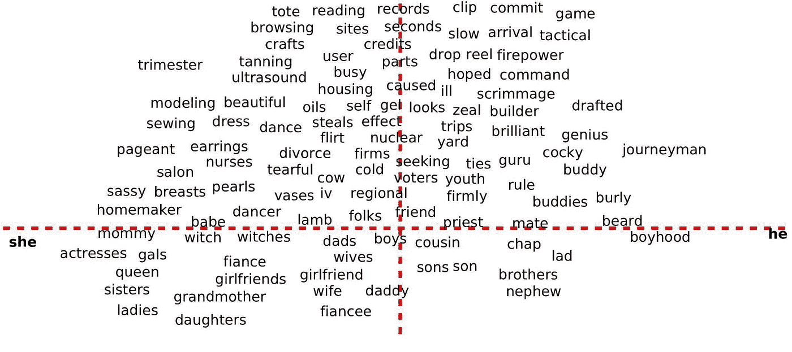
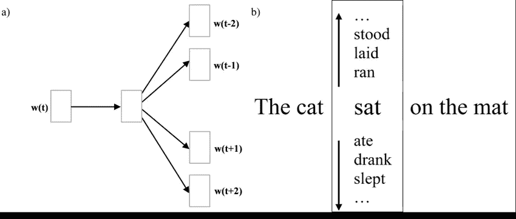
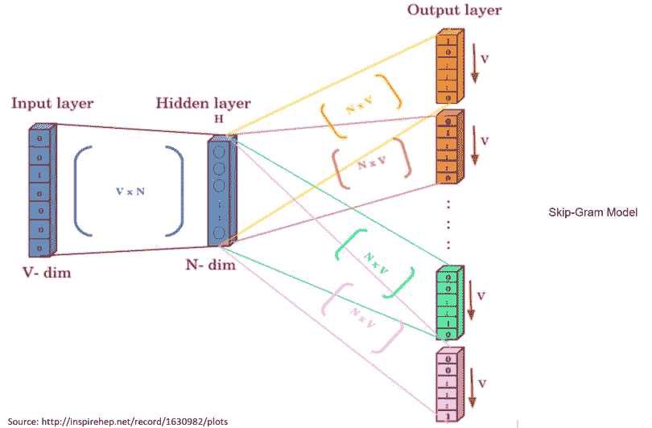
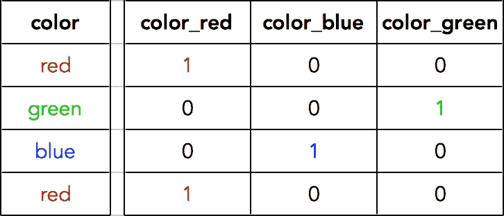
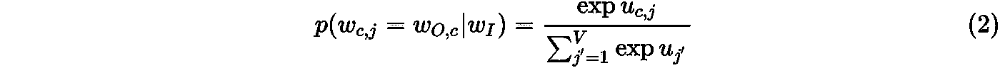
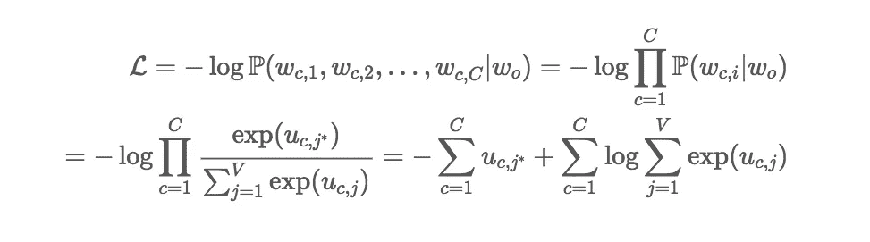

# Skip-Gram:自然语言处理上下文词预测算法

> 原文：<https://towardsdatascience.com/skip-gram-nlp-context-words-prediction-algorithm-5bbf34f84e0c?source=collection_archive---------1----------------------->

NLP 是人工智能的一个领域，我们试图将人类语言作为文本或语音进行处理，以使计算机与人类相似。人类有大量的数据是以非常无组织的格式编写的。因此，任何机器都很难从原始文本中找到意义。

为了让机器从原始文本中学习，我们需要将这些数据转换成向量格式，这样我们的计算机就可以很容易地处理这些数据。这种原始文本到矢量格式的转换被称为单词表示。

word embeddings

单词表示在向量空间中表示单词，因此如果单词向量彼此接近，则意味着这些单词彼此相关。在给定的图像中，我们可以看到在女性中常见的各种单词聚集在左侧，而与男性相关的单词聚集在右侧。因此，如果我们传递单词 like 耳环，计算机会将其与女性联系起来，这在逻辑上是正确的。

由于任何语言的词汇量都很大，并且不能被人类标注，因此我们需要无监督的学习技术，它可以自己学习任何单词的上下文。Skip-gram 是一种无监督学习技术，用于查找给定单词的最相关单词。

跳跃语法用于预测给定目标单词的上下文单词。这是 CBOW 算法的逆运算。这里，目标单词被输入，而上下文单词被输出。因为要预测不止一个上下文单词，这使得这个问题变得困难。

skip-gram example

将给出单词`sat`,我们将分别尝试预测位置`-1 and 3`处的单词`cat, mat`,假设`sat`位于位置`0`。我们不预测常用词或停用词，如`the`。

# 体系结构

The Skip-gram model architecture (Source: [https://arxiv.org/pdf/1301.3781.pdf](https://arxiv.org/pdf/1301.3781.pdf) Mikolov el al.)

我们可以看到 w(t)是给定的目标单词或输入。有一个隐藏层执行权重矩阵和输入向量 w(t)之间的点积。隐藏层中不使用激活函数。现在，隐藏层的点积结果被传递到输出层。输出层计算隐藏层的输出向量和输出层的权重矩阵之间的点积。然后，我们应用 softmax 激活函数来计算单词在给定的上下文位置出现在 w(t)的上下文中的概率。

# 我们将使用的变量

1.  存在于我们的数据集或文本中的唯一单词的字典。该词典被称为词汇表，并且是系统已知的单词。词汇用‘V’来表示。
2.  `N`是隐藏层中存在的神经元数量。
3.  窗口大小是需要预测单词的最大上下文位置。窗口大小由 c 表示。例如，在给定的架构图像中，窗口大小是 2，因此，我们将预测上下文位置(t-2)、(t-1)、(t+1)和(t+2)处的单词。
4.  上下文窗口是在给定单词的范围内可能出现的要预测的单词的数量。上下文窗口的值是 2*c 的窗口大小的两倍，并且由 k 表示。对于给定的图像，上下文窗口的值是 4。
5.  输入向量的维数等于|V|。每个单词使用一个热编码进行编码。
6.  隐藏层(W)的权重矩阵的维数为[|V|，N]。||是返回数组大小的模数函数。
7.  隐藏层的输出向量是 H[N]。
8.  隐藏层和输出层(W’)之间的权重矩阵的维数为[N，|V|]。
9.  W '和 H 之间的点积给出了输出向量 U[|v|]。

N = context window

# 工作步骤

1.  使用一种热编码将单词转换成向量。这些向量的维数是[1，|v|]。

one hot encoding

2.单词 w(t)从|v|神经元传递到隐藏层。

3.隐藏层执行权重向量 W[|v|，N]和输入向量 w(t)之间的点积。在此，我们可以断定 W[|v|，N]的第(t)行将是输出(H[1，N])。

4.请记住，隐藏层没有使用激活函数，因此 H[1，k]将直接传递到输出层。

5.输出层将应用 H[1，N]和 W'[N，|v|]之间的点积，并给出向量 u。

6.现在，为了找到每个向量的概率，我们将使用 softmax 函数。因为每次迭代给出一种热编码类型的输出向量 U。

7.具有最高概率的单词是结果，并且如果给定上下文位置的预测单词是错误的，那么我们将使用反向传播来修改我们的权重向量 W 和 W’。

将对词汇表中存在的每个单词 w(t)执行这些步骤。并且每个单词 w(t)将被传递 k 次。因此，我们可以看到，在每个时段中，前向传播将被处理|v|*k 次。

# 概率函数

softmax probability

w(c，j)是在第`c`个上下文位置预测的第`j`个字；w(O，c)是出现在第`c`个上下文位置的实际单词；w(I)是唯一的输入字；并且 u(c，j)是当预测第`c`个上下文位置的单词时 U 向量中的第`j`个值。

# 损失函数

Loss function

因为我们想要最大化在第`c`个上下文位置上预测 w(c，j)的概率，所以我们可以表示损失函数`L`。

# 优势

1.  这是无监督的学习，因此可以对任何给定的原始文本。
2.  与矢量表示相比，它需要更少的内存。
3.  它需要两个维数分别为[N，|v|]的权重矩阵，而不是[|v|，|v|]。通常，N 大约为 300，而|v|以百万为单位。因此，我们可以看到使用这种算法的优势。

# 不足之处

1.  找到`N`和`c`的最佳值是困难的。
2.  Softmax 函数的计算开销很大。
3.  训练该算法所需的时间很长。