# 灌篮视频分类(Tensorflow 2.0 分布式训练用数字风暴的数据科学 PC！)

> 原文：<https://towardsdatascience.com/slam-dunk-video-classification-tensorflow-2-0-a6d4809f9663?source=collection_archive---------10----------------------->

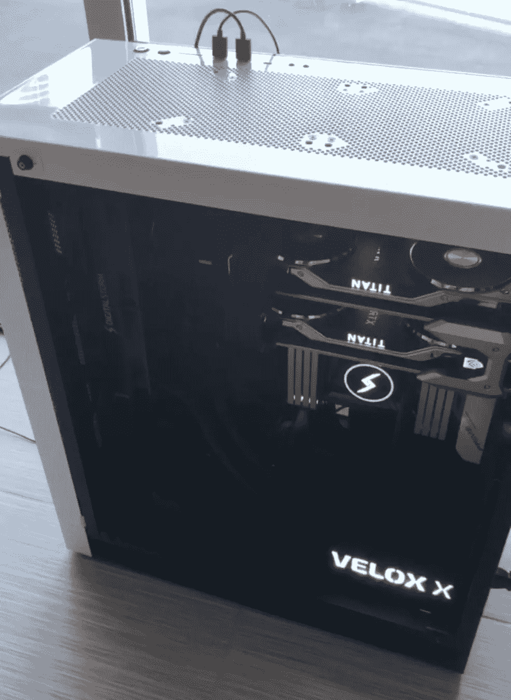

Data Science PC by Digital Storm

最近宣布的来自数字风暴的[数据科学 PC 是人工智能和深度学习未来非常有趣的一步。本文将重点介绍 PC 上 2 个泰坦 RTX GPU 的强大功能，以及 Tensorflow 2.0 针对计算机视觉应用的新分布式训练 API 的简单语法！在这个例子中，与在同一台机器上训练单个 GPU 相比，分布式训练实现了大约 2.5 倍的惊人加速，平均 63 秒/时段，而平均 143 秒/时段。](https://www.digitalstorm.com/nvidia-data-science.asp)

这个端到端教程将构建一个二进制图像分类器来处理视频帧。这个项目背后的动机是一个计算机视觉助手，从包含大部分空白帧的长记录中剪辑出短的扣篮视频。我通过把我的 iPhone 放在三脚架上记录半场来收集数据。令人恼火的是，我最终得到的 2 分钟视频只有大约 4.5 秒的扣篮片段。视频的大部分只是一个空的半场，如下图左下方所示。

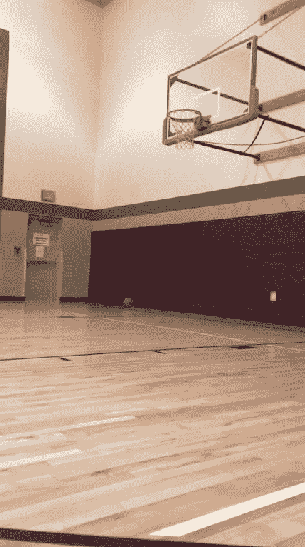

Most of the video is an empty hoop, we want to use the classifier to crop out these frames

这个端到端的教程将建立一个分类器来解析完整的训练磁带中的扣篮。端到端的工作流程包括从视频数据中提取图像帧，我对这个项目的数据标记策略，如何调整图像大小，如何在[数据科学 PC](https://www.digitalstorm.com/nvidia-data-science.asp) w/ TF 2.0 分布式培训上训练分类器，如何使用这个分类器从完整的锻炼视频中裁剪出扣篮，以及如何将这些图像拼接到一个视频中！

此工作流程包含 6 个步骤，从视频文件中提取帧，标记数据，调整数据大小，训练分类器，使用分类器解析视频帧，最后，将图像拼接到仅包含锻炼扣篮的视频中！

[我还为此制作了一个视频教程，如果你愿意这样做的话！](https://www.youtube.com/watch?v=LQ8b7piC1M4&t=25s)

# 步骤 1:从视频文件中提取帧

工作流程的第一步是从视频文件中获取图像帧。通常视频每秒包含大约 30 帧，在我们的例子中，这意味着视频每秒 30 幅图像。平均而言，这些 1-2 分钟的原始视频剪辑会产生大约 2，000 个图像帧。下面代码的一个有趣的特点是，cv2 视频阅读器默认以旋转方式读取图像，所以我不得不使用 imutils 库将这些图像垂直旋转回来。我还建议观察计数是如何递增的，这样图像帧就不会不断地被一个接一个地覆盖。

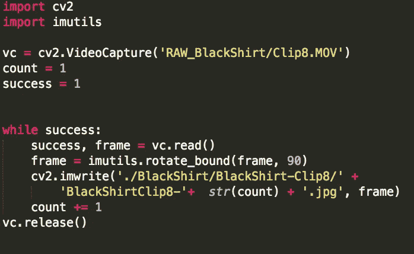

CV2 to extract image frames from video files!

# 步骤 2:标签数据

以这种方式提取视频帧后，我们只剩下这些文件夹。剪辑末尾的数字，例如“BlackShirtClip8-k.jpg”表示视频帧的顺序。幸运的是，为了便于标记，我们可以利用这种连续的顺序一次标记几个数据点。例如，如果我第一次出现在场景中的第 405 帧，我们可以安全地假设 1–404 可以被标记为“空”或不“在帧内”。

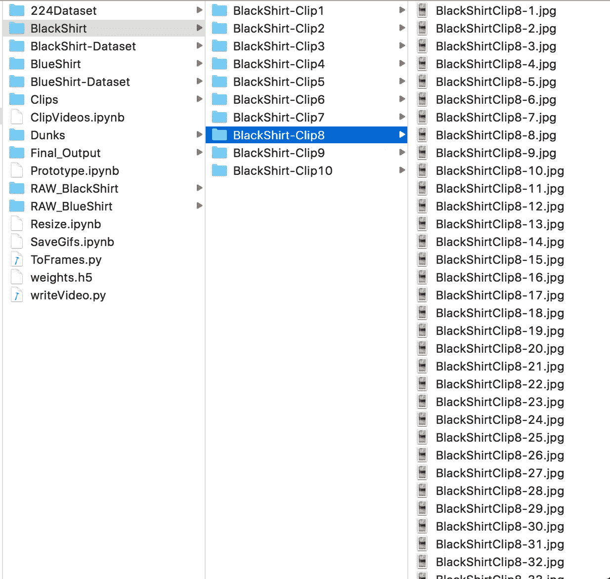

My strategy for labeling data in this project is to take advantage of the sequential nature of frames to mass label data points.

# 步骤 3:调整数据大小

该分类器将使用预先构建到 Tensorflow.Keras.Applications 中的 ResNet50。该网络接受 224 x 224 图像作为输入。这确实扭曲了 1080 x 1920 的自然图像，但这似乎不会导致性能下降，所以现在，我们只能接受它。下面的代码遍历带标签的数据目录，并使用 Pillow 打开图像并调整它们的大小。

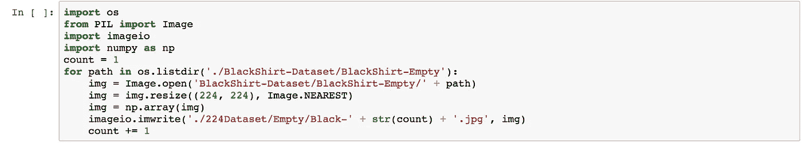

The keras.applications.resnet50 classifier takes in 224 x 224 images as input!

# 第四步:训练分类器！

现在我们已经为模型准备好了训练数据，我们将通过 Digital Storm 在 Data Science PC 上使用 Tensorflow 2.0 分布式训练 API 来训练一个二进制图像分类器。下面显示的第一个代码块从 keras 导入必要的库并加载图像数据。我们以这种方式加载图像数据，以便在一个 [tf.data objec](https://www.tensorflow.org/guide/data) t 中将它绑定到 GPU。

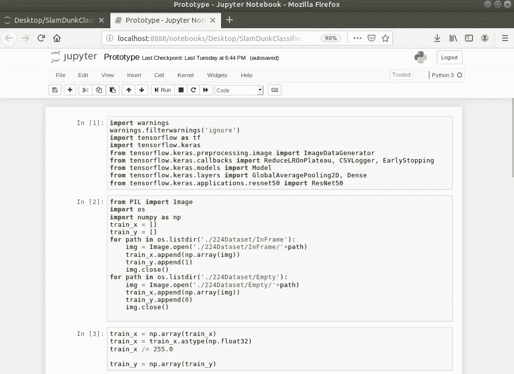

Import necessary libraries for the classifier and load the images into memory to fit into a tf.data object

下面的代码块建立了我们的模型和分布式训练策略。本教程使用了 [Tensorflow 分布式培训文档](https://www.tensorflow.org/guide/distributed_training)中涵盖的镜像策略。我们的模型采用 ResNet50，删除用于 ImageNet 的 1000 路分类层，并向输出添加 3 个完全连接的层。最终输出层具有 1 个激活节点，并使用 sigmoid 激活将图像分类为帧中有我或帧中没有我。

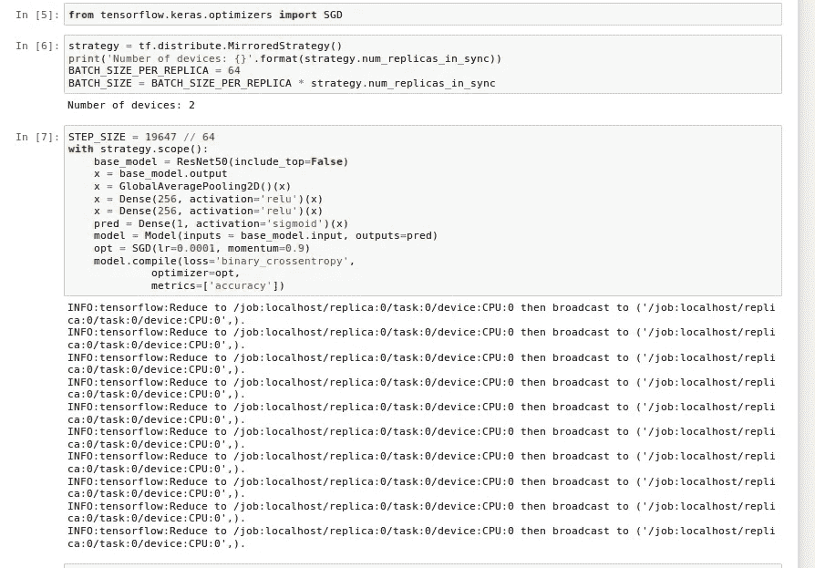

Setup for the TF 2.0 Distributed Training API with the Mirrored Strategy for distribution!

下面的代码块将训练数据加载到 tf.data 对象中，并将数据缓存到 GPU 上。Tensorflow 2.0 分布式培训 API 的惊人之处在于其简单性。我们要把训练规模扩大到 2 个 GPU 所要做的就是同样的“model.fit”语法！在我们训练模型之后，我们保存权重以用于稍后剪辑视频。

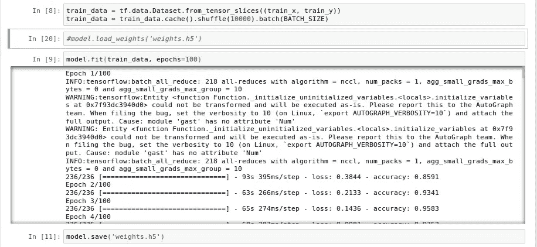

Training the model with Distributed Training on the Data Science PC

# 在 1 个泰坦 RTX GPU 上训练的速度比较

以下代码行显示了 Tensorflow 2.0 分布式培训 API +数据科学 PC 实现的显著加速。我们能够在其他地方使用完全相同的代码和设置来实现 63 秒/纪元对 143 秒/纪元！

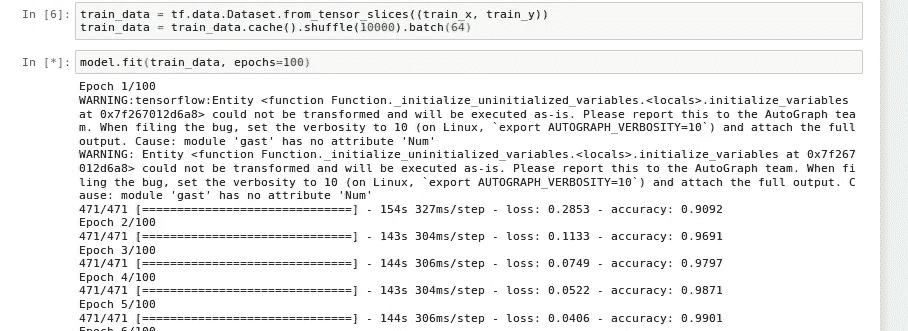

Note: 143s / epoch using just 1 GPU. Compared to 63s / epoch using 2 GPUs with the Distributed Training API

# 第五步:使用模型裁剪扣篮！

现在我们已经完成了模型的训练，我们将它加载到内存中以应用于我们的视频帧。下面的代码块加载到模型和保存的权重文件中。

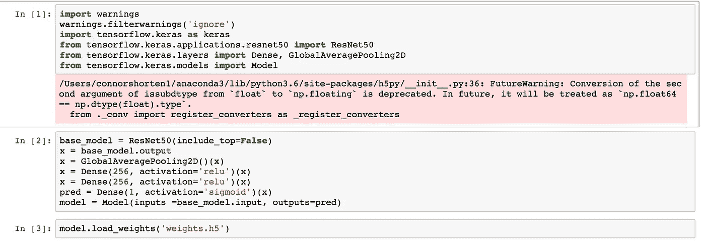

Load the model for inference

现在我们有了模型，我们遍历视频帧并保存我所在的帧的位置(被分类器标记为 1)。这是在生产线上完成的:

```
if (label >= 0.95):
  action_frames.append(frame_counter)
```

我将决策界限提高到 0.95，以避免误报。我发现这对于避免分类中的噪音非常有效。

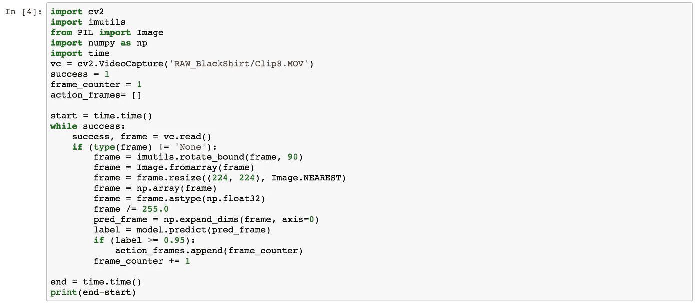

Label frames which contain me in the frame, compared to the empty hoop frames shown previously

现在我们有了一个 action_frames 列表，看起来像这样:

```
[405, 406, 407, ..., 577, 768, 769, ..., 999, 1000, .... ]
```

这个列表包含了我在场景中的所有帧。我想解析这个剪辑，所以它有成对的(开始，结束)帧。这是通过使用以下代码遍历动作列表来实现的:

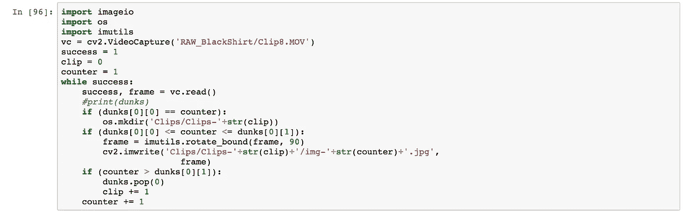

Write clips to separate folders

上面代码的结果是一个数组，例如[(405，577)，(768，999)]。然后，我们将这些间隔中包含的帧写入单独的文件夹中，并在步骤 6 中将它们组装成视频。

# 步骤 6:从图像帧中组合视频

现在我们有了视频中每个扣篮对应的图像帧，我们可以使用 [cv2 VideoWriter 将它们制作成自己的视频。](https://www.youtube.com/redirect?redir_token=7Dra5MJorq1M9mtK6o_r0XkUFu98MTU3MjAyMzQ5N0AxNTcxOTM3MDk3&q=https%3A%2F%2Ftheailearner.com%2F2018%2F10%2F15%2Fcreating-video-from-images-using-opencv-python%2F&event=video_description&v=LQ8b7piC1M4)请注意，如果您想在视频中获得慢动作效果，您也可以将 fps 从 30 更改为 15！

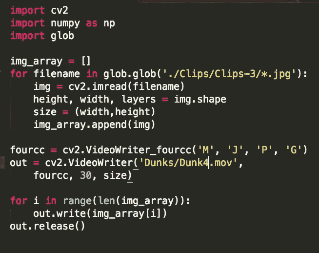

Assemble the dunk clips into videos!

感谢您阅读本教程，请让我知道你对此有任何问题！如果你感兴趣的话，我还制作了一个视频教程来讲述这些步骤。