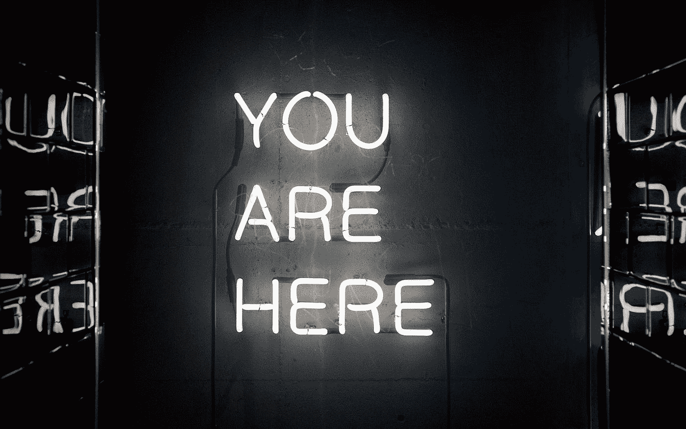

# 深度学习时代的 SLAM

> 原文：<https://towardsdatascience.com/slam-in-the-era-of-deep-learning-e8a15e0d16f3?source=collection_archive---------9----------------------->

## 深化灌篮

## 1.什么是 SLAM，为什么我们需要它？

Photo by [John Baker](https://unsplash.com/@jlondonbaker?utm_source=medium&utm_medium=referral) on [Unsplash](https://unsplash.com?utm_source=medium&utm_medium=referral)

本文是探索深度学习和 SLAM 之间关系的系列文章的第一部分。我们首先来看看什么是 SLAM，它是如何工作的。这将允许我们更深入地了解系统的哪些部分可以被一个有经验的对应物代替，以及为什么。让我们从头开始，如果一切顺利，我们不需要一个标志来告诉我们“你在这里”，因为 SLAM 会为我们解决这个问题。

# 猛击

同步定位和地图绘制(简称 SLAM)是一个研究得比较好的问题，机器人学有两个目标:

*   **映射**:构建一个环境的表示，目前我们称之为“地图”
*   **定位**:找到机器人相对于地图的位置。

# 什么时候需要 SLAM？

在室内、地下或水下等无法使用 GPS 的环境中，移动代理必须完全依靠其机载传感器来构建环境的表示，以便定位自己。这就是需要 SLAM 的场景。即使在 GPS 可以提供粗略定位的情况下，SLAM 也可以用于提供车辆位置的精细估计。

# 为什么同时发生？

"先有鸡还是先有蛋？"是一个古老的问题，同时也回答了 SLAM 的问题。如果我们已经有了地图，相对于它来定位机器人是相对容易的，因为我们知道相对于什么来定位。同样，如果我们一直都知道机器人在哪里(位置和方向)，那么通过在一个公共参考系中叠加传感器测量值，就可以很容易地构建一个地图。既不是从地图也不是从位置开始(习惯上认为第一个测量位置是地图的原点)，定位和绘图都需要同时进行*以获得机器人的最新位置以及地图的最新估计。*

# *地图里有什么？*

*看情况。你问什么？在申请上。SLAM 最大的应用之一就是本地化。我们制作地图来找出我们现在或以后相对于它们的位置。*

*想象一下，在一个大城市的道路上有数百万辆汽车，每个人都通过共享地图来帮助其他人定位。这是必要的，因为地图不是静态的，相反，它是一个随时随时间变化的活生生的有机体。对于大规模定位，地图可以表示为对应于传感器测量中唯一可识别区域的一组稀疏点。稀疏表示对于创建、更新和共享是高效的。*

*地图是另一个明显的应用。想象一个移动代理(你拿着一个相机)在你想出租的房产内移动。你使用 SLAM 魔法，弹出一个详细的 3D 建筑模型。在这种情况下，地图需要是租赁物业的密集表面模型。*

*对于虚拟现实/增强现实应用，SLAM 充当本地化主干。因为最终目标是本地化，所以可以使用稀疏表示。*

*根据应用的不同，地图可以由各种不同的东西组成，从稀疏的点到世界的密集表示。稍后，我们将看到深度学习如何为 SLAM 地图实现更复杂但稀疏的表示。*

# *里程表、SfM、SLAM*

*在开始剖析现代 SLAM 系统之前，有必要澄清一些术语上的混淆。*

*   *最纯粹的里程计通过比较*两个连续的*传感器观测值来提供移动代理的运动的*估计，这是基于激光的里程计的情况。Nister 等人的作品[视觉里程计](https://ieeexplore.ieee.org/abstract/document/1315094/)。艾尔。将此扩展到跟踪多个图像帧，然而，焦点仍然在运动上，而不是环境表示上。**
*   *来自运动的结构(SfM)处理一组*无序的*图像，以恢复环境模型以及摄像机位置。可持续森林管理的一个很好的例子是 Agarwal 等人的“[一天建成罗马](http://grail.cs.washington.edu/rome/)”。艾尔。*
*   *SLAM 利用了机器人设置中观察的顺序性质。它假设观察结果来自一个时间序列(即视频流)，而不是一组无序的图像。*

# *SLAM 传感器*

*根据传感器是测量外部世界还是[测量自身，传感器可以分为两类，](https://www.quotes.net/mquote/1104913)测量系统的内部状态。*

*   *本体感受(来自拉丁语 *proprius* 意为‘自己的’+接受的):IMU、陀螺仪、指南针。这些传感器不测量环境的任何方面，因此仅在恢复机器人轨迹的估计中有用。*
*   *外部感受:相机(单声道，立体声，More-o)，激光，激光雷达，RGB-D 传感器，Wifi 接收器，光强等。任何可以测量外界某个方面随机器人位置/方位变化的东西，理论上都可以作为 SLAM 的传感器。*

*虽然已经提出了使用本体和外部感受传感器的组合的许多不同的 SLAM 解决方案，但是展望未来，我们将考虑单目 SLAM 的情况，即仅使用单个相机的 SLAM。这是具有挑战性的，因此也是有趣的，因为仅使用单个相机会引入在基于多相机/激光器的解决方案中不存在的问题。这也将给出深度学习在 SLAM 中可以发挥作用的地方。*

# *单眼 SLAM 的问题*

*   *标度模糊性*
*   *标度漂移*
*   *纯旋转:单眼 SLAM 死在纯旋转下，就那么差。对于单个相机，基线(两个相机位置之间的平移)用于估计被观察场景的深度，这一过程称为三角测量。如果相机只旋转，基线为零，没有新的点可以三角测量。更糟糕的是，图像平面上的明显运动在旋转下比在平移下更大。实际上，我们知道深度的点从视野中消失了，没有新的点可以被估计，因为没有基线。结果，追踪失败！*

# *现代 SLAM 系统的模块*

*我说现代是为了区别于不再流行的基于过滤的方法。在本系列中，我们将主要关注 SLAM[【2】](https://ieeexplore.ieee.org/stamp/stamp.jsp?arnumber=5681215)的基于图的公式。*

*让我们在这里停下来，考虑一下我们想要用 SLAM 系统实现什么。我们希望将原始传感器测量值转换成连贯的地图，并在此过程中恢复机器人在获得传感器测量值的每个时刻的位置。期望相干图比单个传感器测量更精确。传感器测量是 SLAM 管道的输入，机器人姿态和地图是 SLAM 管道的输出。在图 SLAM 公式中，图中的顶点是我们想要估计的实体(输出) :机器人位置、世界上点的位置等。边缘表示这些实体之间的约束，这些约束从原始传感器测量(输入)中导出。*

*从实现的角度来看，我们有一个可以成为顶点的东西的概念:当机器人用它的传感器对世界进行测量时，它的位置(姿态)作为顶点进入图形。我们如何用公式表示图中的边？这就是我们遇到的现代 SLAM 系统的第一个模块:前端。*

***前端**负责将原始传感器测量值转换成顶点和边，这些顶点和边将出现在图表中。它处理诸如从图像中提取特征、3D 点初始化和数据关联(特征匹配)等任务。前端通过将实际传感器转换为我们想要估计的实体(顶点)之间的相对约束(边),作为一种抽象传感器的方式。一旦这些约束形成，**后端**负责优化图表以找到最佳解决方案。*

# *SLAM 解决了吗？*

*关于这个问题意味着什么，一直有很多争论。简短的回答是“是也不是”。正是这个问题导致了我们的论文[1] 的产生，这篇论文详细讨论了 SLAM 的过去、现在和未来。*

# *下次*

*我们来看看现代 SLAM 系统的架构。*

# *参考文献。*

1.  **凯德娜 C，卡隆 L，卡里略 H，*[拉蒂夫 Y](https://medium.com/@yasir.latif) *，斯卡拉穆扎 D，内拉 J，里德 I，伦纳德 JJ。同步定位和地图绘制的过去、现在和未来:走向健壮感知时代。2016 年十二月；32(6):1309–32.**
2.  *[*Grisetti G，Kummerle R，Stachniss C，Burgard W .《基于图的 SLAM 教程》。IEEE 智能交通系统杂志。2010;2(4):31–43.*](https://ieeexplore.ieee.org/stamp/stamp.jsp?arnumber=5681215)*