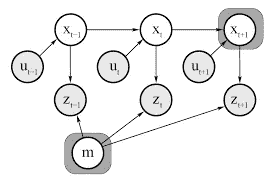
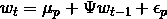
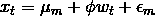
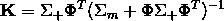
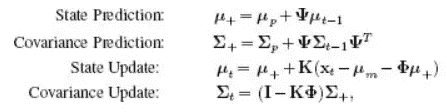
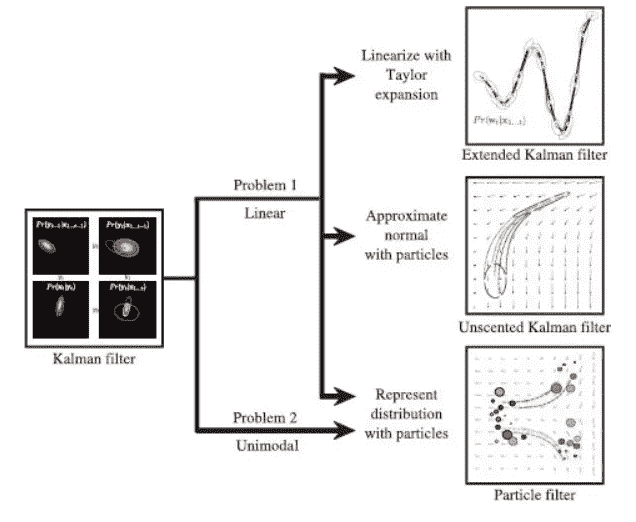
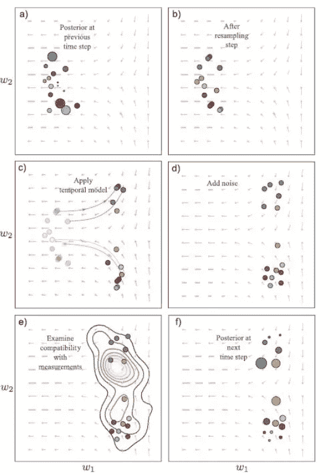
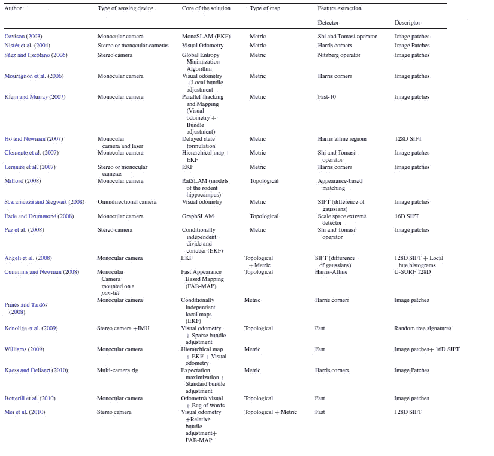
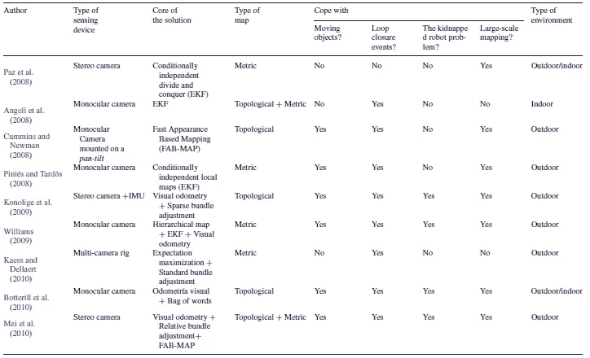

# 自动驾驶是如何工作的？满贯入门

> 原文：<https://towardsdatascience.com/slam-intro-fd833ef29e4e?source=collection_archive---------5----------------------->

## ***SLAM 是机器人/车辆构建其当前环境的全球地图，并使用该地图在任何时间点导航或推断其位置的过程[1–3]。***

SLAM 的使用通常出现在自主导航中，尤其是在全球定位系统(GPS)失效的区域或以前看不见的区域中辅助导航。在本文中，我们将把机器人或车辆称为“实体”。使用该过程的实体将具有反馈系统，在该反馈系统中，传感器实时获得它们周围的外部世界的测量值，并且该过程分析这些测量值以绘制本地环境图，并基于该分析做出决策。

# 介绍

SLAM 是一种时间模型，其目标是从一组有噪声的测量值中推断出一系列状态[4]。给定先前的状态和测量，该计算预期映射环境、 *m* 和表示为状态 *w* ₜ 的实体的路径。状态可以是各种各样的东西，例如，Rosales 和 Sclaroff (1999)使用状态作为行人周围边界框的 3D 位置来跟踪他们的运动。Davison 等人(2017 年)使用单目摄像机的摄像机位置、摄像机的 4D 方位、速度和角速度以及一组 3D 点作为导航状态。

SLAM 包括两个步骤，虽然研究人员在这里使用的术语各不相同，但我将它们称为预测步骤和测量步骤。为了准确地表示导航系统，在状态之间以及状态和测量值之间需要有一个学习过程。SLAM 最常见的学习方法称为**卡尔曼滤波器**。

## 卡尔曼滤波器

*卡尔曼滤波器*是一种用于状态估计的贝叶斯滤波器。这是一种递归算法，它进行预测，然后根据系统中的不确定性随时间修正预测。不确定性被表示为当前状态估计和先前测量的权重，称为*卡尔曼增益*。该算法将实体状态的历史、观察和控制输入以及当前观察和控制输入作为输入。该滤波器使用两个步骤:预测和测量。**预测**过程使用*运动模型*，该运动模型在给定先前位置和当前控制输入的情况下估计当前位置。**测量**校正过程使用*观测模型*，该模型基于估计状态、当前和历史观测值以及不确定性做出当前状态的最终估计。

Figure 1\. From Cyrill Stachniss, UNI Freiburg. The new state wₜ₊₁ and m are being estimated using the historical states, control inputs, and observations and the current control input and observation.

第一步涉及基于先前状态和一些噪声生成预测的时间模型。

Equation 1\. Prediction step/model. μ is a mean vector representing the change in states. ψ is a matrix, number of states by number of states, that relates the mean of the state at the current time to the previous time. ε is the transition noise and can determine how closely related the current state is to the previous. [4]

第二步结合测量来“校正”预测。传感器是为自主导航收集测量值的常用方法。有两类传感器:外部感受性和本体感受性[1]。*外部感受*传感器从环境中收集测量数据，包括声纳、激光测距、摄像机和全球定位系统。在 SLAM 术语中，这些是观察值。*本体感受*传感器通过编码器、加速度计和陀螺仪等设备收集系统内部的测量值，如速度、位置、变化和加速度。在 SLAM 术语中，这些将是单元控制，可以输入到实体的测量。所有这些传感器都有各自的优缺点，但相互结合可以产生非常有效的反馈系统。

Equation 2\. μₘ is a mean vector for measurements. Φ is a matrix, number of measurements by number of states, that relates the mean of the measurements to the current state. εₘ is the measurement noise, which is normally distributed with a covariance Σₘ. [4]

*卡尔曼增益*是我们如何衡量我们在测量中的信心，并在可能的世界状态远大于观察到的测量时使用。例如，如果我们的相机失焦，我们将不会对它提供的内容有太多的信心。小的卡尔曼增益意味着测量对预测贡献很小并且不可靠，而大的卡尔曼增益意味着相反。

Equation 3\. The calculation of the Kalman gain where Σ ₊ is the predicted covariance. [4]

更新过程如下:

Equation 4\. The Kalman filter learning process using Kalman Gain [4]. Image from Simon J. D. Prince (2012).

虽然这种方法很有用，但也有一些问题。卡尔曼滤波器假设可以用线性函数表示的单峰分布。解决线性的两种方法是扩展卡尔曼滤波器(EFK)和无迹卡尔曼滤波器(UFK)。EFK 使用泰勒展开来近似线性关系，而 UFK 使用一组点质量来近似正态性，这些点质量被确定地选择为具有与原始分布相同的均值和协方差[4]。一旦选择了点，该算法通过非线性函数传递这些点，以创建一组新的样本，然后将预测分布设置为正态分布，其均值和协方差与变换后的点相等。

由卡尔曼滤波器强加的单峰分布的假设意味着状态的多个假设不能被表示。使用粒子滤波是处理这些问题的常用方法。

Image from Simon J. D. Prince (2012).

## 粒子过滤器

粒子滤波器允许通过空间中的粒子来表示多个假设，在空间中，更高的维度需要更多的粒子。每个粒子被赋予一个权重，这个权重代表了我们对它所代表的状态假设的信心。预测步骤从原始加权粒子采样开始，并从该分布采样预测状态。测量校正步骤根据粒子与观测数据的一致程度来调整权重，这是一项数据关联任务。最后一步是归一化得到的权重，使它们的总和为 1，因此它们是 0 到 1 的概率分布。

Image from Simon J. D. Prince (2012). Here shows the steps of a particle filter.

由于粒子的数量会变得很大，因此对该算法的改进集中在如何降低采样的复杂度上。*重要抽样*和 *Rao-Blackwellization* 划分是常用的两种方法【4】。

# 当前的研究前景

以下图片摘自 Fuentes-Pacheco，j .、Ruiz-Ascencio，j .、& Rendón-Mancha，J. M. (2012 年)“可视化同步定位和绘图:调查”，代表 SLAM 中截至 2010 年的一些当前方法。他们把研究分成几个领域。核心解决方案是使用的学习算法，其中一些我们已经在上面讨论过了。地图的类型或者是度量地图，其捕获环境的几何属性，和/或拓扑地图，其描述不同位置之间的连通性。

在线跟踪中最常用的特征是*显著特征*和*地标*。地标是环境中由其 3D 位置和外观描述的区域(Frintrop 和 Jensfelt，2008)。一个显著的特征是由图像的 2D 位置和外观描述的图像区域。深度学习技术通常用于*描述*和*检测*每个时间步的这些显著特征，以向系统添加更多信息【4–5】。检测是识别环境中显著元素的过程，描述是将对象转换成特征向量的过程。

Table 1 from J. Fuentes-Pacheco et al. (2012). Research related to feature extraction.

SLAM 应用的场景有两种，一种是闭环，一种是“被绑架的机器人”。闭环检测是在“被绑架的机器人”在没有先前信息的情况下绘制环境地图时，在任意长度的循环行程中识别已经访问过的地方[1]。

Table 1 continued from J. Fuentes-Pacheco et al. (2012) for environment specific methods.

# 结论

SLAM 是用于状态的时间建模的框架，通常用于自主导航。它主要基于概率原理，对状态和测量值的后验和先验概率分布以及两者之间的关系进行推理。这种方法的主要挑战是计算的复杂性。状态的维度越多，测量值越多，计算就变得越难处理，从而在准确性和复杂性之间进行权衡。**下面是用于生成此内容的完整来源列表**，希望您喜欢！

# 参考

[1] Fuentes-Pacheco，j .，Ruiz-Ascencio，j .，和 Rendón-Mancha，J. M. (2012 年)。视觉同步定位与地图创建:综述。人工智能评论，43(1)，55–81。[https://doi.org/10.1007/s10462-012-9365-8](https://doi.org/10.1007/s10462-012-9365-8)

[2]达兰特-h .威特和 t .贝利(2006 年)。同步定位和绘图:第一部分。IEEE 机器人和自动化杂志，13(2)，99–108。[https://doi.org/10.1109/MRA.2006.1638022](https://doi.org/10.1109/MRA.2006.1638022)

[3] T .贝利和 h .达兰特-威特(2006 年)。“同步定位和地图绘制(SLAM):第二部分”，载于 *IEEE 机器人学&自动化杂志*，第 13 卷，第 3 期，第 108–117 页。doi:10.1109/MRA。56606.88868688661

[4]西蒙 J. D .普林斯(2012 年)。*计算机视觉:模型、学习和推理。*剑桥大学出版社。

[5]穆拉利诉邱海平和简诉中国(2018 年)。利用语义视觉地标进行精确的车辆导航。

[6] Seymour，z .，Sikka，k .，Chiu，H.-P .，Samarasekera，s .，和 Kumar，R. (2019 年)。长时 2D 视觉定位的语义感知注意神经嵌入。(1).

[7] Fuentes-Pacheco，j .，Ruiz-Ascencio，j .，和 Rendón-Mancha，J. M. (2012 年)。视觉同步定位与地图创建:综述。*人工智能评论*， *43* (1)，55–81。[https://doi.org/10.1007/s10462-012-9365-8](https://doi.org/10.1007/s10462-012-9365-8)