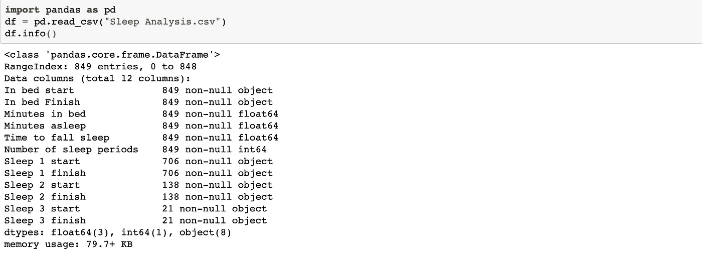
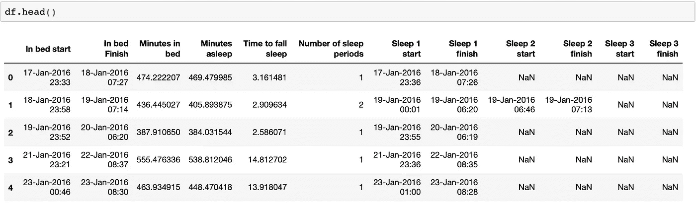
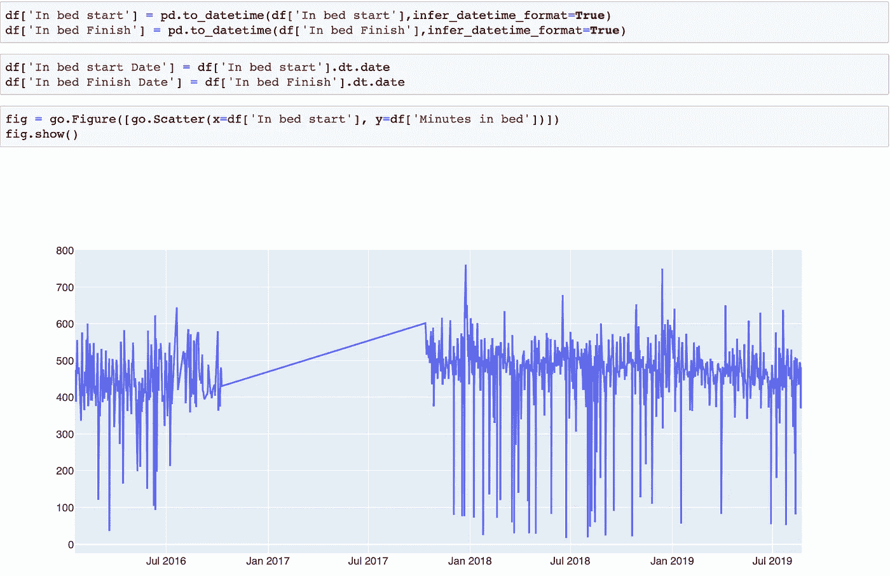
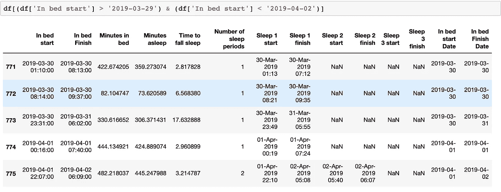
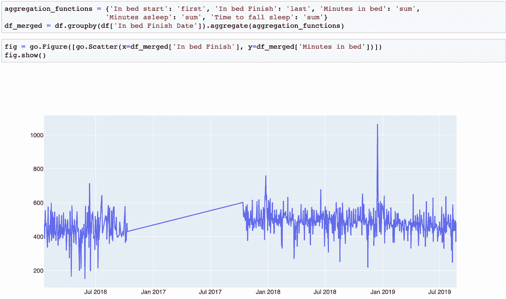
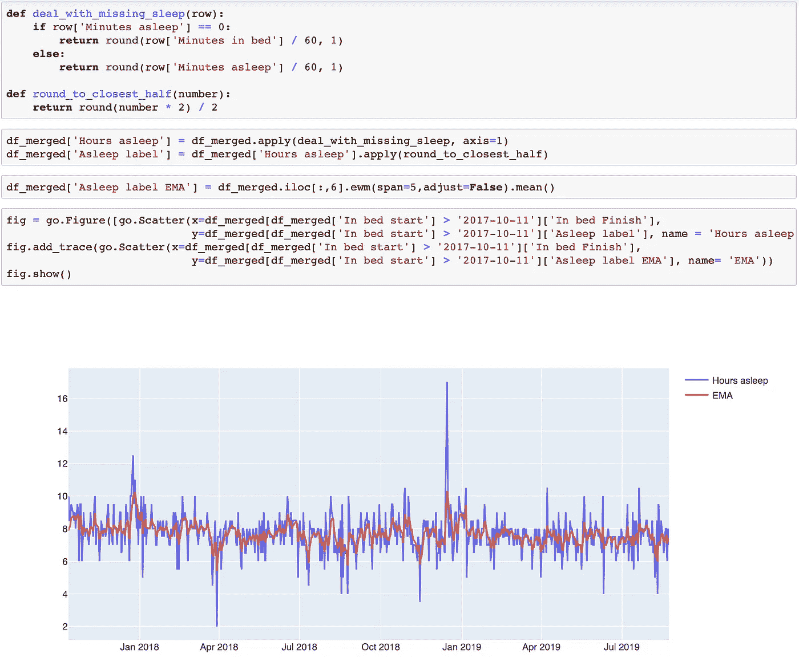
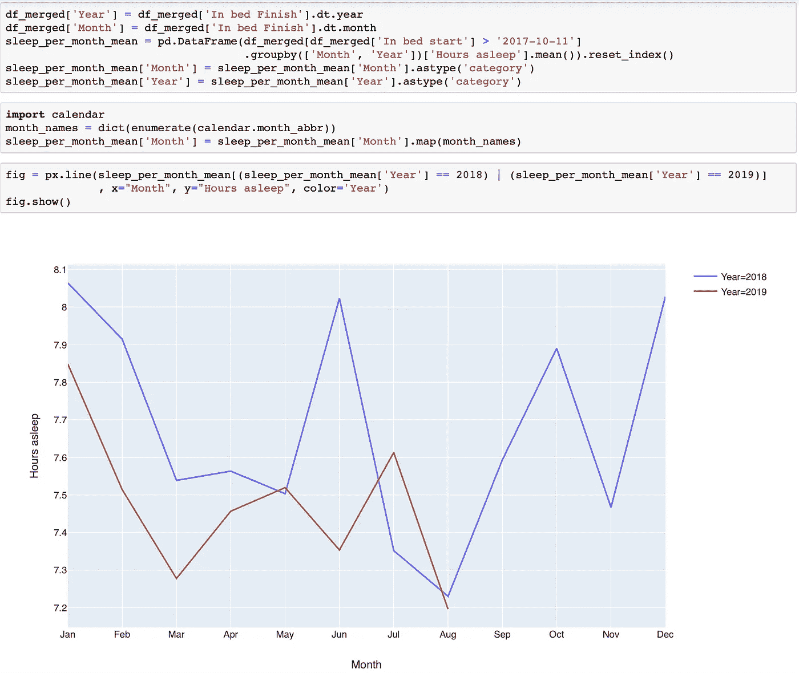

# 睡眠模式:探索性数据分析

> 原文：<https://towardsdatascience.com/sleeping-patterns-exploratory-data-analysis-de3a59c676c8?source=collection_archive---------20----------------------->


Photo by [The Creative Exchange](https://unsplash.com/@creativeexchange?utm_source=unsplash&utm_medium=referral&utm_content=creditCopyText) on [Unsplash](https://unsplash.com/search/photos/sleeping?utm_source=unsplash&utm_medium=referral&utm_content=creditCopyText)

## 我这些年收集的睡眠数据分析。

# 介绍

我从 2016 年开始记录我的睡眠时间。一开始，我是在 iPhone 的健康应用程序中手动输入时间。在某个时候，我开始使用一个名为[睡眠周期](https://www.sleepcycle.com)的应用程序，它自动化了整个过程，使之变得更加容易。很长一段时间以来，我一直在努力收集尽可能多的关于我行为模式的数据。我每天都戴着我的 Apple Watch，我痴迷于关闭我的活动环，即使这意味着在雷暴中走更长的路回家。我相信，如果人们能够量化他们的行为，那么他们就可以改变它，过上更健康、更充实的生活。不是每个人都必须这样做，但我认为每个人都应该有这样做的选择。

这篇文章的目的是对我在过去四年中收集的睡眠数据进行探索性的数据分析。

# 数据

如前所述，我已经从我的手机健康应用程序中提取了数据。尽管苹果提供了导出手机上存储的所有健康数据的可能性，但这有点麻烦，因为数据是 XML 格式的。我发现了一种更简单的访问数据的方法，使用 [QS 访问应用](https://quantifiedself.com/about/access/)，它以 CSV 格式生成所有数据。

马克·科斯特在[的这篇好文章](http://www.markwk.com/data-analysis-for-apple-health.html)中详细介绍了如何从苹果健康应用程序中获取数据。

# 我实际上有多少数据？

一旦我有了所有的数据，我打开 Jupyter 笔记本，导入熊猫，问自己:“我实际上有多少数据？”

```
import pandas as pd
df = pd.read_csv("Sleep Analysis.csv")
df.info()
```



我有大约 850 张唱片。为了更好地理解数据，我打印了前五行。

```
df.head()
```



有两个*日期时间*列表示休眠周期的开始和结束。我注意到睡眠时间是以分钟为单位的。有一栏叫做*睡眠周期数*好像代表我晚上有没有醒。我也很好奇在*睡眠周期数*列中有多少记录为零。通过一行代码，我发现有 141 条记录在*睡眠周期数*列中为零，代表大约 15%的数据。数据集的可信度已经在下降。

# 绘制时间序列数据

我采取的下一步是探索当绘制成时间序列数据时数据是什么样子。

我将睡眠期的开始和结束时间转换成日期时间格式。然后，我用 plotly 把数据可视化。

```
df['In bed start'] = pd.to_datetime(df['In bed start'],infer_datetime_format=True)
df['In bed Finish'] = pd.to_datetime(df['In bed Finish'],infer_datetime_format=True)df['In bed start Date'] = df['In bed start'].dt.date
df['In bed Finish Date'] = df['In bed Finish'].dt.dateimport plotly.graph_objects as gofig = go.Figure([go.Scatter(x=df['In bed start'], y=df['Minutes in bed'])])
fig.show()
```



All the data plotted

我立即注意到两件事:2017 年缺少很多数据，而且有很多向下的峰值。

我很失望地看到，我已经在 2016 年底停止收集数据，但我对此无能为力。另一方面，尖峰信号是可以研究的。我放大了这个图，看看尖峰信号发生在哪里，并意识到它们发生在我早上醒来时，关掉了闹钟，但后来决定多睡一会儿，并设置了一个新的闹钟。本质上，尖峰代表重复的日期。在下图中，行 771 和 772 说明了这一点。那天早上我 7:12 醒来，做了一个小时的事情，然后又睡了一个小时。



Example of record duplication

我发现我有 38 个重复的记录。为了消除尖峰信号，我决定合并重复的记录。

```
aggregation_functions = {
'In bed start': 'first', 
'In bed Finish': 'last', 
'Minutes in bed': 'sum', 
'Minutes asleep': 'sum', 
'Time to fall sleep': 'sum'
}
df_merged = df.groupby(df['In bed Finish Date']).aggregate(aggregation_functions)
```

合并重复的行并绘制数据后，绘图看起来更平滑了。



Data without duplicate dates

一旦我有了时间序列图，我决定专注于 2017 年 gap 之后开始的数据，因为 2016 年我主要是手动插入数据。我将睡眠的分钟数转换成睡眠的小时数，并四舍五入到最接近的一半，比如 7.5 或 8 小时。之后，我再次绘制了数据。



Data of the last two years with a trend line

我用指数移动平均线(EMA)在图的中间画了一条趋势线。均线通常被用来模拟价格波动的趋势。

虽然这有助于了解在大多数晚上，我大约睡了 7.5 到 8 个小时，但在这个图表中仍然有太多的噪音。为了更清楚地了解我过去几年的睡眠时间，我决定绘制 2018 年和 2019 年的月平均值。



Amount of time I have slept on average

除了 7 月，2018 年我睡的时间更长。这是因为自 2018 年以来，我花了五分钟到达我的办公室，而自 2019 年初以来，我每天早上通勤一小时。这两年的开始都很有希望，尽管在这两种情况下，我的睡眠时间一直在减少，直到三月份。我无法解释 2018 年 6 月的加息。在这两年的八月，我都有假期，所以我去了很多地方。这解释了为什么那个月我睡得这么少。

尽管我没有 2017 年的任何数据，但我记得那一年的大多数夜晚我的睡眠时间都不到 7.5 小时。平均而言，可能接近 6.5。结果，大多数下午，午饭后我都在打瞌睡。在 2017 年底读完马修·沃克的《我们为什么要睡觉》后，我意识到睡眠不足给我的健康带来了多大的损害。很高兴我的睡眠习惯有了很大的改善。

# 结论

在这个分析开始时，我以为我有四年的数据，原来我有大约两年的数据。在过去的两年里，我一直努力保持每晚 7.5-8 小时的平均睡眠时间。这一年，我在这方面一直没有成功。

我仅仅触及了这个数据集的表面。将来，我可以看看我睡觉的时间，以及一周中的每一天是如何影响我的睡眠节奏的。

所有的代码都可以在我的 Github repo 中获得，但是我选择不公开这些数据，至少现在是这样。