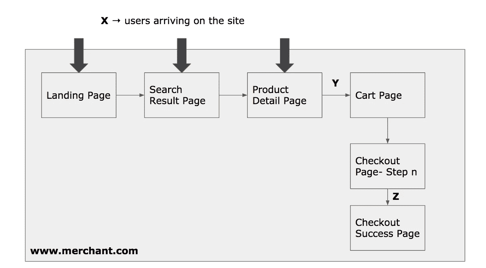
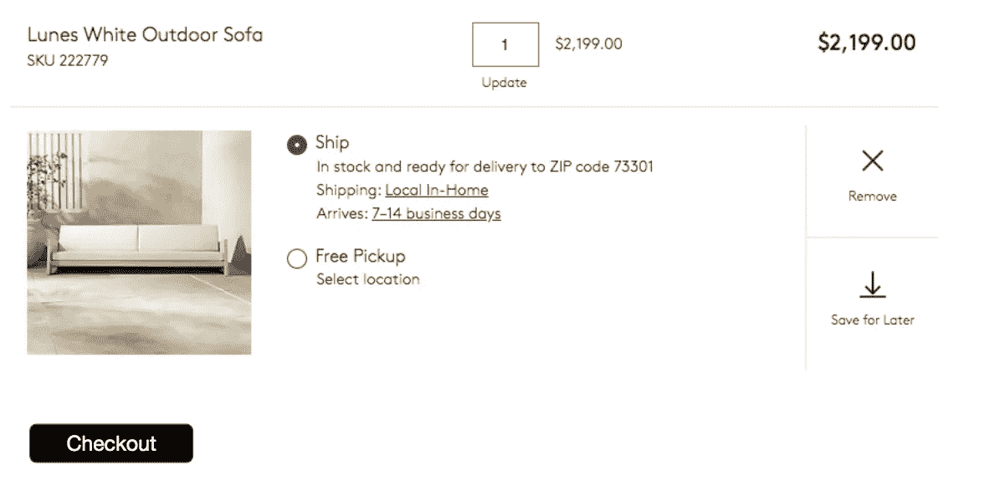
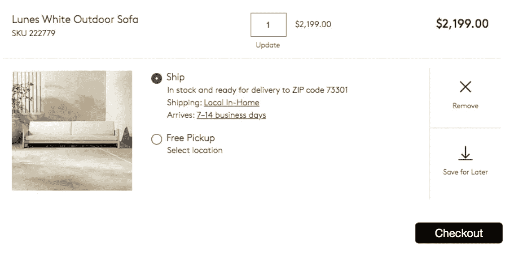
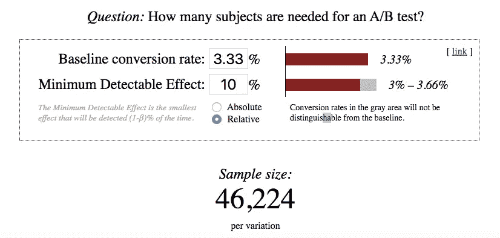
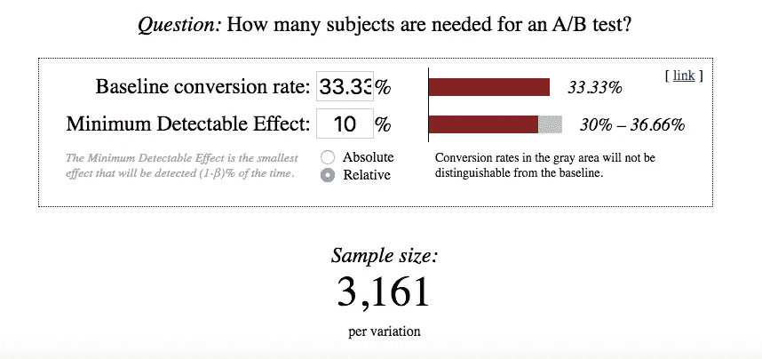
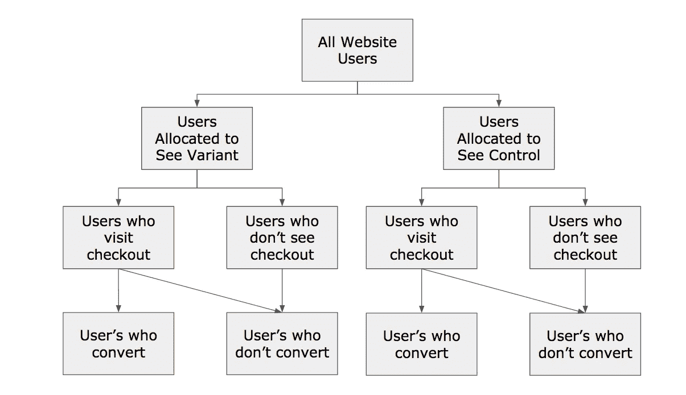
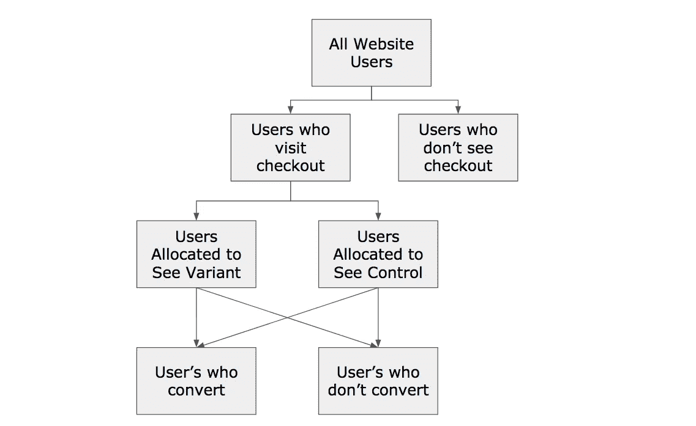

# 如何在 A/B 测试中分割流量

> 原文：<https://towardsdatascience.com/smart-a-b-test-design-understanding-test-exposure-85ee44c897ba?source=collection_archive---------8----------------------->

## 选择当用户登陆你的网站时和当他们接触你的测试时是否分开测试会显著影响你的测试需要多长时间来完成。

Photo by [Austin Distel](https://unsplash.com/@austindistel?utm_source=medium&utm_medium=referral) on [Unsplash](https://unsplash.com?utm_source=medium&utm_medium=referral)

当我开始我的 A/B 测试时，有几件事我只是在表面水平上理解的(我在书上或在线视频上看过的东西)。然而，我很幸运有同事帮助我直观地理解这些想法，包括测试设计背后的基本概念。我在另一篇名为“[A/B 测试背后的直觉——新产品经理初级读本](/the-intuition-behind-a-b-testing-a-primer-for-new-product-managers-6f21dee98533?source=your_stories_page---------------------------)”的文章中写道

一旦我掌握了基础知识，其他技术帮助我优化了测试的设计。在这篇文章中，我将讨论其中的一种技术——测试曝光。

理解“测试暴露”是必不可少的，因为它有助于以一种能帮助你更快得到结果的方式来设计测试。

## 我们去购物吧！

我们从一个简单的例子开始。想象你的产品是一个让用户购买家具的网站[*【www.merchant.com】*](http://www.merchant.com)。下图解释了用户如何浏览网站的各个部分。

**X** 指的是在任何一个**登陆页面到达你的网站的用户总数。Y** 是访问购物车页面**的用户数量。Z** 是在购物车页面*点击结账*进入结账流程**的人数。**

让我们假设下面的数字反映了 X、Y 和 z 的值。

X =每天 12，000 个独立用户(上个月的平均值)

Y =每天 1，200 个用户(或 10%的登录用户向购物车添加东西并访问他们的购物车)

Z =每天 400 个用户(所有访问网站的用户中有 3.33%最终购买了一些东西。或者，33.33%开始结账的用户最终购买了该商品。)

## 测试假设

假设您的购物车页面如下所示:

Shopping cart page. Screenshot lifted from the site cb2.com and then doctored to illustrate the example.

假设您的设计团队提出了一个测试假设:

> 在与人们如何阅读有关的研究中，他们期望一个让他们前进的动作出现在右侧，一个让他们回到左侧的动作。通过将结账按钮向右移动，我们可以将我们网站的转化率提高 10%，因为那些因为找不到结账按钮而可能不会转化的人不会轻易找到结账按钮。

所以，你想出了下面的设计作为你的变体。

## 让我们看看测试细节和设置

测试设计者的下一步是确定如何在控制组和变量组之间划分流量。你有两个选择:

1.  *选项 1* :当用户第一次登陆网站时，将他们分配到控制组或变量组。
2.  *选项 2* :当用户第一次进入购物车页面时，将他们分配到控制组或变量组。

你必须做出这个决定，如果你是 A/B 测试的新手，你会想

> 真的有区别吗？

## 估计样本量

为了回答前面的问题，让我们来评估一下您需要的样本集的大小。为了回答这个问题，我们将使用[埃文·米勒的优秀 A/B 测试样本量计算器](https://www.evanmiller.org/ab-testing/sample-size.html)。我们将使用 0.05 的**显著性阈值**的标准值和 80%的**幂**

**选项 1 的样本量**

也就是说，每个变体需要 46，224 个用户，或者大约 92，448 个独立用户进入网站。

**选项 2 的样本量**

也就是说，每个变体需要 3，161 个用户，或者 6，322 个用户进入购物车。如果访问网站的所有用户中有 10%最终进入购物车，那么要让 6，322 个用户进入购物车，就需要 63，220 个用户进入网站。

## 让我们比较一下这两个选项

*   选项 1:当新用户登陆任何网站时，需要 92，448 个用户来分流流量。
*   选项 2:当一个新用户进入购物车(在那里设置了测试)时，需要 63，220 个用户来分流流量。

与方案 2 相比，方案 1 需要多 46.23 %的用户。选项 2 更优越，因为它更快地检测到相同的结果，从而加快了测试速度。

## 但是等等？怎么会这样呢？

当我第一次发现这个问题时，我的反应是一样的。

> 在其他一切保持不变的情况下，仅仅改变将用户分配到变量和控制桶中的方式，怎么可能改变测试参与者的数量呢？

为了找出原因，我做了一些网上调查，以下是我所了解到的。要理解这一点，你必须绘制出用户流，并确定哪些用户属于“转换用户”和“非转换用户”这两个类别

**选项 1**

Splitting users into control and variant groups upon landing on the website

请注意，不转换的人群由进入结账流程的人和不进入的人组成。埃文·米勒称后者为“累赘”。

在上面的方案中，有很大的自重。因此,“信号”与“噪声”的比率较低，您将需要更多的样本，导致测试结果较慢(正如您在上面的计算中看到的)

**选项二**

Splitting users into control and variant groups only after they enter the checkout flow

在这个方案中，没有自重。因此,“信号”与“噪声”的比率将会很高，您将会更快地看到您的测试结果(正如您在上面的计算中所看到的)

直观地看，与方案 2 相比，方案 1 的静重量取决于两个因素:

1.  P1——你从进入网站到成功购买的转化率。在我们的例子中是 3.33%。数字越大，选项 2 和选项 1 越相似。
2.  P2——你从购物车到成功购买的转化率。在我们的例子中是 33.33%。这个数字越大，选项 1 和选项 2 就越不相似。

与选项 1 相比，通过选项 2 设计测试的效率增益(通过运行测试所需的更少数量的用户)计算如下

E = (1 — P1) / (1 — P2)

为了更精确地解释这一点，请随意挖掘[细节](https://www.evanmiller.org/lazy-assignment-and-ab-testing.html#appendix)。

## 所以，回来测试曝光？

测试暴露指的是在用户旅程中的正确时刻将用户分成控制组和变量组的概念。正确的时刻是当用户看到 100%展开的修改后的设计时。

## 总结和要点外卖

1.  确定你的漏斗中的测试暴露点。
2.  从这一点出发，确定您的测试指标的基本速率。
3.  在给定测试假设的情况下，确定测试指标的提升。
4.  使用您正在测试的基本费率和提价的值相应地计算样本量。
5.  实现您的测试，以便在测试暴露时将用户分成控制组和变量组。

## 学分:

我要感谢来自 VRBO 的同事 Stas Blade 向我介绍了这个特定的概念，并感谢 Evan Miller 出色的样本大小计算器和他在 A/B 测试主题上的思想领导力。

**关于我** : [Aditya Rustgi](https://www.linkedin.com/in/adityarustgi/) 是一名产品领导者，在电子商务和旅游行业的多边市场和 B2B Saas 商业模式方面拥有超过 15 年的产品和技术领导经验。最近，他是 Expedia 公司 VRBO 的产品管理总监。