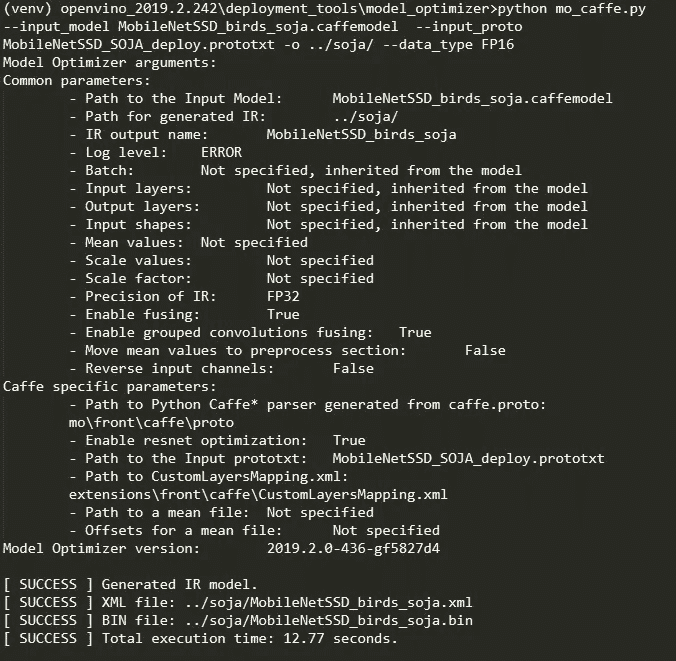

# 智能观鸟者——定制预训练的人工智能模型，以检测感兴趣的鸟类

> 原文：<https://towardsdatascience.com/smart-bird-watcher-customizing-pre-trained-ai-models-to-detect-birds-of-interest-dca1202bfbdf?source=collection_archive---------11----------------------->

随着基于人工智能的框架和技术的快速发展，以检测、分类和预测广泛的主题，人们可以预计开发者将更容易将自己的想法带到现实中。然而，由于有许多可用的选项，当你有令人兴奋和新奇的想法时，决定哪一个符合需要以及从哪里开始是一个耗时的过程。在这里，我希望我可以为一个项目设计一个循序渐进的教程，它的每一部分都可以被不同的框架使用/替换，作为一个起点。

我喜欢在我们的小阳台上种植几乎所有的东西，从橙子到鳄梨籽。最近，我注意到我们的阳台吸引了两种鸟类:

1.  蜂鸟只是来阳台看几秒钟，我很想知道它们什么时候在附近欣赏它们，并可能给它们拍一张漂亮的照片(哦！查看我的 [Instagram](https://www.instagram.com/sojarts/?hl=en) :D)
2.  还有**蓝松鸦**，它们喜欢在我的花盆里挖掘、隐藏和收获不同的东西，带走一些纪念品，通常会留下一堆垃圾。所以，我也爱知道他们在身边的时候让他们知道谁是阳台的老板！:D

经过几次失败的尝试后，我想到了一个聪明的鸟类观察者的主意，当这两只感兴趣的鸟中的任何一只在附近时，它可以以某种方式通知我。下图是我如何想象这个系统的:


因此，对于那些可能对这种系统感兴趣的人，我整理了这个动手教程，其中我将涵盖这个智能观鸟系统的不同元素，以及可以重复用于许多类似想法的具体但足够通用的组件。该系统具有以下组件:

1.  **检测模型:**我利用预先训练的检测模型(例如 [MobileNet-SSD](https://github.com/chuanqi305/MobileNet-SSD) )来加强我在开发特定检测模型方面的努力(专注于两种特定的鸟类——蜂鸟和蓝鸟)
2.  **输入数据:**提供来自环境的输入的传感器。我使用了一个[英特尔 RealSense](https://amzn.to/2pYGgEc) (鉴于其感知深度的能力)以及一个罗技网络摄像头( [C525 型号](https://amzn.to/2pd5LB1))——***没有网络摄像头？*** 不用担心，您可以将视频文件传送给模特。
3.  **处理硬件:**在本教程中，我使用了[英特尔 AI devKit](https://software.intel.com/en-us/ai/on-pc/devkit) (亚马逊上的[)，这是](https://amzn.to/32GYo2s)[英特尔](http://intel.com)通过学生大使计划慷慨提供的。(了解更多关于该计划的信息[在这里](https://software.intel.com/en-us/ai/ambassadors)，你也可以得到你的！)或者你可以考虑有一个[神经计算棒](https://amzn.to/2qVoGAM)，如果你在本教程中使用的是上图所示的[树莓派](https://amzn.to/2NNfdV9)元素。
    “这篇博客文章是英特尔学生
    大使竞赛的一部分。”


AI on the PC Development Kit — [read more](https://software.intel.com/en-us/ai/on-pc/devkit)

有了所有必要的元素，我将构建这个系统所需的步骤划分如下:

1.  **从网络摄像头读取数据**
2.  **加载预训练模型，并将其应用于步骤 1 的帧上**
3.  **启用系统语音命令**(只是为了更上一层楼:D)
4.  **重新训练模型以满足我的需求**(特别是帮助它发现它看到的是哪只鸟)

在接下来的部分中，我将详细解释上面的每个步骤。如果你向下滚动，或者看右边滚动条的大小，你可能会被吓到！但是…很简单…只要不往下看…

# 0.开始之前—源代码

在我们开始之前，我建议在你的系统中启动一个新的 Ubuntu 虚拟机，在上面安装 python 和 pip，然后开始这个教程。因为没有它们，你不能复制这些步骤，否则你可能会扰乱你的工作环境。

1.  [这里下载](https://www.virtualbox.org/)虚拟盒子<

2.从这里下载 [Ubuntu“桌面”镜像](https://ubuntu.com/download/desktop)(确保选择一个离你的位置近的镜像以获得最高速度> [镜像列表](https://launchpad.net/ubuntu/+cdmirrors?_ga=2.54177775.690139774.1573777853-393755315.1573777853) <)

3.创建新的虚拟机:

—如果你能负担得起，让它的硬盘大于 15GB
—从机器>设置>系统>处理器菜单尽可能增加虚拟机的 cpu 内核数量。

然后在上面安装 Ubuntu。最后，打开一个终端(ctrl+alt+t)并安装所需的包:

```
sudo apt-get update
sudo apt-get upgradesudo apt-get install -y git python3.6 python3-pip vim tree portaudio19-dev python-pyaudio python3-pyaudio
```

> 在你继续之前，我建议你从你的虚拟机的硬盘文件中复制一份，以防万一你想重新开始，你就不必再安装 Ubuntu，更新它，再安装那些软件包了！

4.然后，创建一个文件夹，我称之为观鸟者，这将是我们现在的工作目录:

```
cd ~/Documents/
mkdir BirdWatcher cd BirdWatcher
git clone [https://github.com/soja-soja/AIBirdWatching.git](https://github.com/soja-soja/AIBirdWatching.git)cd [AIBirdWatching](https://github.com/soja-soja/AIBirdWatching.git)
pip3 install -r requirements.txt
```

> 你也可以在[我的 git 库](https://github.com/soja-soja/AIBirdWatching)中找到本教程的源代码。

**简单的方法——不推荐:**我已经编写了一个脚本，它将安装和配置所有必需的包，并使它对你来说更快更容易，你所要做的就是如下运行它:(不推荐)

```
cd ~/Documents/BirdWatcher/AIBirdWatching/chmod +x setup.sh./setup.sh
```

**更难——但值得推荐:**你可以按照教程的其余部分去理解每一步的作用。

# 1.用 python 从网络摄像头读取数据

这一步是最简单的一步，假设您的系统中安装了 python 和 open-cv，并且连接了网络摄像头，您只需要以下几行代码来传输来自网络摄像头的数据:

```
cd ~/Documents/BirdWatcher/AIBirdWatching/gists/
python3 webcam.py
```

stream frames from webcam and display the output

在代码中，我们打开一个到网络摄像头的连接，从网络摄像头读取第一帧和所有其他帧，显示它们，直到用户按下键盘上的“escape”键。为了成功断开网络摄像头，我们首先释放网络摄像头，然后关闭连接。
为了让框架更有趣，您可以添加文本并在框架上绘制，如下所示:

```
cd ~/Documents/BirdWatcher/AIBirdWatching/gists/
python3 webcam_edit1.py
```

其中我定义了一个新的函数(drawOnFrames)，在它的前 5 行中我指定了我要在框架上画的位置、颜色和字体，然后使用 cv2.rectangle 在框架上画一个框，使用 cv2.putText 我用随机颜色写一条消息。然后，我在显示框架之前的循环中调用这个函数，这样我就可以用随机颜色在我的框架上绘图了:


find more of my shots on [[Flickr](https://www.flickr.com/photos/sojarts/)] or [[Instagram](https://www.instagram.com/sojarts/)]

# 2.加载预训练模型

在这一步中，我们下载一个预先训练好的模型，并应用它来检测来自网络摄像头的图像流中的对象(步骤 1 的输出)。
有许多专门用于对象检测的[预训练模型](https://github.com/tensorflow/models/blob/master/research/object_detection/g3doc/detection_model_zoo.md)，您可以也鼓励您尝试它们，检查它们的准确性和处理时间，以便找到符合您需求的模型。这里，我们重点关注 [MobileNet-SSD 网络](https://github.com/weiliu89/caffe/tree/ssd)的 21 个通用类(例如，鸟、人、车……)。

为了将模型应用到我们从网络摄像头获取的帧上，我们需要模型权重和配置，因此使用以下文件:> [deploy.prototxt](https://github.com/chuanqi305/MobileNet-SSD/blob/master/deploy.prototxt) <和>[mobilenet _ ITER _ 73000 . caffemodel](https://github.com/chuanqi305/MobileNet-SSD/blob/master/mobilenet_iter_73000.caffemodel)<)获取它们:

```
cd ~/Documents/BirdWatcher/
git clone [https://github.com/chuanqi305/MobileNet-SSD.git](https://github.com/chuanqi305/MobileNet-SSD.git)cd ~/Documents/BirdWatcher/AIBirdWatching/gists/
python3 apply_SSD.py
```

Applying MobileNet_SSD model on a frame

我们首先在前 18 行中加载模型，然后定义一个应用模型的函数，决定哪些预测有足够的信心，然后使用我们之前学习的绘图技巧，在屏幕上显示结果。输出如下所示:


find more of my shots on [[Flickr](https://www.flickr.com/photos/sojarts/)] or [[Instagram](https://www.instagram.com/sojarts/)]

搞定了。已经有趣和有益的项目。在这里，您可以尝试不同的阈值，以确保模型没有大声思考和报告任何低置信度的发现，并决定您希望如何呈现检测到的元素。

# 3.语音命令已启用

过了一会儿，我想如果我问系统“你看到了什么？”它回答说“我有 90%的把握看到一只鸟”。会很酷，对吧？让我们实现它吧。

为了实现上述场景，我们需要两个模块:

1)语音到文本模块，用于收听命令“你看到了什么”并将其转换成文本

2)文本到语音读出检测对象(模型的输出)

对于第一个模块，我们需要以下内容:

```
cd ~/Documents/BirdWatcher/AIBirdWatching/gists/
python3 text_to_voice.py
```

Converting voice to text

对于第二个模块，我们考虑这些代码:

```
cd ~/Documents/BirdWatcher/AIBirdWatching/gists/
python3 voice_to_text.py
```

Converting text to voice

上面的代码是不言自明的，但是如果你需要更多的解释或者任何澄清，请在评论中告诉我。

# 4.重新训练预训练模型

我们将深入探讨这一过程。要重新训练预训练的模型，您需要完成以下步骤:

1.  用于培训和测试的数据收集，并标记收集的数据
2.  使用标记的收集数据重新训练模型

这里的问题是，我该怎么办，从哪里开始？我给你几个提示…

# 4.1.数据收集和标记

要收集一个新的训练数据集，你可以大概可以依靠公开可用的数据集>[查看这个列表](http://deeplearning.net/datasets/) <。例如，出于我的目的，我可以使用[加州理工学院鸟类 200 数据集](http://www.vision.caltech.edu/visipedia/CUB-200.html)。此类数据集为您提供了图像和标签，因此它们涵盖了前 2 个步骤，但是，您可能需要做一些预处理，以确保标签在您需要的文件夹结构和文件结构中。

如果出于某种原因，你想手动收集自己的数据集，另一个选择是从 [Google images](http://images.google.com) 下载几张与我的标签(蜂鸟和蓝鸟)相关的图片。我选择了第二个选项，因为我可能无法为我未来的项目找到数据集(假设你想在下一个项目中检测你的 [Roomba](https://amzn.to/32N08Ht) ！).
为此，我使用了这个[回购](https://github.com/hardikvasa/google-images-download)。它是有能力的，并且有很好的文档记录，您可以选择 CLI 和 python 内嵌使用。按照以下方式安装:

```
cd ~/Documents/BirdWatcher/ 
git clone [https://github.com/hardikvasa/google-images-download.git](https://github.com/hardikvasa/google-images-download.git)cd google-images-download && sudo python3 setup.py install
```

使用如下命令，我为每只鸟获得了 10 张图像:

```
mkdir ~/Documents/BirdWatcher/DownloadedImages/googleimagesdownload --keywords "hummingbird" --limit 10 -o ~/Documents/BirdWatcher/DownloadedImages/
```

注意:如果你想下载超过 99 张图片，那么你必须使用 chromeDriver，你可以使用下面的代码下载(或者从>[这里](https://chromedriver.storage.googleapis.com/78.0.3904.105/chromedriver_linux64.zip) <)并把地址传给代码:(更多例子点击[这里](https://google-images-download.readthedocs.io/en/latest/examples.html))

```
cd ~/Downloads
wget [https://chromedriver.storage.googleapis.com/78.0.3904.105/chromedriver_linux64.zip](https://chromedriver.storage.googleapis.com/78.0.3904.105/chromedriver_linux64.zip)unzip chromedriver_linux64.zipgoogleimagesdownload --keywords "hummingbird" --limit 100 --chromedriver ~/Downloads/chromedriver --format jpg -o ~/Documents/BirdWatcher/DownloadedImages/googleimagesdownload --keywords "blue jay" --limit 100 --chromedriver ~/Downloads/chromedriver --format jpg -o ~/Documents/BirdWatcher/DownloadedImages/
```

> **注意**:如果最后两个命令很快完成，检查文件夹或输出并确保图像已下载！有时，由于连接问题、谷歌速度限制等，你需要多次运行最后两个命令(通常是 1 或 2 次)来下载图片..

接下来，我们需要标记图像。我用过 LabelIMG(这里 <找到它>[)。](https://github.com/tzutalin/labelImg)

```
sudo apt-get install -y pyqt5-dev-toolscd ~/Documents/BirdWatcher
git clone [https://github.com/tzutalin/labelImg.git](https://github.com/tzutalin/labelImg.git)cd labelImgsudo pip3 install -r requirements/requirements-linux-python3.txt
make qt5py3# Then run as follows:
python3 labelImg.py ../DownloadedImages/hummingbird/ ../AIBirdWatching/BirdWatcher/pre_defined_labels.txt# and then:
python3 labelImg.py "../DownloadedImages/blue jay/" ../AIBirdWatching/BirdWatcher/pre_defined_labels.txt
```

最后两个命令将打开“hummingbird”和“blue jay”目录中的所有文件，确保分别打开和标记每组图像的所有文件，并使用预定义的标签，这些标签将在您绘制一个框后显示。以下是您需要的键盘快捷键:

> 按下 **w** 使盒子制作工具激活，然后在主题周围创建一个盒子，选择标签，然后按下**空格键**保存标签文件。按 **d** 进入下一幅图像，或按 **a** 返回。虽然这是一个简单的过程，但很快你将需要一杯咖啡和一些休息来完成这个过程。


# 4.2.重新训练预训练模型

现在，为 eeee 的“再训练一步”鼓掌！我发现> [这个](https://tolotra.com/2018/09/15/how-to-retrain-ssd-mobilenet-for-real-time-object-detection-using-a-raspberry-pi-and-movidius-neural-compute-stick/) <教程很有用，也很神奇，但是，当我浏览它的时候，我遇到了一些问题，我想你可能也喜欢另一个叙述，我总结了我浏览这个教程的步骤。

我们按照以下步骤重新训练模型:

1.  **将文件放入正确的结构中**

我们将制作以下结构:


```
cd ~/Documents/BirdWatchermkdir MyDataset
mkdir MyDataset/bird_dataset
mkdir MyDataset/bird_dataset/Images
mkdir MyDataset/bird_dataset/Labels
mkdir MyDataset/bird_dataset/Videos
mkdir MyDataset/bird_dataset/Structure
```

然后将所有图像复制到图像目录和标签(*。xml 文件)放入标签文件夹:

```
cd ~/Documents/BirdWatcher/DownloadedImages/
# where the images you have downloaded and labeled are...cp */*.jpg ~/Documents/BirdWatcher/MyDataset/bird_dataset/Images/
cp */*.xml ~/Documents/BirdWatcher/MyDataset/bird_dataset/Labels/
```

现在创建用于训练和测试的文件列表鉴于训练数据点的数量很少，我使用 all 进行训练，all 进行测试，您可以为每个标签添加更多照片，并将其分成 80%和 20%分别用于训练和测试，方法是从文件中移除线条或编辑 python 文件:

```
cd ~/Documents/BirdWatcher/AIBirdWatching/gists/
python3 trainval_creator.pycp ~/Documents/BirdWatcher/AIBirdWatching/BirdWatcher/MyDataset/bird_dataset/labelmap.prototxt ~/Documents/BirdWatcher/MyDataset/bird_dataset/
```

上面的代码将把两个文件 *trainval.txt* 和 *test.txt* 放到*my dataset/bird _ dataset/Structure*中:


**2。点击** **<** 从> [**下载 caffe 和文档**](https://github.com/weiliu89/caffe/tree/ssd)

```
cd ~/Documents/BirdWatcher/git clone --branch ssd --depth 1 [https://github.com/weiliu89/caffe.git](https://github.com/weiliu89/caffe/tree/ssd/scripts)## or get INTEL OPTIMIZED CAFFE
# git clone [https://github.com/intel/caffe.git](https://github.com/intel/caffe.git)
## in that case do the following:
# sudo apt-get install -y python3-venv# python3 -m venv env
# source env/bin/activate 
# caffe/scripts/prepare_env.sh cd caffe 
export CAFFE_ROOT=$(pwd)# add this in your ~/.bashrc so you dont have to do this after each restart or system shutdown:echo  export CAFFE_ROOT=$(pwd) >> ~/.bashrc
```

然后，在您继续之前，我们需要安装 caffe。您主要需要以下命令—警告:这将需要一些时间(大约 30 分钟)。
(或者你可以从> [这里的](http://caffe.berkeleyvision.org/install_apt.html) <按照安装 caffe 的指示)

```
# for CPU:
sudo apt install -y caffe-cpu# for GPU:
#sudo apt install caffe-cudasudo apt-get install -y build-essential cmake git pkg-config libprotobuf-dev libleveldb-dev libsnappy-dev libhdf5-serial-dev protobuf-compiler libatlas-base-dev libgflags-dev libgoogle-glog-dev liblmdb-dev  python3-dev python-numpy python-scipy libopencv-dev liblapack-dev liblapack3 libopenblas-base libopenblas-dev # libjasper-dev
sudo apt-get install -y --no-install-recommends libboost-all-devcd /usr/lib/x86_64-linux-gnusudo ln -s libhdf5_serial.so.100.0.1 libhdf5.so
sudo ln -s libhdf5_serial_hl.so.100.0.0 libhdf5_hl.soexport PATH_HDF5=/usr/include/hdf5/serial/cd ~/Documents/BirdWatcher/caffecd python
export PYTHONPATH="/usr/lib/python3.6:$(pwd)"export CPATH="/usr/include/hdf5/serial/"
# find the path using the following: 
#find /usr -iname "*hdf5.h*"echo export PYTHONPATH=/usr/lib/python3.6:$(pwd) >> ~/.bashrc
echo export CPATH="/usr/include/hdf5/serial/" >> ~/.bashrc 
```

现在，使用以下命令编辑 Makefile.config 文件。根据您的系统配置，您必须更改许多项目。我们将从我整理的已经调整过的配置文件中复制:

```
cd ~/Documents/BirdWatcher/caffe/cp ~/Documents/BirdWatcher/AIBirdWatching/BirdWatcher/caffe/Makefile.config  ~/Documents/BirdWatcher/caffe/Makefile.config
```

或者如果您想自己编辑它:

```
vim Makefile.config# make required changes to reflect your system environment and 
# then ctrl+v to paste and then press escape and type ":x"
# to save the file and exit
```

还有…这里是有趣的事情开始的地方，:D，我说的有趣是指错误！

```
cd ~/Documents/BirdWatcher/caffe/make all
make py
```

我遇到的主要问题通过安装丢失的包或重命名。所以它正在寻找的库(例如，它正在寻找 X.1.0.1.so，而我有 X.1.4.so，所以我要么找到它们，要么重命名文件以匹配咖啡馆正在寻找的东西——我知道……我知道……但是它工作了)。

```
# For example:# Find the path (I call it PATHX) using the following command:
#find / -name "libhdf5_serial_hl.so"#and then do the following:# cd PATHX
# sudo ln -s libhdf5_serial_hl.so.100.0.0 libhdf5_hl.so
```

我试图在一台新的 Ubuntu 机器上一遍又一遍地重做教程，以确保你将面临最少的错误。然而，如果你在一分钟后阅读它，一个包可能会被更新，从而破坏整个过程！所以耐心点，准备好…

现在，我们所拥有的只是一个工作框架。让我们回到模型上来。从这里下载预训练模型:

首先，我们将一个>[文件](https://github.com/soja-soja/AIBirdWatching/blob/master/BirdWatcher/caffe/data/CustomDataset/create_data.sh) <复制到/caffe/data/文件夹中:

```
mkdir ~/Documents/BirdWatcher/caffe/data/CustomDatasetcp ~/Documents/BirdWatcher/AIBirdWatching/BirdWatcher/caffe/data/CustomDataset/create_data.sh ~/Documents/BirdWatcher/caffe/data/CustomDataset
```

授予我们刚刚创建的文件执行权限，然后运行它:

```
cd ~/Documents/BirdWatcher/caffe/data/CustomDatasetchmod +x create_data.sh
./create_data.sh
```

这将在我们的数据集文件夹中创建新的文件和文件夹，请检查它们:

```
cd ~/Documents/BirdWatcher/MyDataset/bird_dataset/
tree ./
```


现在将 [MobileNet-SSD](https://github.com/chuanqi305/MobileNet-SSD) 克隆到文件夹/caffe/examples 文件夹中，并创建几个到我们之前创建的项目的软链接:

```
cd ~/Documents/BirdWatcher/caffe/examples
git clone --depth 1 [https://github.com/chuanqi305/MobileNet-SSD](https://github.com/chuanqi305/MobileNet-SSD) cd MobileNet-SSDln -s ~/Documents/BirdWatcher/MyDataset/bird_dataset/bird_dataset/lmdb/bird_dataset_trainval_lmdb/ trainval_lmdbln -s ~/Documents/BirdWatcher/MyDataset/bird_dataset/bird_dataset/lmdb/bird_dataset_test_lmdb/ test_lmdbln -s ~/Documents/BirdWatcher/MyDataset/bird_dataset/labelmap.prototxt labelmap.prototxtcp ~/Documents/BirdWatcher/AIBirdWatching/BirdWatcher/caffe/examples/MobileNet-SSD/solver_test.prototxt ~/Documents/BirdWatcher/caffe/examples/MobileNet-SSD/cp ~/Documents/BirdWatcher/AIBirdWatching/BirdWatcher/caffe/examples/MobileNet-SSD/solver_train.prototxt ~/Documents/BirdWatcher/caffe/examples/MobileNet-SSD/cp ~/Documents/BirdWatcher/AIBirdWatching/BirdWatcher/caffe/examples/MobileNet-SSD/train.sh ~/Documents/BirdWatcher/caffe/examples/MobileNet-SSD/cp ~/Documents/BirdWatcher/AIBirdWatching/BirdWatcher/caffe/examples/MobileNet-SSD/merge_bn.py ~/Documents/BirdWatcher/caffe/examples/MobileNet-SSD/cp ~/Documents/BirdWatcher/AIBirdWatching/BirdWatcher/caffe/src/caffe/util/math_functions.cpp ~/Documents/BirdWatcher/caffe/src/caffe/util/
```

现在我们使用下面的命令来生成“training prototxt”。它需要类的数量作为参数。一定要把背景算作一门课。在我们的例子中，我们有 3:

```
cd ~/Documents/BirdWatcher/caffe/examples/MobileNet-SSD./gen_model.sh 3
```

尽管没有输出！成功运行之后，应该在 example/文件夹中创建用于部署、训练和测试的 prototxt:

```
ls -al ~/Documents/BirdWatcher/caffe/examples/MobileNet-SSD/example
```


你准备好了吗？我们希望使用以下命令开始训练:

```
cd ~/Documents/BirdWatcher/caffe/examples/MobileNet-SSD./train.sh
```

每走 1000 步或使用 CTRL+C 停止训练时，caffe 会自动在“*快照/”*文件夹中保存一个快照。

要在特定的检查点恢复训练，请在您的 **train.sh 中使用以下代码行，而不是以“-weights=…”开头的代码行:**

```
#../../build/tools/caffe train -solver="solver_train.prototxt" \#-snapshot snapshot/mobilenet_iter_1000.solverstate \
```

编辑“1000”以反映您上次停止训练的时间。不确定？看看这个

最后一步…我保证！我们将为部署和 boom 生成模型！为此，请使用/snapshot/文件夹中快照的文件名，然后运行以下命令:

```
cd ~/Documents/BirdWatcher/caffe/examples/MobileNet-SSDpython3 merge_bn.py snapshot/$(ls snapshot|grep caffemodel| tail -n 1)# for example: 
# python3 merge_bin.py 'snapshot/mobilenet_iter_2242.caffemodel'
```

# 测试重新训练的模型

现在，您需要提供您重新训练的模型作为输入模型，并将其应用于来自网络摄像头的帧流:

```
cd ~/Documents/BirdWatcher/AIBirdWatching/gists/python3 [Run.py](https://github.com/soja-soja/AIBirdWatching/blob/master/Run.py) -mc "~/Documents/BirdWatcher/caffe/examples/MobileNet-SSD/[MobileNetSSD_birds_soja.caffemodel](https://github.com/soja-soja/AIBirdWatching/blob/master/re-trained_Model/MobileNetSSD_birds_soja.caffemodel)" -p "~/Documents/BirdWatcher/caffe/examples/MobileNet-SSD/example/[MobileNetSSD_deploy.prototxt](https://github.com/soja-soja/AIBirdWatching/blob/master/re-trained_Model/MobileNetSSD_deploy.prototxt)"
```

仍然没有得到你想要的结果？遵循下一部分…

# 改善结果

根据您为训练设置的时间、每个标签的训练数据的质量和数量，您可能会得到一个不令人满意的模型。但是在所有这些努力之后…不推动它前进是令人沮丧的！

我可以与您分享的一个变通方法是，您拥有的通用模型能够将元素标记为宽泛的类别:汽车、鸟……而我们经过重新训练的模型擅长标记特定的鸟种。明白了吗？

那么，如果我们考虑一个混合两级模型；我们将 MobileNet-SSD 模型应用于帧，并寻找一只鸟，当我们找到任何鸟时，我们应用第二个模型来确定它是哪个物种！boOoM！这个想法大概是这样的:

通过这种方式，我们可以提高准确性并展示我们的工作:D 使用额外的参数“-d hybrid”和“-mb”再次运行代码，该参数指向 MobileNet-SSD 的 73000 次迭代:

```
python3 Run.py  -mc "~/Documents/BirdWatcher/caffe/examples/MobileNet-SSD/[MobileNetSSD_birds_soja.caffemodel](https://github.com/soja-soja/AIBirdWatching/blob/master/re-trained_Model/MobileNetSSD_birds_soja.caffemodel)" -p "~/Documents/BirdWatcher/caffe/examples/MobileNet-SSD/example/[MobileNetSSD_deploy.prototxt](https://github.com/soja-soja/AIBirdWatching/blob/master/re-trained_Model/MobileNetSSD_deploy.prototxt)" -d hybrid -mb "~/Documents/BirdWatcher/caffe/examples/MobileNet-SSD/mobilenet_iter_73000.caffemodel"
```

# CPU 很棒，但我们也有 VPU！

现在，为了在 VPU(我们的 AI 开发套件中的 MYRIAD)上运行该模型，我们必须将 caffe 模型转换成可以被英特尔 OpenVINO 推理引擎使用的[优化]版本。

1.  首先你需要安装 OpenVINO toolkit，安装指南[Linux](https://docs.openvinotoolkit.org/latest/_docs_install_guides_installing_openvino_linux.html)[windows](https://docs.openvinotoolkit.org/latest/_docs_install_guides_installing_openvino_windows.html)。

2.转到`<INSTALL_DIR>/deployment_tools/model_optimizer`目录。

3.使用`mo_caffe.py`脚本简单地转换一个带有输入模型`.caffemodel`文件路径的模型:

```
python3 mo_caffe.py --input_model MobileNetSSD_birds_soja.caffemodel  --input_proto MobileNetSSD_SOJA_deploy.prototxt -o ../soja/ --data_type FP16
```



在上面的代码行中，我们提供了输入模型(*。caffemodel)和原型文件(*。prototxt)，我们指定输出目录，如果我们不这样做，它将被放在 mo_caffe.py 的旁边，最后，正如在 [openVINO 文档](http://software.intel.com/en-us/model-optimizer-for-ncs2)中提到的，我们使用 FP16，因为我们将在 MYRIAD(VPU)上使用它:

> 请记住，如果您使用的是 GPU、FPGA 或 VPU (MYRIAD 和 HDDL)设备，请使用 FP16 型号。如果你用的是 CPU 或者 GPU，那就用 FP32 型号。
> 
> [阅读更多](https://software.intel.com/en-us/model-optimizer-for-ncs2) …

现在，我们有了在推理机上运行模型所需的文件。让我们插上电源:

就是这样！

在我的设置中，使用 MYRIAD，推理时间从 0.04-0.06 秒下降到大约 0.026-0.03 秒，这在最好(最坏)的情况下提高了 130% (14%)，为动态应用更复杂的模型留下了空间。

```
python3 Run.py -d MYRIAD -m "<YOUR_OPENVINO_INSTALL_DIR>/deployment_tools/soja/MobileNetSSD_birds_soja.xml"
```


# 我如何将这个项目应用到我自己的项目中？？

嗯，你知道怎么做，简单地改变你感兴趣的对象的所有标签。为此，决定您希望模型跟踪的对象，然后:

1.  为他们下载图像
2.  给图像贴标签
3.  将它们复制到正确的目录结构中
4.  编辑以下文件以反映您的类:
    *~/Documents/bird watcher/my dataset/bird _ dataset/label map . proto txt*
5.  使用正确数量的类(#objects +1)运行“`./gen_model.sh 3`
6.  编辑“Run.py”中的类名

就是这样！我将很高兴听到你的项目…

# 额外:树莓派+神经计算棒——便宜但有效

如果你在这个教程中使用你的[树莓派](https://amzn.to/2NNfdV9)，你也可以得到一个[神经计算棒](https://amzn.to/2qVoGAM)。

如果您决定走这条路，以下资源将帮助您起步:

>[在神经计算棒](https://tolotra.com/2018/09/15/how-to-retrain-ssd-mobilenet-for-real-time-object-detection-using-a-raspberry-pi-and-movidius-neural-compute-stick/#comment-71)
上部署我们预先训练好的模型(滚动到最后一节)

>[神经计算棒启动指南](https://software.intel.com/en-us/articles/get-started-with-neural-compute-stick)


## 希望你在本教程中找到了你想要的东西，很乐意联系和交流想法！在以下位置找到我:

> [领英](https://www.linkedin.com/in/sojaa/)
> 
> [Instagram](https://www.instagram.com/sojarts/)
> 
> [Git](https://github.com/soja-soja)

## 如果你遇到任何问题、错误或议题，你知道在哪里可以在[媒体](https://medium.com/@itsoja)上找到我！