# 逻辑回归智能折扣|从零开始的机器学习(第一部分)

> 原文：<https://towardsdatascience.com/smart-discounts-with-logistic-regression-machine-learning-from-scratch-part-i-3c242f4ded0?source=collection_archive---------7----------------------->

## 向选定的客户发送折扣代码以增加利润


> TL；DR 在这一部分中，您将从头开始使用 Python 构建一个*逻辑回归*模型。在此过程中，您将了解梯度下降算法，并使用它来训练您的模型。

## 从零开始的机器学习系列:

1.  **逻辑回归智能折扣**
2.  [用线性回归预测房价](https://medium.com/@curiousily/predicting-house-prices-with-linear-regression-machine-learning-from-scratch-part-ii-47a0238aeac1)
3.  [用 Python 从头开始构建决策树](https://medium.com/@curiousily/building-a-decision-tree-from-scratch-in-python-machine-learning-from-scratch-part-ii-6e2e56265b19)
4.  [利用 K 均值聚类进行调色板提取](https://medium.com/@curiousily/color-palette-extraction-with-k-means-clustering-machine-learning-from-scratch-part-iv-55e807407e53)
5.  [用朴素贝叶斯进行电影评论情感分析](https://medium.com/@curiousily/movie-review-sentiment-analysis-with-naive-bayes-machine-learning-from-scratch-part-v-7bb869391bab)
6.  [使用随机梯度下降的音乐艺术家推荐系统](https://medium.com/@curiousily/music-artist-recommender-system-using-stochastic-gradient-descent-machine-learning-from-scratch-5f2f1aae972c)
7.  [利用神经网络进行时尚产品图像分类](https://medium.com/@curiousily/fashion-product-image-classification-using-neural-networks-machine-learning-from-scratch-part-e9fda9e47661)
8.  [使用强化学习在后启示录世界中构建一个出租车驾驶代理](https://medium.com/@curiousily/build-a-taxi-driving-agent-in-a-post-apocalyptic-world-using-reinforcement-learning-machine-175b1edd8f69)

假设你正在开发你的网上服装店。你的一些顾客已经付了全价。有些没有。您想要创建一个促销活动，并向一些客户提供折扣代码，希望这可能会增加您的销售额。但是，您不希望向可能会支付全价的客户提供折扣。您应该如何挑选将获得折扣的客户？

***完整源代码笔记本*** (谷歌合作实验室):

[](https://colab.research.google.com/drive/1kmtjoULbyRtAtDPKYlhWSwATLpF7PQd8) [## 物流回收

colab.research.google.com](https://colab.research.google.com/drive/1kmtjoULbyRtAtDPKYlhWSwATLpF7PQd8) 

# 数据

您从数据库、分析包等中收集了一些数据。这是你可能会想到的:

让我们将数据加载到熊猫数据框中:

看一看它:

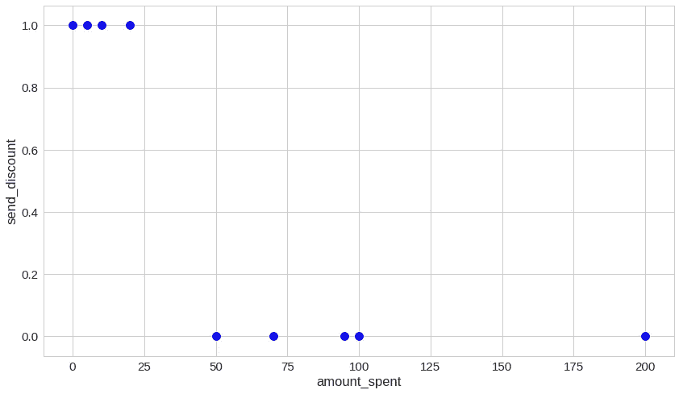

> 注意-显示的数据是您可能拥有的真实数据集的简化。如果您的数据非常简单，您可以尝试更简单的方法。

# 用逻辑回归做决策

当因变量/目标变量为二元时，逻辑回归用于分类问题。即其值为真或假。*逻辑回归*是实践中最流行、最广泛使用的算法之一([见此](https://www.kaggle.com/surveys/2017))。

可以用逻辑回归解决的一些问题包括:

- **电子邮件** —判定是否为垃圾邮件
- **网上交易**-欺诈与否
- **肿瘤分类**-恶性还是良性
- **客户升级**-客户是否会购买高级升级

我们想要预测变量 *y* 的结果，例如:

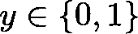

并设置 0:否定类(例如，电子邮件不是垃圾邮件)或 1:肯定类(例如，电子邮件是垃圾邮件)。

## 就不能用线性回归吗？


Source: [machinelearningplus.com](https://www.machinelearningplus.com/)

线性回归是另一个非常流行的模型。它的工作假设是观察到的现象(你的数据)可以用一条直线来解释。

线性回归的响应变量 *y* 在【0，1】区间内*不受*限制。这使得很难根据其输出做出二元决策。因此，不适合我们的需要。

# 逻辑回归模型

考虑到我们的问题，我们想要一个使用 1 个变量(预测值)(`*x_1*`*-amount _ spend*)的模型来预测我们是否应该向客户发送折扣。

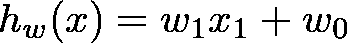

其中系数`*w_i*`是模型的参数。设系数向量`***W***`为:


那么我们可以用更简洁的形式来表示`*h_w(x)*`:

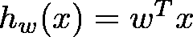

那就是*线性回归*模型。

我们希望构建一个输出值介于 0 和 1 之间的模型，因此我们希望提出一个满足以下条件的假设:

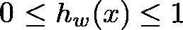

对于 ***逻辑回归*** 我们想要修改它并引入另一个函数 *g* :


我们将把`***g***`定义为:

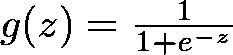

在哪里

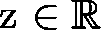

*g* 又称*s 形函数*或*逻辑函数*。替换后，我们得到:

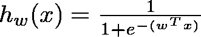

为了我们的假设。

## 仔细观察 sigmoid 函数

直观上，我们将使用 sigmoid 函数“超过”线性回归模型，将其限制在[0；+1].

回想一下，sigmoid 函数定义为:


让我们将其转化为一个 Python 函数:

sigmoid 函数的图形表示:

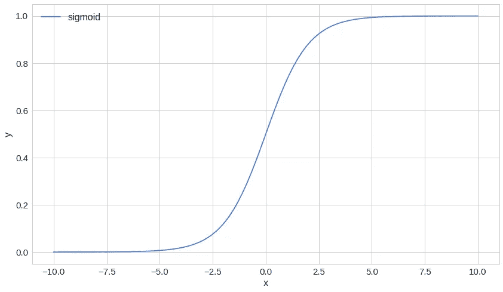

看起来很眼熟吧？注意它收敛到-1 或+1 的速度有多快。

# 我们如何找到模型的参数？

让我们检查一些方法，为我们的模型找到好的参数。但是在这个上下文中，好是什么意思呢？

## 损失函数

我们有一个模型可以用来做决策，但我们仍然需要找到参数`**W**`。要做到这一点，我们需要客观地衡量一组给定的参数有多好。为此，我们将使用损失(成本)函数:

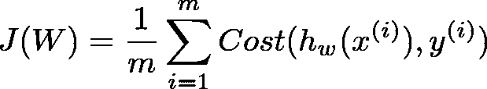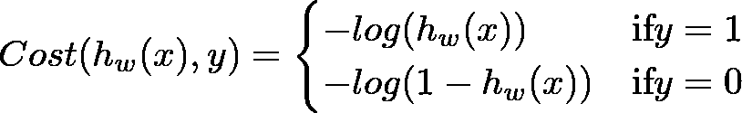

这也被称为[对数损失或交叉熵损失](https://ml-cheatsheet.readthedocs.io/en/latest/loss_functions.html)函数


Source: [https://ml-cheatsheet.readthedocs.io](https://ml-cheatsheet.readthedocs.io)

我们可以把上面的函数压缩成一个:

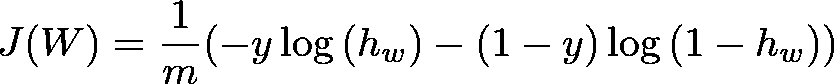

在哪里

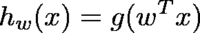

让我们用 Python 来实现它:

## 方法 1——尝试一个数字

让我们想出 3 个数字来表示系数 w0、w1 和 w2。

```
loss: 25.0 predicted: 0.999999999986112 actual: 0.0
```

不幸的是，我很懒，这种方法对我来说似乎有点太麻烦了。让我们看下一个:

## 方法 2——尝试许多数字

好吧，现在的电脑速度非常快，6 核以上的笔记本电脑随处可见。智能手机也可以很有性能！让我们善用这种力量，通过尝试大量数字来找出那些讨厌的参数:

```
0.0 
0.0 
0.0 
6.661338147750941e-16 
9.359180097590508e-14
1.3887890837434982e-11 
2.0611535832696244e-09 
3.059022736706331e-07 
4.539889921682063e-05 
0.006715348489118056 
0.6931471805599397 
5.006715348489103 
10.000045398900186 
15.000000305680194 
19.999999966169824 
24.99999582410784 
30.001020555434774 
34.945041100449046 
inf 
inf
```

令人惊讶的是，我们尝试的第一个参数值使我们的损失为 0。这是你的幸运日还是永远如此？答案留作读者练习:)

## 方法 3——梯度下降

梯度下降算法(是的，有很多)为我们提供了一种寻找某个函数 ***f*** 最小值的方法。它们通过沿梯度定义的下降方向迭代工作。

在机器学习中，我们使用梯度下降算法来为我们的模型(逻辑回归、线性回归、神经网络等)找到“好”的参数。


source: PyTorchZeroToAll

它是如何工作的？从某个地方开始，我们沿着负梯度指定的方向迈出第一步。接下来，我们重新计算负梯度，并在它指定的方向上再走一步。这个过程一直持续到我们不能再走下坡路的时候——一个局部最小值。

好的，但是我们怎样才能找到梯度呢？我们必须找到我们的成本函数的导数，因为我们的例子相当简单。

## sigmoid 函数的一阶导数

sigmoid 函数的一阶导数由以下等式给出:

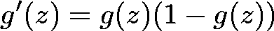

完整的推导可以在[这里](https://math.stackexchange.com/a/1225116/499458)找到。

## 成本函数的一阶导数

回想一下，成本函数由以下等式给出:


考虑到


我们获得成本函数的一阶导数:

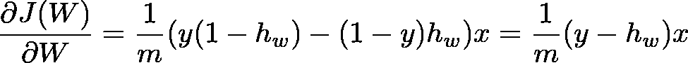

## 更新我们的参数 W

现在我们有了导数，我们可以回到我们的更新规则，并在那里使用它:

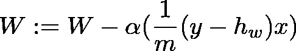

参数`a`被称为*学习率*。高学习率可以快速收敛，但有超过最低点的风险。低学习率允许在负梯度的方向上自信地移动。然而，这很费时间，所以我们要花很多时间去收敛。

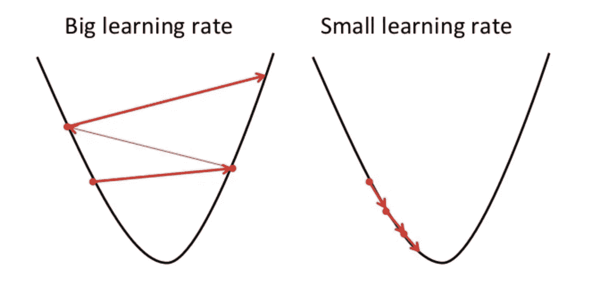

Too big vs too small learning rate (source: [https://towardsdatascience.com/](https://towardsdatascience.com/))

## 梯度下降算法

我们要使用的算法如下:

```
Repeat until convergence {
  1\. Calculate gradient average
  2\. Multiply by learning rate
  3\. Subtract from weights
}
```

让我们用 Python 来做这件事:

关于那个`until convergence part`。你可能会注意到，我们有点蛮力绕过它。也就是说，我们将运行该算法预设的迭代次数。另一个有趣的点是我们的权重`W`的初始化——最初设置为零。

让我们来测试一下我们的实现。但是首先，我们需要一个函数，在给定一些数据`X`的情况下，帮助我们预测`y`(预测我们是否应该根据客户的消费向其发送折扣):

现在进行我们的简单测试:

注意，我们使用`reshape`向`X`添加一个虚拟尺寸。此外，在我们调用`predict`之后，我们对结果进行舍入。回想一下，sigmoid 函数在[0；1]范围。我们将对结果进行四舍五入，以获得 0 或 1(是或否)的答案。

```
run_tests()
```

下面是运行我们的测试用例的结果:

```
F
```

嗯，这并不好，经过这么多的努力，我们还没有达到为我们的模型找到好的参数的目标。但是，哪里出了问题？

欢迎来到您的第一次模型调试会议！让我们从发现我们的算法是否随着时间的推移而改进开始。为此，我们可以使用我们的损失指标:

```
run_tests()
```

除了每 *10，000* 次迭代打印一次训练损失之外，我们几乎复制并粘贴了我们的训练代码。让我们来看看:

```
loss: 0.6931471805599453 	
loss: 0.41899283818630056 	
loss: 0.41899283818630056 	
loss: 0.41899283818630056 	
loss: 0.41899283818630056 	
loss: 0.41899283818630056 	
loss: 0.41899283818630056 	
loss: 0.41899283818630056 	
loss: 0.41899283818630056
loss: 0.41899283818630056F........
```

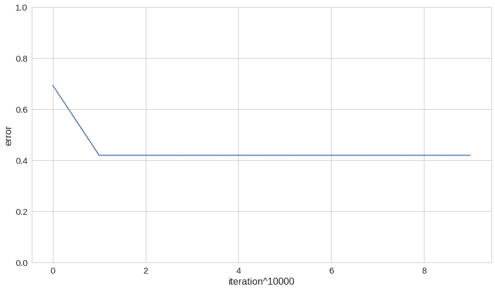

够可疑的是，我们第一次尝试就找到了问题的可能原因！我们的损失不够低，换句话说，我们的算法在某个点卡住了，这个点对我们来说不是一个足够好的最小值。我们如何解决这个问题？也许，尝试不同的学习率或者用不同的值初始化我们的参数？

第一，较小的学习率`a`:

```
run_tests()
```

通过`a=0.001`我们得到这个:

```
loss: 0.42351356323845546 	
loss: 0.41899283818630056 	
loss: 0.41899283818630056 	
loss: 0.41899283818630056 	
loss: 0.41899283818630056 	
loss: 0.41899283818630056 	
loss: 0.41899283818630056 	
loss: 0.41899283818630056 	
loss: 0.41899283818630056 	
loss: 0.41899283818630056F.......
```

不太成功，是吗？为我们的模型增加一个参数来查找/学习怎么样？

```
run_tests()
```

结果是:

```
........
---------------------------------------------------------
Ran 8 tests in 0.686s OK
```

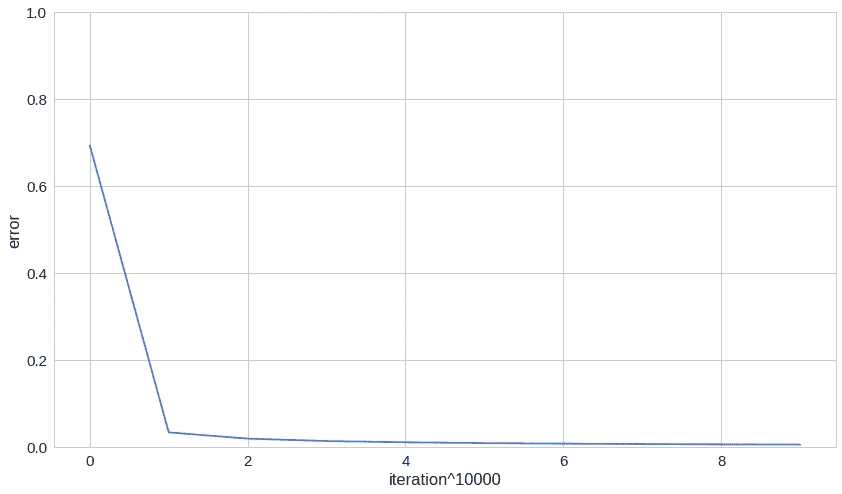

我们在这里做了什么？我们向参数向量 W 添加了一个新元素，并将其初始值设为 1。看起来事情变得对我们有利了！

# 额外收获——打造自己的物流回收器

知道梯度下降的内部工作的所有细节是好的，但是当在野外解决问题时，我们可能会时间紧迫。在这些情况下，一个简单易用的界面来拟合逻辑回归模型可能会节省我们很多时间。所以，我们来造一个吧！

但是首先，让我们编写一些测试:

```
run_tests()
```

我们只是将所有以前编写的函数打包到一个小类中。这种方法的一个巨大优势是我们隐藏了梯度下降算法的复杂性和参数`***W***`的使用。

## 使用我们的回归量来决定谁应该收到折扣代码

既然您已经完成了“难”的部分，让我们使用模型来预测我们是否应该发送折扣代码。

让我们回忆一下最初的数据:


现在，让我们根据从两个新客户那里获得的数据来尝试我们的模型:

```
Customer 1 - $10
Customer 2 - $250
```

```
y_test
```

回想一下，1 表示发送代码，0 表示不发送:

```
array([1., 0.])
```

看起来很合理。愿意尝试更多的案例吗？

您可以在以下位置找到完整的源代码并在浏览器中运行代码:

[](https://colab.research.google.com/drive/1kmtjoULbyRtAtDPKYlhWSwATLpF7PQd8) [## 物流回收

colab.research.google.com](https://colab.research.google.com/drive/1kmtjoULbyRtAtDPKYlhWSwATLpF7PQd8) 

# 结论

干得好！您已经有了一个完整的(尽管简单的)LogisticRegressor 实现，您可以使用它。去吧，玩得开心点！

接下来，您将从头实现一个线性回归模型:)

## 从零开始的机器学习系列:

1.  **逻辑回归智能折扣**
2.  [用线性回归预测房价](https://medium.com/@curiousily/predicting-house-prices-with-linear-regression-machine-learning-from-scratch-part-ii-47a0238aeac1)
3.  [用 Python 从头开始构建决策树](https://medium.com/@curiousily/building-a-decision-tree-from-scratch-in-python-machine-learning-from-scratch-part-ii-6e2e56265b19)
4.  [利用 K 均值聚类进行调色板提取](https://medium.com/@curiousily/color-palette-extraction-with-k-means-clustering-machine-learning-from-scratch-part-iv-55e807407e53)
5.  [用朴素贝叶斯进行电影评论情感分析](https://medium.com/@curiousily/movie-review-sentiment-analysis-with-naive-bayes-machine-learning-from-scratch-part-v-7bb869391bab)
6.  [使用随机梯度下降的音乐艺术家推荐系统](https://medium.com/@curiousily/music-artist-recommender-system-using-stochastic-gradient-descent-machine-learning-from-scratch-5f2f1aae972c)
7.  [利用神经网络进行时尚产品图像分类](https://medium.com/@curiousily/fashion-product-image-classification-using-neural-networks-machine-learning-from-scratch-part-e9fda9e47661)
8.  [使用强化学习在后启示录世界中构建一个出租车驾驶代理](https://medium.com/@curiousily/build-a-taxi-driving-agent-in-a-post-apocalyptic-world-using-reinforcement-learning-machine-175b1edd8f69)

喜欢你读的吗？你想了解更多关于机器学习的知识吗？

[](https://leanpub.com/hmls) [## 从零开始实践机器学习

### “我不能创造的东西，我不理解”——理查德·费曼这本书将引导你走向更深的…

leanpub.com](https://leanpub.com/hmls)