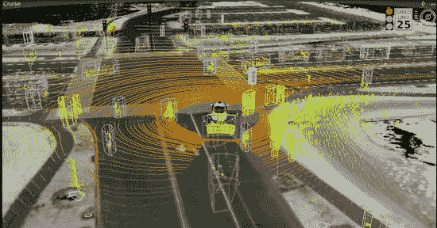
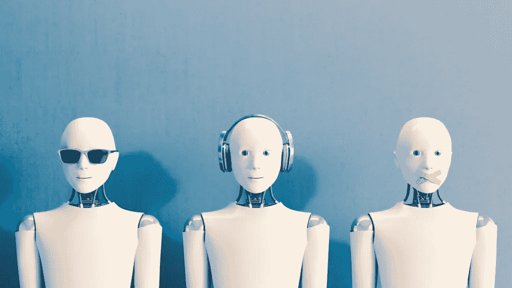

# 智能交互设计是解决人工智能学习问题的正确途径

> 原文：<https://towardsdatascience.com/smart-interaction-design-is-the-proper-way-to-solve-the-learning-problem-in-ai-bdf989f433cb?source=collection_archive---------26----------------------->

## 挑战是人机交互，而不是算法

人工智能(AI)是 21 世纪最热门的术语之一，也是最容易被误解的术语之一。

很多时候，当谈到 AI 时，我们喜欢自动将它与其他术语结合起来，如[机器学习、深度学习和神经网络](https://www.researchgate.net/publication/318900216_Machine_Learning_Deep_Learning_and_AI_What's_the_Difference)。这听起来好像超过 90%的人工智能是这种只有博士才能理解的统计算法。

## 理解人类互动赋予数据意义

虽然自动学习和分类算法对人工智能系统的开发至关重要，但它们只是真正智能的推动者。这些算法对于开发智能是必要的，但还不够。

这意味着，多年来机器学习算法的改进已经使机器能够像人类一样感知世界。然而，要让机器像人一样思考和行动，我们必须到别处寻找答案。

经过几千年的进化，人类发展出了独特的方式来解释和思考这个世界。要让“人工智能”(也就是隐藏在这个术语背后的所有技术)对我们的社会产生重大影响，它不仅必须理解如何像人类一样行动，还必须理解如何像我们一样思考。

不幸的是，虽然信息革命使我们能够收集数 Pb 的数据，了解我们*在某种情况下如何行动*，但却没有收集多少关于我们*如何思考*的数据。这使得不可能正确地训练一个人工智能系统。

## 通过智能交互设计收集有意义的数据

我们需要开始致力于大规模的交互系统，使机器能够与人类快速交流和合作。机器需要开始学习我们如何概念化世界。

这对研究人员和公司意味着，“人工智能”的未来很大一部分在于设计，在于与人类互动和向人类学习的系统能力，以及理解人类的背景——而不仅仅是更强大的 GPU 和算法。需要对与这些系统交互的最终用户的需求和挑战有深刻的理解。

在这篇文章中，我将深入探讨“人工智能”的当前状态(特别是 CV 和最先进的神经网络)，并展示与人类智能相比，这些技术目前的不足之处。

我还将讨论为什么互动学习是人工智能和人类了解我们世界的最佳方式之一，如果不是唯一的方式的话。最后，我们将提供一些关于如何创建这些交互系统的建议，这些系统将最终实现真正的人工智能。

# 目前的人工智能密切模仿人类的思维过程，但在自主学习方面存在不足

市面上的 AI 系统大多模仿心理学中人类的信息处理模型。简单来说，智能系统在三个非常独特的阶段处理信息:**接收、解释和学习。**

# 第一阶段:接待

**接收**是一些受体(如人体的眼睛、耳朵)从环境中接收信号，并将这些信号以处理系统可以解释的格式(电磁信号)发送给处理代理(大脑)的过程。

在人工智能中，这些受体的例子包括特斯拉半自动驾驶汽车上的摄像头，Waymo 汽车上的激光雷达或 Alexa 的远场麦克风。

# 第二阶段:解释

随后是**解释**过程，其中处理代理(大脑)对接收器发送的数据执行三个操作:

1.  它从数据中识别几个相关的对象
2.  然后，它进入参考文献库(人类的记忆)，搜索(对我们来说是未知的“算法”)有助于它识别物体的参考文献，然后识别它们(识别出这个形状是一个苹果)。
3.  基于整个系统的当前状态(对基本需求的评估，如饥饿、疲劳)，处理代理(大脑)确定它接收到的每条信息的重要性，并只向用户呈现通过某个阈值的信息(在人类认知中我们称之为注意力)。我们所有人都经常经历这种认知偏差。例如，当你饿的时候，你可能会注意到周围有更多的食物，并通过闻到一英里外的意大利大蒜的味道而突然产生超能力。

在“人工智能”中，解释通常发生在云上的大型 GPU 信息处理系统中，使用最先进的机器学习算法。

How a Waymo vehicle sees the world

随着机器学习和游戏算法的最新发展(特别是深度神经网络和最近的计算机视觉)，“人工智能”系统可以非常好地识别基于参考体的物体，从而实现自动驾驶汽车等惊人的创新。

然而，我们不能就此停止，因为加工剂使用的参考库是有限的，尤其是在其生命周期的开始阶段(婴儿可能甚至不知道大蒜是什么)。

# 第三阶段:学习

这就是为什么**学习**必须发生，以不断扩大这个系统的参考图书馆，以达到其全部潜力。

如果你看看当前的人工智能研究，这是真正的挑战所在。神经网络非常擅长将情况分类，并根据提供的参数进行优化。然而，在没有人类开发人员帮助的情况下，从头开始创建这些类别或参数所需的数据是完全不可想象的，因此这是非常困难的。

这是因为“人工智能”将世界视为多个纯粹的数学矩阵，并不具备与人类经验产生共鸣的内在能力，除非我们教会它这样做。

在训练这些分类模型的过程中，他们只得到每个特定情况的结果(标签)，而不是导致特定结果的整个思维过程和基本原理，这使得理解变得更加困难。

例如，一个系统可能能够通过编程来识别一个婴儿的图像，但它不会理解为什么首先需要识别一个婴儿的图像，因为创建它的工程师从未向它提供过该信息。这里需要指出的是，我们并不是要开发一个通用的人工智能，而是要优化当前的、专用的“人工智能”系统。

在某种程度上，当前的“人工智能”系统就像一个超级智能的新生婴儿——尽管你可以向它展示世界上所有的知识，但它无法理解世界是如何真正运转的，除非它真正来到这个世界，从经验中学习。

因为它缺乏创建自己的上下文的能力，我们问 Siri 和 Alexa 的大多数命令实际上都是由苹果和亚马逊的工程师手动编程的。这也是为什么亚马逊花费如此大的精力围绕 Alexa 创建一个开放的生态系统，以鼓励公司在其 Alexa 平台上编程技能。正是因为它们如此依赖人类，当前的系统如 Alexa 无法真正开发新的上下文并像人类一样学习。因此，称它们为“人工智能”是不准确的(我知道，我在这篇文章中虚伪地连续使用了这个术语)。

# 智能交互设计是解决学习问题的简单方法

那么，我们如何才能创建一个能够与人类世界产生共鸣的 AI 系统呢？答案相当简单——我们教它与人类互动并提问。

正如我们之前得出的结论，训练任何“人工智能”系统(一种人类交互形式)的最大挑战是缺乏关于人类思维过程的详细、交互级别的数据。

## 人工智能应该专注于数据收集，而不仅仅是数据消费

为了收集这种级别的数据，我们不仅需要提升它作为*数据消费*(使用其他地方生成的数据)代理的角色，还需要提升它作为*数据收集*代理的角色(生成自己的数据集)。

这意味着我们需要以这样一种方式设计人工智能，使它们能够与人类互动，不仅理解人类想要什么，而且理解他们为什么想要它(上下文)。简单来说:就像师傅带徒弟一样，需要边干边学。

为了与人类进行这种程度的互动，我们必须首先转变我们对人工智能的看法。目前，我们认为人工智能是一个无所不能的黑匣子，可以自动解决所有问题，而不需要任何人工输入。

当没有经验的用户第一次尝试一个人工智能系统时(想想 Siri 或 Alexa ),你会经常体验到这种不和谐。但即使在一般情况下，当一个东西是“人工智能”时，你会认为你可以给人工智能一个通用命令，如“Alexa，为我做我的工作”，并期望 Alexa 在我们躺在床上看网飞时为我们管理我们的业务。

## 让我们开始把“AI”想象成一个顾问

当人类顾问与客户互动时，他永远不会把客户拉到一边，告诉他们，“嘿，我们完全理解你的业务需求。我们可以为您尽一切努力改善您的业务，您只需坐在一旁观看。”

相反，他们会花很多时间与客户坐下来，问一些精心设计的问题，以更好地了解客户的需求，并最终与客户合作，创造出满足他们特定需求的解决方案。

一个咨询项目的成功真的取决于一个顾问的能力，他能够找出客户的需求，并根据他们的限制为客户提供最大的价值。

如果这是我们在与人类社会中更聪明的部分互动时坚持的标准，我们就不应该指望人工智能在不与我们互动的情况下自动理解我们的所有需求并提供完美的解决方案。

# 创造一个更具互动性的人工智能

为了让人工智能能够像顾问一样提出智能问题，我们必须大大减少对创建最强大的机器学习算法的强调。相反，我们**应该专注于设计系统，在实现人工智能设计任务的同时，实现人工智能和人类用户之间的最大互动**。

更实际的是，这意味着人工智能产品经理不仅应该专注于雇用擅长算法设计的工程师，还应该招募以人为中心的设计师和了解 ML 的工程师。他们可以与特定人工智能产品的最终用户交谈，并促进互动。工程和设计这两个人的任务是确定人工智能与*和*用户合作的最佳方式，以提高系统自身的智能，从而改善人类用户的生活。

## 人工智能应该为人服务，而不是取代人

本质上，创建交互式人工智能要求人工智能产品经理以理解和*服务*人为目标来构建人工智能，而不是*取代*人。

同样重要是，人工智能的发展必须比现在更加透明。正如设计公司 [IDEO](https://medium.com/@ideo) 在“[给收集我们数据的公司的一个信息:不要忘记我们](https://medium.com/ideo-stories/a-message-to-companies-that-collect-our-data-dont-forget-about-us-bf6fc8acfd2c)中指出的那样，“今天的企业如果想与客户建立信任，就必须为透明度和用户控制进行设计。

目前，许多人工智能公司拒绝向他们的用户揭示幕后实际发生的事情。人们可能会认为，这是因为他们担心竞争对手窃取他们的技术秘密，而是因为他们担心，如果消费者看到一些“人工智能”系统下仍有多少人工操作，用户将对公司失去信任。除此之外，如前所述，ML 系统的本质是，它们在某种程度上是一个黑箱，所以透明性通常是不可能的。

为了实现人工智能技术的最高智能水平，用户必须深入参与设计迭代过程。因此，虽然透明度可能会在短期内损害人工智能产品的早期采用，但更高的透明度对整个人工智能系统的长期好处是无限的。

# 最后的想法

隐藏在人工智能术语下的技术将给我们的日常生活带来巨大的变化。不管你喜不喜欢，人工智能将是未来几十年改变我们劳动力的主要力量。

然而，要让人工智能真正对我们的社会有用，他们不仅需要理解我们人类做什么，还需要理解我们为什么要这样做，而这种学习需要人工智能跳出黑箱，与用户互动。

随着 ML、CV 和其他占主导地位的人工智能技术从学术阶段进入生产阶段，人工智能将越来越不是一个编码问题，而是一个设计问题，在这个问题上，以人为中心、同情最终用户的设计师将发挥关键作用。

最终，我可以看到一个未来的世界，在这个世界中，这些系统和人类和谐共存，每一方都在人类社会中扮演着自己独特的角色。只有到那时，人工智能革命才会给人类带来繁荣。