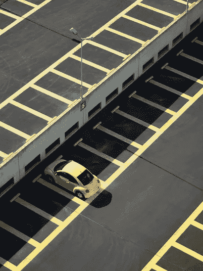
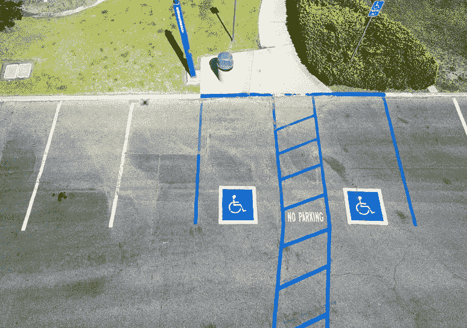
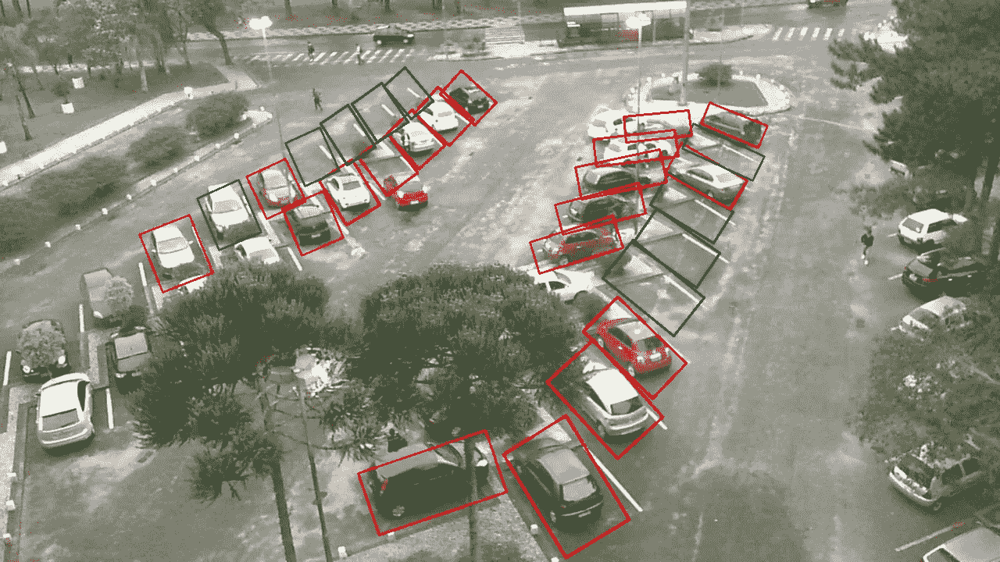
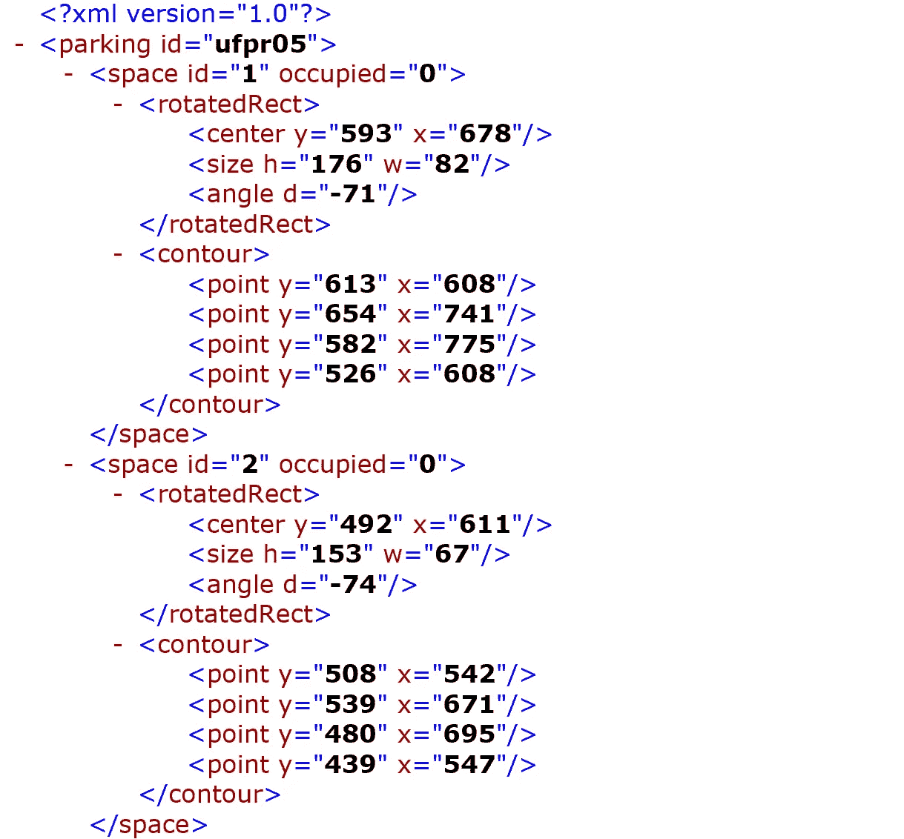
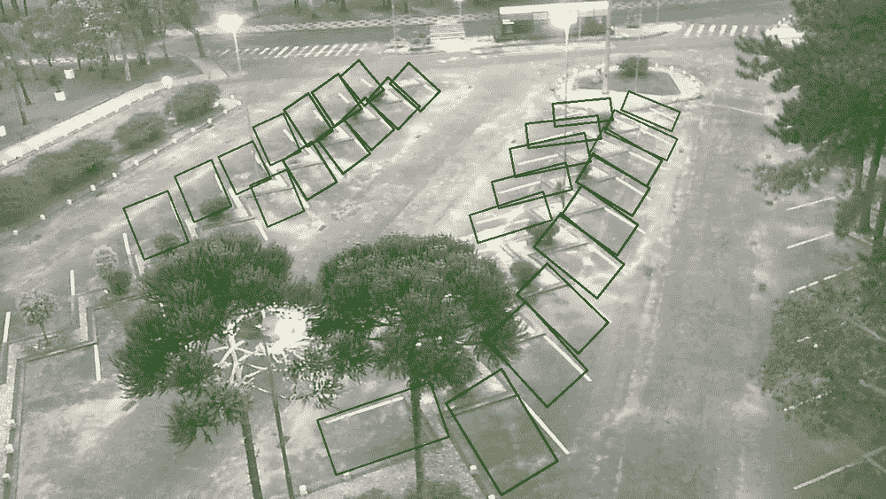
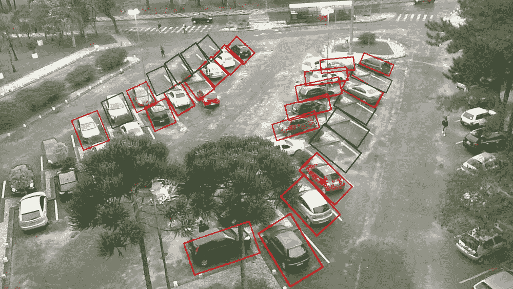

# 智能停车——人工智能的应用

> 原文：<https://towardsdatascience.com/smart-parking-an-application-of-ai-9a4af90b1de6?source=collection_archive---------18----------------------->

## 使用摄像机图像在分配的停车位中检测车辆

Parking signboard (Image by [Paul Brennan](https://pixabay.com/users/paulbr75-2938186/?utm_source=link-attribution&utm_medium=referral&utm_campaign=image&utm_content=2287718) from [Pixabay](https://pixabay.com/?utm_source=link-attribution&utm_medium=referral&utm_campaign=image&utm_content=2287718))

当我们想到人工智能时，我们的脑海中立即形成了钢铁侠电影中贾维斯的形象，这是一个能够执行许多不同事情的人工智能助手。然而，人工智能的应用并不总是如此复杂。区分猫图像和狗图像，检测给定图像中的人脸，或者计算任何给定图像中特定对象的数量，都是人工智能的应用。

一个这样的现实世界应用是在智能停车系统中，人工智能在给定的图像中检测停车位，并使用视频馈送确定给定的停车位是否可用或被占用。这种系统被用作屏障传感器、红外传感器和地面传感器的替代物，其中安装和维护成本被证明是非常昂贵的。

# 使用人工智能的智能停车

上面提到的智能停车系统可以检测给定图像中的停车位，并使用摄像机馈送来确定给定停车位是否可用或被占用，优选地实时地，该智能停车系统包括两个主要步骤:

***1。找到所有的停车位:*** 在摄像机覆盖的给定空间中，知道哪些空间是指定停车位是至关重要的。大多数停车场通过绘制白盒或白线来指定停车区域，如下图所示。对于我们来说，识别停车位可能是一项简单的任务，但对于计算机来说，能够看到这些图像，比如说有多少个停车位，并在停车位周围绘制 bod，这是一项艰巨的任务。

Left ( Photo by Hayes Potter on Unsplash), middle ( Photo by [Raban Haaijk](https://unsplash.com/@haaijk?utm_source=unsplash&utm_medium=referral&utm_content=creditCopyText) on [Unsplash](https://unsplash.com/?utm_source=unsplash&utm_medium=referral&utm_content=creditCopyText)), right ( Photo by [Robert Ruggiero](https://unsplash.com/@robert2301?utm_source=unsplash&utm_medium=referral&utm_content=creditCopyText) on [Unsplash](https://unsplash.com/?utm_source=unsplash&utm_medium=referral&utm_content=creditCopyText))

**2*。查找停车位是否可用或被占用:*** 一旦我们知道哪些是停车位，我们就可以进行第二步，检测停车位是否被占用或可用。与上面的步骤一样，我们很容易看到一个停车位，并说它是否被占用。

# 我的智能停车实验

作为我这个月实验项目的一部分，我实现了一个人工智能算法，它接收一个带注释的图像，并在停车位周围绘制一个绿色的边界框，如果停车位可用，则绘制一个红色的边界框。这包括训练一个深度卷积神经网络来检测停车位是否被占用。

The output from the vehicle detection system used in an image from PKLot dataset

上面的图像显示了我使用人工智能进行智能停车实验的结果。训练和验证图像取自 [PKLot 数据集](http://www.inf.ufpr.br/lesoliveira/download/ESWA2015.pdf)，该数据集包含不同天气条件下 173 个不同停车位的总计约 690，000 张图像[1]。

## 第一步:找到所有的停车位

对于这个实验，我从 PKLot 数据集本身获取注释，以获得给定图像的停车位坐标。到目前为止，我使用的所有输入图像都来自同一个数据集，因此它们都带有停车位的注释。

以下是来自 PKLot 数据集的其中一幅图像的注释文件片段。

A snippet of annotation for parking space from PKLot dataset

通过使用这个文件，我能够获得图像中所有停车位的坐标。

## ***第二步。查找停车位是否可用或被占用***

现在我有了停车位的坐标，我就能够获得单个停车位的图像，并使用它来确定该停车位是否被占用。

对于单个停车位图像的分类，我使用迁移学习训练了一个 VGG 模型。然后，我将训练好的模型用于之前获得的每个单独的停车位图像的分类。经过训练的模型能够在验证集上达到 99.5%的准确率。

# 接下来呢？

这可以进一步扩展，并变成一个智能停车系统，其中，代替图像，该算法采用实时视频馈送，以便获得实时停车可用性更新。我将在一个直播视频中试验这种算法，并在未来几周内写下相关内容。

在成功完成这个实验后，我学到了无论何时你有一个想要解决的挑战，把它分解成更小的步骤，即使它们是简单或明显的步骤。分解会让手头的挑战变得更容易处理，并且有助于一次专注于一个部分。

*你认为 AI 还有哪些有趣的用例？* ***随时通过***[***LinkedIn***](https://www.linkedin.com/in/sabinapokhrel)***联系我。***

或者在下面留下你的想法。

[**点击这里**](https://medium.com/@sabinaa.pokhrel) 阅读我其他关于 AI/机器学习的帖子。

**参考文献:**

[1]德·阿尔梅达、保罗·r . l .等人，“PK Lot——用于停车场分类的稳健数据集”。*专家系统及应用*，第 42 卷，2015 年第 11 期，第 4937–4949 页。爱思唯尔公司，doi:10.1016/j.eswa.2015.02.009。