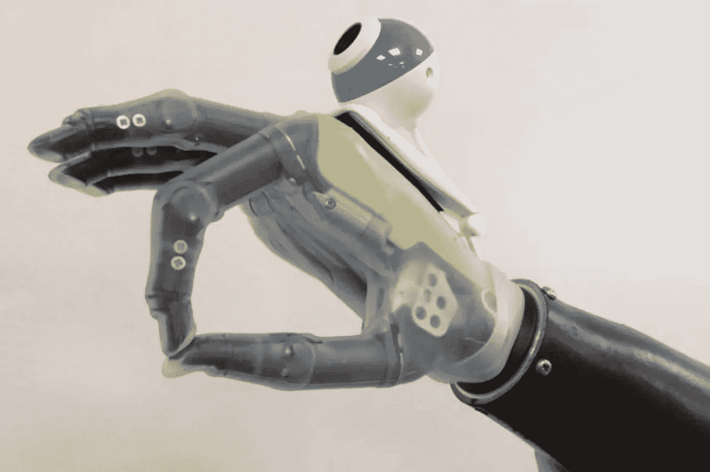

# 使用张量流进行物体检测的智能假肢

> 原文：<https://towardsdatascience.com/smart-prosthetics-with-object-detection-using-tensorflow-2bbb371c888d?source=collection_archive---------18----------------------->

在北卡罗来纳州立大学主动机器人传感(ARoS)实验室工作期间，我有机会参与一个项目，利用计算机视觉技术对上肢假肢进行更智能的控制。一个假臂可以检测到它试图与之互动的是什么样的物体，并相应地调整它的动作。



Source: Newcastle University

类似的工作已经在[纽卡斯特大学](https://www.ncl.ac.uk/press/articles/archive/2017/05/handthatsees/)和[微软创新杯的获胜者身上完成。](https://blogs.technet.microsoft.com/machinelearning/2018/09/10/why-would-prosthetic-arms-need-to-see-or-connect-to-cloud-ai/)在微软项目的情况下，图像数据被发送到 Azure 云，使用 [Azure 自定义视觉服务](https://azure.microsoft.com/en-us/services/cognitive-services/custom-vision-service/)进行对象检测和分类。

在我们的方法中，我们希望演示如何在边缘完成对象检测和分类，嵌入在修复设备本身中。该系统由一个假肢、一个 NVIDIA GPU 和一个 USB 摄像头组成。相机会将图像帧发送到 GPU，GPU 会识别对象的类型，然后将这些信息发送到假肢。然后，手臂可以以允许其与被识别的物体最佳交互的方式移动。

我使用 OpenCV 并实现了一个[单次多盒检测器](/understanding-ssd-multibox-real-time-object-detection-in-deep-learning-495ef744fab) (SSD)算法，使用 [Tensorflow](https://www.tensorflow.org/) 在上下文 (COCO)数据集的[公共对象上进行训练。该程序部署在 NVIDIA Jetson TX2 GPU 上，用于处理来自连接到假肢的摄像头的图像。](http://cocodataset.org/)


作为原型制作的一部分， [OpenCV](https://opencv.org/) 被用来实现计算机视觉技术，比如对样本图像文件进行 canny 边缘检测。该算法将获取一幅图像，绘制出它的边缘，并输出一幅只显示边缘的新图像。


可以通过定位图像颜色变化的位置来找到边缘。在 canny 边缘检测中，这是通过找到像素的强度梯度来完成的。然后，为了减少噪声，设置高和低阈值来确定哪些片段实际上是边缘。

梯度可以用以下公式计算:


More details can be found at [https://docs.opencv.org/master/da/d22/tutorial_py_canny.html](https://docs.opencv.org/master/da/d22/tutorial_py_canny.html)

这个程序随后得到了增强，可以从传入的摄像机流中读取帧。

```
**import** **numpy** **as** **np**
**import** **cv2**

cap_stream = cv2.VideoCapture(1)
**while**(cap_stream.isOpened()):
        *# Take each frame*
        ret, frame = cap_stream.read()
        **if** ret == True:
            edges = cv2.Canny(frame,100,200)
            cv2.imshow('edges',edges)
            **if** cv2.waitKey(1) & 0xFF == ord('q'):
                **break**
cap_stream.release()
```

精明的边缘检测允许操作摄像机的输入，但是我们需要解释输入的图像。基于 Tensorflow 的深度学习框架用于对传入的相机馈送执行对象检测。SSD Inception COCO V2 **，**使用在上下文中的公共对象(COCO)数据集上训练的预训练模型。

单镜头检测器使用一个网络来识别区域并对其进行分类，而不是将这两项任务分开。这种方法是嵌入式设备的首选，因为它的计算成本较低。

对象检测的初始原型是在单个静止图像上完成的。这是通过加载预训练的模型来完成的，每当检测到对象时，使用 OpenCV 在对象周围绘制一个边界框，并用名称和置信度来标记它。


为了实时执行对象检测，步骤非常相似，除了接收输入，使用来自 OpenCV 的相机流，而不是读取文件。这类似于执行实时 canny 边缘检测的步骤。然后，相机流中的每一帧都被输入到 Tensorflow 会话中，这样就可以识别物体了。输出是一个视频源，其边界框类似于上面显示的静态图像输出。

此过程的性能比预期的要慢，每帧大约需要 3 秒来识别对象，从而导致延迟馈送。为了使对象检测更有效，一个单独的线程专门用于处理相机的 I/O，从而产生更快的输出(不到 1 秒)。

下面是张量流代码的一个片段:

```
video_capture = WebcamVideoStream(src=1).start()     
fps = FPS().start()
config = tf.ConfigProto()
 config.gpu_options.allow_growth = True
 with detection_graph.as_default():
     with tf.Session(config = config,graph=detection_graph) as sess:
  while True:
      image_np = video_capture.read()
  #input and output tensors for detection_graph
      image_tensor=detection_graph.get_tensor_by_name("image_tensor:0")
      detection_boxes = detection_graph.get_tensor_by_name("detection_boxes:0")
      detection_scores = detection_graph.get_tensor_by_name("detection_scores:0")
      detection_classes = detection_graph.get_tensor_by_name("detection_classes:0")
      num_detections = detection_graph.get_tensor_by_name("num_detections:0")

      image_np_expanded = np.expand_dims(image_np,axis=0)
      (boxes,scores,classes,num)= sess.run(
              [detection_boxes, detection_scores, detection_classes, num_detections],
      feed_dict={image_tensor: image_np_expanded})
      vis_util.visualize_boxes_and_labels_on_image_array(
            image_np,
            np.squeeze(boxes),
            np.squeeze(classes).astype(np.int32),
            np.squeeze(scores),
            category_index,
          use_normalized_coordinates=True, line_thickness=8)
      cv2.imshow('object detection', cv2.resize(image_np, (800,600)))
      if cv2.waitKey(25) & 0xFF == ord('q'):
         cv2.destroyAllWindows()
         break 
```

然后将这个 python 应用程序加载到运行 Linux 的 GPU 上并进行测试。GPU 的视频输入由通过 USB 连接的摄像头提供。

在这个项目中遇到的大多数挑战都与安装和配置 GPU 以及运行对象检测应用程序所需的库有关。

该项目能够实现预期的结果，即能够在 GPU 上使用深度学习近实时演示对象检测。这为将其嵌入假肢以获得更好的适应性提供了可行性。

通过创建用于更准确的对象检测的自定义模型，而不是使用在 COCO 上训练的 SSD 模型，可以对该项目进行进一步的增强。可以通过调整曝光和亮度来消除输入视频帧中的异常值，从而对视频捕捉进行改进。

链接到我的 GitHub 项目:[https://github.com/rohinisharma/AROS-hsproject](https://github.com/rohinisharma/AROS-hsproject)