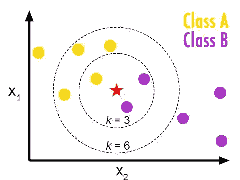
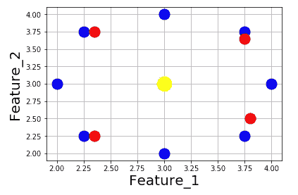
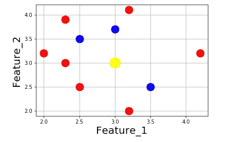

# 更聪明的 K 近邻

> 原文：<https://towardsdatascience.com/smarter-k-nearest-neighbours-3f88b5b7f17d?source=collection_archive---------27----------------------->

## 我们应该改变“K”吗？

Source: FromTheGenesis

# 背景

K 近邻(KNN)算法是理解起来最简单和直观的机器学习算法之一。例如，如果你试图将某件事分成两类:“是”或“否”，你就取“k”个最相似的数据点，看看它们是“是”还是“否”。如果 k=5，你看五个最相似的数据点，如果，例如，你看到 4 个“是”和 1 个“否”，你会猜测该点是一个“是”。

# **更智能的机器学习**

在标题中，我讨论了让 KNN 变得更聪明。“更聪明”是什么意思？在这种情况下——我的意思是当算法在一个特定的情况下分析数据时，人类可以看到是荒谬的。当我们发现这些情况时，我们可以改变算法的行为来解释它们，从而得到更好的结果。最好是考虑每个单独的点，并提出一些算法可能出错的一般规则，以及如何对它们进行重新分类。我之前写的关于[处理高度相关的专栏](/background-d5f101e00afc?source=your_stories_page---------------------------)和[贝叶斯软投票](/soft-voting-bayesian-style-5306a48d26d1?source=your_stories_page---------------------------)的帖子就是这种情况。

# 警告:改进距离度量

KNN 算法需要一种方法来定义从一个数据点到另一个数据点的“距离”,因为它将邻居定义为距离最小的那些点。通常使用欧几里德距离(直线距离)。然而，有些功能比其他功能更重要。例如，如果你预测谁在泰坦尼克号上幸存，年龄的可变性比他们社会安全号码最后 4 位的可变性更重要。

为了让 KNN 算法考虑到这一点，您通常会通过将更重要的特征乘以一个大于 1 的数字来增强它们，以便它们对“距离”的贡献更大。这被称为“功能提升”，应该在缩放数据后完成，通常是在运行另一个机器学习模型后，以确定要提升哪些功能以及提升多少。但是，我不会进一步讨论这个问题，因为这不是本文的目的。

# 警告:软投票

你可以改变你的投票机制，从每点一票，到给更近的点更多的票。理论上，这将提高模型的准确性，因为附近的点可能比远处的点更具预测性。如果你试图设计最好的 KNN，你也应该使用某种软投票，但是，在实践中最好要小心，因为它很容易过度修正邻近效应。

# 修正 K:问题？

我们通常试图优化“k”的最佳值。无论是 k=5，k=11，k=25，等等。然而，这真的有意义吗？我们希望用相同的 k 值来预测数据集中的每一点吗？如果我们要改变“k”的值，我们如何通过查看测试数据做到不偏不倚？在这里，我将提出两种情况，固定的 K 使我们的算法变得愚蠢。为简单起见，我们将假设一个二进制分类，其中 50%的数据在每个类别中。

# 问题 1:所有点不相等

在上图中，假设我们要对黄色点进行分类，并决定它更可能是红色还是蓝色。如果我们有 k=7 和硬投票，我们有 4 个红色和 3 个蓝色，所以算法会猜测“红色”。然而，这里选择 k=4 似乎更明智，因为有 4 个点非常接近我们的目标，选择这个会使我们猜测“蓝色”，这似乎更明智。这看起来很直观，我们不需要看我们的测试数据来找出答案。

## 解决方案 1

如果您设置了 k=7，就可以用足够的软投票来解决这个问题，但是，可能会有另一个问题。

# 问题 2:任意截止

有 8 个蓝点，和 4 个稍微接近的红点。如果您设置了 k1–7，这将会把黄色点分类为红色。然而，由于红蓝点之间的距离几乎相同，因此让红军对投票施加如此大的额外影响是没有意义的。我凭直觉猜测是蓝色。

## 解决方案 2

最佳解决方案是:1)运行某种算法来查看一个点，并确定一个较好的“k”值，即当 k 增加 1 确实会增加距离时，将其删除；或者 2)设置一个非常大的“k”值，但距离度量要足够好，以单独显示这种行为(例如，负指数权重)。

# 问题 3:固定样本量

对于上面的例子，假设你已经设置了 k=5。有 3 个蓝点和 2 个红点最接近我们试图分类的点。

假设你在测试一个假设，关于是更多的 NYU 学生更喜欢泰勒还是坎耶。此外，让我们假设你没有办法知道谁是 NYU 的学生，谁不是。你打算如何回答这个问题？一种方法是从 NYU 市中心开始，随机询问人们他们最喜欢的艺术家是谁。靠近 NYU 市中心的人更有可能是 NYU 的学生，所以你最信任他们的数据。然而，如果结果在统计学上没有定论，你将不得不走得更远，询问更多人的偏好，甚至冒着采访越来越多非 NYU 学生的风险。

这类似于上面的 KNN 问题。最接近黄点的点与黄点最相似，但是，如果在统计上不能确定是红色还是蓝色更好，我们需要去更远的地方进行更多的检查。如果你看到 3 个学生支持泰勒，2 个学生支持坎耶，你会得出泰勒更受欢迎的结论，还是会得到更多数据？

这个想法类似于伟大的经济学家米尔顿·弗里德曼创造的[序贯抽样](https://en.wikipedia.org/wiki/Sequential_analysis)。

## 解决方案 3

如果您正在处理一个大数据集，可以等到您获得高度的统计显著性，但是，在一个较小的数据集上，我会建议一种不同的方法。我会使用[加法平滑](https://en.wikipedia.org/wiki/Additive_smoothing)方法，来创建概率的贝叶斯估计，类似于我在这里讨论的。然后，我会使用 70%的概率阈值进行预测。

当你的样本变大时，最好切换到统计显著性测试，如果你的样本变得太大，就选择大多数。

# 结论和实际应用

我认为上面建议的方法是解决最近邻问题的更合理的方法，尽管它们实现起来更繁琐。然而，正如编程中的许多事情一样，一旦你实现了一次，就很容易再实现一次，你会不断地收获好处。

随着您使用的数据量的增加，您使用哪个模型并不特别重要。然而，更智能的模型将允许您基于少量数据做出更强有力的结论，这是数据科学中的一个现实问题。对小数据集的推理是人类专家远远优于当前机器的领域之一，也许像这样摘下低垂的果实将有助于弥合这一差距。

## 声明:一如既往地让我知道，如果你以前读过这篇文章，或者如果这是不正确的。