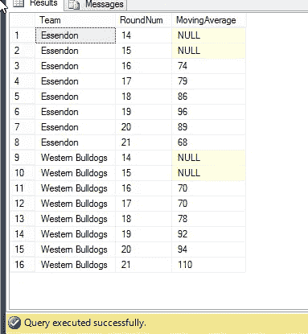

# 平滑 SQL 中的数据

> 原文：<https://towardsdatascience.com/smoothing-data-in-sql-c042ab0839a?source=collection_archive---------27----------------------->


A teddy bear Western Bulldogs Australian Rules Football fan sitting on an Essendon Bombers beanie — by the end of the article we will judge how these two AFL teams’ seasons are going (photo: author)

## *使用移动平均来平滑 SQL 中的数据*

在数据世界中发现的一个问题是如何区分信号和噪声。当处理序列中出现的数据时，例如时间序列数据(最熟悉的例子，但决不是唯一的例子)，处理该问题的一个常用方法是应用平滑器。

平滑器可以从非常简单的到非常复杂的，但是我们将集中在比较简单的一端。

所有这些平滑器，不管多简单或多复杂，都有一个共同点，那就是它们依赖于以特定顺序出现的数据。为了计算平滑度，您需要能够引用焦点行周围的多行，SQL 并不总是很好地设置了这一点。

近年来，SQL 的主要实现(包括 MySQL、SQLite、PostgreSQL 和 SQL Server)已经添加了 Lead()和 Lag()函数，允许对出现在感兴趣的行之前和之后的行执行计算。我们可以利用这些函数在 SQL 中实现简单的平滑器，比如加权移动平均。

像所有的窗口函数一样，SQL 让您可以灵活地使用“PARTITION”和“OVER”关键字来指定函数所应用的数据。从语义上来说

```
SELECT Index, Classifier, Value, LAG(Value) OVER (Partition By Classifier ORDER BY Index)
FROM YourTable
```

请注意，默认偏移量是一个位置，但是您可以在 Lag 函数中指定偏移量，例如 Lag(Value，2)是原始行后面的两行。

但是，我们不能在同一个列中返回多个窗口函数变量，所以我们不能做我们需要做的算术来计算加权移动平均本身。因此，我们需要创建一个公共表表达式来提供滞后列，并运行后续查询来计算加权移动平均值本身。再一次，用纯语义的术语来说:

```
WITH Base_Table
AS
(SELECT Index, Classifier, Value 
  ,LAG(Value) OVER (Partition By Classifier ORDER BY Index) as LagVal1
  ,LAG(Value,2) OVER (Partition By Classifier ORDER BY Index) as LagVal2FROM YourTable)SELECT Index, Classifier
            , (Value + LagVal1 + LagVal2)/3 as MovingAverage
From Base_Table
```

然而，为了恰当地说明，我们需要一个好的例子。不管是好是坏，我是来自维多利亚的澳大利亚人，所以我遵循的足球准则是澳大利亚规则(如果我是来自新南威尔士州或昆士兰州的澳大利亚人，这不太可能是真的)。我的球队是埃森登轰炸机队，他们最近在与西部牛头犬队的比赛中遭遇了历史上最大的一次失败，只得到 33 分，而西部牛头犬队得到 137 分。

通过自我鞭笞的方式，我认为计算两个队在最近比赛中得分的移动平均值是有益的，以便更好地了解他们每个人的趋势。

首先，我们需要创建一个包含最近几场比赛分数的表格。

```
CREATE TABLE AFL_SCORES(  Team VarChar(30)
, RoundNum Int
, Score Int
)
;INSERT INTO AFL_SCORESVALUES
  ('Essendon', 14, 71)
, ('Essendon', 15, 77)
, ('Essendon', 16, 76)
, ('Essendon', 17, 86)
, ('Essendon', 18, 96)
, ('Essendon', 19, 106)
, ('Essendon', 20, 67)
, ('Essendon', 21, 33)
, ('Western Bulldogs', 14, 73)
, ('Western Bulldogs', 15, 66)
, ('Western Bulldogs', 16, 71)
, ('Western Bulldogs', 17, 74)
, ('Western Bulldogs', 18, 89)
, ('Western Bulldogs', 19, 113)
, ('Western Bulldogs', 20, 80)
, ('Western Bulldogs', 21, 137);
```

然后我们有了查询本身，按照上面介绍的模式，一个 CTE 创建滞后列，一个后续查询计算移动平均值本身。请注意，这是简单的移动平均线，但在许多情况下，使用加权移动平均线，有各种不同的加权方案，以适应不同的口味。

```
WITH LagsTable
AS
(SELECT   Team
          , RoundNum
          , Score
          , Lag(Score)    OVER (Partition By Team Order By RoundNum) AS ScoreLag1
          , Lag(Score,2)  OVER (Partition By Team Order By RoundNum) AS ScoreLag2FROM AFL_SCORES)SELECT   Team
         , RoundNum
         , (Score+ScoreLag1+ScoreLag2)/3 As MovingAverageFROM LagsTable
```

给出结果:



对于埃森登的球迷来说，这可能是一点安慰，因为西部牛头犬队连续几轮都有所改善，这比埃森登最近的得分下降趋势更强。

无论如何，这是一个有用的、尽管对个人来说很痛苦的方法，来说明如何使用 SQL 通过窗口函数计算移动平均值。

罗伯特·德格拉夫的书《管理你的数据科学项目》[](https://www.amazon.com/Managing-Your-Data-Science-Projects/dp/1484249062/ref=pd_rhf_ee_p_img_1?_encoding=UTF8&psc=1&refRID=4X4S14FQEBKHZSDYYMZY)**》已经通过出版社出版。**

*[*在 Twitter 上关注罗伯特*](https://twitter.com/RobertdeGraaf2)*