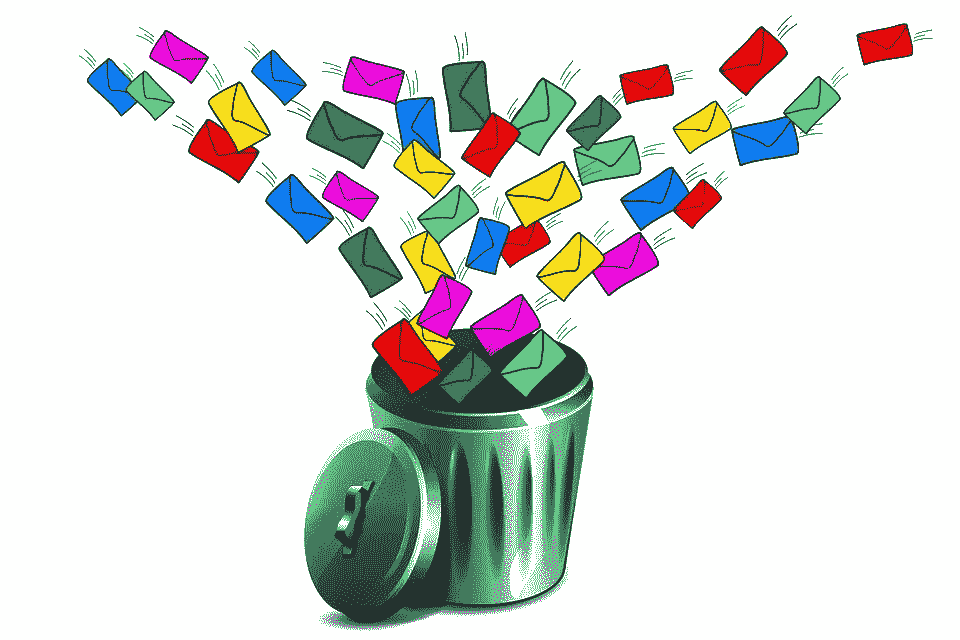
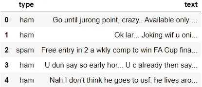
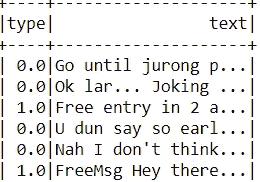
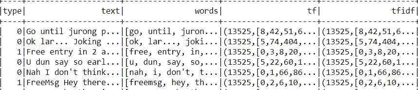
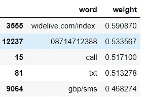
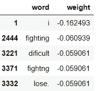
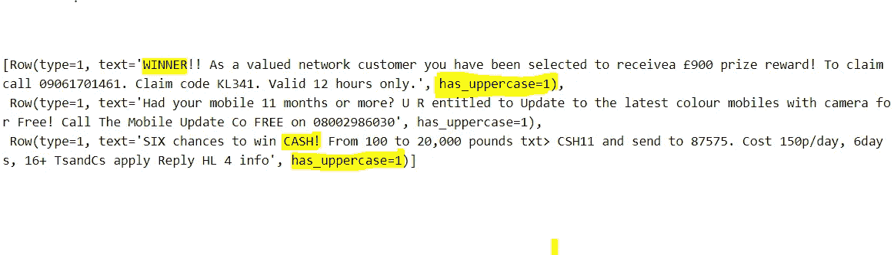
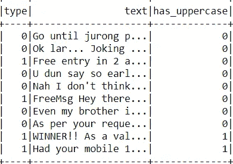

# 建立垃圾短信检测器

> 原文：<https://towardsdatascience.com/sms-spam-detector-499f31515f14?source=collection_archive---------25----------------------->

## 做好准备，垃圾邮件来了

在这篇博文中，我们将使用逻辑回归和 pySpark 开发一个垃圾短信检测器。我们会预测一条短信是否是垃圾短信。这是数据科学的第一个用例之一，现在仍被广泛用于过滤电子邮件。

[https://pixabay.com/images/id-4009691/](https://pixabay.com/images/id-4009691/)

数据集:文本文件可以从[这里](https://github.com/harshdarji23/Sms-spam-detector/blob/master/sms_span_df.csv)下载。这是我们的数据集的样子:

我们正在使用 pySpark 进行分布式计算，我们将创建一个机器学习管道来自动化工作流程。我们看到“type”列包含分类数据，因此第一步是将“type”列的内容转换为数字属性。我们编码是因为逻辑回归不能处理分类数据。

**1=spam 0=ham**

现在，我们将创建一个流水线，它将结合一个`Tokenizer`、`CounterVectorizer`和一个`IDF`估计器来计算每个 SMS 的 TF-IDF 向量。

**Tokenizer:** 它从每条短信的句子中创建单词(记号)

**Countvectorizer:** 它计算一个标记在文档中出现的次数，并使用这个值作为它的权重。

**TF-IDF 矢量器** : TF-IDF 代表“术语频率-逆文档频率”，意味着分配给每个标记的权重不仅取决于它在文档中的频率，还取决于该术语在整个语料库中的重复出现程度。你可以在[这里](/hacking-scikit-learns-vectorizers-9ef26a7170af)和[这里](https://scikit-learn.org/stable/modules/feature_extraction.html#text-feature-extraction)了解更多。

要了解我们为什么使用 TF-IDF，请阅读[medium 上的这篇](https://medium.com/@shivangisareen/tfidf-7b29017dcdd)帖子。

现在我们有了 TF-IDF 形式的句子，让我们创建 ML 管道，其中第一阶段是上面创建的`tfidf_pipeline`，第二阶段是具有不同正则化参数(𝜆)和弹性网络混合(𝛼).)的`LogisticRegression`模型要了解更多关于正则化和逻辑回归背后的数学知识，请阅读这篇文章。

## **对比车型**

我们使用[交叉验证](/5-reasons-why-you-should-use-cross-validation-in-your-data-science-project-8163311a1e79)，因为它帮助我们更好地使用我们的数据，并且它提供了更多关于我们算法性能的信息。

**Output**

我们看到具有包含 regParam=0.02、elasticNetParam=0.2 的管道 lr_pipeline2 的模型 2 在验证数据上表现最佳，因此我们将此管道拟合到我们的测试数据，并找出它在测试数据上的 AUC。

**Output: AUC_best=0.976126746201693**

# 推理

现在，我们将使用上面拟合的管道 2(`lr_pipeline2`)来创建包含最负面单词和最正面单词的 Pandas 数据帧。

**Left=Positive words, Right=Negative words**

# 结论

我们将我们的文本转换成记号和 TF-IDF 向量，用逻辑回归的参数进行试验，并使用验证数据的 AUC 度量评估我们的模型。最后，基于模型对验证数据的性能，我们对测试数据进行了模型拟合，并测量了模型的性能。因此，我们开发了一个垃圾邮件检测器使用正则逻辑回归。

# **我们能提高我们模型的性能吗？**

可以通过对数据进行特征工程来提高模型的性能。典型的垃圾邮件包含大写字母的单词。所以我们创建了一个数据帧`sms_spam3_df`，在这里我们添加了一个新的列`has_uppercase`，如果第一个大写字母序列大于或等于 3，它包含一个整数`1`，否则包含一个整数`0`。

让我们看看我们的数据框是什么样的:

现在，我们有两列文本，has_uppercase，我们必须对文本进行标记化并创建 TF-IDF，然后使用 vector assembler 与 has _ upper case 列合并。我们创建一个合并两列的管道，使用[maxabscaler](https://spark.apache.org/docs/2.0.2/ml-features.html#maxabsscaler)执行要素缩放，并运行一个逻辑回归模型(lr2 正则化参数𝜆=0.2 和弹性网络混合𝛼=0.1 ),该模型在上述数据框中表现最佳。

## **`**has_uppercase,**`**是与短信是垃圾短信正相关还是负相关的特征？****

**我们从流水线中取出 has_uppercase 特征的系数，结果是 0.9289。因此，has_uppercase 与 SMS 是垃圾短信正相关。**

## ****`**has_uppercase**`**的系数与最大正 tfidf 系数的比值是多少？******

****Tfidf 的最大系数为 2.01，因此`has_uppercase`的系数与最大正 tfidf 系数之比为 0.46****

> ****感谢您的阅读！非常感谢您的反馈****