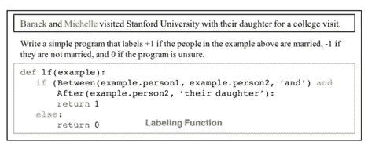
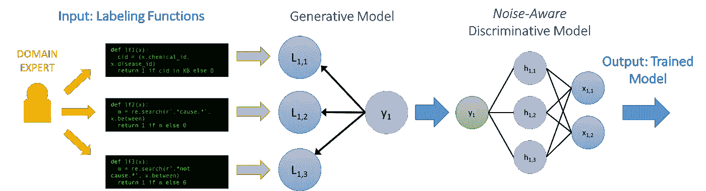

# 通气管——一个薄弱的监督系统

> 原文：<https://towardsdatascience.com/snorkel-a-weak-supervision-system-a8943c9b639f?source=collection_archive---------13----------------------->

当今强大的模型，如 DNN 的模型，在许多任务上产生最先进的结果，并且比以往任何时候都更容易运转(使用最先进的预训练模型，如 ULMFiT 和 BERT )。因此，我们现在可以输入原始数据——图像、文本等，而不是花费大量时间来精心设计模型的特征。它们可以学习自己的特征。然而，这种成功有一个隐藏的成本——这些模型需要大量带标签的训练集。并且这些标记的训练集对于大多数真实世界的任务来说是不存在的或者相当小。并且创建这些大的带标签的训练数据集可能是昂贵的、缓慢的、耗时的或者有时甚至是不切实际的(隐私问题)。当需要领域专家来标记数据时，问题会变得更糟。此外，任务可能会随着时间的推移而变化，手动标记的训练数据是静态的，不能适应时间的变化。

斯坦福大学的一个团队开发了一套被广泛称为“弱监管”的方法来解决这一数据标签瓶颈。这个想法是以编程方式标记数百万个数据点。

有各种各样的方法，我们可以使用试探法、经验法则、现有的数据库、本体等，有计划地生成训练数据。由此产生的训练数据被称为*弱监督*:它并不完全准确，可能由多个重叠和冲突的不同信号组成

可以被认为是监管不力的原因的例子包括:

*   领域试探法(例如，通用模式、经验法则等。)
*   现有的地面实况数据并不完全适合手头的任务，但*足够近*有用(传统上称为“远程监督”)
*   不可靠的非专家注释者(例如众包)

sprock 是一个围绕数据编程范例构建的系统，用于快速创建、建模和管理训练数据。

数据编程范式是一种简单而强大的方法，在这种方法中，我们要求领域专家用户将各种弱监督信号编码为*标记函数*，这些函数只是标记数据的函数，可以用 Python 等标准脚本语言编写。这些标记函数通过正则表达式、经验法则等使用通用模式对领域启发进行编码。所产生的标签是有噪声的，并且可能相互冲突。

在通气管中，试探法被称为 ***标记函数(LFs)。*** 以下是一些常见的劳动力市场类型:

*   硬编码启发法:通常是正则表达式(regexes)
*   语法:例如，[空间的依赖树](https://explosion.ai/demos/displacy)
*   远程监督:外部知识库
*   嘈杂的人工标签:众包
*   外部模型:具有有用信号的其他模型

Snorkel Labeling Function Example

在你写好你的 LFs 之后，潜泳将训练一个*标签模型*，它利用所有 LFs 之间的冲突来估计它们的准确性。通过查看标记函数彼此同意或不同意的频率，我们学习每个监督源的估计精度(例如，所有其他 LF 倾向于同意的 LF 将具有高学习精度，而每当所有其他 LF 对同一示例投票时似乎都不同意的 LF 将具有低学习精度)。通过组合所有标记函数的投票(根据它们的估计精度进行加权)，我们能够为每个示例分配一个模糊的“噪声感知”标签(在 0 和 1 之间)，而不是硬标签(0 或 1)。然后，当标记一个新的数据点时，每个 LF 将投一票:赞成、反对或弃权。基于这些投票和 LF 准确度估计，标签模型可以以编程方式将概率标签分配给数百万个数据点。最后，我们的目标是训练一个分类器，它可以超越我们的 LFs 进行推广。

Snorkel Model

这种方法的三大优点是:

1.我们改进了标记方法的可伸缩性:每个 LF 可以为数十、数百或数千个示例贡献标签信息——而不仅仅是一个。

2.我们现在可以使用未标记的数据。我们可以将我们的 LFs 应用于所有未标记的例子，为潜在的巨大训练数据集创建大量不完美但“足够好”的标签。

3.这些标签可以用来训练一个强大的区分分类器，该分类器具有一个大的特征集，该特征集概括了 LFs 直接提出的原因之外的原因。(因此，即使我们只使用 100 个 LFs，它们标记的示例可能每个都有数千个特征，其权重由判别分类器学习)。

因此，通过这种方式获得大量低质量的监督，并使用统计技术来处理噪音较大的标签，我们可以训练更高质量的模型。

一些使用了浮潜的弱监管工具的公司—

*   IBM 的对话代理:[在弱监督下引导对话代理(AAAI 2019)](https://arxiv.org/pdf/1812.06176.pdf)
*   谷歌的网页内容和事件分类:[浮潜干铃:在工业规模部署弱监管的案例研究(SIGMOD Industry 2019)](https://arxiv.org/abs/1812.00417) 和[谷歌人工智能博客文章](https://ai.googleblog.com/2019/03/harnessing-organizational-knowledge-for.html)
*   英特尔的商业智能: [Osprey:非程序员对不平衡提取问题的监管不力(SIGMOD DEEM 2019)](https://ajratner.github.io/assets/papers/Osprey_DEEM.pdf)

## 参考

 [## HazyResearch 浮潜

### 2019 年 3 月 21 日]使用我们的多任务版本“浮潜金属”,我们在胶水上取得了新的最先进的成绩…

hazyresearch.github.io](https://hazyresearch.github.io/snorkel/)  [## 浮潜和弱监督机器学习的曙光

### 由亚历克斯·拉特纳，斯蒂芬·巴赫，亨利·埃伦贝尔和克里斯·雷在这篇文章中，我们将讨论我们的方法弱…

dawn.cs.stanford.edu](https://dawn.cs.stanford.edu/2017/05/08/snorkel/)