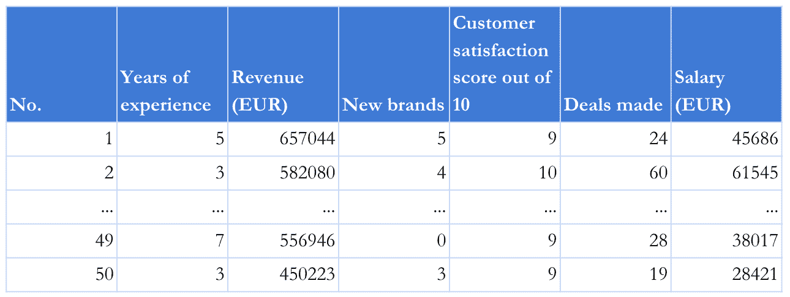
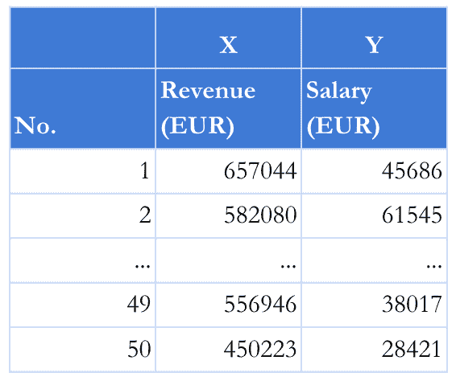
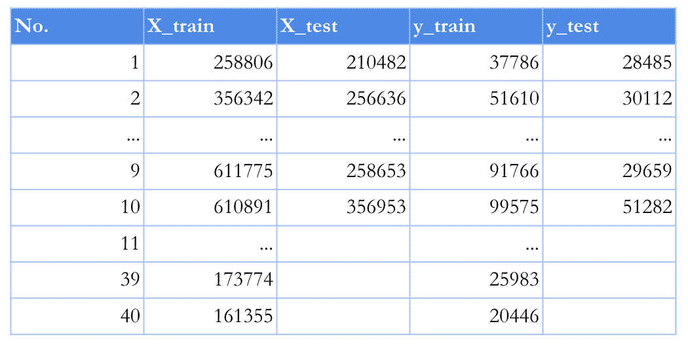
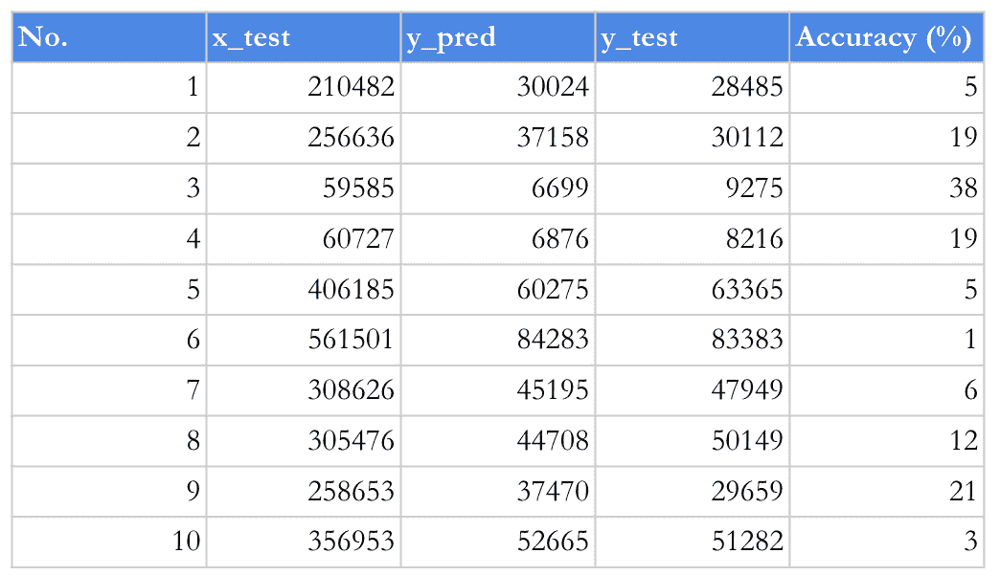
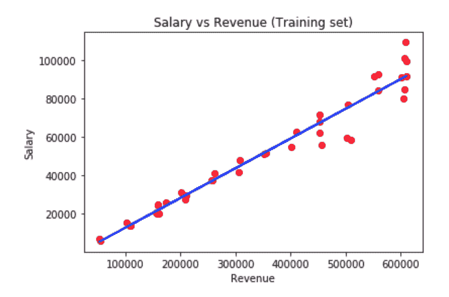
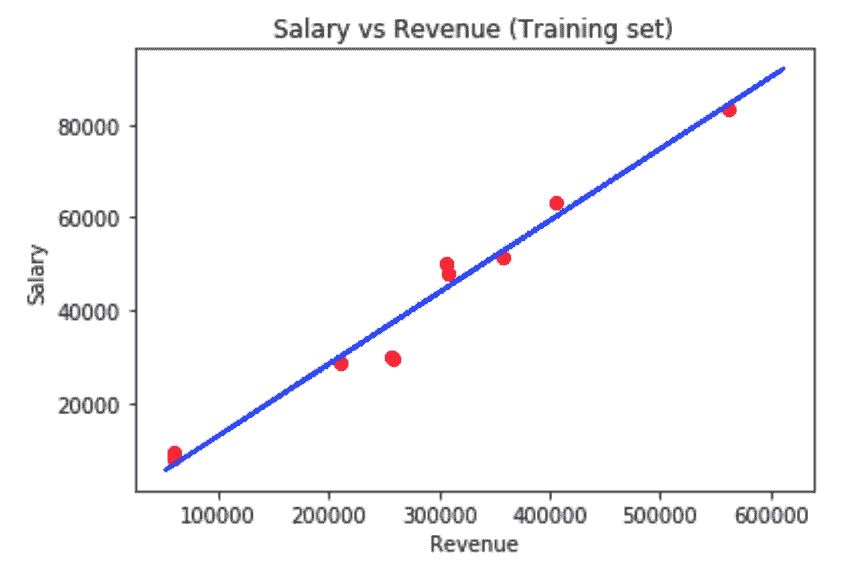
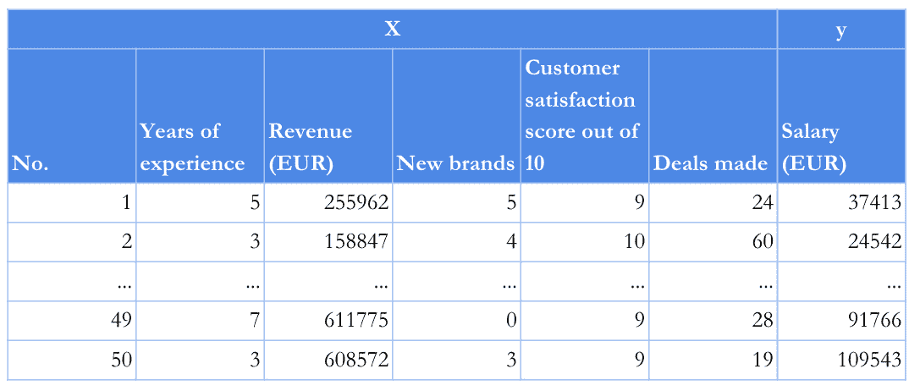
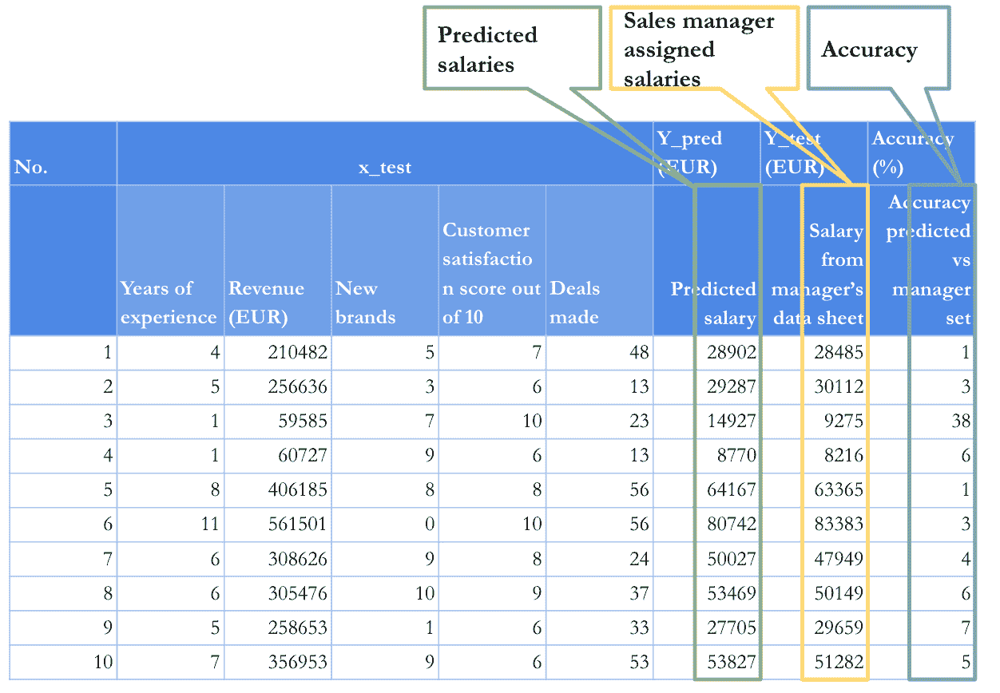

# 那么，什么是人工智能呢？首先，这并不像听起来那么难

> 原文：<https://towardsdatascience.com/so-what-is-artificial-intelligence-firstly-its-not-as-hard-as-it-sounds-5f630a618bc7?source=collection_archive---------19----------------------->


> 在这篇文章中，我将揭开人工智能这个术语的神秘面纱，我将揭示它在哪里以及如何被使用。最后，使用基本的编程技术，我将提供一个简单的概念证明，人工智能可以应用在不复杂的业务流程中。不要害怕，你不必是一个技术大师来理解这篇文章。

人工智能(AI)。好像每一篇关于科技的文章都要提到 AI。至少有一两次。它与自动驾驶汽车、亚马逊的 Alexa 联系在一起，当然，它会偷走你的工作。不管是好是坏，人工智能成了一个时髦词。虽然看起来很多人并不真正理解它的含义，所以让我来给你解释一下。人工智能(AI)这个术语是基于这样一种想法，即计算机或系统可以从数据中学习，识别模式，并在最少的人工干预下做出决策。从数据分析中学习的方法被定义为机器学习(ML)。它自动建立分析模型，是人工智能概念的一个子集。

这篇文章旨在提供对人工智能实际上是什么的更好理解。今天，它在许多行业中发挥着重要作用。它被用来促进人类劳动力以更少的花费获得更多。对我们大多数人来说，人工智能这个词与复杂的技术联系在一起。智力这个词指的是聪明的东西或人，能够以更好的方式表现。没有人想比别人聪明，对吗？那么，人工智能到底对人类劳动力有什么贡献呢？例如，各种期刊正在使用人工智能进行新闻写作和发布。彭博是其中之一并不奇怪。就在去年，他们的程序 Cyborg 制作了数千篇文章，这些文章采用了金融报道，并像商业记者一样将它们转化为新闻故事。教育系统正在使用人工智能来准备专门的学习计划。目前有几家公司，如 Content Technologies 和 Carnegie Learning，正在开发智能教学设计和数字平台，使用人工智能为从学前到大学水平的学生提供学习、测试和反馈，为他们提供他们已经准备好的挑战，识别知识差距，并在适当的时候重定向到新主题。根据美国教育部门报告中的人工智能市场，甚至预计从 2017 年到 2021 年，美国教育中的人工智能将增长 47.5%。提到的几个领域只是人工智能进入人类劳动力之旅的开始。在未来几年，人工智能将出现在越来越多的行业，彻底改变我们的工作方式。

那么，对于我们大多数人来说，人工智能和机器学习这两个术语真的太难理解了吗？为了让事情更清楚，让我们用一个例子，机器学习的一些概念可以帮助企业通过花更少的钱实现更多的目标。

想象一下，一家从事销售工作的公司，由 50 名销售代表组成，他们努力工作，为公司的收入增长做出贡献。他们肯定希望被公平对待，并获得与他们的业绩相应的薪水。这家公司的销售经理努力公平对待所有员工。多年的行业经验帮助他为销售团队制定了一个通用的关键绩效指标。经理认为，该指标不仅有助于做出更好的决策，还能洞察哪些员工更有经验，从而指导经验较少的同事。此外，他还引入了收入作为 KPI，这是定义整个公司成功的最关键的方面之一，可以与员工工资直接相关。新客户、他们的满意度得分和销售代表达成的交易是定义成功的销售代表绩效时必须包括的其他重要因素。

总而言之，这是销售经理定义的五个关键绩效指标:

*   多年的经验
*   收入
*   新客户(新品牌)
*   客户满意度得分
*   达成的交易

销售经理创建了一个电子表格，其中列出了所有员工的年度业绩。几个不眠之夜和无数的能量饮料之后，经理从公司的电子日志中收集了所有员工的绩效信息，并填写了下面的表格(谢谢，Greg)。在填写了关键绩效指标的值后，他开始通过设定工资来检查每一行。最后，他重新检查了所有的工资单元，以确保每个员工都与其他人进行了比较。



为了使这变得简单，让我们从解决工资如何依赖于收入开始。我们将使用 Python 编程语言来训练算法。

## 步骤 1 —下载并安装工具

让我们下载[阿纳康达](https://www.anaconda.com/distribution/)

> *全球最受欢迎的 Python/R 数据科学平台*

## 步骤 2 —导入库

```
import numpy as np *# fundamental package for scientific computing with Python*
import matplotlib.pyplot as plt *# Python 2D plotting library*
import pandas as pd *# High-performance, easy-to-use data structures and data analysis tools for the Python*
import requests as r *# Requests is a Python HTTP library*
import io *# Python's main facilities for dealing with various types of input and output*
```

## 第三步——从网上获取工资数据

[RAW](https://raw.githubusercontent.com/liumedz/simple-ai/master/50_Salaries.csv) ，[数据表](https://github.com/liumedz/simple-ai/blob/master/50_Salaries.csv)

```
*# these lines of code get the data from web url and fill the dataset* 
content = r.get('https://raw.githubusercontent.com/liumedz/simple-ai/master/50_Salaries.csv').content
dataset = pd.read_csv(io.StringIO(content.decode('utf-8')))
```

## 步骤 4 —选择数据子集来训练算法

它非常类似于 excel 或其他电子表格程序，可以从列和行中选择数据。为了在 Python 中做到这一点，我们使用了 **iloc[ <行>，<列> ]** 函数。在括号中，我们设置由逗号分隔的行数和列数。

```
X = dataset.iloc[:, 2].values
y = dataset.iloc[:, 6].values
```

首先，让我们使用算法输入的收入作为 x。为此，我们必须通过在 ***iloc* [:，2]【T5]括号中设置 2 来选择第三列，并将其分配给变量 x**

其次，我们通过将薪水赋给变量 y 来使用它作为结果。

变量 X 和 Y 的结果列于表中。



## 步骤 5-将数据集分成训练集和测试集

为了训练计算机找出在创建算法时使用的倾向，我们有一组 50 个销售团队的工资记录。我们还想测试计算机是否像大多数人类一样擅长预测。为了验证算法的性能，我们随机抽取了 10%的数据记录。我们将在未来使用它们来确认或忽略我们对算法性能的假设。我们将使用其余 90%的记录来训练算法。

```
from sklearn.model_selection import train_test_split
X_train, X_test, y_train, y_test = train_test_split(X, y, test_size = 0.2, random_state = 0)
```



## **步骤 5——对训练集进行线性回归拟合**

为了对训练集进行线性回归，我们将使用 sklearn 库中的 linear_model。拟合方法用于使用训练集来训练模型。

```
from sklearn.linear_model import LinearRegression
regressor = LinearRegression()
regressor.fit(X_train, y_train)
```

## 步骤 6 —预测测试集结果

为了预测测试集结果，我们将使用线性回归库中的预测方法，通过设置 X_test 数据来预测 Y_test 结果

```
y_pred = regressor.predict(X_test)
```



## **步骤 7 —可视化训练集结果**

为了可视化训练集结果，我们将使用 matplotlib.pyplot 库。蓝线显示了如果我们设定一个特定的收入，将会预测的工资。简单地说，因为收入和预测工资之间的关系是线性的，所以该算法被称为线性回归。

```
plt.scatter(X_train, y_train, color = 'red')
plt.plot(X_train, regressor.predict(X_train), color = 'blue')
plt.title('Salary vs Revenue (Training set)')
plt.xlabel('Revenue')
plt.ylabel('Salary')
plt.show()
```



## 步骤 8——可视化测试集结果

```
plt.scatter(X_test, y_test, color = 'red')
plt.plot(X_train, regressor.predict(X_train), color = 'blue')
plt.title('Salary vs Revenue (Training set)')
plt.xlabel('Revenue')
plt.ylabel('Salary')
plt.show()
```

测试集有助于验证算法的执行情况。我们使用来自销售经理测试集的数据记录样本来比较算法的预测准确性。蓝线代表在特定收入下的预期薪资。红点代表销售经理设定的实际工资。红点和蓝线之间的最短距离证明了该算法能够以令人满意的准确度预测工资。线和点之间的距离越长，预测就越不准确。



**代码**

```
*# Importing the libraries*
import numpy as np 
import matplotlib.pyplot as plt
import pandas as pd
import requests as r
import io *# Importing the dataset*
content = r.get('https://raw.githubusercontent.com/liumedz/simple-ai/master/50_Salaries.csv').content
dataset = pd.read_csv(io.StringIO(content.decode('utf-8')))
X = dataset.iloc[:, 2:3].values
y = dataset.iloc[:, 6].values *# Splitting the dataset into the Training set and Test set*
from sklearn.model_selection import train_test_split
X_train, X_test, y_train, y_test = train_test_split(X, y, test_size = 0.2, random_state = 0) *# Fitting Multiple Linear Regression to the Training set*
from sklearn.linear_model import LinearRegression
regressor = LinearRegression()
regressor.fit(X_train, y_train)*# Predicting the Test set results*
y_pred = regressor.predict(X_test)*# Visualising the Trianing set results*
plt.scatter(X_train, y_train, color = 'red')
plt.plot(X_train, regressor.predict(X_train), color = 'blue')
plt.title('Salary vs Revenue (Training set)')
plt.xlabel('Revenue')
plt.ylabel('Salary')
plt.show() *# Visualising the Test set results*
plt.scatter(X_test, y_test, color = 'red')
plt.plot(X_train, regressor.predict(X_train), color = 'blue')
plt.title('Salary vs Revenue (Training set)')
plt.xlabel('Revenue')
plt.ylabel('Salary')
plt.show()
```

## 第 9 步-让我们多个参数

在步骤 4 中，我们使用收入 X 作为输入参数，使用工资 y 作为输出参数。让我们扩展绩效指标的数量，并使用销售经理使用的所有参数。



为了开始使用所有这些参数，我们需要调整代码。

```
X = dataset.iloc[:, 1:5].values
y = dataset.iloc[:, 6].values
```

现在，我们将 KPI 的数据从第 2 列到第 6 列赋给变量 X，将第 6 列的预测工资数据赋给变量 y。



从表的结果中我们可以看到，y_pred 值 28902、29287、14927、8770、64167、80742、50027、53469、27705、53827 对应于从销售经理数据表 28485、30112、9275、8216、63365、83383、47947 中随机选择的 10%的工资我们看到，该算法预测工资的准确率很高。数字是 1，3，38，6，1，3，4，6，7，5。只有 9275 英镑的工资从趋势中脱颖而出，准确率为 38%。在这种情况下，我们可以得出结论，9275 欧元的工资不是很好，不符合多元线性回归趋势线。

**代码**

```
*# Multiple Linear Regression**# Importing the libraries*
import numpy as np 
import matplotlib.pyplot as plt
import pandas as pd
import requests as r
import io *# Importing the dataset*
content = r.get('https://raw.githubusercontent.com/liumedz/simple-ai/master/50_Salaries.csv').content
dataset = pd.read_csv(io.StringIO(content.decode('utf-8')))
X = dataset.iloc[:, 1:6].values
y = dataset.iloc[:, 6].values *# Splitting the dataset into the Training set and Test set*
from sklearn.model_selection import train_test_split
X_train, X_test, y_train, y_test = train_test_split(X, y, test_size = 0.2, random_state = 0) *# Fitting Multiple Linear Regression to the Training set*
from sklearn.linear_model import LinearRegression
regressor = LinearRegression()
regressor.fit(X_train, y_train)*# Predicting the Test set results*
y_pred = regressor.predict(X_test)
```

**结论**

机器学习是人工智能(AI)的一种应用，它为系统提供了从经验中学习和改进的能力，而无需显式编程。我们拥有的数据越多，我们能期待的结果就越好。机器学习专注于开发能够访问数据并使用这些数据进行学习的计算机程序。在这篇文章中，我们分析了一个主要的机器学习算法。销售经理的工资历史被用作训练简单的多元线性回归算法的数据。本文证明，算法不仅可以预测未来的结果，还可以帮助我们模拟未来，在这种情况下制定计划并做出更好的决策。

在本文中，我们学习了线性回归算法的原理，这是人工智能领域中最常用的机器学习算法之一。算法本身只是一台被指示能够使用数据并应用一些模式来使我们的工作更容易的计算机。如果来自不同工作领域的专家能够理解机器学习算法的原理，他们就可以思考这些算法如何为日常业务流程的自动化做出贡献。