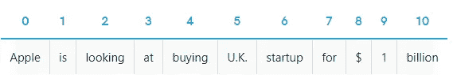
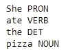
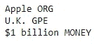
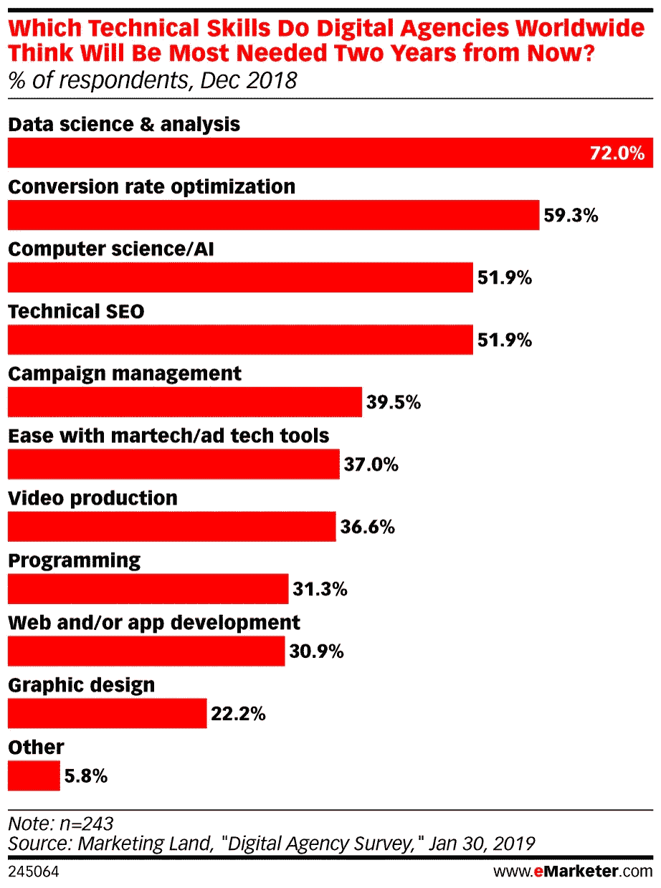

# 那么 spaCy 是什么？

> 原文：<https://towardsdatascience.com/so-whats-spacy-ad65aa1949e0?source=collection_archive---------12----------------------->

## 以及为什么它在数字营销中很重要


如果说 Python 中一个针对表格和结构化数据的普通数据分析工具有[熊猫](https://pandas.pydata.org/)，那么**中针对文本和非结构化数据的自然语言处理** (NLP)中的数据分析工具有 [**spaCy**](https://spacy.io/) 。

你看。

当您第一次作为数据科学家开始工作时，您可能会处理结构化数据，根据您的需要，这些数据不一定需要空间来处理复杂的文本数据。

在大多数情况下——至少在我看来——[Pandas](/why-and-how-to-use-pandas-with-large-data-9594dda2ea4c)将适合您的使用，因为它足够强大，可以为结构化数据进行大部分数据清理和分析。

一旦你开始处理**非结构化文本数据**——基本上是 NLP 的东西——熊猫不再能处理这些数据，这时 spaCy 就有了大量的内置功能，可以通过复杂高效的 NLP 技术来处理、分析甚至理解这些数据。

> **NLP** 是**人工智能**的一个子领域，与计算机和人类语言之间的交互有关。
> 
> NLP 是计算机从人类语言中分析、理解和推导含义的过程。

事实上，早在一段时间前，我和我的一个客户一起工作，理解单词在上下文中的意思以及文本之间的关系。

那是我偶然发现斯帕西的时候，从那以后我再也没有回头看。

在这篇文章结束时，我希望你能**更多地了解 spaCy** 以及如何**在你的数字营销空间**以及其他领域利用这个强大的工具。

我们开始吧！

# spaCy 是什么，为什么你需要关心它？


[Natural Language Processing With spaCy in Python](https://morioh.com/p/1c7376d3fbd7)

也许您是一名数据科学家，想要了解更多有关 spaCy 的信息，以便在您的项目中使用。

也许你是一家计划在日常工作中利用 NLP 技术的公司，尤其是在数字营销领域。

或者也许你只是对当前最先进的 NLP 中的流行库感兴趣。

我强烈推荐您查看 [**spaCy**](https://spacy.io/usage/spacy-101) ，因为您可以分析大量文本，并通过统计建模和高级深度学习方法从非结构化数据中获得洞察力。

这是一个免费的开源 Python 库，专为 NLP 应用程序的生产使用而设计。它易于使用的特性和直观的 API 使得它非常受欢迎和有吸引力。

也许现在你会问，“那么 spaCy 到底能为我做些什么呢？”

我的回答是，“看你需要什么了。”

spaCy 拥有太多[功能，我只列出一些关键特性供您参考:](https://realpython.com/natural-language-processing-spacy-python/#what-are-nlp-and-spacy)

## 1.标记化和位置**标记**

**标记化**永远是我们进行任何文本数据处理之前的第一步。这意味着 spaCy 将通过对每种语言应用特定的规则来将句子分割成单词、标点符号、符号等。

```
import spacynlp = spacy.load("en_core_web_sm")
doc = nlp("Apple is looking at buying U.K. startup for $1 billion")
for token in doc:
    print(token.text)
```



[Tokenization](https://spacy.io/usage/spacy-101)

一旦我们有了标记化的单词，典型的下一步将是执行**词性(POS)标记**以理解语法属性(名词、动词、形容词等)。)的每个单词。

```
import spacynlp= spacy.load("en_core_web_sm")doc= nlp("She ate the pizza")for token in doc:
    print(token.text, token.pos_)
```



POS tagging results

做词性标注的主要原因之一是为基于规则的过程识别相似的语法结构，我将在后面解释。

目前，只是把词性标注作为更好地理解上下文中的单词的一种方法。

## 2.命名实体识别

命名实体是分配了名称的 ***【现实世界对象】***——例如，一个人、一个组织或一个国家。

换句话说，我们希望将单词归类到某些通用名称中，以便进一步处理。例如:

```
import spacynlp= spacy.load("en_core_web_sm")doc= nlp(u"Apple is looking at buying U.K. startup for $1 billion")for ent in doc.ents:
    print(ent.text, ent.label_)
```



Named Entity Recognition Results

在这句话中， ***“苹果正考虑以 10 亿美元收购英国初创公司”*** ，我们要给某些词分配命名实体。根据预训练模型的预测:

*   **“苹果”**公认为“公司、机构、机关等。”
*   **“英国”.**被识别为“国家、城市、州”
*   **【1 美元】**是公认的“货币价值，包括单位”

但是，模型的预测输出并不完美，因为模型是在某些特定数据集上训练的，因此需要进一步的模型训练/调整，这取决于您的使用案例。

## 3.类似

可以确定单词、句子、段落甚至整个文档/文章之间相似性。

它是使用 [**单词向量**](https://en.wikipedia.org/wiki/Word2vec) 计算的，单词向量本质上是以向量/矩阵的形式对单词含义的多维表示。

默认情况下，spaCy 返回的相似性是两个向量之间的[余弦相似性](https://en.wikipedia.org/wiki/Cosine_similarity)——但是如果需要的话可以调整。

```
import spacy# Load a larger model with vectors
nlp = spacy.load('en_core_web_md')# Compare two documents
doc1 = nlp("I like fast food")
doc2 = nlp("I like pizza")
print(doc1.similarity(doc2))
```

使用 spaCy，我们可以只用一行代码计算相似性得分，上面两个句子的得分是 86%。

在这种情况下，相似性得分有点道理，因为两个句子都在谈论食物。

事实上，预测相似性对许多类型的应用程序都很有用。例如，根据用户阅读的文章向用户推荐相似的文章。标记社交媒体上的重复或相似内容也很有帮助，比如脸书和推特上的帖子。

# 为什么空间在数字营销中很重要



[Technical skills that will be most needed two years from now](https://www.emarketer.com/chart/226138/which-technical-skills-do-digital-agencies-worldwide-think-will-most-needed-two-years-now-of-respondents-dec-2018)

信不信由你，随着数据科学和大数据生态系统的兴起，传统营销迟早会让位于数据驱动的营销。

随着[每天产生数十亿的文本数据](https://www.forbes.com/sites/bernardmarr/2018/05/21/how-much-data-do-we-create-every-day-the-mind-blowing-stats-everyone-should-read/#3199f03d60ba)，需要更先进的工具以前所未有的速度分析这些大数据，从而为公司和机构提供可操作的见解。

SpaCy 专为轻松处理生产中的大量数据而构建。

一旦你知道如何利用这个工具的功能，可能性是无限的，包括**情感分析**和大规模构建**推荐系统**。

许多例子中的一个——我敢肯定你以前遇到过这种情况——是向用户推荐与他们当前正在看的内容相似的内容。

如果你正在浏览脸书或 Medium，推荐系统会一直在后台运行，向你展示你最感兴趣的最相关和最相似的帖子或文章。

> 人们喜欢个性化。

如果你可以利用 spaCy(或任何其他工具)来了解你的客户对你的服务的感受，并向他们推送相关内容，他们很可能会对你的服务更加满意和高兴。

这只是 spaCy 能够做的许多很酷的事情之一。

# 最后的想法


[Source](https://unsplash.com/photos/6lcT2kRPvnI)

感谢您的阅读。

如果你已经做到了这一步，我希望现在你已经对 spaCy 有了更多的了解，将来会有更多的特性加入进来，因为它仍在由世界各地许多优秀的开发人员积极开发中。

归根结底，spaCy 只是许多公司和机构用来分析文本数据和利用高级 NLP 进行预测的众多工具之一。

> NLP 不再只是未来。已经到了。

理解如何在项目和工作中使用它是很重要的，尤其是当涉及大量文本数据时。

一如既往，如果您有任何问题或意见，请随时在下面留下您的反馈，或者您可以随时通过[我的网站](https://www.admondlee.com/)或 [LinkedIn](https://www.linkedin.com/in/admond1994/) 联系我。在那之前，下一篇文章再见！😄

# 关于作者

[**Admond Lee**](https://www.linkedin.com/in/admond1994/) 目前是东南亚排名第一的商业银行 API 平台[**Staq**](https://www.trystaq.com)**—**的联合创始人/首席技术官。

想要获得免费的每周数据科学和创业见解吗？

你可以在 [LinkedIn](https://www.linkedin.com/in/admond1994/) 、 [Medium](https://medium.com/@admond1994) 、 [Twitter](https://twitter.com/admond1994) 、[脸书](https://www.facebook.com/admond1994)上和他联系。

[](https://www.admondlee.com/) [## 阿德蒙德·李

### 让每个人都能接触到数据科学。Admond 正在通过先进的社交分析和机器学习，利用可操作的见解帮助公司和数字营销机构实现营销投资回报。

www.admondlee.com](https://www.admondlee.com/)