# 基于机器学习的社交媒体情感分析:第一部分

> 原文：<https://towardsdatascience.com/social-media-sentiment-analysis-49b395771197?source=collection_archive---------2----------------------->

社交媒体为世界各地的人们打开了一个全新的世界。人们只需点击一下鼠标就能获得大量信息。随着信息而来的是人们的观点，随之而来的是人们对一个话题的积极和消极的看法。有时这也会导致欺凌和传递对某人或某事的仇恨言论。


因此，在本文中，我们将使用包含推文集合的数据集来检测与特定推文相关的情绪，并使用机器学习相应地检测它是负面还是正面。

N***ote**:****使用* ***Jupyter 笔记本*** *或****Google Colab****强烈推荐。*

如果你想了解更多关于 ***Jupyter 笔记本*** *及其功能的信息，请阅读这篇博文。*

[](/jypyter-notebook-shortcuts-bf0101a98330) [## Jupyter 笔记本快捷方式

### Jupyter 笔记本是什么？

towardsdatascience.com](/jypyter-notebook-shortcuts-bf0101a98330) 

那么我们开始吧，好吗？


Classifying tweets into positive or negative sentiment

# **数据集描述**

形式上，给定一个推文和标签的训练样本，其中**标签‘1’**表示推文是**种族主义/性别歧视**，而**标签‘0’**表示推文是**非种族主义/性别歧视**，我们的目标是预测给定测试数据集上的标签。

*   id:与给定数据集中的 tweets 相关联的 id。
*   tweets:从各种来源收集的 tweets，带有积极或消极的情绪。
*   标签:带有**标签‘0’**的推文属于**正面情绪**，而带有**标签‘1’**的推文属于**负面情绪。**

**导入必要的包**

**读取 train.csv 熊猫文件**

*   在第一行中，我们使用 Pandas 读取 train.csv 文件。
*   在第二行中，作为安全备份，我们保留了原始 train.csv 文件的副本。**我们制作了一份训练数据的副本，这样即使我们不得不在该数据集中进行任何更改，我们也不会丢失原始数据集。**

**训练数据集概述**

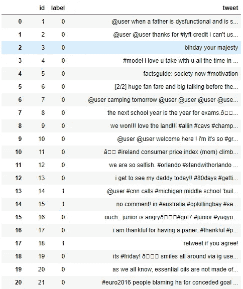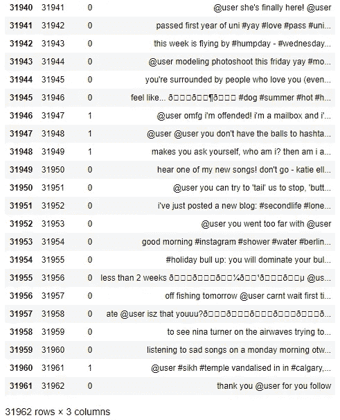

正如你所看到的，我们的数据集中有 3 个属性，总共有 31962 条带标签的推文，“1”代表负面情绪的推文，“0”代表正面情绪的推文。

**读取 test.csv 熊猫文件**

*   在第一行中，我们使用 Pandas 读取 test.csv 文件。
*   在第二行中，作为安全备份，我们保留了原始 test.csv 文件的副本。**我们制作了测试数据的副本，这样即使我们不得不在这个数据集中做任何更改，我们也不会丢失原始数据集。**

**测试数据集概述**

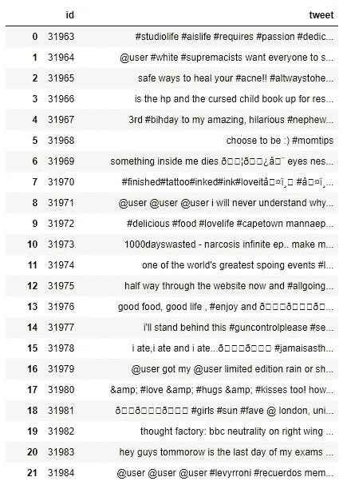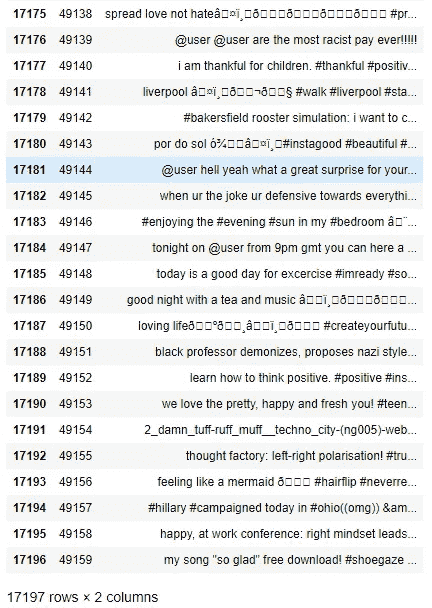

如我们所见，这里有 2 个**属性**，即**‘id’**和**‘tweets’。**这是我们将在其上测试我们的机器学习模型的数据集，因此它是未标记的。

# **数据预处理**

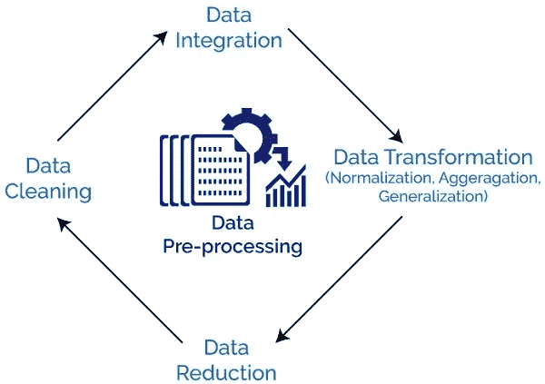

Steps of data pre-processing

让我们从数据集的预处理开始。

## 第一步:

**合并 train.csv 和 test.csv 文件。**

Pandas `**dataframe.append()**`函数用于将其他数据帧的行追加到给定数据帧的末尾，返回一个新的数据帧对象。

**组合训练和测试数据集概述。**

> 在单元格中键入 **combine.head()** ，您会得到以下结果。

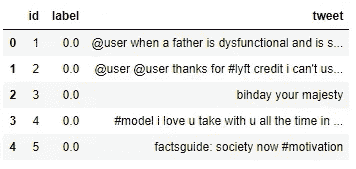

> 再次在单元格中键入 combine.tail()，您会得到以下结果。

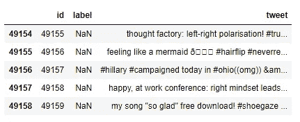

Test.csv appended with the train.csv file

不在原始数据帧中的列被添加为新列，并且新单元格被填充了`NaN`值。

要了解更多关于熊猫的 append()函数，请参考下面的链接。

 [## 熊猫。DataFrame.append - pandas 0.25.1 文档

### 将 other 的行追加到调用方的末尾，返回一个新对象。“其他”中不在调用者中的列是…

pandas.pydata.org](https://pandas.pydata.org/pandas-docs/stable/reference/api/pandas.DataFrame.append.html) 

## 第二步

**移除 Twitter 句柄(@User)**

在我们的分析中，我们可以清楚地看到 Twitter 句柄对解决我们的问题没有任何重要的贡献。所以我们最好在数据集中删除它们。

下面给出了一个用户定义的函数，用于从推文中删除不需要的文本模式。它有两个参数，一个是文本的原始字符串，另一个是我们想要从字符串中移除的文本模式。该函数返回相同的输入字符串，但没有给定的模式。我们将使用这个函数从我们数据中的所有 tweets 中删除模式' @user '。

这里使用 NumPy Vectorization**' NP . vectorize()'**，因为在处理中大型数据集时，它比传统的 for 循环快得多。

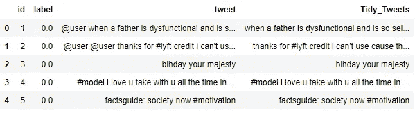

After removing the twitter handles.

更详细的讨论可以参考下面这篇中型博客。

[](/data-science-with-python-turn-your-conditional-loops-to-numpy-vectors-9484ff9c622e) [## Python 数据科学:将条件循环转化为 Numpy 向量

### 为了加速整体数据转换，甚至对条件循环进行矢量化也是值得的。

towardsdatascience.com](/data-science-with-python-turn-your-conditional-loops-to-numpy-vectors-9484ff9c622e) 

## 第三步

**删除标点、数字和特殊字符**

标点符号、数字和特殊字符帮助不大。最好将它们从文本中删除，就像我们删除 twitter 句柄一样。这里我们将用空格替换除字符和标签之外的所有内容。

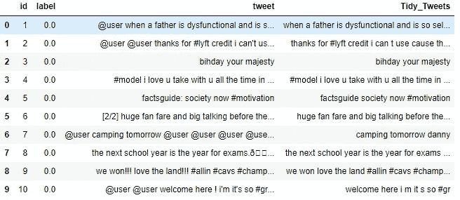

## 步骤 4

**删除短词**

在选择要删除的单词的长度时，我们必须小心一点。所以，我决定删除所有长度不超过 3 的单词。这些字也被称为**停止字。**

例如，像“嗯”、“和”、“哦”这样的术语用处很小。最好摆脱他们。

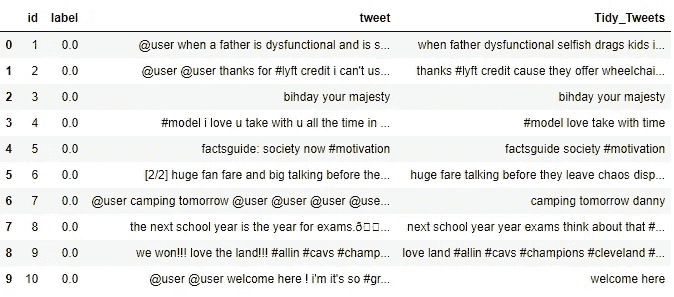

## 第五步

**标记化**

现在，我们将对数据集中所有清理过的推文进行标记。记号是单独的术语或单词，记号化是将一串文本拆分成记号的过程。

**这里我们对我们的句子进行标记，因为我们将在下一步中应用源自“NLTK”*包的内容。***

*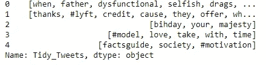*

*Results after tokenization*

## *第六步*

***词干***

*词干提取是一个基于规则的过程，从单词中去除后缀(“ing”、“ly”、“es”、“s”等)。*

*例如——“玩”、“玩家”、“玩过的”、“玩”和“玩”是“玩”这个词的不同变体*

*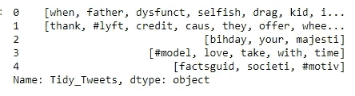*

*现在让我们把这些代币缝合在一起*

*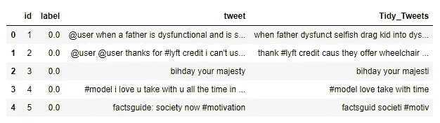*

*最后，当我们必须预处理包含文本数据的数据集时，这些是要遵循的基本步骤。*

*N **注:** *要深入了解预处理不同阶段使用的概念，如* ***词干化、标记化、正则表达式、NLTK*** *请参考下面的博文。**

*[](/introduction-to-natural-language-processing-for-text-df845750fb63) [## 文本自然语言处理导论

### 读完这篇博文后，你会知道一些从一些文本中提取特征的基本技术，所以你可以使用…

towardsdatascience.com](/introduction-to-natural-language-processing-for-text-df845750fb63) 

好了，现在我们完成了数据预处理阶段。

让我们进入下一步，即**数据可视化。**

# 数据可视化

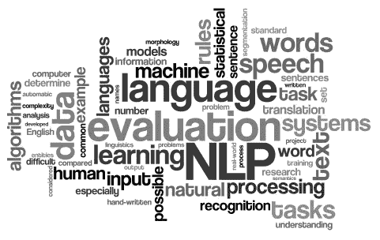

因此，数据可视化是机器学习项目中最重要的步骤之一，因为它让我们在应用不同的机器学习模型之前，对数据集及其所有内容有一个大致的了解。

那么，让我们开始吧。

## WordCloud

一种流行的可视化技术是 **WordCloud。**


单词云是一种可视化，其中最频繁出现的单词以大尺寸出现，不太频繁出现的单词以小尺寸出现。

因此，在 Python 中，我们有一个用于生成 **WordCloud** 的包。

让我们深入代码，看看如何生成一个 **WordCloud。**

**导入生成词云所需的包**

## 正在为标签为“0”的推文生成 WordCloud。

存储数据集中所有非种族主义/性别歧视的词汇。

生成所需的**文字云**的代码。

***为了更好的理解，每一行都做了适当的注释。***

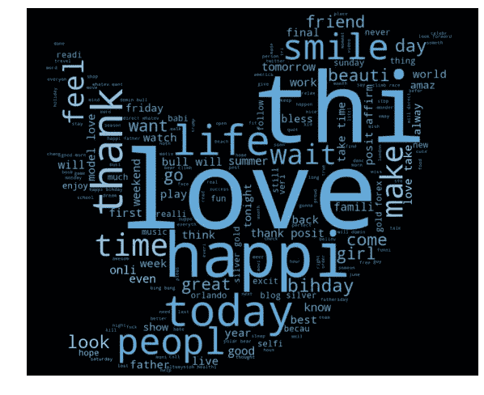

Generated WordCloud

我们可以看到大多数单词是积极的或中性的。快乐、微笑和爱是最常见的。因此，大多数常用词与积极情绪的推文是一致的。

## 正在为标签为“1”的推文生成 WordCloud。

**存储数据集中所有非种族主义/性别歧视的词语。**

生成所需的 **WordCloud** 的代码。

***为了更好的理解，每一行都做了适当的注释。***

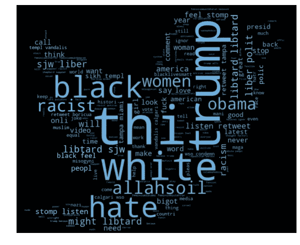

Generated WordCloud

我们可以清楚地看到，大多数单词都有负面的含义。所以，看起来我们有一个很好的文本数据要处理。

## 理解标签对推文情绪的影响


Twitter 上的哈希标签可以通过使用一般和非特定的标签对你的追随者数量产生重大影响。如果你给一般的词加了标签，比如 **#creative，**或者正在发生的事件，比如 **#TIFF，**，你的推文很可能会超出你的关注者名单。

因此，我们将看看如何提取标签，看看哪些标签属于哪个类别。

**从推文中提取标签的功能**

***数据集中所有正面评论标签的嵌套列表。***

**输出:**

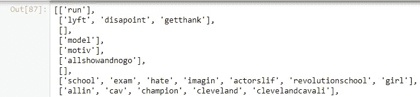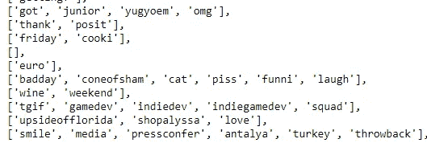

***这里我们把列表*** 去掉

**输出:**

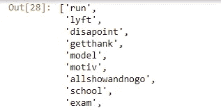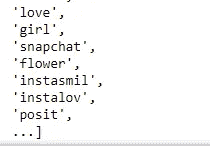

***数据集*** 中负面评论的所有标签的嵌套列表

**输出:**

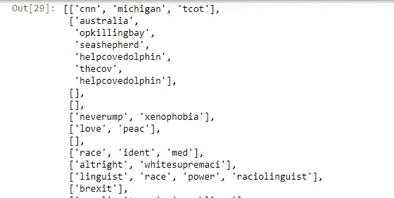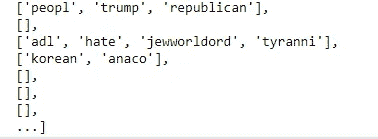

***在这里我们把*这个单子去掉**

**输出:**

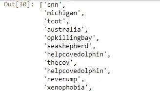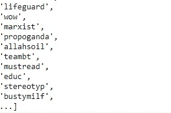

## 绘制条形图-绘图

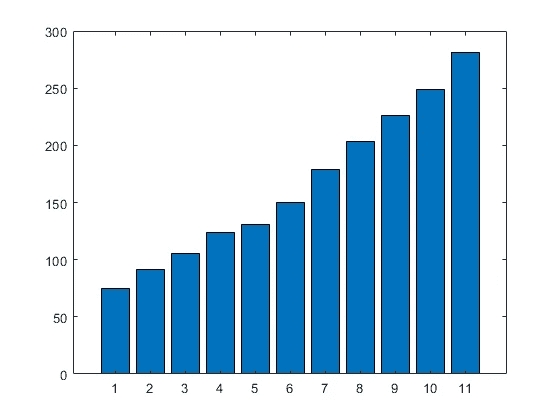

## 对于数据集中正面的推文

***统计有积极情绪的词的频率***

输出:

```
FreqDist({'love': 1654, 'posit': 917, 'smile': 676, 'healthi': 573, 'thank': 534, 'fun': 463, 'life': 425, 'affirm': 423, 'summer': 390, 'model': 375, ...})
```

***为标签*** 中最常用的词创建一个数据帧

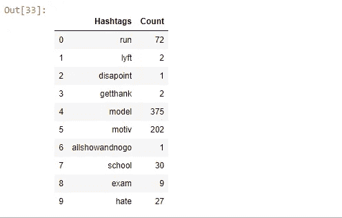

***绘制用于标签*** 的 20 个最常用词的条形图

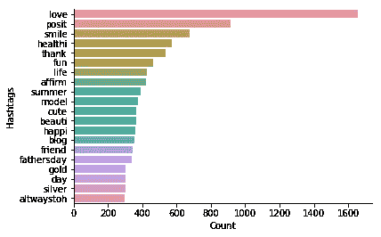

Count BarPlot

## 对于数据集中的负面推文

***统计有负面情绪的词语出现的频率***

**输出:**

```
FreqDist({'trump': 136, 'polit': 95, 'allahsoil': 92, 'liber': 81, 'libtard': 77, 'sjw': 75, 'retweet': 63, 'black': 46, 'miami': 46, 'hate': 37, ...})
```

***为 hashtags*** 中最常用的单词创建数据帧

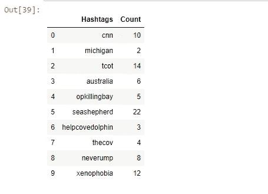

***绘制用于标签的 20 个最常用单词的条形图***

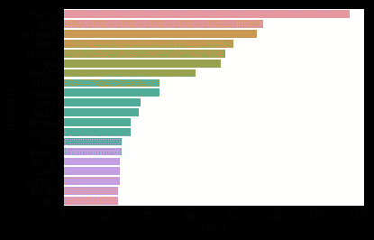

第一部分到此结束

那么，让我们看看到目前为止我们学到了什么。

# 总结:

## **1。问题陈述**

我们在这个项目中到底要做什么。

## 2.**数据集描述**

在这里，我们得到了关于我们将要使用的数据集的概述，以及训练和测试是如何划分的，其中一个被标记，另一个未被标记，分别具有每个数据集中出现的 tweets 的数量。

## 3.**数据预处理**

*   移除 Twitter 句柄(@user)
*   删除标点、数字、特殊字符
*   删除短单词，即有长度的单词
*   标记化
*   堵塞物

## 4.数据可视化

*   WordCloud
*   条形图* 

*伙计们，现在就到此为止。将很快回来，在这篇文章的第二部分，我们将了解两种最流行的单词嵌入技术 ***单词袋*** *和* ***TF-IDF。****

**我们还将了解如何将不同的* ***机器学习模型*** *应用到这个问题陈述中。**

**敬请期待。**

*如果你想阅读这篇文章的第二部分，请点击下面的链接。*

*[](/social-media-sentiment-analysis-part-ii-bcacca5aaa39) [## 基于机器学习的社交媒体情感分析:第二部分

### 大家好，让我们从第一部分停止的地方开始。

towardsdatascience.com](/social-media-sentiment-analysis-part-ii-bcacca5aaa39)* 

*你可以打电话给我*

***领英**:[https://www.linkedin.com/in/deepak-das-profile/](https://www.linkedin.com/in/deepak-das-profile/)*

*GitHub:[https://github.com/dD2405](https://github.com/dD2405)*

## ***快乐阅读！！！***