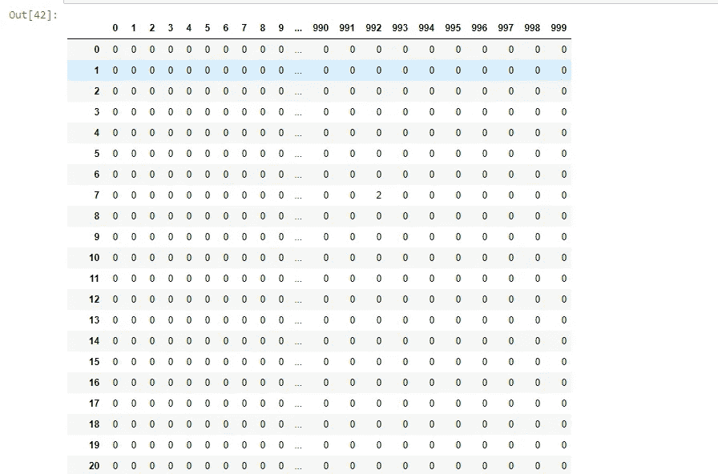
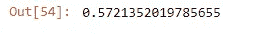
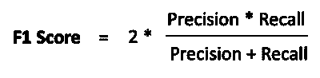

# 基于机器学习的社交媒体情感分析:第二部分

> 原文：<https://towardsdatascience.com/social-media-sentiment-analysis-part-ii-bcacca5aaa39?source=collection_archive---------1----------------------->


Photo by [Tengyart](https://unsplash.com/@tengyart?utm_source=medium&utm_medium=referral) on [Unsplash](https://unsplash.com?utm_source=medium&utm_medium=referral)

大家好，让我们从第**部分—第一部分**停止的地方开始。

在本帖中，我们将讨论如何通过使用**词汇袋**和 **TF-IDF** 从文本数据集中提取特征。然后，我们将看到我们如何应用**机器学习** **模型**，使用这些特征来预测一条推文是属于**积极:【0】**还是**消极:【1】**情绪。

N***ote***:*如果你还没有看过本系列的****Part—I****一定要看一下，以便更好地理解* ***Part — II。***

[](https://medium.com/@deepakdas_13693/social-media-sentiment-analysis-49b395771197) [## 基于机器学习的社交媒体情感分析:第一部分

### 社交媒体为世界各地的人们打开了一个全新的世界。人们只需点击一下鼠标就能变得巨大…

medium.com](https://medium.com/@deepakdas_13693/social-media-sentiment-analysis-49b395771197) 

那么，我们开始吧？

# 从干净的推文中提取特征

## 词袋特征

单词包是一种从文本文档中提取特征的方法。这些特征可以用于训练机器学习算法。它创建了在训练集中的所有文档中出现的所有唯一单词的词汇表。

考虑一个名为 C of D documents {d1，d2…..dD}和从语料库 c 中提取出的 N 个唯一记号。这 N 个记号(单词)将形成一个列表，单词袋矩阵 M 的大小将由 D×N 给出。矩阵 M 中的每一行都包含文档 D(i)中记号的频率。

例如，如果你有两份文件-

*   D1:他是一个懒惰的男孩。她也很懒。
*   D2:史密斯是个懒惰的人。

首先，它使用所有文档中唯一的单词创建一个词汇表。

**['他'，'她'，'懒惰'，'男孩'，'斯密'，'人']**

正如我们在上面的列表中看到的，我们不考虑这个集合中的**“是”、“a”、“也”**，因为它们不传达模型所需的必要信息。

*   这里， **D=2，N=6**
*   大小为 2×6 的矩阵 M 将被表示为:


上表描述了包含每个文档中每个单词的词频的训练特征。这被称为单词袋方法，因为在这种方法中，单词的出现次数而不是顺序或次序是重要的。

因此，让我们将这个单词嵌入技术应用到我们可用的数据集。

我们有一个名为**计数矢量器**的包来执行这项任务。

**输出:-**



## **TF-IDF 的特点**

**TF-IDF** 代表**词频-逆文档频率，**和 **TF-IDF** 权重是信息检索和文本挖掘中经常使用的权重。该权重是一种统计度量，用于评估一个单词对集合或语料库中的文档有多重要。重要性与单词在文档中出现的次数成比例增加，但是被单词在语料库中的频率抵消。

通常情况下， **TF-IDF** 重量由两项组成:

## **词频(TF) :**

第一个计算归一化的**项频率(TF)** ，aka。一个单词在文档中出现的次数，除以该文档中的总单词数。


**示例:-**

*考虑包含 100 个单词的文档，其中单词 cat 出现 3 次。*

****【TF】****为猫则****(3/100)= 0.03****

## ***逆文档频率(IDF) :***

*第二项是**逆文档频率(IDF)，**计算为语料库中文档数量的对数除以特定项出现的文档数量。*

**

***示例:-***

*假设我们有 1000 万个文档，单词 cat 出现在其中的 1000 个文档中。*

**然后，将* ***逆文档频率【IDF】****计算为**

****log(10，000，000/1000)= 4。****

## ***TF-IDF 示例:***

***求TF-IDF 重量的公式:-***

****

*从上面的例子来看，**术语频率是 0.03** 而**逆文档频率是 4。***

**这样，TF-IDF 重量就是这些量* ***的乘积:0.03 * 4 = 0.12。****

***代码:-***

*让我们使用 Python 将这种技术应用于我们的数据集。*

*我们在 **Scikit-Learn** 中提供了一个包，称为 **TfidfVectorizer。***

***输出:-***

****

*这些是我们在数据集上用于特征提取的**单词嵌入**技术。*

*让我们进入下一步。*

***将数据集分割成训练集和验证集。***

# *将数据集分成训练集和验证集*

*通过以上两种技术，即**词袋和 TF-IDF** ，我们从数据集中的推文中提取了特征。*

*现在，我们有一个数据集包含来自**单词袋**模型的特征，另一个数据集包含来自 **TF-IDF** 模型的特征。*

*第一项任务是将数据集分为训练集和验证集，以便我们可以在应用模型预测未知和未标记的测试数据之前训练和测试我们的模型。*

***使用训练集的词袋特征***

```
*train_bow = bow[:31962]

train_bow.todense()*
```

***输出:-***

**

***将 TF-IDF 中的功能用于训练集***

```
*train_tfidf_matrix = tfidf_matrix[:31962]

train_tfidf_matrix.todense()*
```

***输出:-***

**

***将数据分割成训练和验证集***

```
*from sklearn.model_selection import train_test_split*
```

***词袋功能***

```
*x_train_bow, x_valid_bow, y_train_bow, y_valid_bow = train_test_split(train_bow,train['label'],test_size=0.3,random_state=2)*
```

***TF-IDF 特点***

```
*x_train_tfidf, x_valid_tfidf, y_train_tfidf, y_valid_tfidf = train_test_split(train_tfidf_matrix,train['label'],test_size=0.3,random_state=17)*
```

*我们已经将数据集分成了训练集和验证集。*

*想详细了解用于[](https://en.wikipedia.org/wiki/Feature_extraction)**特征提取的**网袋**和 **TF-IDF** 型号。请务必阅读下面的博文，进行深入的讨论。***

***[](/introduction-to-natural-language-processing-for-text-df845750fb63) [## 文本自然语言处理导论

### 读完这篇博文后，你会知道一些从一些文本中提取特征的基本技术，所以你可以使用…

towardsdatascience.com](/introduction-to-natural-language-processing-for-text-df845750fb63) 

最后，我们来到了这个系列最期待的部分，即将**机器学习模型**应用于我们的数据集。

# 应用机器学习模型

*我们要解决的底层问题属于* ***监督机器学习*** *范畴。因此，在继续对我们的数据集应用不同的机器学习模型之前，让我们简单讨论一下这个主题。*

## 监督机器学习:-

大多数实用的机器学习使用**监督学习**。

在监督学习中，您有输入变量(x)和输出变量(Y ),并使用算法来学习从输入到输出的映射函数。

## Y = f(X)

目标是很好地逼近映射函数，以便当您有新的**输入** **数据(x)** 时，您可以预测该数据的**输出变量(Y)** 。

它被称为监督学习，因为算法从训练数据集学习的过程可以被认为是教师监督学习过程。我们知道正确的答案，算法迭代地对训练数据进行预测，并由老师进行纠正。当算法达到可接受的性能水平时，学习停止。

监督学习问题可以进一步分为回归和分类问题。

*   **分类**:分类问题是当输出变量是一个类别时，如**【红色】**或**【蓝色】**或**【疾病】****【无疾病】**或在我们的例子中**【阳性】**或**【阴性】**
*   **回归**:一个回归问题是当输出变量是一个实值时，比如**“美元”**或者**“重量”。**

我们的问题属于分类类别，因为我们必须将我们的结果分为**阳性**或**阴性**类。

还有另一类机器学习算法叫做**无监督机器学习**你有一个输入数据，但没有相应的输出变量。无监督学习的目标是对数据中的底层结构或分布进行建模，以便了解更多关于数据的信息。但这与我们的问题陈述无关。

## 继续:-

因此，从上面的数据集分割中，我们看到我们将使用来自**单词袋**和 **TF-IDF** 的特征用于我们的**机器学习模型**。

我们通常使用不同的模型来查看哪个模型最适合我们的数据集，然后我们使用该模型来预测测试数据的结果。

这里我们将使用 3 种不同的模型

*   **逻辑回归**
*   **XGBoost**
*   **决策树**

然后我们将比较它们的性能，并选择具有最佳可能特征提取技术的最佳可能模型来预测我们的测试数据的结果。

## ***从 sklearn 导入 f1 _ score***

*我们将始终使用 F1 分数来评估我们模型的性能，而不是准确性。在这篇文章的结尾你会知道为什么。*

**代码:-**

```
from sklearn.metrics import f1_score
```

现在，让我们继续对我们的数据集应用不同的模型，这些模型来自使用**词汇袋**和 **TF-IDF 提取的特征。**

# 逻辑回归

***我们要用的第一个模型是*******Logistic 回归。****

```
*from sklearn.linear_model import LogisticRegressionLog_Reg = LogisticRegression(random_state=0,solver='lbfgs')*
```

## ***文字袋功能***

****拟合 Logistic 回归模型。****

```
*Log_Reg.fit(x_train_bow,y_train_bow)*
```

****预测概率。****

```
*prediction_bow = Log_Reg.predict_proba(x_valid_bow)

prediction_bow*
```

***输出:-***

**

*Predicting the probabilities for a tweet falling into either Positive or Negative class.*

*如果你对上面的输出感到困惑，读一读这个堆栈溢出的回答，你会对此有一个清晰的认识。*

*[](https://stackoverflow.com/a/27780053/8138208) [## 9.000000000 e-01 是一个什么样的数字？

### 我声明了一个 x 变量并用 np.arange(-1，1，0.1)填充它。print(x)方法给了我类似于…

stackoverflow.com](https://stackoverflow.com/a/27780053/8138208) 

输出基本上为我们提供了推文落入负面或正面类别的概率。

***计算 F1 分数***



F1 Score

## TF-IDF 功能

***拟合 Logistic 回归模型。***

```
Log_Reg.fit(x_train_tfidf,y_train_tfidf)
```

***预测概率。***

```
prediction_tfidf = Log_Reg.predict_proba(x_valid_tfidf)

prediction_tfidf
```

**输出:-**


Predicting the probabilities for a tweet falling into either Positive or Negative class

***计算 F1 分数***


F1 Score

N***ote:***[***嵌套列表***](https://stackoverflow.com/a/27527429/8138208) *中的元素[0][0]为* ***标签:0 或正推文*** *，元素[0][1]为* ***标签:1 或负推文。***

要深入分析逻辑回归，请阅读以下文章。

[](https://machinelearningmastery.com/logistic-regression-for-machine-learning/) [## 机器学习的逻辑回归

### 逻辑回归是机器学习从统计学领域借用的另一种技术。它是最受欢迎的…

machinelearningmastery.com](https://machinelearningmastery.com/logistic-regression-for-machine-learning/) 

# XGBoost

***我们使用的下一个模型是 XGBoost。***

```
from xgboost import XGBClassifier
```

## **文字袋功能**

```
model_bow = XGBClassifier(random_state=22,learning_rate=0.9)
```

***拟合 XGBoost 模型***

```
model_bow.fit(x_train_bow, y_train_bow)
```

***预测概率。***

```
xgb = model_bow.predict_proba(x_valid_bow)

xgb
```


Predicting the probability of a tweet falling into either Positive or Negative class.

***计算 F1 分数***

**输出:-**


F1 Score

## TF-IDF 功能

```
model_tfidf = XGBClassifier(random_state=29,learning_rate=0.7)
```

***拟合 XGBoost 模型***

```
model_tfidf.fit(x_train_tfidf, y_train_tfidf)
```

***预测概率。***

```
xgb_tfidf=model_tfidf.predict_proba(x_valid_tfidf)

xgb_tfidf
```


Predicting the probability of a tweet falling into either Positive or Negative class.

***计算 F1 分数***

**输出:-**


F1 Score

要更深入地分析 XGBoost 模型，请阅读下面的文章。

[](https://machinelearningmastery.com/gentle-introduction-xgboost-applied-machine-learning/) [## 用于应用机器学习的 XGBoost 简介

### XGBoost 是一种算法，最近一直主导着应用机器学习和 Kaggle 竞争…

machinelearningmastery.com](https://machinelearningmastery.com/gentle-introduction-xgboost-applied-machine-learning/) 

# 决策树

我们使用的最后一个模型是决策树。

```
from sklearn.tree import DecisionTreeClassifierdct = DecisionTreeClassifier(criterion='entropy', random_state=1)
```

## 词袋特征

***拟合决策树模型。***

```
dct.fit(x_train_bow,y_train_bow)
```

***预测概率。***

```
dct_bow = dct.predict_proba(x_valid_bow)

dct_bow
```


Predicting the probability of a tweet falling into either Positive or Negative class

***计算 F1 分数***


F1 Score

## TF-IDF 功能

***拟合决策树模型***

```
dct.fit(x_train_tfidf,y_train_tfidf)
```

***预测概率。***

```
dct_tfidf = dct.predict_proba(x_valid_tfidf)

dct_tfidf
```


Predicting the probability of a tweet falling into either Positive or Negative class

***计算 F1 分数***


F1 Score

要更深入地分析决策树模型，请阅读下面的文章。

[](/light-on-math-machine-learning-intuitive-guide-to-understanding-decision-trees-adb2165ccab7) [## 理解决策树的直观指南

### 理解决策树的底层机制和参数

towardsdatascience.com](/light-on-math-machine-learning-intuitive-guide-to-understanding-decision-trees-adb2165ccab7) 

# 模型比较

现在，让我们用不同的单词嵌入技术来比较我们在数据集上应用的不同模型。

## **话袋**


F1 Score of different models using features from Bag-of-Words

**对比图**


## **TF-IDF**


**对比图**


正如我们从**词汇袋**和 **TF-IDF** 中看到的，最佳可能模型是**逻辑回归。**

现在，让我们比较一下**逻辑回归**模型与特征提取技术**词汇袋**和 **TF-IDF 的得分。**


**对比图**


# 预测我们测试数据的结果

从上面的对比图中我们可以清楚地看到，最好的可能的 **F1 得分**是通过使用 **TF-IDF** 特征的**逻辑回归**模型获得的。

**代码:-**

# 预测后的结果

```
res = pd.read_csv('result.csv')res
```


从上面的输出我们可以看到，我们的具有 **TF-IDF** 特征的**逻辑回归**模型预测一条推文是否属于**正面-标签:0** 或**负面-标签:1** 情绪的类别。

# 摘要:-

## 5.使用的特征提取技术

*   词汇袋
*   TF-IDF

## 6.使用的机器学习模型

*   逻辑回归
*   XGBoost
*   决策树

## 7.使用的评估指标

*   F1 分数

所以，我们终于到达了旅程的终点。我们完成了使用**机器学习**来预测特定推文情绪的任务。

# 收拾一些残局。


出现的问题有**“F1 成绩是多少？”**和**为什么 F1 的分数而不是准确度？”。**

因此，在我们继续之前，你需要对术语有一个基本的概念，例如**混淆矩阵**及其内容。

因此，请参考本文，对与**混淆矩阵**相关的术语有一个基本的了解。

[](/understanding-confusion-matrix-a9ad42dcfd62) [## 理解混淆矩阵

### 当我们得到数据，经过数据清洗，预处理和争论，我们做的第一步是把它提供给一个…

towardsdatascience.com](/understanding-confusion-matrix-a9ad42dcfd62) 

好了，让我们来回答上面的疑问。

## 为什么 F1 是分数而不是准确度？

让我们为我们的训练数据集**标签，即‘0’或‘1’，生成一个**计数图**。**

```
sns.countplot(train_original['label'])sns.despine()
```


*   从上面生成的**计数图**中，我们可以看到我们的数据集是多么不平衡。我们可以看到，与情绪为**负——标签:1** 的值相比，情绪为**正——标签:0** 的值在数量上相当高。
*   因此，当我们将**准确性**作为我们的评估指标时，可能会遇到大量误报的情况。这就是为什么我们使用 **F1 分数**而不是**准确度作为我们的评估标准。**

## F1 成绩是多少？

要了解 F1 分数，我们首先要了解**精度**和**召回。**

*   **精度**是指你的相关结果的百分比。
*   **召回**是指被你的算法正确分类的相关结果总数的百分比。


*   我们总是面临**精度**和**召回**之间的权衡情况，即高**精度**给出低**召回**，反之亦然。
*   在大多数问题中，你可以优先考虑最大化精确度，或者回忆，这取决于你试图解决的问题。但总的来说，有一个更简单的衡量标准，它同时考虑了精确度和召回率，因此，你可以将这个数字最大化，以使你的模型更好。这个指标被称为**F1-得分**，它只是**精度**和**召回**的调和平均值。



所以这个标准看起来更加容易和方便，因为你只需要最大化一个分数，而不是平衡两个独立的分数。

最后，我们已经到了这篇文章的两部分系列的结尾。我希望在这篇文章之后，你对如何从文本处理**开始，并对文本数据应用* ***机器学习*** *模型并从中提取信息有一个基本的了解。**

**之后，我们可以尝试使用可用的 web 框架，如* ***Flask、FastAPI*** *等，在网站上部署我们的机器学习模型。到生产。但那是另一篇博文的内容了。**

*您可以通过以下方式联系到我:*

***LinkedIn**:【https://www.linkedin.com/in/deepak-das-profile/ *

*GitHub:[https://github.com/dD2405](https://github.com/dD2405)*

## ***快乐阅读！！！*******