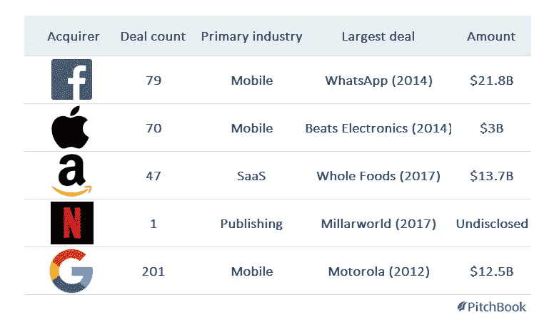

# 社会迫切需要一个替代网络

> 原文：<https://towardsdatascience.com/society-desperately-needs-an-alternative-web-3989a9c01b25?source=collection_archive---------18----------------------->

## 现在转向一条旨在自由信息、保护我们的隐私并对人类需求负责的互联网之路是否为时已晚？

Deposit Photos: Leave Me Alone

我看到一个正在崩溃的社会。猖獗的技术正在同时颠覆以前经济增长的支柱产业。随着工资停滞不前，在日益自动化的经济中，就业机会越来越少，工作的男人和女人已经感受到了它的影响。日益加剧的工资不平等和金融脆弱性引发了民粹主义，多米诺骨牌效应正在 T2 蔓延。人们很愤怒。他们要求公平，并受到可能危及他们生计的政策和外来者的威胁。这造成了国家内部和国家之间更大的文化和种族分歧。技术使得这种愤怒以前所未有的速度传播、影响和操纵，导致两极分化加剧，焦虑情绪蔓延。从全球来看，我们的联系更加紧密，这对我们不利。我们已经见证了[政府](https://www.rt.com/viral/396710-government-cyber-troops-social-media/)和[企业](https://www.dailyherald.com/business/20181221/social-media-companies-under-pressure-to-share-disinformation-data-with-one-another)利用技术传播虚假信息以获取利益。虽然监管机构努力应对这些危害，但科技巨头们继续有增无减地运用他们的影响力和权力来建立足迹，使消费者和企业越来越依赖于他们的平台和技术栈。我们不能逃避，也不想逃避。这就引起了人们的关注…

这篇名为[世界正被数据污染所窒息](https://washingtonmonthly.com/magazine/january-february-march-2019/the-world-is-choking-on-digital-pollution/)的文章对我们今天所目睹的一切进行了深刻的提炼:

> 进步不是没有代价的。就像 200 年前的工厂一样，数字进步带来了污染，降低了我们的生活质量和民主的力量……我们现在正面对着一个嵌入我们生活和机构每一个结构中的系统，以深刻影响我们基本价值观的方式塑造着我们的社会。

# 蒂姆·伯纳斯·李对万维网的意图已经偏离了轨道:

蒂姆·伯纳斯·李(Tim Berners Lee)曾经有过这样一个乐观主义的观点:如果我们能开发一个每个人都可以免费使用的网络，并在全球范围内激发创造力、联系、知识和乐观主义，会怎么样？他认为互联网是 T2 的基本人权，

> …这意味着保证所有人都能以可承受的价格访问互联网，确保互联网数据包的传递不受商业或政治歧视，并保护网络用户的隐私和自由，无论他们住在哪里。

1989 年至 1991 年间，蒂姆·伯纳斯·李领导了[万维网](https://www.thoughtco.com/history-of-the-internet-1992007)的开发，并发布了“语言 HTML(超文本标记语言)来创建网页 HTTP(用于创建网页)、HTTP(超文本传输协议)和 URL(统一资源定位符)。”

现在无处不在的 WWW 掀起了一场规模巨大的运动，彻底改变了我们做生意、获取和消费信息、建立联系的方式，并使创新和乐观的心态永久化。

还出现了一个肆无忌惮的机会主义和剥削、不确定性和不平等的网络。我们看到越来越多的筒仓和回音室被焦虑、错位信任和确认偏差所驱动。随着主流消费者见证这些意图，我们注意到越来越多的边缘化促使更多人脱离这些社区和应用程序，以保护他们的心理健康。然而，技术产生的上瘾是不容易治愈的。与此同时，人们继续遭受痛苦。

最令人不安的是网络欺凌对我们孩子的影响。2016 年，[国家犯罪预防](https://www.comparitech.com/internet-providers/cyberbullying-statistics/)报告 [43%的青少年是网络欺凌的对象](http://archive.ncpc.org/resources/files/pdf/bullying/cyberbullying.pdf)，比十年前增加了 11%。其他一些令人麻木的统计数据:

*   “2017 年儿科学术协会会议显示，2008 年至 2015 年期间，因企图自杀或表达自杀想法而入院的儿童数量翻了一番”
*   “Javelin 研究发现，被欺负的儿童成为身份欺诈受害者的可能性是普通儿童的 9 倍。”
*   “来自众多研究的数据也表明，社交媒体现在是网络恶霸青睐的媒介”

# 大科技:大到不能倒？

随着网络在整个 90 年代的发展，我们见证了像谷歌、雅虎、微软以及后来的脸书和亚马逊这样的大玩家的出现。正如[克里斯·迪克森](https://medium.com/s/story/why-decentralization-matters-5e3f79f7638e)所说:

> 在第二个互联网时代，从 2000 年代中期到现在，盈利性科技公司——最著名的是谷歌、苹果、脸书和亚马逊(GAFA)——开发的软件和服务迅速超越了开放协议的能力。智能手机的爆炸式增长加速了这一趋势，因为移动应用成为互联网的主要用途。最终，用户从开放服务迁移到这些更复杂、更集中的服务。即使用户仍然访问像 web 这样的开放协议，他们通常也会通过 GAFA 软件和服务来实现。

今天，我们恰当地将一些首字母缩略词用于这些巨头:G-MAFIA(谷歌、微软、亚马逊、脸书、IBM、苹果)，或 FAANG(脸书、苹果、亚马逊、网飞和谷歌)，以及现在的 BAT(百度、阿里巴巴和腾讯)。这些参与者创造了一个逐渐集中化的互联网，限制了竞争，扼杀了初创公司的增长，这些公司更容易受到这些科技巨头的影响。我与一位社交网络创始人(他要求匿名)的讨论谈到了一个大型平台，该平台不断从他们的网站复制新发布的功能，他们这样做是透明的，因为“他们可以”他还见证了用户参与的停滞和最终的流失。如果没有必要的资源，他无法有效竞争，最终他妥协了，改变了他的商业模式，回到加密货币社区重新开始。

想想看:这八家公司脸书、苹果、微软、亚马逊、谷歌、腾讯、百度和阿里巴巴[的市值超过了“欧元区所有上市公司在新兴市场和日本的市值”G-MAFIA(不包括 IBM)在 2018 年公布的平均回报率为](https://www.thestreet.com/investing/stocks/one-stunning-stat-shows-how-important-tech-stocks-have-become-in-investing-14624703) [45%，而 S & P500](https://www.nasdaq.com/article/facebook-apple-amazon-netflix-google-who-takes-the-tech-crown-in-2018-cm902245) 的平均回报率为 19%。现在再加上科技行业的高度整合。自 2007 年以来，FAANG】总共收购了 398 家公司。这类收购提高了监管者和经济学家对反垄断监管的兴趣。IBM 以 340 亿美元的价格收购 Red Hat ,这是历史上最高的收购。

大型科技公司的估值继续上升，尽管它们的技术暴露了一些罪恶。有一种二分法将对消费者有利的东西和对股东有利的东西对立起来。我们从这些平台中获得了一些很好的经验，但我们也看到了一些看不见的伤害。无论多么无意，它们都是优先考虑用户增长和参与的业务要求的结果。这些绩效指标是推动员工绩效和公司目标的动力。当我们想到大型技术的影响时，他们的云环境和 web 托管服务器确保我们的电子邮件、我们的社交活动和我们的网站对网络上的每个人都可用。本质上，他们控制着互联网的运行。

Amy Webb 是《[*The Big Nine*](https://amywebb.io/books)*:The Tech Titans and they Thinking machine could Warp Humanity*》一书的作者，他不仅提到了 G-MAFIA，还提到了 BAT(在极具争议的[社会信用体系](https://www.businessinsider.com/china-social-credit-system-punishments-and-rewards-explained-2018-4)中带头建立信任价值的财团)。她写道:

> 我们不再假设 G-MAFIA(谷歌、苹果、脸书、IBM 和亚马逊)可以平等地为其 DC 和华尔街的主人服务，并且自由市场和我们的企业家精神将为人工智能和人类产生尽可能好的结果

毫无疑问，这九个将塑造互联网的未来。韦伯设想了几个场景，在这些场景中，中国不断侵蚀的影响力将使 AGI 能够比社会信用体系更普遍地控制世界，在这些场景中，“民主将在美国终结”。这并不令人难以置信，因为我们已经看到了 BAT 在游戏、社交媒体、金融科技领域增加投资的迹象，超过了美国的投资。

韦伯还预见了一个扼杀个人隐私的未来，我们的个人信息被锁定在这些科技巨头的操作系统中，这些巨头现在是寡头垄断，助长了“数字种姓制度”，模仿了中国熟悉的威权制度。

韦伯预测的未来是可以想象的。今天，除了《剑桥分析》和政府所谓的利用脸书操纵选民和制造混乱之外，损害，无论多么不同，都比我们意识到的更加普遍，彼此之间的联系也更加紧密。我们已经看到[亚马逊的面部识别技术](http://www.ciobulletin.com/software/mit-opposes-amazon-selling-recognition)被用于执法，这被认为是无效的，是种族偏见造成的。同样，Buzzfeed 报道了面部识别在[零售系统](https://www.buzzfeednews.com/article/leticiamiranda/retail-companies-are-testing-out-facial-recognition-at)中的使用，而没有考虑用户的同意。我们相信[脸书通过双因素认证保护我们安全的举措](https://techcrunch.com/2019/03/03/facebook-phone-number-look-up/)，而他们利用我们的手机号码来锁定我们的行为，并在此过程中削弱我们的隐私。众所周知，脸书和亚马逊都曾利用我们的数据来操纵我们的情绪。当 Tiktok 因非法收集儿童数据被罚款 570 万美元时，它只是在效仿其前任。有史以来最大的数据泄露事件涉及一些最大的科技公司，如 FB，雅虎！和优步以及像万豪和 Equifax 这样的老牌公司。下游的影响尚未实现，因为这些数据是在[暗网](https://www.thesun.co.uk/tech/5872481/facebook-accounts-dark-web-stolen-hacked-50-million/)上卖给出价最高的竞标者的。当 [23andMe](https://www.scientificamerican.com/article/23andme-is-terrifying-but-not-for-the-reasons-the-fda-thinks/) 创建个人基因组服务作为将人们与他们的根联系起来的服务时，它反而被暴露为“针对不知情的公众的大规模信息收集行动的幌子。”

这种流行病仍在继续。正在出现的是算法和技术背后隐藏的意图，这使得我们更难信任我们的同行、我们的机构和我们的政府。当员工们因为谷歌与中国的“[”蜻蜓](https://www.theguardian.com/world/2018/aug/02/google-working-on-censored-search-engine-for-china)”审查搜索引擎及其与 DARPA 的 [Project Maven](https://gizmodo.com/google-plans-not-to-renew-its-contract-for-project-mave-1826488620) 无人机监视项目而愤怒时，几乎没有机制来阻止这些举措在没有适当监督的情况下起飞。科技界辩称，它们不同于大型制药公司或银行业。监管他们会扼杀互联网。

技术领先于监管。这个新的世界创造了一些在现行法律下无法解决的情况。GDPR 释放出一种普遍的法律威胁，然而，有些人认为它的某些方面可能确实会扼杀创新。然而，这是一个开始。与此同时，我们需要进步，这样系统和治理才能同步，科技巨头才能受到约束。这不是一项容易的任务。AI 决策的后果谁来负责？应该建立什么机制来确保该行业不以违背公共利益的方式行事？从业者如何确定一个系统是否适合这个任务，以及它是否随着时间的推移而保持合适？这些正是我们在[英国/加拿大伦理和人工智能研讨会](https://sites.google.com/view/aiethics/home)上试图回答的问题。今天没有明确的答案。

# 回到基础:我们能重新分散日益集中的互联网吗？

我有个想法！我们如何将日益数字化的世界转移到一个我们都感到安全的地方；我们控制数据的地方；在那里，我们的需求和欲望得到满足，而不依赖任何一两个机构来给我们这种价值。去中心化的网络是一种心态，是一种替代结构中的信念，可以解决数据污染带来的一些问题。这种边缘观念正慢慢回归主流:

> 一个旨在抵制将其体系结构、服务或协议集中化的企图的网站，这样任何个人、国家或公司都无法控制其使用。

有可能扭转我们今天经历的恶化吗？我与那些在去中心化网络的价值观下积极工作的人交谈过，他们正在朝着这个灵丹妙药努力。安德鲁·希尔和卡森·法默开发了纺织品。IO，一个完全由用户控制和拥有的照片数字钱包。Textile.io 一开始并不是一个去中心化的项目。正如安德鲁回忆的那样:

> 我们开始这个项目时问:个人数据的未来会是什么样子？我们一点也不喜欢这个答案。看起来，随着计算能力的速度和算法复杂性的增加，数据的无处不在将我们带到一个对我们不利的状态:容易被操纵，容易被跟踪，个人生活容易被第三方(政府、个人和公司)侵犯

卡森·法默指出，GMAIL 从根本上来说是一种更好的用户体验，因为个人不需要运行自己的协议或设置自己的服务器。这种向集中化技术的“自然”发展很好地服务了九大巨头。

> 从那以后，由于数据背后的资本主义价值，就出现了这种失控。他们正在建立背后的商业模式，它不会在一夜之间消失。通过对收集我们数据的少数公司的盲目信任，我们创造了一种失控效应(有些人称之为“数据网络效应”)，这些公司现在从我们的数据中创造价值，这比任何新进入市场的公司都要大几个数量级。这意味着，围绕我们数字数据的“最伟大”创新仅来自少数几家大公司。

然而，人们总体上并不了解这一迫在眉睫的威胁。很少有人真正理解网络安全漏洞的影响，也没有人真正理解他们自愿向这些网络提供的数据对个人福利或安全的影响。这其中有多少需要主流去关心它才能达到它所需要的可伸缩性？希尔认为，除非技术的价值被风险所抑制，否则很少有人会放弃技术。希尔解释说，我们“发出的意图实际上不同于我们有意的行为。”例如，许多人会支持立法降低某些地区的速度限制，以尽量减少车祸死亡。然而，将这一功能设计到自动驾驶汽车中，使它们无法行驶得更快，会更加令人反感，因为它会妨碍我们。

采用去中心化的网络不能按旧的规则来玩。当前规范之外的新体验和互动需要吸引个人价值观，从而实现信任并易于采用。让用户远离传统并不是一件容易的事情。然而，新兴组织正开始在旧技术中搭建桥梁，以努力*重新分散*。Matrix.org 为分散式通信创建了一个开放标准。主要由捐款资助的 [Dat 项目](https://datproject.org/)提供了一个点对点文件共享协议，以创建一个更加以人为本的互联网，而没有数据被出售的风险。对于 [Textile.io](https://www.textile.io/) 来说，他们的 Instagram 版本允许用户将照片添加到他们的移动应用程序中，该应用程序存在于你的手机上，在你手机外的 [IPFS](https://ipfs.io/) (一种用于在分布式文件系统中共享超媒体的点对点协议)节点上存在一份私人加密的副本。没有人会看到加密的照片版本，除非您共享该照片的私钥。Textile 没有查看数据，也没有处理或保存数据的意图。[Handshake.org](https://handshake.org/)是一个“无许可和分散的命名协议，用公共共享替换 DNS 根文件和服务器”，不受审查，没有任何看门人。由布鲁斯特·卡勒创办的互联网档案馆是一家非营利性图书馆，在过去的 22 年里，它已经对超过 4000 亿个网页进行了编目，同时还对所有模拟的东西(书籍、音乐、电影)进行了数字化处理，试图保存网络历史和知识，供任何人免费访问。

互联网档案馆主任温迪·哈纳穆拉也是 [DWeb](https://decentralizedweb.net/) 的创始人，这是一个始于 2016 年的峰会，汇集了 4 个变革杠杆内的建筑商和非建筑商:1)法律 2)市场 3)规范和价值观 4)技术，以倡导更好的网络。其目的是为互联网做一次登月计划，创造一个“永远锁着的网络”为什么是现在？温迪宣称，

> 在过去的几年里，我们已经意识到网络正在让我们失望。我们转向屏幕寻找我们得到的信息，相反，假新闻中的欺骗，不可靠的信息，缺失的数据。我们很多业内人士认为我们可以做得更好。技术是做得更好的途径之一。

Dweb 的主流观点:

> 创建分散式 Web 的目标是减少或消除这种集中控制点。这样，如果任何一个玩家退出，系统仍然工作。这样的系统可以更好地保护用户隐私，确保可靠的访问，甚至使用户可以直接购买和出售，而不必通过现在充当中间人的网站，并在这个过程中收集用户数据。

虽然现在还为时尚早，但至少十年来，许多玩家已经选择成为这场运动的一部分，以解决日益集中所带来的问题。从 Diaspora 到 Bit Torrent，[越来越多的技术](https://github.com/gdamdam/awesome-decentralized-web)继续开发 DWeb 的替代品:用于存储、社交网络、通信和协作应用、数据库、加密货币等。Carson 看到了 Dweb 的发展，觉得抓住这个机会的时机已经成熟:

> 去中心化给了我们一个新的前进方向:去中心化的数据存储、基于加密的隐私和 P2P 网络给了我们工具去想象一个个人拥有和控制他们的个人数据的世界。在未来，所有的技术都可以建立并促成同样的数据网络效应。这是令人兴奋的，因为这意味着我们可以利用我们的数据创造一个具有爆炸性创新和价值创造的世界，而不是一个受到少数公司生产能力和想象力限制的世界…

去中心化的网络能解决这个问题吗？在一个信任转瞬即逝的世界里，这可能是一条重要的前进道路，但现在还为时过早。DWeb 正在重新觉醒。它的玩家的出现看到了巨大的希望，然而，体验将需要变得更好。许多事情必须协同工作。公众需要更多地了解对他们个人权利和福利的影响。企业需要改变思维模式。多伦多大学的住校专家乔治·汤姆科博士提醒我，如果商业能够变得更人性化，变得更有同情心

> …有能力感受一个人的痛苦或不适，并通过与其他人合作来减轻她的痛苦或不适，从而给予足够的关心…随之而来的是一个更具同理心的社会，以及一种能带来更多成功的文化

监管也必须与技术同步，但它必须是知情的，经过深思熟虑的，以鼓励竞争，并最大限度地降低消费者的成本。更重要的是，我们必须鼓励更多的解决方案，为用户带来更多的数据控制，让他/她在网上获得他们想要的体验，而不用担心后果。这是互联网最初的承诺。

这篇文章最初出现在[福布斯](https://www.forbes.com/sites/cognitiveworld/2019/03/15/society-desperately-needs-an-alternative-web/#5605b15024e3)上。