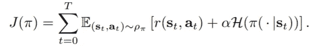
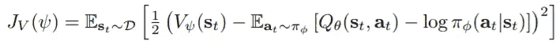
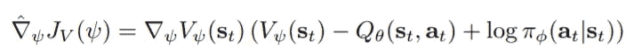
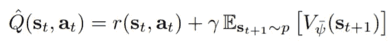
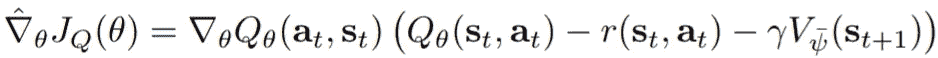
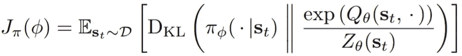
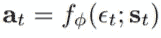
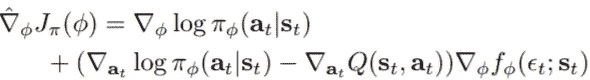
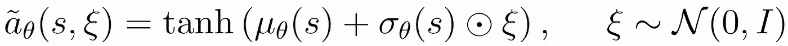

# 软演员-评论家揭秘

> 原文：<https://towardsdatascience.com/soft-actor-critic-demystified-b8427df61665?source=collection_archive---------3----------------------->

## 理论的直观解释和 PyTorch 实施指南


软演员评论家，来自加州大学伯克利分校的人们的新强化学习算法最近一直在制造很多噪音。该算法不仅比传统的 RL 算法具有更高的采样效率，而且在收敛时对脆性具有鲁棒性。在这篇博文中，我们将深入研究算法的工作原理，并在 PyTorch 中实现它。本教程假设您熟悉强化学习的问题规范和术语。如果你不熟悉这个或者需要复习，可以看看 [OpenAI 的教程](https://spinningup.openai.com/en/latest/spinningup/rl_intro.html)。

在我们开始之前，让我们快速地看一下为什么我们关心。

弥诺陶洛斯机器人不仅能在很短的时间内学会，还能对训练中没有见过的情况进行归纳。因此，SAC 让我们非常接近在机器人和其他领域的非模拟环境中使用强化学习。

近年来，一些最成功的 RL 算法，如信赖域策略优化(TRPO)、邻近策略优化(PPO)和异步行动者-批评家代理(A3C)都存在样本效率低的问题。这是因为它们以“基于策略”的方式学习，即它们在每次策略更新后都需要全新的样本。相比之下，基于 Q 学习的“非策略”方法，例如深度确定性策略梯度(DDPG)和双延迟深度确定性策略梯度(TD3PG ),能够使用经验重放缓冲器从过去的样本中有效地学习。然而，这些方法的问题是它们对超参数非常敏感，并且需要大量的调整来使它们收敛。软演员-评论家遵循后一种算法的传统，并增加了对抗收敛脆性的方法。让我们看看怎么做。

# 理论

SAC 是为涉及连续动作的 RL 任务定义的。SAC 最大的特点是采用了修正的 RL 目标函数。SAC 不仅寻求终身回报的最大化，还寻求保单熵的最大化。术语“熵”有一个相当深奥的定义，根据应用有许多解释，但我想在这里分享一个直观的解释。我们可以认为熵是一个不可预测的随机变量。如果一个随机变量总是取一个值，那么它的熵为零，因为它根本不是不可预测的。如果一个随机变量可以是具有相等概率的任何实数，那么它具有非常高的熵，因为它是非常不可预测的。为什么我们希望我们的政策具有高熵值？我们希望在我们的策略中有一个高熵，以明确地鼓励探索，鼓励策略为具有相同或接近相等 Q 值的动作分配相等的概率，并确保它不会陷入重复选择可能利用近似 Q 函数中的一些不一致性的特定动作。因此，SAC 通过鼓励策略网络探索并且不将非常高的概率分配给动作范围的任何一部分来克服脆性问题。



Objective Function consisting of both a reward term and an entropy term H weighted by α

现在我们知道了我们要优化什么，让我们来理解我们如何进行优化。SAC 使用三个网络:由ψ参数化的状态值函数 v，由θ参数化的软 q 函数 q，以及由ϕ.参数化的策略函数 **π** 虽然原则上不需要为通过策略相关的 V 和 Q 函数设置单独的近似器，但作者表示，在实践中，设置单独的函数近似器有助于收敛。因此，我们需要训练三个函数逼近器，如下所示:

1.  我们通过最小化以下误差来训练价值网络:



不要被这个长长的误差公式吓到。它只是说，在我们从经验重放缓冲区中采样的所有状态中，我们需要减少我们的价值网络的预测和 Q 函数的预期预测加上策略函数π的熵(这里通过策略函数的负对数来测量)之间的平方差。

我们将使用上述目标的导数的以下近似值来更新 V 函数的参数:



2.我们通过最小化以下误差来训练 Q 网络:


在哪里



最小化这个目标函数等于如下:对于体验重放缓冲器中的所有(状态，动作)对，我们想要最小化我们的 Q 函数的预测和即时(一个时间步长)奖励加上下一个状态的贴现期望值之间的平方差。请注意，该值来自由ψ参数化的值函数，其顶部有一个条形。这是一个附加价值函数，称为目标价值函数。我们会谈到为什么我们需要它，但是现在，不要担心它，只要把它当作我们正在训练的一个价值函数。

我们将使用上述目标的导数的以下近似值来更新 Q 函数的参数:



3.我们通过最小化以下误差来训练策略网络π:



这个目标函数看起来很复杂，但实际上它表达的东西非常简单。你在期望中看到的 DKL 函数叫做 Kullback-Leibler 散度。我强烈推荐你阅读 KL 散度，因为最近它在深度学习研究和应用中出现了很多。出于本教程的目的，您可以将其理解为这两个发行版有多么不同。所以，这个目标函数基本上是试图使我们的策略函数的分布，看起来更像我们的 Q 函数的指数分布，被另一个函数 z 归一化。

为了最小化这个目标，作者使用了一种叫做重新参数化的技巧。这个技巧用于确保从策略中采样是一个可区分的过程，以便在反向传播错误时没有问题。该策略现在参数化如下:



ε项是从高斯分布中采样的噪声矢量。我们将在实现部分详细解释它。

现在，我们可以将目标函数表达如下:


归一化函数 z 被丢弃，因为它不依赖于参数ϕ.上述目标的梯度的无偏估计量如下所示:



这就是数学！

# 履行

现在我们已经理解了算法背后的理论，让我们用 Pytorch 实现它的一个版本。我的实现是以 [higgsfield 的](https://github.com/higgsfield/RL-Adventure-2)为模型的，但是有一个关键的变化:我使用了重新参数化的技巧，由于方差较低，这使得训练收敛得更好。首先，让我们看看算法的主体，这样我们就可以在较高的层次上理解发生了什么，然后我们就可以深入到各个组件的细节中。

```
env = NormalizedActions(gym.make("Pendulum-v0"))

action_dim = env.action_space.shape[0]
state_dim  = env.observation_space.shape[0]
hidden_dim = 256

value_net        = ValueNetwork(state_dim, hidden_dim).to(device)
target_value_net = ValueNetwork(state_dim, hidden_dim).to(device)

soft_q_net1 = SoftQNetwork(state_dim, action_dim, hidden_dim).to(device)
soft_q_net2 = SoftQNetwork(state_dim, action_dim, hidden_dim).to(device)policy_net = PolicyNetwork(state_dim, action_dim, hidden_dim).to(device)

**for** target_param, param **in** zip(target_value_net.parameters(), value_net.parameters()):
    target_param.data.copy_(param.data)

value_criterion  = nn.MSELoss()
soft_q_criterion1 = nn.MSELoss()
soft_q_criterion2 = nn.MSELoss()lr  = 3e-4

value_optimizer  = optim.Adam(value_net.parameters(), lr=lr)
soft_q_optimizer = optim.Adam(soft_q_net.parameters(), lr=lr)
policy_optimizer = optim.Adam(policy_net.parameters(), lr=lr)

replay_buffer_size = 1000000
replay_buffer = ReplayBuffer(replay_buffer_size)
```

首先，我们初始化一个 OpenAI 健身房环境，我们的代理将在其中玩强化学习游戏。我们存储关于环境的观察维度的信息，行动空间的维度，然后，设置我们想要在我们的网络中有多少隐藏层的超参数。然后我们初始化我们想要训练的三个网络以及一个目标 V 网络。你会注意到我们有两个 Q 网络。我们维护两个 Q 网络来解决 Q 值高估的问题。为了解决这个问题，我们维护了两个 Q 网络，并使用其中最小的一个来更新我们的策略和 V 函数。

现在，是时候解释一下整个 target V 网络业务了。目标网络的使用是由训练 V 网络中的一个问题引起的。如果你回到理论部分的目标函数，你会发现 Q 网络训练的目标依赖于 V 网络，而 V 网络的目标依赖于 Q 网络(这是有意义的，因为我们试图在两个函数之间实施贝尔曼一致性)。因此，V 型网络有一个间接依赖于自身的目标，这意味着 V 型网络的目标依赖于我们试图训练的相同参数。这使得训练非常不稳定。

解决方案是使用一组接近主 V 网络参数的参数，但有时间延迟。因此，我们创建了落后于主网络的第二个网络，称为目标网络。有两种方法可以解决这个问题。第一种方法是在设定的步骤数后，定期从主网络复制目标网络。另一种方法是通过 Polyak 平均(一种移动平均)本身和主网络来更新目标网络。在这种实现中，我们使用 Polyak 平均。我们将主 V 网络和目标 V 网络初始化为具有相同的参数。

```
while frame_idx < max_frames:
    state = env.reset()
    episode_reward = 0

    for step in range(max_steps):
        if frame_idx >1000:
            action = policy_net.get_action(state).detach()
            next_state, reward, done, _ = env.step(action.numpy())
        else:
            action = env.action_space.sample()
            next_state, reward, done, _ = env.step(action)

        replay_buffer.push(state, action, reward, next_state, done)

        state = next_state
        episode_reward += reward
        frame_idx += 1

        if len(replay_buffer) > batch_size:
            update(batch_size)

        if frame_idx % 1000 == 0:
            plot(frame_idx, rewards)

        if done:
            break

    rewards.append(episode_reward)
```

这里有嵌套循环。外环为剧集的开始初始化环境。内部循环用于一集内的各个步骤。在内部循环中，我们从策略网络中采样一个动作，或者在最初的几个时间步骤中从动作空间中随机采样，并将状态、动作、奖励、下一个状态和完成(一个变量，指示我们是否进入了剧集的最终状态)记录到重播缓冲器中。我们这样做，直到缓冲区中的观测值达到最小数量。然后，在记录到缓冲区之后，我们在内部循环的每次运行中进行网络更新。

以下是网络更新的代码:

```
def update(batch_size,gamma=0.99,soft_tau=1e-2,):

    state, action, reward, next_state, done = replay_buffer.sample(batch_size)

    state      = torch.FloatTensor(state).to(device)
    next_state = torch.FloatTensor(next_state).to(device)
    action     = torch.FloatTensor(action).to(device)
    reward     = torch.FloatTensor(reward).unsqueeze(1).to(device)
    done       = torch.FloatTensor(np.float32(done)).unsqueeze(1).to(device)

    predicted_q_value1 = soft_q_net1(state, action)
    predicted_q_value2 = soft_q_net2(state, action)
    predicted_value    = value_net(state)
    new_action, log_prob, epsilon, mean, log_std = policy_net.evaluate(state)

# Training Q Function
    target_value = target_value_net(next_state)
    target_q_value = reward + (1 - done) * gamma * target_value
    q_value_loss1 = soft_q_criterion1(predicted_q_value1, target_q_value.detach())
    q_value_loss2 = soft_q_criterion2(predicted_q_value2, target_q_value.detach())
    print("Q Loss")
    print(q_value_loss1)
    soft_q_optimizer1.zero_grad()
    q_value_loss1.backward()
    soft_q_optimizer1.step()
    soft_q_optimizer2.zero_grad()
    q_value_loss2.backward()
    soft_q_optimizer2.step() # Training Value Function
    predicted_new_q_value = torch.min(soft_q_net1(state, new_action),soft_q_net2(state, new_action))
    target_value_func = predicted_new_q_value - log_prob
    value_loss = value_criterion(predicted_value, target_value_func.detach())
    print("V Loss")
    print(value_loss)
    value_optimizer.zero_grad()
    value_loss.backward()
    value_optimizer.step()# Training Policy Function
    policy_loss = (log_prob - predicted_new_q_value).mean()

    policy_optimizer.zero_grad()
    policy_loss.backward()
    policy_optimizer.step()

    for target_param, param in zip(target_value_net.parameters(), value_net.parameters()):
        target_param.data.copy_(
            target_param.data * (1.0 - soft_tau) + param.data * soft_tau
        )
```

首先，我们通过减少状态-动作对的预测 Q 值与其对应值(reward+(1—done)* gamma * target _ value)之间的 MSE 来更新两个 Q 函数参数。

对于 V 网络更新，我们取状态-动作对的两个 Q 值中的最小值，并从中减去在该状态下选择该动作的策略的对数概率。然后我们减小上述量和那个状态的预测 V 值之间的 MSE。

然后，我们通过减少策略在状态 **log(π(S))** 中选择动作的对数概率减去该状态-动作对的预测 Q 值来更新策略参数。这里注意，在这个损失中，预测的 Q 值由策略组成: **Q(S，π(S))** 。这很重要，因为它使术语依赖于ϕ.的策略参数

最后，我们通过 Polyak 将其与主价值网络平均来更新目标价值网络。

接下来，让我们快速了解一下网络结构:

```
class ValueNetwork(nn.Module):
    def __init__(self, state_dim, hidden_dim, init_w=3e-3):
        super(ValueNetwork, self).__init__()

        self.linear1 = nn.Linear(state_dim, hidden_dim)
        self.linear2 = nn.Linear(hidden_dim, hidden_dim)
        self.linear3 = nn.Linear(hidden_dim, 1)

        self.linear3.weight.data.uniform_(-init_w, init_w)
        self.linear3.bias.data.uniform_(-init_w, init_w)

    def forward(self, state):
        x = F.relu(self.linear1(state))
        x = F.relu(self.linear2(x))
        x = self.linear3(x)
        return x

class SoftQNetwork(nn.Module):
    def __init__(self, num_inputs, num_actions, hidden_size, init_w=3e-3):
        super(SoftQNetwork, self).__init__()

        self.linear1 = nn.Linear(num_inputs + num_actions, hidden_size)
        self.linear2 = nn.Linear(hidden_size, hidden_size)
        self.linear3 = nn.Linear(hidden_size, 1)

        self.linear3.weight.data.uniform_(-init_w, init_w)
        self.linear3.bias.data.uniform_(-init_w, init_w)

    def forward(self, state, action):
        x = torch.cat([state, action], 1)
        x = F.relu(self.linear1(x))
        x = F.relu(self.linear2(x))
        x = self.linear3(x)
        return x

class PolicyNetwork(nn.Module):
    def __init__(self, num_inputs, num_actions, hidden_size, init_w=3e-3, log_std_min=-20, log_std_max=2):
        super(PolicyNetwork, self).__init__()

        self.log_std_min = log_std_min
        self.log_std_max = log_std_max

        self.linear1 = nn.Linear(num_inputs, hidden_size)
        self.linear2 = nn.Linear(hidden_size, hidden_size)

        self.mean_linear = nn.Linear(hidden_size, num_actions)
        self.mean_linear.weight.data.uniform_(-init_w, init_w)
        self.mean_linear.bias.data.uniform_(-init_w, init_w)

        self.log_std_linear = nn.Linear(hidden_size, num_actions)
        self.log_std_linear.weight.data.uniform_(-init_w, init_w)
        self.log_std_linear.bias.data.uniform_(-init_w, init_w)

    def forward(self, state):
        x = F.relu(self.linear1(state))
        x = F.relu(self.linear2(x))

        mean    = self.mean_linear(x)
        log_std = self.log_std_linear(x)
        log_std = torch.clamp(log_std, self.log_std_min, self.log_std_max)

        return mean, log_std

    def evaluate(self, state, epsilon=1e-6):
        mean, log_std = self.forward(state)
        std = log_std.exp()

        normal = Normal(0, 1)
        z      = normal.sample()
        action = torch.tanh(mean+ std*z.to(device))
        log_prob = Normal(mean, std).log_prob(mean+ std*z.to(device)) - torch.log(1 - action.pow(2) + epsilon)
        return action, log_prob, z, mean, log_std

    def get_action(self, state):
        state = torch.FloatTensor(state).unsqueeze(0).to(device)
        mean, log_std = self.forward(state)
        std = log_std.exp()

        normal = Normal(0, 1)
        z      = normal.sample().to(device)
        action = torch.tanh(mean + std*z)

        action  = action.cpu()
        return action[0]
```

Q 和 V 网络相当标准，所以让我们更仔细地看看策略网络。该策略有两个输出:平均值和对数标准偏差—我们使用对数标准偏差，因为它们的指数总是给出一个正数。对数标准偏差被钳位在相同的区域内。然后，为了获得动作，我们使用重新参数化技巧。



from Open AI Spinning Up

为此，我们从标准正态分布中抽取一些噪声样本，乘以我们的标准差，然后将结果加到平均值上。然后这个号码被一个双曲正切函数激活，给出我们的行动。最后，使用 tanh(mean + std* z)的对数似然的近似值计算对数概率。

重要的实现细节到此为止！[完整的代码可以在这里找到](https://github.com/vaishak2future/sac/blob/master/sac.ipynb)。请确保您运行它并试验不同的超参数，以了解它们如何影响训练。我希望这有所帮助。请给我发送任何意见，更正或链接到任何酷的项目，你用 SAC！

**更新:** Tuomas Haarnoja 通过电子邮件告诉我，有一个新版本的算法只使用了一个 Q 函数，并取消了 V 函数。它还增加了自动发现称为“温度”的熵项的权重。你可以查阅[2]中的新论文。

# 参考

[[1] T .哈尔诺贾等 2018。*软行动者-批评家:具有随机行动者的非策略最大熵深度强化学习*](https://arxiv.org/abs/1801.01290)

[[2] T .哈尔诺贾等 2018。*软演员-评论家算法及应用。*](https://arxiv.org/abs/1812.05905)