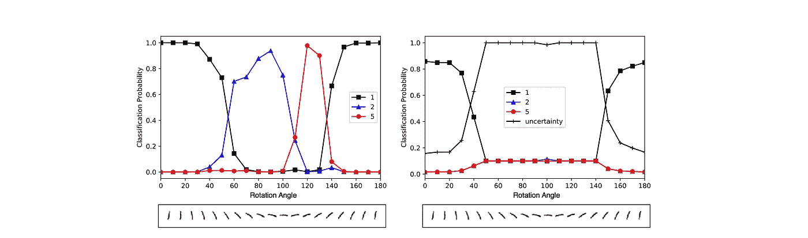
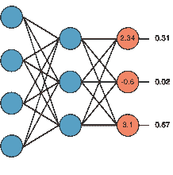
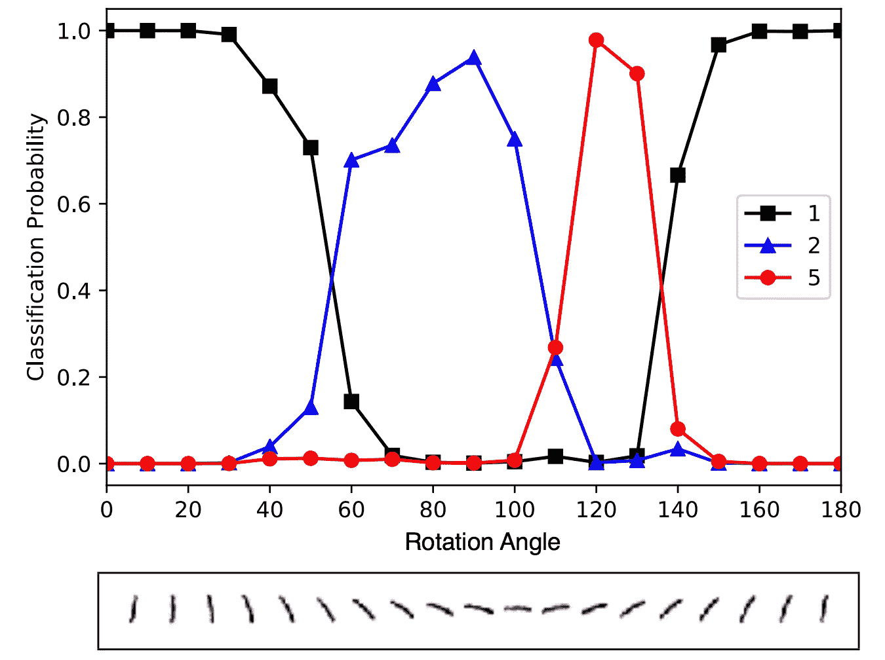
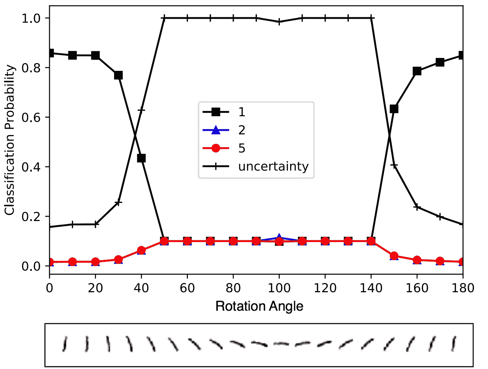

# Softmax 和不确定性

> 原文：<https://towardsdatascience.com/softmax-and-uncertainty-c8450ea7e064?source=collection_archive---------8----------------------->

When your network is 99% sure that a sideways 1 is actually a 5.

[softmax 函数](https://en.wikipedia.org/wiki/Softmax_function)经常被用作分类问题的神经网络中的最终激活函数。此函数将输入向量归一化到一个范围内，这通常会导致概率解释。虽然 softmax 函数的输出确实可以被视为一个概率向量，但很容易陷入将此信息与关于置信度的陈述(在统计意义上)纠缠在一起的陷阱。

在这篇简短的文章中，我将展示 softmax 函数如何在分类问题中提供误导性的输出，以及如何最好地解释 softmax 函数的结果。我将通过一个涉及经典 MNIST 数据集的简单示例来演示什么会出错。

# 输出向量—它是什么意思？

比方说，你训练一个神经网络将一幅图像分类为猫、狗或人。你决定使用一个有几个卷积层的卷积神经网络，完全连接的层，最后一层之后只有三个节点。这些节点中的值只是实数，没有任何限制。

最终需要某种预测，因此 softmax 函数将这些节点值映射到 0 和 1 之间，所有分量的总和等于 1。然后选择最大值作为预测值。

## 为什么要用 Softmax？

由于 softmax 函数不会更改输出值的排序，因此归一化后，之前的最大值仍然是最大值。那么，如果我们已经有足够的信息进行预测，为什么还要使用这样的激活函数来保持顺序呢？

一个答案与网络的训练有关。万一我们是对的或错的，在我们做出预测之后会发生什么？如果损失函数利用真实值预测，那么我们的预测的损失可能必须在特定的范围内。即使预测是正确的，仍可能存在与输出值 0.75 对 0.95 相关联的损失。

# 不确定

假设我们现在有一个训练好的分类器来区分猫、狗和人类。当我们向分类器展示一张新的猫的图片时，它会预测这是一只输出为 0.99 的猫。这是否意味着图片是一只 99%有把握的猫？如果我们给它看一只老虎或一匹马，会发生什么？我们网络的输出会说这张马的图其实是输出 0.65 的狗。那么有 65%的可能性这是一只狗吗？

现在考虑在正常 MNIST 数据集上训练的分类器。分类器只看到 0 到 9 之间的数字图像。如果我们开始旋转数字会发生什么？如果我们旋转数字 1，网络还能识别它吗？

Classification Probabilities for a Rotated Digit [1].

当我们开始旋转数字 1 时，随着旋转角度的增加，最高输出分量在 1、2、5 之间移动，最后回到 1。在某些时候，分类器对于不正确的猜测有接近 100%的分类概率！

# 解决办法

对于在测试期间可能有非分布样本的分类器，考虑为输出添加一个新选项:*“我不知道。”*这样，我们通过网络直接量化不确定性。如果网络选择不确定的选项作为最有可能的，那么我们就不能在可能的输出中做出预测。

这种方法对于非分布样本非常有用，但对于恶意的例子也非常有用，在这些例子中，篡改的图像被用来故意混淆网络。

当使用不确定性选项时，旋转的 MNIST 数字更有意义。

Classification Probability with Uncertainty option.

这种方法在[【1】](https://arxiv.org/pdf/1806.01768.pdf)中有大量讨论。如果有足够的兴趣，我很乐意写一篇后续文章，讨论论文作者如何通过 PyTorch 或 Tensorflow 中的一些算出的例子在理论层面和应用层面上实现这一点。

让我知道你的想法！我很感谢你能走到这一步，并很高兴听到任何关于这个想法的问题或意见。

## 参考

[1] *证据深度学习量化分类不确定性*。森索伊先生，卡普兰先生，坎德米尔先生。[https://arxiv.org/pdf/1806.01768.pdf](https://arxiv.org/pdf/1806.01768.pdf)。2018.