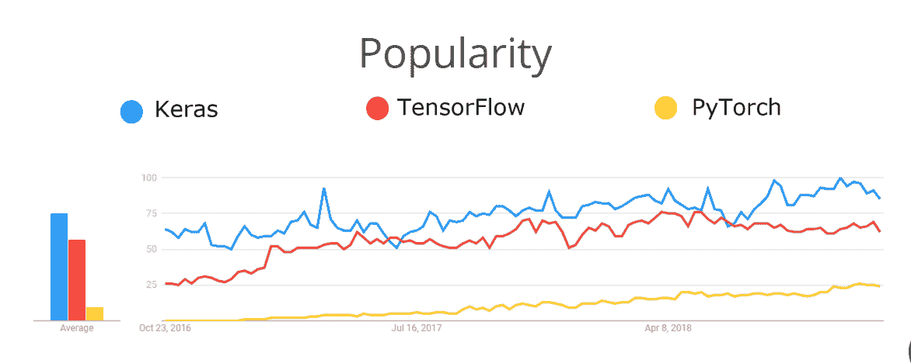

# 软件开发人员:你在颠倒地学习机器学习

> 原文：<https://towardsdatascience.com/software-developers-youre-learning-machine-learning-upside-down-3867dc140862?source=collection_archive---------17----------------------->


Don’t be this guy.

## 我们大多数人都是从头开始学习机器学习的。但是开发人员成为 ML 的有效用户所需的技能是完全不同的。那么今天有远见的软件工程师应该学习什么关于 AI 的知识呢？

我记得我第一次尝试学习编码。我上中学的时候，我的爸爸，一个程序员，打开了一个文本编辑器，在屏幕上打出了这个:

```
public class HelloWorld {
    public static void main(String[] args) {  
        System.out.println("Hello World.");
    }
}
```

“请问？”我说。

“上面印着‘你好，世界’，”他回答道。

“什么是公开的？什么是阶级？什么是静电？什么——”

“暂时忽略这一点。这只是样板文件。”

但是我被那些我不理解的所谓样板文件吓坏了，所以我开始学习这些关键词的意思。这被证明是复杂和无聊的，几乎扼杀了我年轻的程序员的抱负。

今天学习软件开发比我上高中时要容易得多，这要归功于像 codecademy.com 这样的网站，建立基本开发环境的容易程度，以及 T2 倾向于教授像 Python 和 Javascript 这样的高级解释语言。你可以在几分钟内从对编码一无所知到在浏览器中编写你的第一个条件语句。没有杂乱的环境设置、安装、编译器或样板文件需要处理——您可以直接进入有趣的部分。

这正是人类最好的学习方式。首先，我们在高层次上学习核心概念，只有*然后*我们才能欣赏和理解引擎盖下的细节以及它们为什么重要。我们学 Python，*然后* C，*然后*汇编，而不是反过来。

不幸的是，今天许多开始学习机器学习的人都有着和我第一次接触 Java 时一样的经历。他们提前了解了所有底层细节——层架构、反向传播、辍学等——并开始认为 ML 真的很复杂，也许他们应该先上一堂线性代数课，然后放弃。

这是一个遗憾，因为在不久的将来，大多数有效使用机器学习的软件开发人员将不需要考虑或了解任何底层的东西。正如我们(通常)不编写汇编或实现我们自己的 TCP 栈或加密库一样，我们将使用 ML 作为工具，并将实现细节留给一小组专家。到那时——在机器学习被“大众化”之后——开发人员将需要理解的不是实现细节，而是在世界上部署这些智能算法的最佳实践。

## 我们现在在哪里

今天，如果你想建立一个神经网络来识别照片中你的猫的脸，或者预测你的下一条推文是否会火起来，你可能会开始学习 [TensorFlow](http://tensorflow.org) 或 [PyTorch](http://pytorch.org) 。这些基于 Python 的深度学习库是当今设计神经网络最流行的工具，它们都不到 5 岁。

在它短暂的生命周期中，TensorFlow 已经变得比五年前更加用户友好。在早期，要成为一名有效的 TensorFlow 程序员，你不仅要理解机器学习，还要理解分布式计算和延迟图架构。即使是写一份简单的打印声明也是一个挑战。



Breakdown of Keras/TensorFlow/PyTorch popularity, courtesy [this](https://www.quora.com/What-are-the-major-differences-between-TensorFlow-Keras-and-PyTorch) Quora answer.

就在今年秋天早些时候，TensorFlow 2.0 正式发布，使得该框架对开发人员更加友好。下面是 TensorFlow 2.0 中 Hello-World 风格的模型的外观:

如果你以前设计过神经网络，上面的代码是简单易懂的。但是如果你还没有或者刚刚开始学习，你可能会有一些问题。比如，什么是辍学？这些密集层是什么，需要多少，放在哪里？什么是`sparse_categorical_crossentropy`？TensorFlow 2.0 消除了构建模型中的一些摩擦，但它没有抽象掉设计这些模型的实际架构。

## 我们要去哪里

那么易用的 ML 工具的未来会是什么样子呢？从谷歌到亚马逊到微软和苹果，每个人都在花时间试图回答这个问题。此外——免责声明——这也是我作为谷歌工程师花费全部时间思考的问题。

首先，我们将开始看到更多的开发人员使用预先训练好的模型来完成常见任务，也就是说，我们不会收集自己的数据和训练自己的神经网络，而是使用谷歌/亚马逊/微软的模型。许多云提供商已经在做类似的事情。例如，通过点击 Google Cloud REST 端点，您可以使用预训练的神经网络来:

*   从图像中提取文本
*   标记照片中的常见对象
*   将语音转换为文本
*   在不同语言间翻译
*   识别文本的情感
*   更多

你也可以在设备上运行预先训练好的模型，在移动应用程序中，使用像谷歌的 [ML 工具包](https://developers.google.com/ml-kit)或苹果的 [Core ML](https://www.google.com/search?q=apple+ml+core&oq=apple+ml+core&aqs=chrome..69i57j69i60l2j69i65j69i60l3.1240j0j7&sourceid=chrome&ie=UTF-8) 这样的工具。

与你在 TensorFlow 中自己构建的模型相比，使用预训练模型的优势(除了易用性之外)在于，坦率地说，你可能无法亲自构建一个比谷歌研究人员更准确的模型，谷歌研究人员在整个数据互联网和大量 GPU 和[TPU](https://en.wikipedia.org/wiki/Tensor_processing_unit)上训练神经网络。

使用预先训练好的模型的缺点是，它们解决的是一般性问题，比如识别图像中的猫和狗，而不是特定领域的问题，比如识别装配线上某个部件的缺陷。

但是，即使在为特定领域的任务训练定制模型时，我们的工具也变得更加用户友好。


Screenshot of Teachable Machine, a tool for building vision, gesture, and speech models in the browser.

谷歌的免费[可教机器](https://teachablemachine.withgoogle.com/)网站让用户使用拖放界面在浏览器中收集数据和训练模型。今年早些时候，麻省理工学院发布了一个类似的[无代码界面](http://news.mit.edu/2019/drag-drop-data-analytics-0627)，用于构建在触摸屏设备上运行的定制模型，专为医生等非编码人员设计。微软和 lobe.ai 等初创公司也提供类似的解决方案。同时， [Google Cloud AutoML](https://cloud.google.com/automl/) 是一个针对企业级工作负载的自动化模型训练框架。

## 现在学什么

随着 ML 工具变得更容易使用，希望使用这种技术(但不是成为专家)的开发人员的技能将会改变。所以，如果你试图像韦恩-格雷特斯基那样计划冰球要去哪里，你现在应该学习什么？

**知道何时使用机器学习总是很难的**

机器学习算法与标准软件的不同之处在于它们是概率性的。即使是高度精确的模型有时也会出错，这意味着它不是许多问题的正确解决方案，尤其是就其本身而言。以 ML 驱动的语音到文本算法为例:偶尔，当你让 Alexa“关掉音乐”时，她会把你的闹钟设置为凌晨 4 点，这可能没问题。如果一个医学版本的 Alexa 认为你的医生给你开的是 Enulose 而不是 Adderall，那就不对了。

理解什么时候以及如何在生产中使用模型是一个微妙的问题。在以下情况下尤其棘手:

1.  赌注很高
2.  人力资源有限
3.  人类对自己的预测有偏见或不准确

以医学影像为例。我们在全球范围内缺少医生，而在诊断疾病方面，人工智能模型通常比训练有素的医生更准确。但你会希望一种算法对你是否患有癌症拥有最终决定权吗？帮助法官决定刑期的模型也是如此。[模特可以有偏见](https://www.technologyreview.com/s/612775/algorithms-criminal-justice-ai/)，但人也一样。

理解什么时候使用 ML 是有意义的，以及如何正确地部署它并不是一个容易解决的问题，但这是一个不会很快消失的问题。

**可解释性**

机器学习模型是出了名的不透明。这就是为什么它们有时被称为“黑匣子”用“我的神经网络告诉我的”作为唯一的证据，你不太可能说服你的副总裁做出重大商业决策。此外，如果你不明白为什么你的模型做出这样的预测，你可能没有意识到它做出了有偏见的决定(即拒绝向特定年龄组或邮政编码的人提供贷款)。

正是因为这个原因，ML 领域的许多参与者都专注于构建“可解释的 AI”功能——让用户更密切地检查模型使用什么功能来进行预测的工具。作为一个行业，我们还没有完全解决这个问题，但我们正在取得进展。例如，11 月，谷歌推出了一套解释工具以及一种叫做[模型卡](https://modelcards.withgoogle.com/face-detection)的东西——一种帮助用户理解 ML 模型局限性的视觉指南。


Google’s Facial Recognition Model Card shows the limitations of this particular model.

**利用应用创造创意**

有几个擅长机器学习的开发人员，几个擅长神经科学的研究人员，很少有人处于那个交叉点。几乎任何足够复杂的领域都是如此。未来几年，我们将从 ML 中看到的最大进步可能不是来自改进的数学方法，而是来自不同专业领域的人，他们至少学习了足够多的机器学习，以将其应用于他们的领域。这主要是医学成像领域的情况，例如，[最令人兴奋的突破](/how-machine-learning-is-transforming-healthcare-at-google-and-beyond-d4f664b7e27c)——能够在扫描中发现恶性疾病——不是由新的神经网络架构驱动的，而是由应用于新问题的相当标准的模型驱动的。因此，如果你是一个软件开发人员，幸运地拥有额外的专业知识，你已经领先了。

如果我从头开始我的人工智能教育，这至少是我今天会关注的。与此同时，我发现自己花在从零开始在 TensorFlow 中构建定制模型的时间越来越少，而花在使用 AutoML 和 AI APIs 等高级工具以及专注于应用程序开发的时间越来越多。

但这只是我的看法——你认为呢？请在下面的评论中告诉我。

感谢反馈[莎拉·罗宾逊](https://medium.com/u/7f2ab73b39f8?source=post_page-----3867dc140862--------------------------------)和[约书亚·戈登](https://medium.com/u/4dde9eebddbd?source=post_page-----3867dc140862--------------------------------)！