# 解决数据科学挑战——可视化方法

> 原文：<https://towardsdatascience.com/solving-a-data-science-challenge-the-visual-way-355cfabcb1c5?source=collection_archive---------14----------------------->

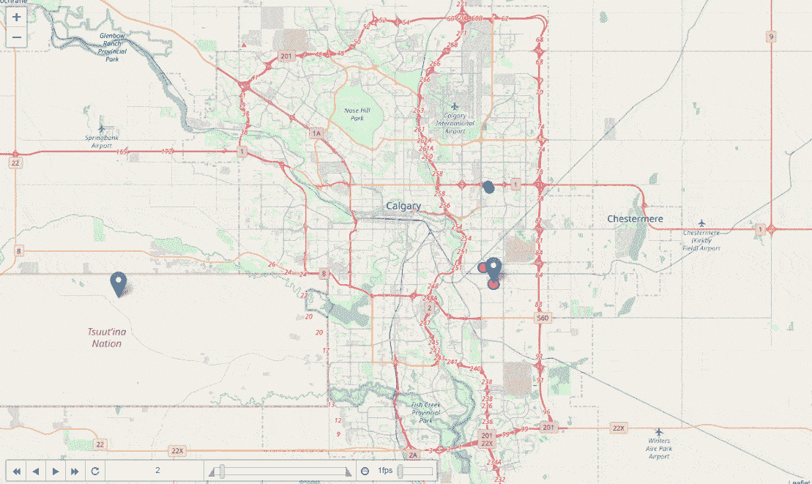

对于视觉学习者来说

在这篇文章中，我将向您展示一些使用 Foium 的很酷的地理空间可视化，包括时变制图，以及在 fo ium 地图上叠加数据宁滨，以便更深入地了解您的地理空间数据。这篇文章可以作为地理空间数据探索性分析的指南。

我在这里试图回答的主要问题是“对于一个城市的零售商来说，最理想的位置是哪里？”我做了一些假设来给这个问题提供一些背景，但事实上这与为客户做的实际研究相差不远。

1.  假设零售商实际上是某种仓库
2.  我们在整个城市有大量的 GPS 数据点，这些数据点是我们车队每天访问的目的地

# 数据

正如我提到的，我们在城市里有很多 GPS 数据点。她的是快照

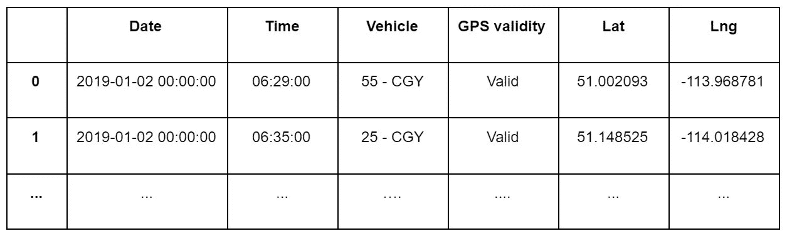

GPS data showing lat, long of each data point as well as the the data & time

为了让这个更有趣，我找到了一个列出卡尔加里所有街区的数据集，也就是这个城市:)。我们将使用这些数据来收集每个社区中最常见的场馆的一些信息，这将有助于我们将它们分成一组簇。我们的假设是，与拥有更多咖啡店或公园的街区相比，拥有更多建筑或家具店的街区更适合作为仓库，这表明这是一个住宅区。

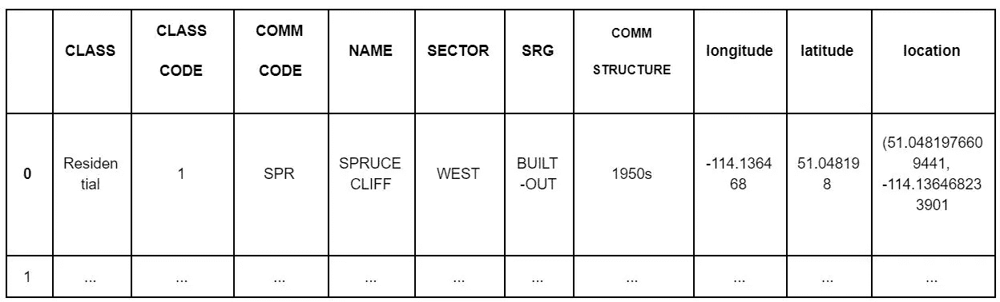

Calgary community data listing all the neighborhoods. Author of this data set has already labeled each neighborhood but since we are bunch of bad ass folks, we’d like to ignore them for now and find label each neighborhood ourselves.

好了，无聊的事情说够了。下面是你如何为我们的 GPS 数据制作一个漂亮的热图。多田…

## 图表

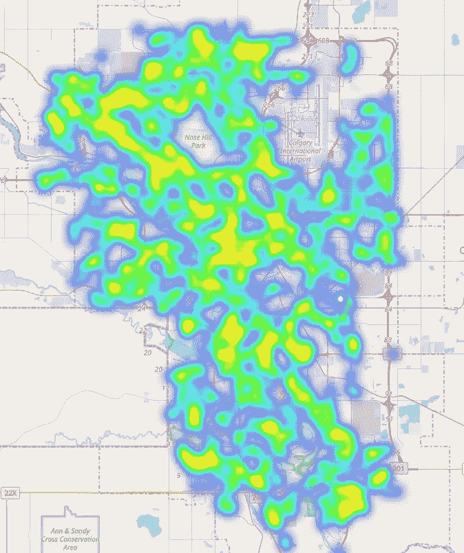

## 代码

```
# Add a column with ones, then calculate sum and generate the heat
sliceDF[‘count’] = 1 
# create map of Calgary using latitude and longitude values
base_heatmap = folium.Map(location=[calgLat, calgLng], zoom_start=10)
# Just adding a marker for fun
folium.Marker((lat,lng), popup=”label”).add_to(base_heatmap)
HeatMap(data=sliceDF[[‘Lat’, ‘Lng’, ‘count’]].groupby([‘Lat’, ‘Lng’]).sum().reset_index().values.tolist(), radius=8, max_zoom=4).add_to(base_heatmap)
# If you want to save the map 
base_heatmap.save(outfile= “truckheatMap.html”)
# To show the map in jupyter
base_heatmap
```

上面的热图实际上并没有显示出准确的情况，因为我们是在综合所有的数据点，而不考虑时间。为了更好地了解我们的舰队大部分时间在哪里，我们需要以某种方式将时间纳入其中。这篇文章漂亮的动画标题就是一种方法。观察在城市中行驶的车队可以发现他们花费更多时间的区域。所以让我们使用酷的叶子制作动画…

## 图表

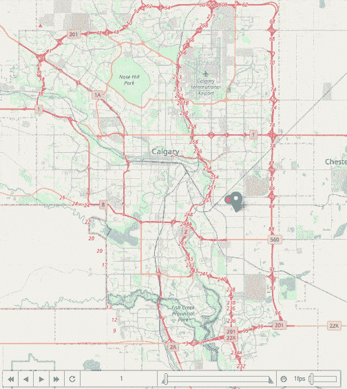

## 代码

```
# Creating list of hours that we need to slice by to generate the time variant map
df_hour_list = []
for hour in sliceDF.Hour.sort_values().unique():
    df_hour_list.append(sliceDF.loc[sliceDF.Hour == hour, ['Lat', 'Lng', 'count']].groupby(['Lat', 'Lng']).sum().reset_index().values.tolist())base_heattimemap = folium.Map(location=[latitude, longitude], zoom_start=11)
HeatMapWithTime(df_hour_list, radius=8, gradient={0.2: 'blue', 0.4: 'lime', 0.6: 'orange', 1: 'red'}, min_opacity=0.8, max_opacity=1, use_local_extrema=True).add_to(base_heattimemap)

base_heattimemap
```

现在，这一切都很好，但这不是一种量化的方法。我们仍然需要直观地追逐这些点，并猜测最终哪些区域比其他区域更密集。如果我们有一个基于密度的图，使用网格并显示每个细胞的相对密度，会怎么样？好的，你猜对了。

## 图表

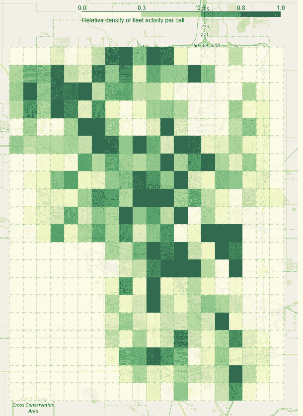

## **代码**

```
# Used a def so that if you wish to add interactivity you can do that easily later on.
def plot(min_hour,max_hour,n):
    #boundaries of the main rectangle
    upper_right = [51.1741,-113.8925]
    lower_left = [50.8672,-114.2715]

    # Creating a grid of nxn from the given cordinate corners     
    grid = get_geojson_grid(upper_right, lower_left , n)
    # Holds number of points that fall in each cell & time window if provided
    counts_array = []

    # Adding the total number of visits to each cell
    for box in grid:
        # get the corners for each cell
        upper_right = box["properties"]["upper_right"]
        lower_left = box["properties"]["lower_left"]# check to make sure it's in the box and between the time window if time window is given 
        mask = ((sliceDF.Lat <= upper_right[1]) & (sliceDF.Lat >= lower_left[1]) &
            (sliceDF.Lng <= upper_right[0]) & (sliceDF.Lng >= lower_left[0]) &
            (sliceDF.Hour >= min_hour) & (sliceDF.Hour <= max_hour))# Number of points that fall in the cell and meet the condition 
        counts_array.append(len(sliceDF[mask]))# creating a base map 
    m = folium.Map(zoom_start = 10, location=[latitude, longitude])# Add GeoJson to map
    for i, geo_json in enumerate(grid):
        relativeCount = counts_array[i]*100/4345
        color = plt.cm.YlGn(relativeCount)
        color = mpl.colors.to_hex(color)
        gj = folium.GeoJson(geo_json,
                style_function=lambda feature, color=color: {
                    'fillColor': color,
                    'color':"gray",
                    'weight': 0.5,
                    'dashArray': '6,6',
                    'fillOpacity': 0.8,
                })
        m.add_child(gj)

    colormap = branca.colormap.linear.YlGn_09.scale(0, 1)
    colormap = colormap.to_step(index=[0, 0.3, 0.6, 0.8 , 1])
    colormap.caption = 'Relative density of fleet activity per cell'
    colormap.add_to(m)return m# limiting time window for our data to 8 am - 5 pm and also grid is 20 x 20 
plot(8,17,20)
```

这篇文章的第二部分旨在向您展示如何使用 Foursquare APIs 来获取一些关于不同邻居的地理空间信息，将邻居分组，并最终组合结果以得出我们的结论。

> *我在谷歌的 API 上工作了很长时间，后来当我开始研究数据科学时，被介绍到 Foursquare 上，感觉棒极了。所以，对于那些不熟悉 Foursquare 的人，我强烈推荐你去看看。值了。*

社区数据如上所示。现在我们忽略作者使用的标签，并假设我们没有它们。我们的目标是自己将这些社区聚集起来，为我们的零售店(仓库)找到一个合适的区域。为此，我们使用 Foursquare explore API，但请随意查看他们的所有 API 列表，它们可能会在您的项目中派上用场。

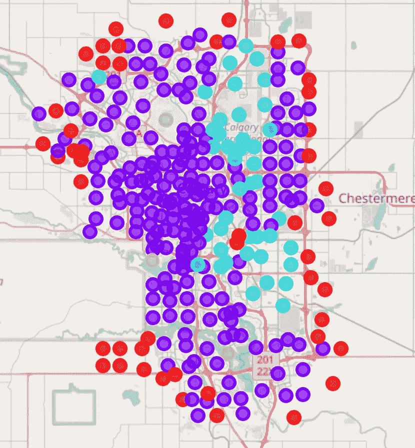

现在，您应该知道如何绘制漂亮的地图，所以让我们使用原始标签从社区数据中制作一个地图，看看发生了什么。

接下来，我们试图为每个街区获取 n 个最常见的场所，并将这些信息输入到 k-means 聚类代码中，以便将街区分组。

要使用 explore Foursquare API 获得一个社区的公共场所列表，您需要做如下事情。

```
# Using Foursquare's explore API get 10 most common venues around # the latitude, longitude provided within 500 m radius. 
# You'll get the CLIENT_ID, CLIENT_SECRET and VERSION after signing up for Foursquare.(Pay attention to API call limits.)
url = "[https://api.foursquare.com/v2/venues/explore?client_id={}&client_secret={}&v={}&ll={},{}&radius=500&limit=10](https://api.foursquare.com/v2/venues/explore?client_id={}&client_secret={}&v={}&ll={},{}&radius=500&limit=10)".format(CLIENT_ID,CLIENT_SECRET,VERSION,neigh
borhood_lat,neighborhood_lng)# results come back in format of JSON 
results = requests.get(url).json()
results
```

我们可以把这个扩展到所有的社区。下面的数据框显示了几行结果。

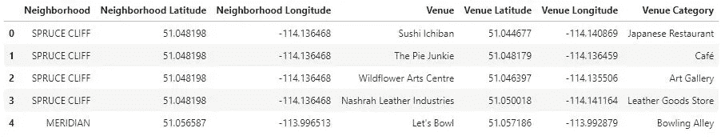

Example of data frame including venues with their latitude and longitude

## 一个热编码

为什么？因为我们有字符串作为每个邻域的标签，需要一种方法来数字化它们，以便我们可以在分类算法中使用它们。“一个热编码”基本上解析您的标签，并为每个标签分配虚拟值，以及为每个标签创建新列，并使用 1 或 0 来确定该行表是否具有该功能。例如，云杉悬崖有咖啡馆，但可能没有健身房等等。下面的片段显示了如何“一次热编码”您的结果:

```
# one hot encoding
calgary_onehot = pd.get_dummies(calgary_venues[['Venue Category']], prefix="", prefix_sep="")# add neighborhood column back to dataframe
calgary_onehot['Neighbourhood'] = calgary_venues['Neighborhood']# move neighborhood column to the first column
fixed_columns = [calgary_onehot.columns[-1]] + list(calgary_onehot.columns[:-1])
calgary_onehot = calgary_onehot[fixed_columns]print("calgary_onehot shape is " , calgary_onehot.shape)
calgary_onehot.head()
```

生成的表格如下所示:


One hot encoded dataframe

为了更好地了解每个街区的性质，我们可以对这些结果进行分组，并对每个街区最常见的场馆进行罚款。然后，我们可以尝试标注每个邻域，例如，咖啡店和杂货店较多的邻域最有可能是住宅区，而建筑区或工厂较多的邻域可能是工业区。

我们将根据结果创建一个熊猫数据框架，包括每个社区的 10 个最常见的场馆。

```
num_top_venues = 10
indicators = ['st', 'nd', 'rd']def return_most_common_venues(row, num_top_venues):
    row_categories = row.iloc[1:]
    row_categories_sorted = row_categories.sort_values(ascending=False)
    return row_categories_sorted.index.values[0:num_top_venues]# create columns according to number of top venues
columns = ['Neighborhood']
for ind in np.arange(num_top_venues):
    try:
        columns.append('{}{} Most Common Venue'.format(ind+1, indicators[ind]))
    except:
        columns.append('{}th Most Common Venue'.format(ind+1))# create a new dataframe
neighborhoods_venues_sorted = pd.DataFrame(columns=columns)
neighborhoods_venues_sorted['Neighborhood'] = calgary_grouped['Neighbourhood']
neighborhoods_venues_sorted.rename(columns={'Neighborhood':"NAME"},inplace=True)for ind in np.arange(calgary_grouped.shape[0]):
    neighborhoods_venues_sorted.iloc[ind, 1:] = return_most_common_venues(calgary_grouped.iloc[ind, :], num_top_venues)neighborhoods_venues_sorted.head()
```

结果是这样的:

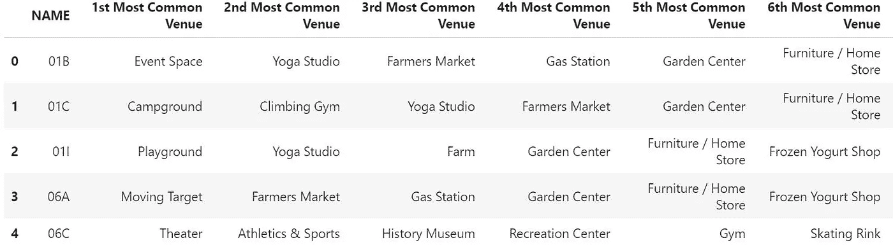

Common venues per each neighborhood, cropped to fit better here but the code above find the 10 most common venues

## 聚类邻域

现在，我们正处于根据我们拥有的一个热编码数据帧对我们的邻域进行聚类的阶段。在这种情况下，我使用 Sklearn 包中的 kmeans-clustering，为了能够在稍后将结果与我们社区数据中的原始分类标签进行比较，我选择使用 n=4 作为分类数。

```
# set number of clusters
kclusters = 4
calgary_grouped_clustering = calgary_grouped.drop('Neighbourhood', 1)
# run k-means clustering
kmeans = KMeans(n_clusters=kclusters, random_state=0).fit(calgary_grouped_clustering)
# check cluster labels generated for each row in the dataframe
neighborhoods_venues_sorted['labels'] = kmeans.labels_
neighborhoods_venues_sorted.head()
```


label column shows the clusters

让我们将我们的结果与包含地理位置的原始数据帧合并，并使用一些选择器绘制一个漂亮的图表，这样我们就可以过滤集群，看看发生了什么。

图表:

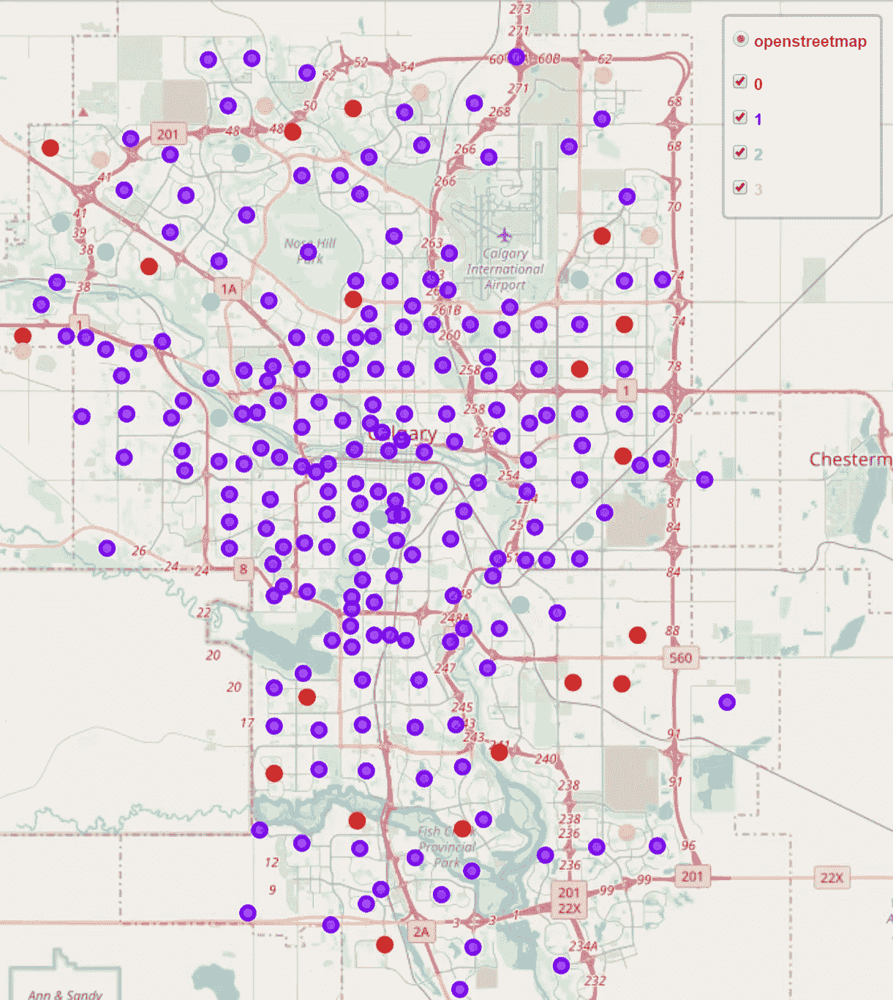

Clustering results plotted with a filtering control panel

实现这一点的代码:

```
calgary_merged['labels'] = calgary_merged['labels'].astype(int)map_clusters = folium.Map(location=[latitude, longitude], zoom_start=11)# set color scheme for the clusters
x = np.arange(kclusters)
ys = [i + x + (i*x)**2 for i in range(kclusters)]
colors_array = cm.rainbow(np.linspace(0, 1, len(ys)))
rainbow = [colors.rgb2hex(i) for i in colors_array]for cluster in range(0,kclusters): 
    group = folium.FeatureGroup(name='<span style=\\"color: {0};\\">{1}</span>'.format(rainbow[cluster-1],cluster))
    for lat, lon, poi, label in zip(calgary_merged['latitude'], calgary_merged['longitude'], calgary_merged['CLASS_CODE'], calgary_merged['labels']):
        if int(label) == cluster: 
            label = folium.Popup('ORIG. '+ str(poi) + 'Cluster ' + str(cluster), parse_html=True)
            folium.CircleMarker(
                (lat, lon),
                radius=5,
                popup=label,
                color=rainbow[cluster-1],
                fill=True,
                fill_color=rainbow[cluster-1],
                fill_opacity=0.7).add_to(group)
    group.add_to(map_clusters)folium.map.LayerControl('topright', collapsed=False).add_to(map_clusters)
map_clusters.save(outfile= "map_clusters.html")
map_clusters
```

## 将聚类与原始标签进行比较

好吧，一切都很好，那又怎样？这项研究的目的是将聚类与标签进行比较，并尝试确定一个靠近零售店或仓库最小距离中心的合适位置。

因此，让我们根据聚类标签和原始标签进行分组，并查看混淆矩阵。请记住，原始标签不一定是真正的标签，而仅仅是数据集作者的主观标签。因此，这应该会给我们一些想法，关于我们的标签的分布与原始标签相比有多相似，仅此而已。

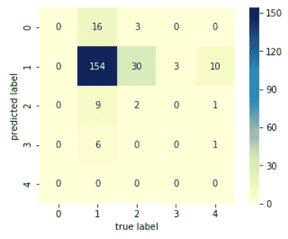

我们发现的最终结果如下所示。红色圆圈包围了中等距离的中心(中间带中心)以及两个被确定为最有可能正在开发或工业的社区(最常见的场所是建筑、大型保留商店)

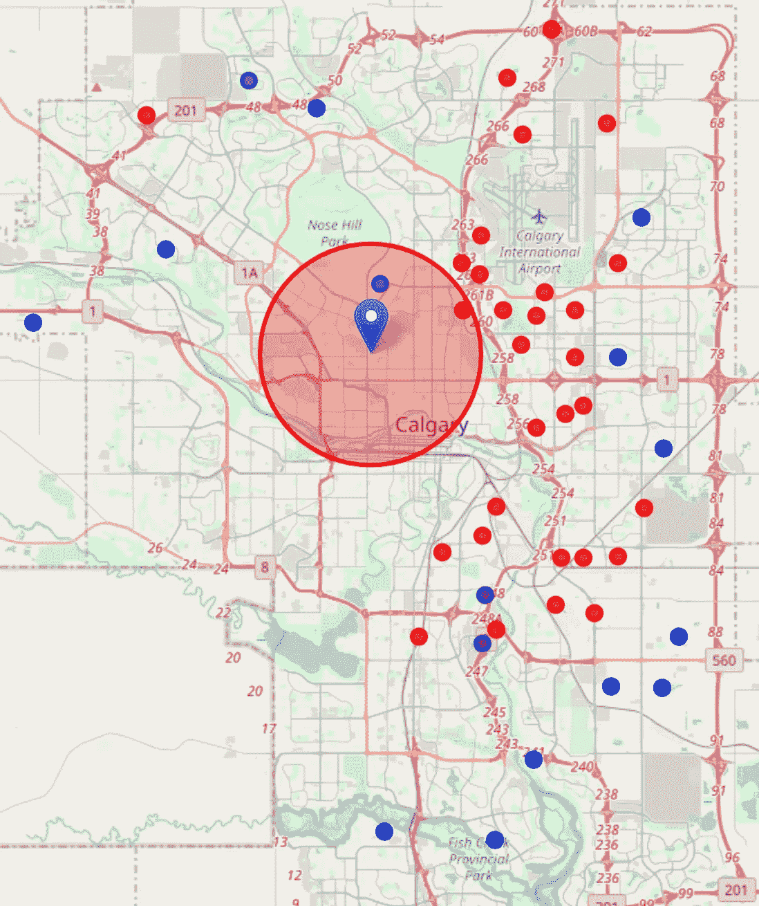

Most ideal area for a mid-size retail store.

## 结论

来自车队的 GPS 数据和城市社区数据被用来支持这一发现，并形成这一结论的基础。请记住，我试图向您展示如何在不深究太多细节的情况下，快速找到这类问题的近似解决方案。

使用实际路径数据寻找中间中心要复杂得多，建模和寻找更精确答案的下一步可能是使用每个点的相对权重。

## 参考

[](https://glenbambrick.com/tag/median-center/) [## 地理空间

### (开源地理空间 Python)“这是什么？”也称为最小距离的中心，中央中心是一个…

glenbambrick.com](https://glenbambrick.com/tag/median-center/) [](https://python-visualization.github.io/folium/) [## 0.8.3 文件

### 基于 Python 生态系统的数据优势和库的映射优势。操纵…

python-visualization.github.io](https://python-visualization.github.io/folium/) [](/data-101s-spatial-visualizations-and-analysis-in-python-with-folium-39730da2adf) [## 数据 101s:使用 Folium 在 Python 中进行空间可视化和分析

### 这是我称之为数据 101 系列的第一篇文章，这个系列的重点是分解如何…

towardsdatascience.com](/data-101s-spatial-visualizations-and-analysis-in-python-with-folium-39730da2adf)