# 如何教你的电脑识别姓名

> 原文：<https://towardsdatascience.com/solving-an-unsupervised-problem-with-a-supervised-algorithm-df1e36096aba?source=collection_archive---------18----------------------->

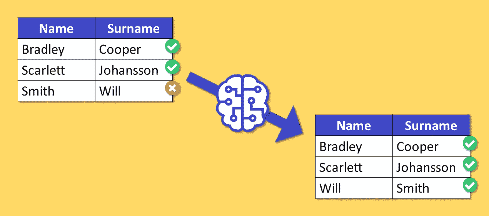

这篇文章来自一个非常具体的现实生活中的问题，这个问题产生于一个现实生活的数据集，并且通过所描述的方法成功地解决了这个问题。希望这一应用可以作为其他类似案例研究的灵感。

# 问题是:混淆了名和姓

假设您有一个巨大的数据集(超过 2000 万行)，其中包含关于某些人的个人数据。数据集遭遇**强重复问题**，因为数据来自不同的来源。此外，唯一的 id(如社会保险号)很少出现，这使得重复数据删除变得困难。

在这种情况下，唯一可行的方法是**概率记录链接**:一组能够量化数据集的两行或多行被引用到同一个人的概率的方法。当然，**名和姓是记录关联的基本特征**。

在这个设置中，您会注意到在**行中发现一个人的姓和名被调换**的情况并不少见(错误率约为 3%)，如下表的第三行所示:

为什么会这样？因为收集数据的方式不同。数据输入一直是由人类进行的，人类会犯错误。

显然，**这种现象会严重影响概率记录链接**。因此，我们的目标是检测这样的错误，并通过转换姓名来修改它们。

考虑到**标签不可用且无法获得(由于时间/资金限制)**，我们如何解决该问题？

# 让我们假设标签存在

让我们假设每行都有一个标签。如果存在这样的标签，它可以采用下列值之一:

*   '正确':如果人的名字出现在“姓名”列，而人的姓氏出现在“姓氏”列
*   “错误”:如果这个人的名和姓被错误地交换了

(这里我们不考虑打字错误或任何其他类型的错误)

如果我们真的有标签，我们会怎么做？

**朴素贝叶斯是一个很好的起点**。这种算法通常用作文本分类的基线，因为它可以轻松处理许多级别(在我们的例子中，有几千个可能的字符串)并且高度可伸缩。

该问题的简单朴素贝叶斯分类器的数学公式如下:

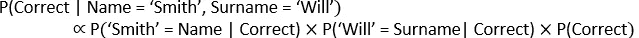

**朴素贝叶斯模仿人类思考的方式**(针对一些简单的问题)。的确，是什么推理过程让我们相信 Name='Smith'/Surname='Will '很可能是数据录入错误？因为——基于我们对世界的了解——我们知道:

*   P('Smith' =姓名|正确)=低
*   P('Will' =姓氏|正确)=低

因此，我们隐含地计算:

*   p(正确| '史密斯' =姓名，'威尔' =姓氏)=非常低

# **发明标签**

现在我们有一种机器学习方法可以帮助我们解决这个问题。唯一缺少的是标签。所以问题是:我们如何获得标签？

提示是:**数据集高度不平衡**。因此，即使存在错误，记录在大多数情况下也是正确的。因此，直觉是:**如果我们认为记录都是正确的，我们就很少会出错。**

假设观察结果都是正确的(错误的)假设不会造成太大的伤害，因为:

*   错误很少，所以经验概率不会受到它们太多的影响，因此它将接近真实概率，
*   这些错误并不取决于具体的名字或姓氏。事实上，没有理由认为某些名字或姓氏比其他名字或姓氏更容易被交换。

对于上面看到的例子，这相当于制造一个总是“正确”的标签。

我知道这看起来很疯狂，但是坚持住。如果所有的观察都被标记为正确，那么上面看到的公式可以归结为:

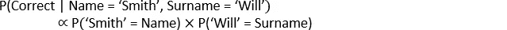

其中:

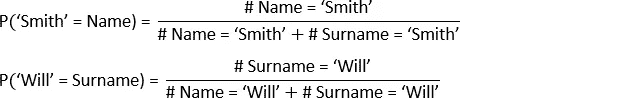

因此，我们现在能够计算将朴素贝叶斯应用于手头问题所需的每个量。

# 数据

我们将使用模拟数据集，以便我们能够量化结果的好坏。

用于产生数据的基本事实由来自美国人口的统计数据提供:

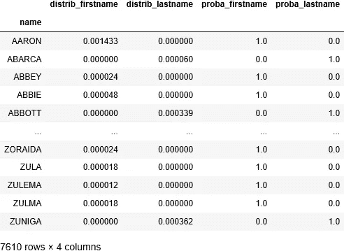

Ground truth

前两列( *distrib_firstname* 和 *distrib_lastname* )分别包含名字或姓氏的任何字符串的相对计数。这些列中的每一列总计为 1。

最后两列( *proba_firstname* 和 *proba_lastname* )包含每个字符串作为名字或姓氏出现的概率。每行的这两列之和等于 1。

然后，通过对名字和姓氏进行随机采样，并考虑 *distrib_firstname* 和 *distrib_lastname，获得数据集。* **数据集由 100 万行组成。错误率** **(名字和姓氏已经被交换的行的百分比)是 3%** ，这意味着 30，000 行。

这是一个数据集预览。

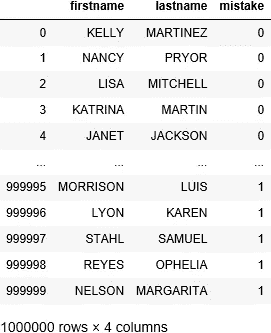

当然，我们有最后一列(也就是标签)，只是因为这是一个模拟数据集。但是，我们永远不会使用它，除了性能测量。

# 应用朴素贝叶斯

下一步是计算每个可能的字符串成为名字或姓氏的概率。基于我们在前面的段落中所看到的，一切都归结为简单地计算一个字符串作为名字或姓氏出现的次数。

我们只是做了一个额外的假设:如果一个字符串在整个数据集中出现的次数少于 10 次，我们将赋予它 50%的概率。

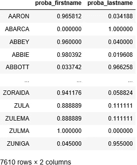

Empirical probability

现在我们可以计算数据集的每一行实际上是正确的概率。使用上面看到的公式，我们得到:

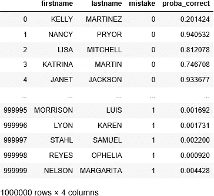

例如，第一行的概率如下获得:

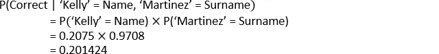

现在我们有了一个新的列，称为 *proba_correct* ，它为每一行分配一个正确的概率，我们只需要选择**一个概率阈值:低于该水平的观察将被视为错误**。

我们如何选择阈值？

由于这是一个任意的选择，它取决于几个方面，其中最主要的是**假阳性和假阴性的成本**。无论如何，看看分布总是一个好主意。

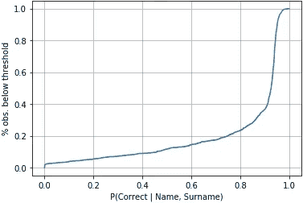

Empirical cumulative distribution of P(Correct | Name, Surname)

在我们的例子中，**因为我们知道错误的发生率在 3%左右，我们将选择第 3 个百分位数 *proba_correct* ，它等于 0.0394921** 。

在最初的实际问题中，我们没有标签，因此评估我们模型性能的唯一方法是对结果进行定性检查。

然而，由于我们使用了模拟数据，我们有能力计算输出质量的定量测量。例如，通过所选阈值获得的混淆矩阵为:

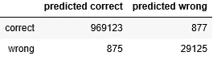

Confusion matrix

因此，**精度等于 99.8248 %** 。记住**原始数据集的准确性是 97%** ，这是一个非常强的结果，特别是考虑到模型是如此简单和可解释。

混淆矩阵意味着我们有 875 个假阳性和 877 个假阴性，总共 1752 个错误。出于好奇，我们可以看看其中的一些:

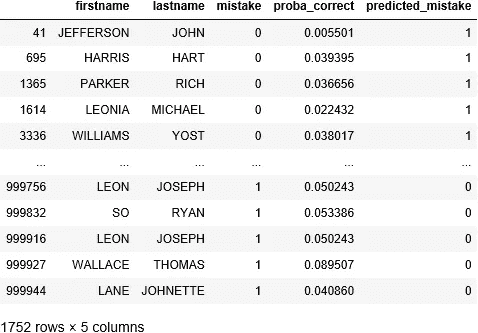

Errors (type I and type II)

事实上，**即使是人类操作员**也很难正确分类这些案例，从而确认我们工作的整体价值。