# 使用设计冲刺在四天内解决大挑战

> 原文：<https://towardsdatascience.com/solving-big-challenges-in-four-days-using-a-design-sprint-3ad468bf91df?source=collection_archive---------16----------------------->

为期 4 天的黑客马拉松，推动团队通过形成和创造新想法、构建新产品或现有产品/功能的原型，然后与真实用户一起测试和验证这些概念来解决重大挑战。设计冲刺将几个月的工作压缩到一周，有助于节省资金。

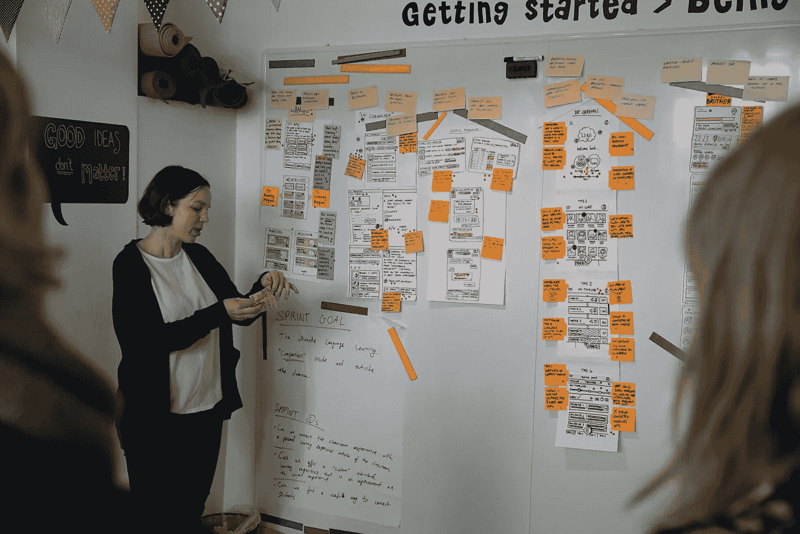

Photo courtesy of AJ&Smart

# 这个概念

使用设计冲刺过程有助于测试一个新的想法、功能、产品或服务是否值得花时间和精力去开发和向公众介绍。因此，设计冲刺是在你投入时间和精力构建新想法之前验证新想法**的最快方式，而不是在你需要等到**发布后的**投入数月和数千美元来检查客户的反应。**

> 设计冲刺是一个在 4 天内解决大问题和验证新想法的循序渐进的过程。— AJ&Smart

在 sprint 期间，sprint 团队应用设计思维方法来解决业务挑战/问题。因此，公司或企业所有者可以提高向目标受众推出新功能的成功率，在这些目标受众中，大多数客户的需求都得到了满足和考虑。

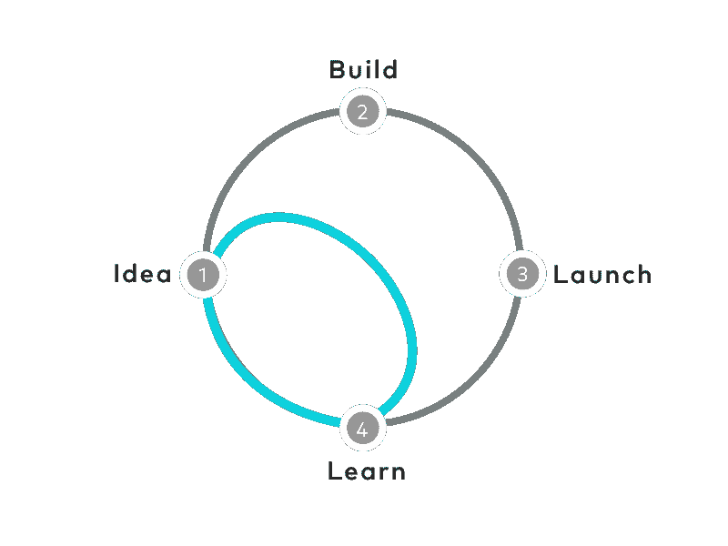

*The sprint gives teams a shortcut to learning without building and launching. (source:* GV.com)

> 在做出任何昂贵的承诺之前，你可以快进到未来，看看你的成品和客户的反应。—GV.com

# 该过程

在**的第一天** ( *团队研讨会*)，sprint 团队与个人一起定义挑战和目标，然后找出如何提出一个解决方案，称为“概念”，一个想法的三帧图像表示。

在**第二** ( *团队研讨会*)上，对第一天提出的所有概念进行投票，并决定一个方向。它是关于决定原型的挑战。然后，sprint 团队为获胜的概念创建一个详细的故事板，详细概述用户可能如何体验这个概念。

在**第三天，**sprint 团队必须将零件组装在一起，然后创建并构建一个原型；这个原型完全基于故事板。当团队在构建原型的时候，他们中的一个人应该在第二天招募真实的用户来测试原型。

在**第四天，**进行用户测试，然后在总结报告中总结用户测试反馈，以调整最终概念。总结报告包括原型的成功和挑战的详细分类。它还包括公司明确的后续行动步骤。

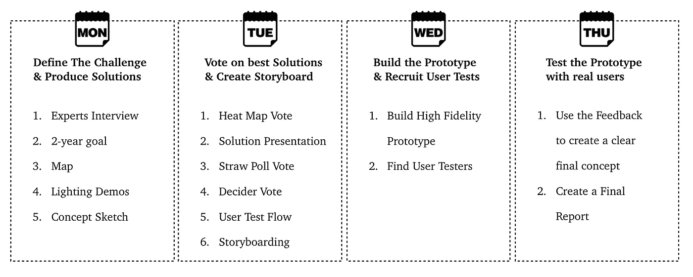

Adapted and Inspired by the new Design Sprint 2.0 at AJ&Smart

接下来，我们将通过一个 7 人团队进行设计冲刺的例子，他们应该**同意**一个问题，**决定**一个要尝试的解决方案，然后**构建**一个简单的测试，通过用真正的测试人员测试原型来验证该解决方案是否能解决问题。

## 澄清:

在开始举例之前，我想澄清一些要点:

*   示例中的原始故事和场景基于 AJ&Smart 创建的一个示例。**我的大部分作品和便利贴都是由 AJ & Smart 举办的研讨会改编的笔记**和灵感。
*   这不是关于如何进行或促进设计冲刺的指南或详细说明；这仅仅是每天成果的简要介绍，用来说明概念的过程和设计冲刺的力量。
*   **阿里的洗衣店**只是一个例子。网站是我编辑修改的草稿，不会被分享或发表。
*   *本设计冲刺示例中提及的所有名称和人物均属虚构。任何与真人、活人或死人的相似之处，纯属巧合。*

# 设计冲刺团队

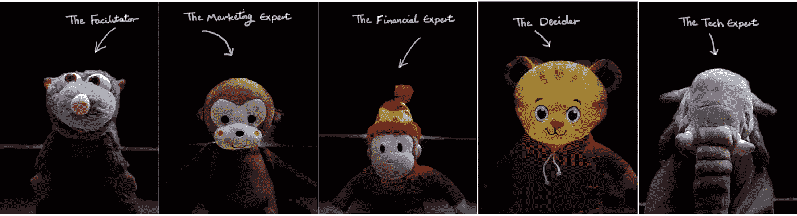

# 第一天

这一切都是为了开始设计冲刺，通过分享知识和经验，与团队进行 360 度介绍，了解冲刺团队想要解决的挑战或问题，为一周的工作选择目标，并了解团队的目标方向。

第一天很重要，因为它为冲刺周开辟了道路。当 sprint 团队开会，主持人采访专家时，团队会在白天和下午做一些事情。

## 业务和挑战

> **商家:**阿里的洗衣店
> 
> **服务**:提供各种洗衣服务。其中一项服务提供了**全套服务**，客户可以使用网站或应用程序来完成一项服务:
> 你订购>我们收取>我们清洗&清洁>我们送货
> 
> **问题:**人们认为这家企业只提供商务衬衫的干洗服务。此外，客户忘记在送货时间回家。

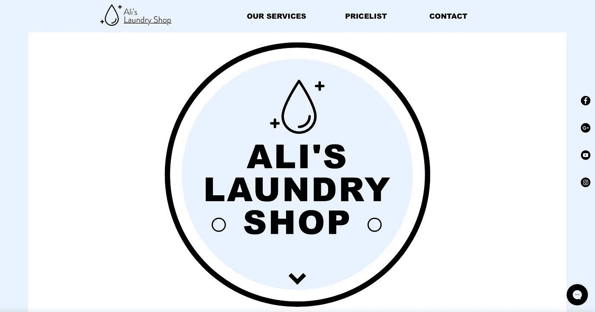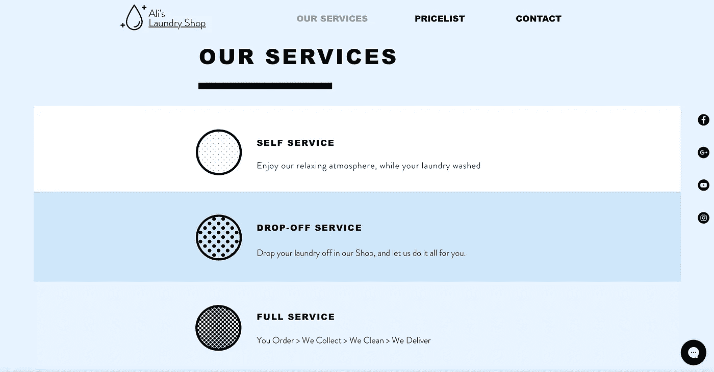

The Landing Page

## 第一步

> 当专家们谈论时，整个团队将会倾听并写下 **HMW** 便利贴，“我们该如何……”通过重新表述他们在便利贴上谈论的挑战/问题。这里的重点是关注数量，我们需要尽可能多的 HMW 有不同的观点和不同的挑战框架。
> 
> 35–45 分钟
> 5–10 分钟每个
> 2 个红点，除了决定者得到 4 个点。

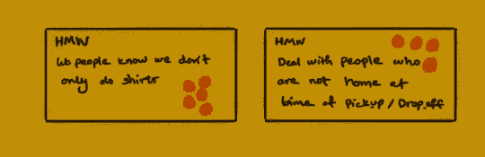

## 第二步

> 这里的目标是就一个长期目标达成一致，一个超级乐观的两年目标。这一切都是为了找到企业两年后的理想定位。sprint 团队的每个人都将在便利贴上写一句话，包括“**两年后……”**关于业务的未来，当然也非常乐观。
> 
> 然后，短跑队用**红点、**除了决胜局得到一个大的**绿点**在 2 年后的**时间**便利贴上投票。每个人将投票选出他/她认为最清晰、最鼓舞人心的目标。一句话，一个陈述，作为一个 2 年的目标得到了大多数的投票，这将使 sprint 团队走上正轨。
> 
> 10-20 分钟
> 1 张便利贴
> 1 个红点，除了决定者得到 1 个绿点

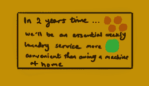

## 第三步

> 这里是 sprint 团队集思广益和单独合作的地方。每个人单独提出 1-3 个悲观的问题，“**我们能不能..”**，关于可能会阻止业务实现 2 年目标的事情。
> 
> 然后，冲刺团队使用**红点、**除了决定者得到一个大的**绿点**来对他们认为最需要回答的前 3 个问题**冲刺问题**进行投票。
> 
> 25-30 分钟
> 每人一张便利贴
> 每人一个红点，除了决定者得到一个绿点

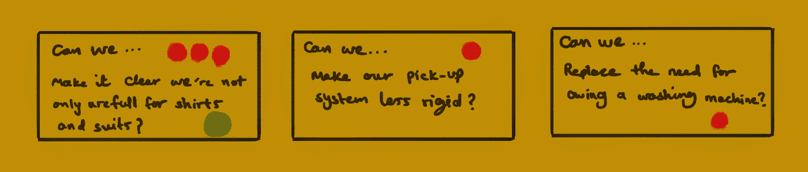

## 第四步

> 到目前为止，该团队创建了 HMWs，陈述了主要挑战、业务未来的长期目标以及三个关于可能阻止公司实现其目标的事情的 sprint 问题。在这里，sprint 团队将绘制一张**地图**来帮助选择**目标**，这是 sprint 团队可以在本周剩余时间内解决的挑战。
> 
> 为了确定一个有价值的目标，sprint 团队将拥有最多选票(点)的 HMW 一个接一个地放在地图上，看看它们在客户如何使用产品或服务的系统中的位置。因此，团队可以在剩下的冲刺阶段找到一个需要关注的领域。
> 
> 然后，通过一点讨论，sprint 团队选择一个好的地方来提出或者测试新的解决方案。应该是大部分 HMW 聚集的区域。
> 
> 30-45 分钟
> 1 冲刺地图
> 1-2 圈围绕选定的区域——由决定者决定

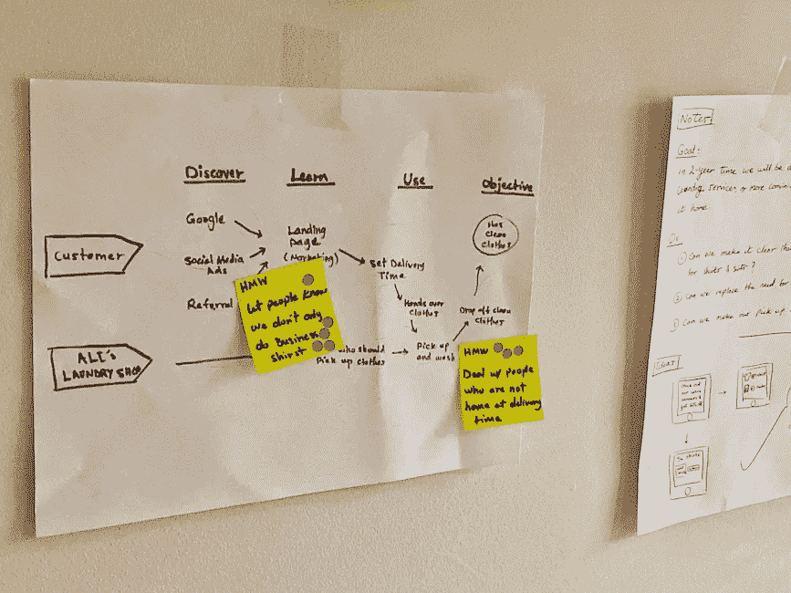

## 第五步

> 在这里，一切都与灵感有关；sprint 团队收集了许多公司、初创公司或任何组织的外部例子，这些公司、初创公司或任何组织都面临着类似于 sprint 团队试图解决的挑战。它向 sprint 团队展示了解决问题的方法。他们将受到其他解决方案的启发，每个人都在网上搜索真实的例子，并通过制作**照明演示**便利贴与团队分享发现。
> 
> 为了确定一个有价值的目标，sprint 团队将拥有最多选票(点)的 **HMW** 一个接一个地放在地图上，看看它们在客户如何使用产品或服务的系统中的位置。因此，团队可以在剩下的冲刺阶段找到一个需要关注的领域。
> 
> 然后，通过一点讨论，sprint 团队选择一个好的地方来提出或者测试新的解决方案。应该是大部分 HMW 聚集的区域。
> 
> 25-30 分钟
> 每场 1-3 次灯光演示

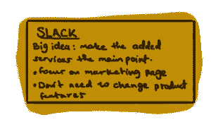

## 第六步

> 在理解了挑战并选择了关注的目标后，sprint 团队通过将想法具体化来完成**四部分草图**。
> 
> 1.**记笔记**:写单词让思想形成。每个人写下并收集他们迄今为止在便利贴上收集的所有信息，包括但不限于 2 年目标、冲刺问题、照明演示等。没有新的东西要添加，只是收集笔记以帮助形成想法。
> 
> 2.想法:私下里，sprint 团队的每个人都创造出反映他们笔记的视觉效果。这里的目标是将这些笔记转化为视觉形式。
> 
> 3.**疯狂八**:超越最初的想法，为一个你想进一步追求和探索的有希望的想法画八张草图。这里的目标是用不同的方式画一个想法八次。
> 
> 4. **3 步概念**:在这里，sprint 团队通过创建一个三面板故事板，将他们的想法组织成一个清晰的故事。一个概念，或一个故事，应该包括一个吸引人的标题和匿名，同时使其不言自明，并使用文字来说明想法。
> 
> 然后，通过一点讨论，sprint 团队选择一个好的地方来提出或者测试新的解决方案。应该是大部分 HMW 聚集的区域。
> 
> 1-1:30 小时
> 每个故事 1 个

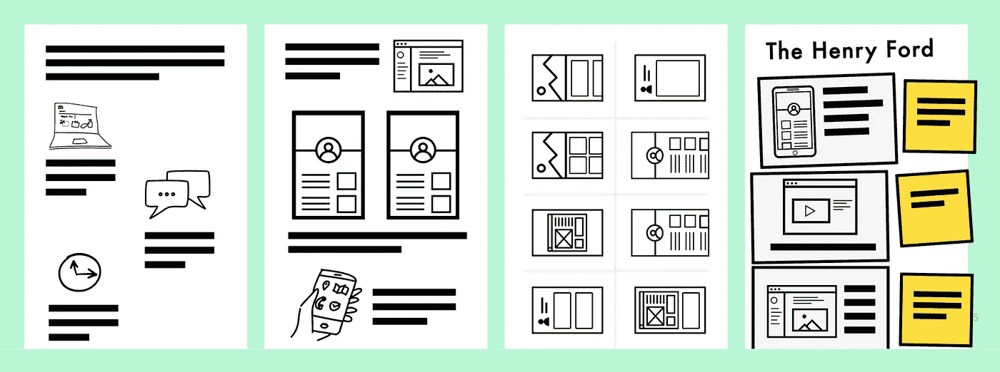

Example of a **Four-Part Sketch.** (Photo courtesy of AJ&Smart)

# 第二天

这是所有关于批评每个解决方案，或概念，并帮助决策者做出好的选择。因此，sprint 团队创建了一种简单的方法来测试所选择的解决方案，这种方法最有可能实现团队的长期目标。在第二天，sprint 团队将专注于验证这个概念或解决方案想法是否能够解决达成一致的挑战。然后，重点将是让团队对概念是什么以及如何让用户接受这个想法有一个清晰的愿景。

## 第一步

> 现在是**概念投票**的时候了。sprint 团队会默默地阅读和回顾第一天结束时产生的每个概念，然后投票，点数不限。
> 
> sprint 团队使用**红点**对草图(概念)进行投票，选择最有影响力的一个，并回答可能阻止团队解决问题和实现 2 年目标的 sprint 问题。
> 
> 这一步将创建一个**热图**，在那里投票给我们一个提示，sprint 团队的意见在哪里下降。
> 
> 10–20 分钟
> 红点无限制

## 第二步

> 在讨论了最热门的概念并填写了缺少的目标以获得一个完整、完美的概念后，将进行**投票*** 投票，sprint 团队的每个人将同时进行同步投票，以选择最佳想法。sprint 团队告知决策者他们对最佳解决方案的看法。
> 
> 除了决定者，sprint 团队使用**较大的红点和他们的首字母**来投票选出最好的想法，他们最终最喜欢的概念。决策者在 sprint 将要原型化和测试的概念上放置一个带星号的大绿点。
> 
> 20–25 分钟
> 每分钟一个大红点，除了决胜局得到一个带星星的大绿点
> 
> ***** **民意测验**是“一种非官方**投票**。它被用来表达对某一问题的普遍看法

## 第三步

> 现在，sprint 团队已经同意了一个最终的概念，在发布之前用真实用户进行验证和测试。这是关于为原型准备一个包含 6 个步骤的**用户测试流程**。同样，要点不是构建一个完整的产品或功能，而是用一个简单的原型(测试)来验证和测试想法(解决方案或概念)。
> 
> sprint 团队将一步一步地用 6 个步骤创建一个简单的故事，从一个现实的切入点开始，以一个理想的结尾结束，测试用户是否真的会这样做。所有的步骤都基于所选择的概念。
> 
> sprint 团队使用**红点、**除了决定者得到一个**大绿点**、**、**对他们认为最露骨的故事的用户测试流程进行投票。决策者制定最终的测试流程，用真实用户进行测试。
> 
> 35–45 分钟
> 1 个用户测试流程每个
> 1 个红点，除了决定者得到 1 个绿点

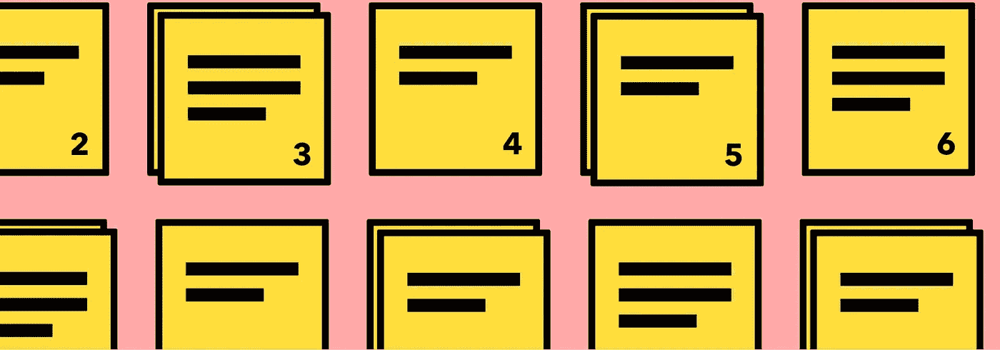

Photo courtesy of AJ&Smart

## 第四步

> 是时候绘制**故事板**了，它精确地说明和翻译了所选用户测试流程中的每一步，而没有添加任何不必要的东西或任何全新的想法。
> 
> 故事板的目的是当 sprint 团队开始构建原型时，不要对原型有任何未解决的问题。但是，要知道，这一切都是为了打一个赌；没有什么是 100%确定的。
> 
> 当 sprint 团队在为最终的故事板整理东西时，团队中的一个人应该开始根据他们的目标受众招募五个用户。例如，如果团队正在寻找一个广泛的目标，脸书广告或 Twitter 广告，或者如果他们正在寻找一个具体的目标，LinkedIn 广告。
> 
> 2–2:30 小时
> 1 整个团队的故事板

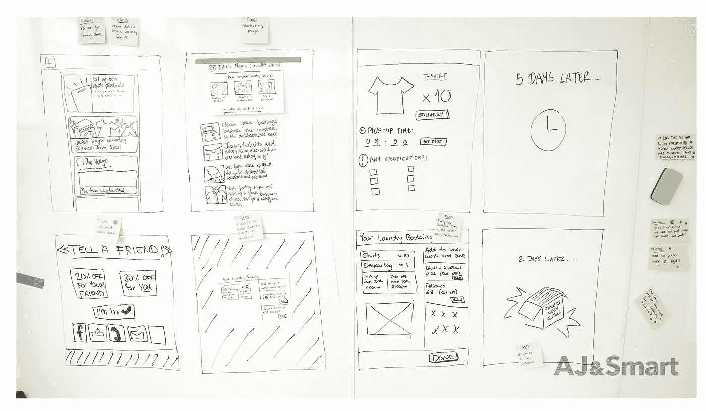

Example of the **Storyboard.** (Photo courtesy of AJ&Smart)

# 第三天

今天是**原型**日。制作原型的主要目的是获得 sprint 问题的答案，这些问题可能会阻止理想解决方案解决主要挑战。因此，sprint 团队将在第二天结束时准确地获取故事板中创建的内容，并使其对用户来说足够真实；如果是登录页面(营销)，创建包含所有所需信息的页面；如果是有形产品，例如咖啡豆，根据故事板中的决策，将咖啡豆包装成向客户销售的样子。

## 第一步

> 对原型来说只是一天；因此，专注于重要的事情是至关重要的。sprint 团队需要**通过标记故事板中明确必须完成的 2 或 3 个关键部分来区分工作**的优先级。
> 
> 确定工作的优先顺序后，sprint 团队一起**分配任务**以确认谁负责什么任务。但是，应该有一个人全面负责原型的建立，并在一天结束时做好准备。
> 
> 10- 20 分钟

## 第二步

> 在这里，一切都应该准备好开始构建**原型**。sprint 团队将从他们选择的 2 或 3 个关键部分开始，然后是故事板的下一部分。
> 
> 与此同时，团队中的一个人应该与将亲自或实时测试原型的用户确认约会。
> 
> 8-10 小时

# 第四天

在这一天，从设计冲刺开始的所有事情都汇集在一起。sprint 团队从一个巨大的挑战开始，然后创建了一个有希望的解决方案来克服问题，同时瞄准一个长期目标，最后构建了一个现实的原型来验证该解决方案是否能解决问题。是时候从真实的人那里得到真实的反馈，以评估长期目标和冲刺题的方向是否正确。

## 第一步

> 在对测试人员进行资格鉴定和安排测试之后，sprint 团队，最多 2 个人，准备一次访问一个用户。在采访用户之前，sprint 团队应该确认任务，审查原型，建立一个实时流，等等。
> 
> 团队的其他成员应该准备一个**反馈板**来总结每次面试时的所有笔记，要么确认要点(正反馈)，要么误解(负反馈)。—用不同颜色的便利贴。
> 
> 20-30 分钟

## 第二步

> 是时候进行面试了，一次一个，整个 sprint 团队一起观察和学习。
> 
> 6-7 小时

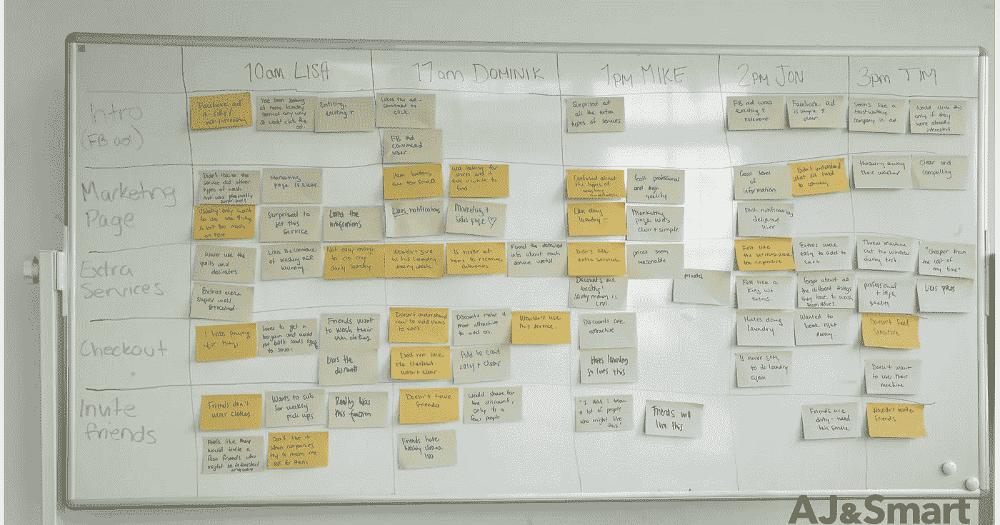

Example of the **Feedback Board.** (Photo courtesy of AJ&Smart)

# 结论

冲刺做好之后，冲刺团队需要把所有的反馈都拿过来总结一下，回顾一下长期目标和冲刺的问题，然后决定冲刺之后如何跟进。所有这些都被报告并格式化为最终的**总结报告**，其中包括基于反馈结果的下一步详细建议。这是一个很好的参考，可以记录在冲刺之前、之中和之后所做的一切。

这一切都始于:

> **经营:** 阿里的洗衣店
> 
> **问题:** 人们认为商家只提供商务衬衫的干洗服务。此外，客户忘记在送货时间回家。

而且，在找到解决问题的方案之前，我们设定了一个长期目标:

> **长期目标:** 成为每周必不可少的洗衣服务，比家里欠一台洗衣机更方便。

但是，我们发现一些陷阱会阻止我们达到目标:

> **陷阱(冲刺题):** - 能不能让我们的接送系统不那么死板？
> -我们能替代对洗衣机的需求吗？
> -能不能说清楚我们不只是干洗服务？

所以，我们需要一个公司，一个真实的例子，一个经历过类似情况的公司:

> **灯光演示(外部示例):** 懈怠

然后，我们制定解决方案，帮助我们克服陷阱，实现目标:

> **解决方案:** -重新设计登陆页面
> -突出显示其他服务
> -在衬衫与其他衣服搭配时增加折扣

最后，基于有助于解决**问题**和克服**陷阱**的**解决方案**(概念)创建了**原型**，用真实用户验证了**原型**，并在最终的**总结报告**中报告了反馈意见和详细建议。

sprint 团队可以做一个迭代周，在那里他们可以使用所有的结果、反馈、修改等等。从第一周开始。sprint 团队专注于根据建议调整原型。同样，sprint 的主要目标是**避免**投入数月和数千美元来分析客户对提交解决方案以解决重大挑战的反应。