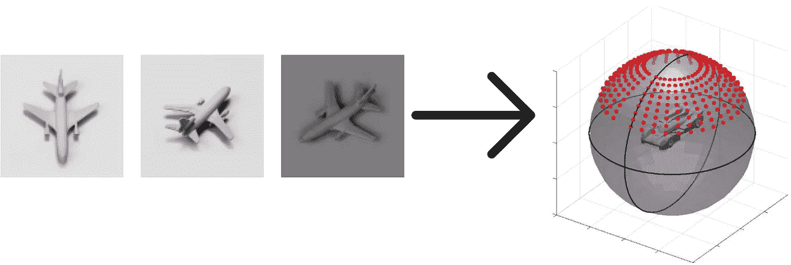
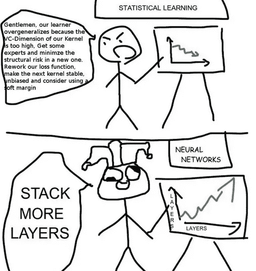

# 用深度神经网络解决经典的无监督学习问题

> 原文：<https://towardsdatascience.com/solving-classic-unsupervised-learning-problems-with-deep-neural-networks-768adb892201?source=collection_archive---------12----------------------->

3D embeddings of high dimensional data using PowerSFA

## *这篇文章讨论并总结了我的研究小组最近的两篇论文的思想:* [通过神经估计互信息学习基于梯度的 ICA](https://arxiv.org/abs/1904.09858)*和* [基于梯度的慢特征分析和谱嵌入训练](https://arxiv.org/pdf/1808.08833.pdf)

最近几年，已经提出了许多不同的无监督学习方法。无监督学习方法对数据进行汇总或转换，从而增强一些所需的属性。这些特性通常很容易通过分析获得，但是当在随机优化(例如神经网络)框架中工作时更难实施。

## 归纳偏差

在创建模型或定义方法之前，需要做一些基础工作。我们对数据或模型做了什么假设？我们如何知道我们最终得到的模型是好的，我们所说的*好的*到底是什么意思？

每个模型都预装了一套*归纳偏差。*支持向量机旨在最大化类别之间的间隔，较短的决策树优于较长的决策树，例如，机器学习之外，一个著名的归纳偏差是科学中的奥卡姆剃刀(最简单的解决方案最有可能是正确的。)以及它的工程表弟，KISS 原理(保持简单，笨蛋！).

*注:这在深度学习的书中被称为* [*正则化策略*](http://www.deeplearningbook.org/contents/representation.html) *而不是归纳偏差，但是我把“正则化”和用来减轻过拟合的东西联系在一起。虽然我们在这里不做推论，但我选择称之为用于指导学习的一般先验为归纳偏差。费伦茨·胡斯萨尔在他的* [*博客*](https://www.inference.vc/unsupervised-feature-learning-in-video-learning-to-linearise/) *中使用了这个术语，我现在也这样称呼它。*

# 激发了一些归纳偏见

我们可能想用独立特征来描述事物。特征只是数据的附加属性，可以直接从数据中发现。比如一张照片中黑色像素的数量，你在一盘棋中的物质优势等等。对于(统计上)独立的特征来说，意味着对一个特征的了解并不能告诉你关于另一个特征的任何事情。

为什么我们希望特性是独立的？人们很容易忽视独立特征的重要性，因为认为世界由独立的部分组成是很自然的。我喜欢这个场景:

> 作为一个例子，想象如下:一种被称为 grue 的语言，具有以下两个概念(即，单词):“Grue”:白天是绿色的，但是晚上是蓝色的，以及“bleen”:白天是蓝色的，但是晚上是绿色的。现在，使用 grue 语言，描述一个蓝眼睛的人会非常复杂，因为你必须说:这个人的眼睛在晚上是 Grue，但在白天是 bleen。
> ——[斯滕索尔](https://old.reddit.com/r/MachineLearning/comments/927hne/project_a_curated_list_of_research_papers_on/e34ref9/)

Describing Gru’s eyes using the “Grue” language is gruesome work.

我们可以看到，颜色和时间的概念在 grue 语言中并不是独立的(有些东西不能同时是“Grue”和“bleen ”),使用从属术语描述世界会引入许多不必要的复杂性。

我们可能想要描述我们世界的另一种方式是根据**慢速特征。**一个缓慢的特性并不是对它的抨击，而是强调它随时间缓慢变化。这是一种鼓励模型确定哪些元素在缓慢变化的具体方式，即使它们是由快速变化的组件组成的。例如，想象一个电影场景，摄像机正在轻轻地放大一张脸。即使我们感觉到没有什么发生(因为感知特征变化非常慢)，像素级的值变化非常快。

# 让我们慢慢开始

慢速特征可以通过[慢速特征分析](/a-brief-introduction-to-slow-feature-analysis-18c901bc2a58) (SFA)找到。重复一下，这不是一个缓慢的“特征分析”,而是一种发现数据缓慢变化的特征的方法。这些缓慢的特征是通过解决优化问题找到的:

简单地说，我们希望找到随时间变化尽可能慢的术语来描述我们观察到的现象。约束(2)-(4)对它们施加零均值、单位方差和去相关。这有助于我们避免退化的解决方案(任何常数函数都可以轻松地解决(1))，并确保我们不会以冗余的特征结束。

在实践中，期望值被样本值代替，我们将经验风险最小化。SFA 按照以下思路解析地解决了这个问题:

1.  对原始数据应用非线性函数。
2.  球形数据满足(2)-(4)
3.  计算球形数据的时间导数
4.  使用 [PCA](https://en.wikipedia.org/wiki/Principal_component_analysis) 找到球形数据变化最小的方向。
5.  通过将球形数据投影到对应于最低特征值的特征向量上来获得慢特征

这种方法已经被证明是我们视觉系统许多方面的精确模型。这种方法的一个局限是，非线性需要手动选取，这就提出了一个问题:以端到端的方式学习整个过程是否有利于提取更慢、更有意义的特征？

这正是我们在工作中所做的:[基于梯度的慢速特征分析和光谱嵌入的训练](https://arxiv.org/pdf/1808.08833.pdf)(将在 ACML 2019 中呈现)。我们训练了一个深度神经网络来解决旋转物体视频的 SFA 优化问题。这可以简单地通过使用(1)作为损失函数来训练网络来完成，但是约束需要通过网络架构来实施。

## 关于滚圆的一些话

如果特征的数据集 *X* 的协方差矩阵等于单位矩阵，也就是说，如果每个特征不相关并且方差为 1，则称该数据集*是球形的*。数据可以通过乘以白化矩阵 *W* 进行变换，使得 *WX = Y* 具有单位对角协方差。

我们如何在神经网络中实现这一点？一种简单的方法是在损失函数中加入一种正则项，将输出的协方差矩阵限制在单位矩阵附近。这将在最小化目标函数和实施约束之间引入一种折衷，而它们的实施是不可协商的。为此，我们为 Keras 创建了一个可区分的球形层。通过在倒数第二层中执行球形化，所要做的就是最大化球形化信号的慢度。

## 可微分球形化

现在，可以用各种方法分析找到白化矩阵，例如用 PCA 白化。如果我们有带有协方差矩阵*σ*的零均值数据，我们可以执行特征分解并得到*σ=uλuᵀ*(其中*σ*的特征向量在 *U* 中，相应的特征值排列在*λ*的对角线上)。这给了我们美白基质的成分(1/√D)Uᵀ)。这可以使用*幂迭代、*以微分方式完成，如下迭代公式

会收敛到 *C* 的最大特征向量。一百次(计算快速)迭代就足够了，并且从 *C* 中减去特征向量

然后找到第二大的，依此类推，直到我们完成并得到我们的球形矩阵:

# 图形 SFA

既然我们有了深入学习 SFA 的所有要素，我们就可以更进一步。不是仅仅最小化在时间上相邻的数据点的表示之间的距离，我们可以使用一般的相似性函数，并促使对于*先验*已知的相似数据点的表示是相似的。例如，考虑 NORB 数据集:

“This database […] contains images of 50 toys belonging to 5 generic categories: four-legged animals, human figures, airplanes, trucks, and cars. The objects were imaged by two cameras under 6 lighting conditions, 9 elevations (30 to 70 degrees every 5 degrees), and 18 azimuths (0 to 340 every 20 degrees).” — [source](https://cs.nyu.edu/~ylclab/data/norb-v1.0/)

球状可视化显示了相机角度如何连接不同的数据点。如果我们将每个数据点与它们的 4 个邻居(上、下、左、右)连接，那么我们可以最小化损失函数

r is 1 if data points i and j are connected, otherwise it is 0

得到一个本质上完美的数据球形嵌入:

Embeddings of a data set with images of an airplane toy from different viewpoints that differ in the height and rotation of the camera. The rotation angle of the viewpoint is color-coded on the left sphere and the height angle is color-coded on the right one.

请注意，与拉普拉斯特征映射等方法不同，这适用于样本外点！

# 独立特征

记住如果 P(A∩B) = P(A) P(B)随机变量 A 和 B 是独立的。学习数据独立特征的最著名算法是独立成分分析(ICA)。

在 ICA 中，假设我们的数据 *X* 是统计独立源 S 的线性混合，即 *X = WS* 其中 W 是混合矩阵。目标是对这个混合矩阵求逆，以得到源。这著名地解决了鸡尾酒会问题，我们有重叠对话的声音文件，我们可以分开。

通过最大化它们的非高斯性(你不想在这里知道，但是由于中心极限定理，随机变量的混合比每一项都更高斯)或者通过最小化每个分量之间的互信息来检索源，这是本文剩余部分的重点。

考虑变量 A 和 B 的交互信息:

This KL divergence term measures the distance between P(A∩B) and P(A)·P(B)

它衡量的是当你观察一个变量时，你对另一个变量了解了多少。右边是它们的联合分布和边际乘积之间的 KL 散度。A 和 B 的互信息为 0 意味着它们是独立的，因为 KL 散度测量概率分布之间的距离。由于 KL 散度是通过(通常)难以处理的积分来定义的，我们需要使用其他方法来估计它。

让 *E(X) = S* 表示我们的参数化向量值函数，以提取包含在向量 *S* 中的独立源。为了使输出在统计上独立，我们希望惩罚每个输出和所有其他输出之间的高互信息。关于[互信息神经估计器](https://arxiv.org/abs/1801.04062) (MINEs)的工作为神经网络 *M* 引入了损失函数，以估计一些随机变量之间的互信息的紧下界:

*-i* 索引表示除了 *sᵢ.之外的所有 *sⱼ'* 的向量*左边一项表示联合分布的期望值，右边一项是边缘的期望值。

很明显，我们希望使 *M* 的这个量最大化，以便对 *E.* 的输出之间的互信息进行精确估计，但是*E*——请原谅我的拟人化——希望这个量很小，以便提取独立分量。在一个系统中用一组矛盾的目标优化系统是很好理解的，从经典的期望最大化到 Goodfellow(或 Schmidhuber？)更近的生成性对抗网络。

The system learns statistically independent outputs by alternate optimization of an encoder E and a mutual information neural estimator (MINE) network M, parameterized by their respective *θ’*s. The mutual information (MI) loss L (Eq. 2) is minimized for E and maximized M.

包括一个可区分的球形层对于这个方法的工作也是至关重要的。我们假设这一层简化了计算问题，因为统计独立的随机变量必然是不相关的。作为概念验证，我们解决了一个简单的[盲源分离问题](https://scikit-learn.org/stable/auto_examples/decomposition/plot_ica_blind_source_separation.html):

Three independent, noisy sources (a) are mixed linearly (b). Our method recovers them © to the same extent as FastICA (d). The code for our solution is available at [https://github.com/wiskott-lab/gradient-based-ica/blob/master/bss3.ipynb](https://github.com/wiskott-lab/gradient-based-ica/blob/master/bss3.ipynb)

训练两个网络，一个用于生成解决方案组件，一个用于估计它们之间的交互信息，效果很好。编码器的每个训练历元之后是 m 的七个训练历元。估计精确的互信息不是必需的，因此对于良好的梯度方向，少量迭代就足够了。

在实践中，我们制作了 K 个估计函数副本，并让每个副本处理一个分量和其余分量之间的互信息的估计。我们发现这比针对每个组件-剩余元组训练 K 个单独的估计器效果更好。以这种方式在估计器之间共享权重的好处表明特征重用在不同的估计器之间是有价值的。

It’s all about finding the right balance between the two

## 总结一下

在这篇文章中，我讨论了我的研究小组最近设计的几个深度无监督学习。它们解决了由[慢特征分析](/a-brief-introduction-to-slow-feature-analysis-18c901bc2a58) (SFA)以及独立分量分析(ICA)所提出的经典问题。这两种方法都依赖于可区分的白化层来工作，这是在 Keras 中为我们的工作创建的。深度学习的 SFA 方法对于高维图像工作良好，但是深度学习的 ICA 方法仍然仅仅处于概念验证阶段。对于未来，我们将研究无监督或半监督的方法，这些方法有助于基于模型的强化学习的学习环境动力学。

在社交媒体上找到我: [GitHub](https://github.com/hlynurd) ， [Medium](https://medium.com/@hlynurd/) ， [LinkedIn](https://www.linkedin.com/in/hlynur-dav%C3%AD%C3%B0-hlynsson-93bb7b80/) ， [reddit](https://old.reddit.com/user/MTGTraner/) ， [Twitter](http://www.twitter.com/hlynurd)

本组网页:[https://www . ini . rub . de/research/groups/theory _ of _ neural _ systems/](https://www.ini.rub.de/research/groups/theory_of_neural_systems/)

*球状可视化* *改编自:王，小韩等，“以自我为中心的视觉对象变换的玩具盒数据集”arXiv 预印本 arXiv:1806.06034 (2018)。*