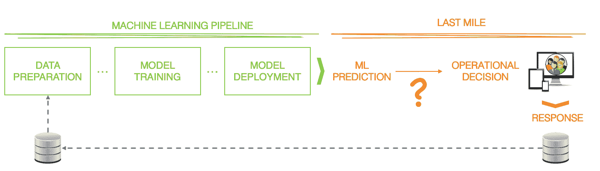

# 为运营决策解决机器学习的“最后一英里问题”

> 原文：<https://towardsdatascience.com/solving-machine-learnings-last-mile-problem-for-operational-decisions-65e9f44d82b?source=collection_archive---------25----------------------->

Photo by [Denny Luan](https://unsplash.com/@dluan?utm_source=unsplash&utm_medium=referral&utm_content=creditCopyText) on [Unsplash](https://unsplash.com/search/photos/animal-jumping?utm_source=unsplash&utm_medium=referral&utm_content=creditCopyText)

如果没有被使用，一个分析性的洞察力或训练过的模型就没有什么价值。

事实上，数据科学价值主张的一个核心原则是，机器学习(ML)模型可以在业务环境中进行解释和应用。洞察、分类和预测需要影响决策者，触及一线员工，或者嵌入业务应用。然而，许多机器学习项目在这方面失败了。这是数据科学版本的[最后一英里问题](https://t.umblr.com/redirect?z=http%3A%2F%2Fen.wikipedia.org%2Fwiki%2FLast_mile&t=YjFmZjIwMDI1YzNiNmQzYjQ4NjI3ZmQ1YTU4YmExNjlkYWM2OGI3NixWUWloOXR2bA%3D%3D&b=t%3AOdjRuA3CIBkw8Kr5zY8M_A&p=https%3A%2F%2Fseanjtaylor.com%2Fpost%2F102556088392%2Fputting-the-magic-in-data-science&m=0)，也是更广泛的“操作化”ML 的主要障碍之一。

当试图将 ML 用于*运营决策*时，即在运营应用和业务流程中嵌入基于 ML 的模型时，最后一英里问题可以细分为:

*   **解释模型响应以做出决策**
*   创造信任、透明度和组织变革
*   管理数据科学、IT 和业务的生命周期和资产

本文将关注突出显示的第一项，这是关于我们如何调用 ML 模型，解释响应，并将响应与业务策略相结合，以便做出决策。

今天，有一个令人印象深刻的机器学习软件和硬件堆栈，支持端到端的数据收集，数据管道的创建，特征工程。REST APIs 背后的模型训练、结果可视化、模型监控和模型部署。这个过程非常简单，可以这样来说明:

Machine Learning Pipeline vs The Last Mile

迄今为止，还没有充分考虑模型“部署”后，即“最后一英里”会发生什么。在 REST API 背后部署机器学习模型是一个很好的起点，但这是旅程的开始，而不是结束。为了使基于 ML 的预测在业务应用或流程中有用，您需要弄清楚何时调用模型，如何解释响应，以及如何将响应转换为可操作的决策。

## 调用模型

首先，您需要决定何时可以安全地使用 ML 模型做出的预测。通常一个模型在它被训练的数据范围之外是不可靠的。例如，一个针对年龄在 25 岁到 65 岁之间的司机的汽车保险风险模型，在预测年轻司机的风险方面可能不够稳健。这也适用于功能组合。一个用城市地区年轻司机的足够数据训练的模型不一定能提供关于农村年轻司机的可靠预测。保护 ML 模型免受未经培训的案例的影响对于保护您的业务至关重要。

这导致需要业务规则来决定什么时候不使用模型，什么时候按原样使用它，以及什么时候使用它并进行一些后验调整。无论您是瞄准新的客户群、推出新产品还是处理新型交易，这种选择都会频繁出现。

第一种选择是一开始忽略这个模型，启动业务，直到你有足够的数据对预测有信心。通常，这意味着依赖于使用人工编写的业务规则或决策表的不太精确的预测。如果这是您在采用 ML 之前使用的，那么在升级时可以方便地保存它们。

在其他情况下，你可以大胆地认为新产品/交易/细分市场与你已经有足够数据的东西足够相似。也许“年轻农村司机的风险=年轻城市司机的风险-5%”是一个比完全没有基于数据的预测更好的风险评估。同样，一些业务规则可以建立这种联系，调用模型并进行调整。

> 在实践中，对于企业决策来说，几乎所有 ML 模型的调用都会被至少一些业务规则或表所包围，这些规则或表决定了对于每个特定的情况调用什么模型。

## 调整预测

数据的可用性可能会限制机器学习模型的预测能力。我们可能没有足够的关于我们知道或怀疑会影响预测的特征的数据。在这种情况下，有必要在调用 ML 模型后调整分数或修改分类。

例如，房地产交易的公共数据集在多个国家和地区都可用。[法国政府的版本](https://www.data.gouv.fr/en/datasets/demandes-de-valeurs-foncieres/)相当全面，包含了 2014 年到 2018 年法国所有的房地产交易。这些数据包括房产位置、房间数量、内部居住空间大小、地块大小等。然而，不包括的是该房产是否有景观、游泳池、内部设施状况和最后一次装修日期。因此，虽然有可能建立一个回归模型来估计房地产的价值，但如果不单独考虑这些额外的参数，它可能会有+/- 20%的误差。一组业务规则或决策表可以很容易地用来上下调整属性值，从而得到更好的预测。

这种情况不是房地产独有的。金融服务中的风险评分、零售中的产品推荐、支付中的欺诈检测等，它们都可以受益于基于实时数据的调整，而这些数据在模型训练时是不可用的。

> 也许有一天，我们的算法可以获得清晰易懂的每一份数据，但与此同时，我们经常需要对基线预测进行调整。

## 组合模型

经营企业就是要平衡风险和回报。做出这种判断也延伸到了运营业务决策。例如，相对于客户违约的风险，发放特定贷款的估计利润是多少？如果我们不提供贷款，客户流失的可能性有多大？如果我们阻止信用卡交易，会对客户忠诚度产生什么影响？如果是欺诈，会有什么损失风险？

为了做出运营决策，我们通常需要将一组预测模型和策略规则缝合在一起。例如，在金融服务领域，以下是做出明智决策时需要考虑的典型因素:

*   风险评分(预测模型或风险表)
*   资格(政策规则)
*   生命周期价值(预测模型)
*   流失分数(预测模型)
*   定价策略(策略规则)

有时，甚至有必要将多个旨在预测同一事物的模型结合起来，但这些模型是从不同的数据源中获得的。例如，在医疗保健领域，围绕糖尿病存在大量研究，但研究方法的差异——研究时间长度、对照组设计、收集的数据等——使得合并数据和训练单个 ML 模型变得困难。事实上，最好的方法可能是训练和部署多种风险模型，并使用业务规则计算基于被评估患者的加权分数。

> 实际上，在商业决策中经常使用多个 ML 模型，并结合表达策略的商业规则。决策建模是结合这些预测性和规范性资产的艺术。

## 应用策略

绝大多数企业决策要么受制于业务政策、行业法规，要么应该遵循“常识”规则。以下是一些例子:

*产品推荐*

*   不要推销客户已经有的优惠
*   不要促销与突出优惠相冲突的优惠
*   不要促销不必要的高折扣(按客户群/层级)

*广告*

*   根据人口统计、地理位置和渠道限制显示哪些广告
*   不要展示冲突广告或竞争品牌的广告(“品牌安全广告”)
*   优化广告投放，以满足但不超出广告预算

*保险*

*   对以前欺诈客户的索赔实施人工索赔审查
*   自动支付低价值、低风险的索赔(基于客户细分/层级)

在某些情况下，像这样的业务规则是软偏好而不是硬规则，它们可以通过训练嵌入到 ML 模型中。在其他情况下，这是困难的或不可取的。你如何确保不向特定客户展示竞争广告(最好是跨会话和渠道)？什么样的 ML 反馈机制会阻止模型提供客户已经拥有的产品？你的公司将如何向审计员和代理机构证明你的决定遵守了法规(100%的时间)？

> 事实是，机器学习是一种概率方法，并不理想地适合遵守确定性的政策和规则。在基于 ML 的预测或分类之后应用业务规则通常会提供更好的一致性和透明度。

## 结论

机器学习的“纯粹主义”观点可能认为不需要商业政策，或者这种政策可以而且应该从数据中学习。这一学派认为，通过将学习与正确的现实世界结果联系起来，并设计有效的反馈回路(可能包括随机化和 A/B 测试)，ML 系统将逐渐学会在没有后验干预的情况下做出正确和最优的决定。

> 纯粹的“纯 ML”方法可能很适合下棋、识别图像或分类文本。对于企业决策，ML 本身很少是足够的。

在实践中，是通过“用规则应用策略”还是“训练 ML 模型”来实现特定的需求，这是一个具体情况具体分析的问题。对于刚接触机器学习的组织，或者当将 ML 注入到现有的业务流程中时，在 ML 模型之外实施策略要求通常更容易，至少在开始时是这样。

你可能会问，你可以利用什么软件来跨越机器学习的最后一英里？虽然典型的机器学习框架没有扩展到模型部署之外，但还有另一种软件类别填补了 ML 模型和业务应用程序之间的空白。

最常被称为*决策管理*——或者 Forrester 的“数字决策平台”——这些平台来自业务规则管理系统(BRMS)的时代，但已经发展到关注决策建模和整体执行。这意味着决策管理平台涵盖预测模型、规范的业务规则，并且通常支持运营决策的建模、监控和治理。

*格雷格在 IBM 工作，常驻法国。以上文章为个人观点，不代表 IBM 的立场、策略或观点。*