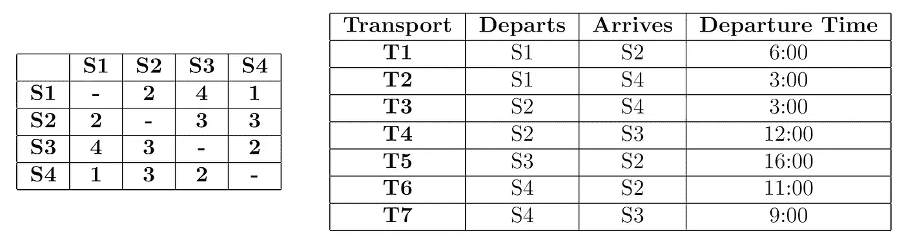

# 求解 DAG 上的最小路径覆盖

> 原文：<https://towardsdatascience.com/solving-minimum-path-cover-on-a-dag-21b16ca11ac0?source=collection_archive---------13----------------------->

## 我们讨论了一个算法来寻找一个 DAG 上的最小路径覆盖。

# 介绍

在这个故事中，我们将首先定义图上的最小路径覆盖问题(MPC ),然后将一个虚构的场景建模为 MPC。接下来，我们将分析我们的模型的结构，并将 MPC 简化为某些特殊情况下的最大匹配问题。我们将用解决方案来结束这个故事。

图的 MPC 是具有最小基数的顶点不相交路径的集合，使得这些路径的并集包含图中的所有节点。换句话说，在 MPC 中，我们希望用最少数量的不共享任何顶点的路径覆盖所有节点。这种划分不一定是唯一的。MPC 的应用范围很广，从软件测试到调度[1]。

# 一个示例场景

让我们定义一个假设的场景如下。假设你受雇于一家管理某城市地铁线路的公司。地铁总共有 4 个站，每个站都可以互相到达。市议会已经决定了车站之间应该进行的运输以及发车时间。因此，你剩下的就是决定你应该购买多少辆火车来实现所有的运输。当然，你想最小化这个数字来最大化公司的利润。

市议会向你提供了交通时刻表，以及从一个车站到另一个车站需要多少小时。这些表格如下:

Hours to take to reach from one station to another (left) and time table of desired transports (right).

现在让我们考虑一个解决方案。最坏的情况下，我们可以为每次运输分配一辆列车，购买 7 辆列车。但是，我们可以从表中观察到，一些运输可以由同一列车依次实现，如 T2 和 T1。如果我们最大化这种运输的数量，那么我们可以最小化购买的数量。因此，我们找到了目标函数最大化！

在最好的情况下，每次运输由同一列火车进行，一列火车就足够了。然而，我们可以看到，这是不可能的，因为有运输冲突的时间表，如 T2 和 T3。因此，我们定义了必须满足的约束。现在我们可以把这个问题表述为:

> 我们如何在完成所有运输的同时，最大化同一列车完成的运输总数？

为了对我们的约束进行建模，让我们为运输构建一个*可行性*图。在这个图中，我们用一个节点来模拟每一次运输，并画出一条从一次运输到另一次运输的有向边，当且仅当这两次运输可以由同一列火车顺序进行。例如，从 T1 到 T5 将存在有向边，因为火车可以在 6:00 从 S1 出发并在 8:00 到达 S2。然后 13:00 到达 S3，16:00 执行 T3。另一方面，T2 和 T3 不相邻，因为火车不能同时从 S2 和 S3 出发。生成的图表如下:

Feasibility graph of given constraints.

在这个图中，一条路径对应于一系列可以由同一列火车依次进行的运输。因此，如果我们找到覆盖所有节点所需的最小路径数，我们就找到了执行所有运输所需的最小列车数。

> 因此，我们的目标是在构建的可行性图上找到一个 MPC。

# 解决方案

对于一般的图，寻找一个 MPC 收敛于寻找一个哈密尔顿路径，不幸的是，这使得 MPC 成为一个 NP 难问题。幸运的是，对于有向无环图(Dag ),我们可以通过简化为二部最大匹配在多项式时间内解决 MPC，这可以在多项式时间内解决。

现在让我们检查一下我们的可行性图是否能包含任何圈。我们说过，一条路径对应于同一列车可以进行的一系列运输。对于一个周期的发生，我们应该至少有一对运输 *Tᵢ* 、 *Tⱼ* ，这样 *Tⱼ* 可以在之后**进行 *Tᵢ* 和 *Tᵢ* 可以在**之后 *Tⱼ* 进行**。但是，如果 *Tⱼ* 可以在**tᵢ*之后**进行，则意味着 *Tᵢ* 在**tⱼ*之后*开始**。因此， *Tⱼ* 无法在** *Tᵢ* 之后**进行，除非我们能时光倒流！***

> 因此，由于时间限制，我们的可行性图是一个 DAG，我们可以在多项式时间内解决我们的问题。

为了解决这个问题，我们将构造一个辅助图 *G* ，并在 *G* 上找到一个最大匹配。为了构造 *G* ，我们将把原始图的每个节点一分为二。其中一个节点将保留原始节点的输出边，另一个节点将保留输入边。例如，考虑可行性图中的节点 *t* 。 *t* 将被一分为二为 *t₁* 和 *t₂* ，我们将从 *t₁* 到 *t* 的邻居绘制一条边，而我们将从 *t* 到 *t₂* 的邻居节点绘制边。注意这样的图总是二分的。对于我们的可行性图，G 可以绘制如下。

Auxillary graph constructed from the feasibility graph.

寻找最大匹配意味着最小化不匹配节点的数量。如果右边部分的节点在 *G* 的最大匹配中不匹配，则在列车执行的序列中，在相应的运输之前，不应执行任何运输。这意味着我们需要这样一个节点一列火车。因此，最小化这样的节点相当于最小化所需的列车数量，在 *G* 上找到最大匹配就解决了我们的问题！

下面我们可以看到 G 的最大匹配，匹配中的边和节点用粗线表示，其余的边用虚线表示。

A maximum matching of G

注意，我们保证不存在完全匹配，因为在右边部分总是至少有一个节点没有输入边。该节点对应于最早的运输，因为最早的运输不能在任何其它运输之后进行。因此，总有至少一个不匹配的节点，我们至少需要一列火车。

有了最大匹配，我们可以通过从左到右追踪匹配来构建路径。这些路径对应于应由同一列车执行的运输，以最小化所需列车的数量。对于上图，我们可以追踪路径为{{ *T1，T4，T5* }，{ *T2，T6* }，{ *T3，T7* }。因此，我们需要至少 3 列火车来完成所有的运输，并在多项式时间内解决我们的问题！

## 参考

[1][https://www.wikiwand.com/en/Path_cover](https://www.wikiwand.com/en/Path_cover)

> 我感谢[tnaz Ekim](http://www.ie.boun.edu.tr/~tinaz/)在 MPC 上的演讲，让我首先听到了这个问题。