# 解决妻子的问题“我今天该穿什么？”用人工智能

> 原文：<https://towardsdatascience.com/solving-my-wifes-problem-what-should-i-wear-today-with-ai-9283e6503ec9?source=collection_archive---------13----------------------->


faAi, Fashion Assistant Artificial Intelligence

# 概观

我妻子几乎每天都会问我这个问题。

> ***今天该穿什么？***

这是一个很难回答的问题，因为首先我没有时尚感，而白纬玲恰恰相反，她也有时装设计学位。其次，我有一个不好的记忆，记得她在过去几周穿了什么衣服，以便能够为我的回答提供多样性。


What should I wear today?

因此，有一天我决定利用周末时间开发一项技术，我认为这项技术可以解决她的问题。

在我开始之前，我想感谢她在这个项目和我所有其他疯狂的项目中给我的所有支持。亲爱的，你是最棒的！

# 研究

我开始做一些研究，以找出我需要建立什么。我试着把自己放在她的位置，我需要什么信息来决定今天穿什么衣服。

## 我有什么衣服？(CH)

显然，我需要从我目前拥有的目录中推荐一件衣服。所以我推测这是一个必须的信息。

## 过去几周我穿了什么？(光盘)

你肯定不想连续几天一遍又一遍地穿同样的衣服。尽管这并不是非常关键，但知道你在过去几周穿了什么将有助于提供更多不同的建议。最重要的是，当你穿那件衣服时，天气和活动的信息对推荐系统也很有用，可以知道哪件衣服适合哪种场合和天气。

## 今天的天气(W)

不用想，你穿什么会受到当天天气的影响。

## 事件(E)

当你去参加一个聚会时，你想穿一些有点花哨的衣服，但是如果你要去远足，你想穿一些有点运动的衣服。

综上所述，今天(CTWT)穿的衣服可以用以下功能来描述:

*CTWT = Func(CH，CD，W，E)*

所有我需要建立的是一个系统，执行这样的功能:)听起来很简单吧？我开始发挥我的想象力，最终在她的衣柜上想象出一个带屏幕的语音助手设备，她可以问“我今天应该穿什么？”并配有推荐衣服照片的回答。更好的是，它将显示她穿那些衣服的样子，以提供更多的视觉背景。它也能够解释这种建议的理由。为什么？这样它就可以回答白纬玲的后续问题“你为什么推荐我？”通常在我推荐之后。

这项技术肯定会涉及很多人工智能。兴奋之余，我开始为这个人工智能寻找一个名字和一个角色，并提出了 faAi。它的发音是“费”，代表时尚助理人工智能。


faAi

# 行动（或活动、袭击）计划

我开始记下我需要执行的任务:

*   建立一个她每天穿什么的照片日记(CD)，用事件和天气标记。
*   建立她自己的服装照片目录(CH)
*   制作一个语音助手机器人，安装在她的衣柜上

建立服装目录的一个简单方法是逐一拍下她所有的衣服。而对于日记来说就是每天自拍。然而，作为客户体验和自动化的倡导者，这对我来说是不可以的。我需要一个系统，自动建立她的衣服目录和零努力日记。

经过一番思考，我想出了这个计划。如果我在房子里的某个地方安装一台照相机，自动拍摄她全身的照片，会怎么样？相机应该足够智能，只拍她的照片，而不是我或我的父母或我的姻亲(是的，以防你怀疑，我的父母和姻亲都不时与我们住在一起，幸运的是他们相处得很好)。它还需要能够识别她穿的衣服，将它们存储到衣服日记，只存储唯一的衣服目录。

除了相机，我还需要一个计算设备来执行上述所有的智能。最完美的设备应该是 AWS DeepLens。这是一个支持深度学习的相机，你可以在设备上部署无数的人工智能模型(在边缘)。

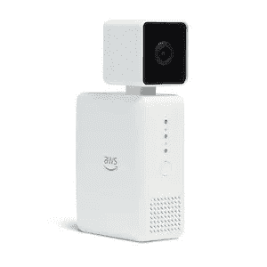

AWS DeepLens

从这一点上，我开始意识到这将是一个大项目。我肯定需要建立一个人工智能模型，在视频帧中识别人脸和身体，并执行面部识别。如果白纬玲的脸被识别，下一个人工智能模型需要捕捉她的衣服，并执行搜索，如果我们已经在她的目录中添加了这件衣服，否则创建一个新的条目。不管怎样，如果这是一件新的衣服，一个条目也会被添加到衣服日记中，用天气和事件来标记。

为了保持理智，我决定将这个项目分成几个阶段，第一阶段专注于自动建立衣服日记。由于我不需要建立服装目录，我还不需要建立服装识别系统。即使最终目标是在她的衣柜里有一个语音助手，但是我希望在第一阶段完成时，她已经可以使用一些东西。因此，我增加了一个额外的任务来构建一个移动应用程序，她可以用它来浏览她的服装日记，至少可以帮助她决定穿什么。

# 自动服装日记生成器

我的第一个任务是找到我应该安装这个相机的位置。在她的衣柜里安装相机可能不是一个好主意，因为我真的不想意外曝光我不应该曝光的照片，如果你知道我的意思。除此之外，我只想在她穿着这些衣服出去的时候，把它们加入她的日记。没有必要录下她在家穿着睡衣的样子。

经过一番寻找，我找到了一个完美的地方。在橱柜顶上，直接看到我的前门。好吧，你需要从前门出去。

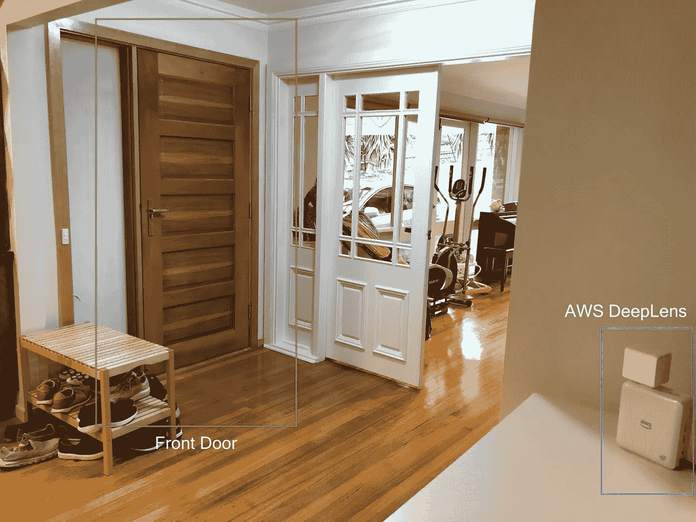

AWS DeepLens’ mounting position

# 用 AWS DeepLens 检测人和人脸

我的下一个任务是建立一个在我的 AWS DeepLens 中运行的人工智能对象检测模型，它可以检测人和脸的存在和位置。面部识别他们是谁，人裁剪他们的全身图像存储到衣服日记。

我使用 Amazon SageMaker 构建了一个自定义的对象检测模型，并将它们部署到 AWS DeepLens 中。然而，为了让这个博客在一个更高的层次上讲述这个故事，我将在一个单独的博客上发布完整的细节。

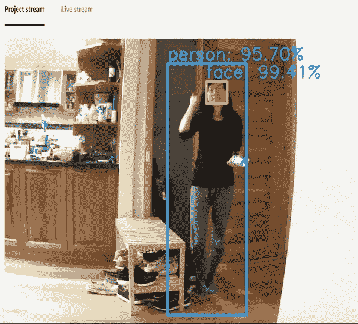

Face and Person Object Detection running on AWS DeepLens, seen from Project Stream window showing some debugging annotations

AWS DeepLens 附带了一个超级有用的功能，称为项目流，您可以显示和注释视频帧，并在您的网络浏览器上观看它们。这样，我可以很容易地观察我的模型的性能，并绘制一些文本和方框来协助我进行调试。正如你在上面的图片中看到的，我的模型准确地识别出了白纬玲的全身和她的脸。我对准确性很满意。

# **在正确的位置检测人员**

下一个要解决的问题是，只有当人在门区域附近时才触发捕获，这可能表示想要离开房子。然而，下面的示例镜头显示了一个错误的肯定检测，其中一个人只是从前面的起居室走向餐厅。

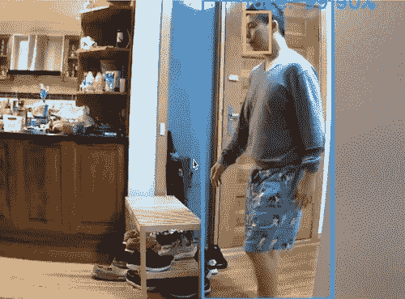

False Positive Detection

查看下面我家的平面图，可以清楚地看到两个红色的箭头，它们指示了导致误报检测的人的行走路径。而我们只想捕捉绿色区域中的人。对此最简单的解决方案是仅当人的边界框的顶部和底部完全在屏幕内时捕捉人。用上面的假阳性情况测试这个逻辑将正确地跳过这个图像，因为边界框的底部在屏幕之外。

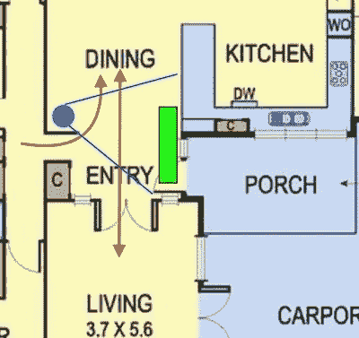

而下面的肯定情况将触发正确的图像捕获，因为边界框的顶部和底部都完全在屏幕内。


Correct Detection

为了确保我已经覆盖了所有可能的假阳性病例，我需要全天运行该系统。首先，我必须完成系统的下一部分，将被检测人的裁剪图像发送到我的图像记录器 S3 桶。这样，我可以在没有我监督的情况下运行系统一天，并在试运行结束时简单地检查桶中的所有图像。

从物联网设备发送图像的最佳方式是通过 MQTT 消息系统，这非常容易做到，尤其是在您创建 AWS DeepLens 项目时提供了很好的示例代码。我只需要添加几行额外的代码，将裁剪后的图像编码成 jpeg 流，然后进行 base64 编码，这样我就可以通过 MQTT 将它作为字符串消息发送出去。

```
client = greengrasssdk.client('iot-data')
iotTopic = '$aws/things/{}/infer'.format(
            os.environ['AWS_IOT_THING_NAME'])
personImageRaw = cv2.imencode('.jpg', personImage)[1]
personImageStr = base64.b64encode(personImageRaw)
client.publish(topic=iotTopic, payload=personImageStr)
```

消息将由云中的 MQTT 主题订阅者接收，然后触发我的 lambda 函数对图像进行 base64 解码，并将它们保存到 S3 桶中。从 MQTT 字符串中解码图像非常简单，只需要下面的一行代码。

```
jpgStream = base64.b64decode(event)
```

具备了以上所有条件，我运行了一整天的系统，并享受了周末的剩余时间:)

# 岳母回避

运行该系统一整天后，我的图像记录器显示了许多有趣的图像。一些图像是正确的检测，如下所示，这很好。

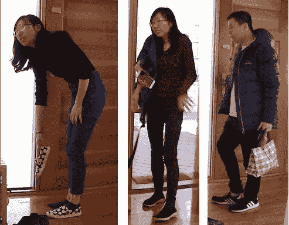

Positive Detection

看到我的其他家庭成员被记录是意料之中的事，然而其他事情引起了我的注意。有很多我岳母的图像(更确切地说是她的上半身)占据了所有拍摄图像的 95%。

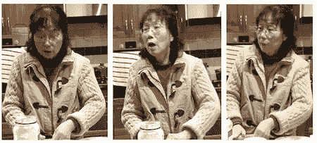

Mother in law is making her legendary dumpling

检查下面的原始视频录像日志揭示了原因。

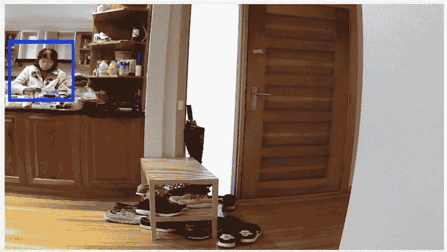

Mother in law behind the kitchen bench

显然，她通过了检测逻辑，因为她个人的边界框的顶部和底部部分(由于与厨房长凳的遮挡，只有她的一半身体被检测到)完全在屏幕内。该系统捕捉到了她的许多照片，因为她在厨房里花了很多时间。这将导致该过程进一步进行大量不必要的面部识别，这是不好的。然而，看到她整天被记录的无数照片，让我想起她每天为我们做饭和帮助我们的宝宝有多忙。对我来说，她是世界上最好的婆婆…

好吧，尽管她有多棒，我不希望她的照片在今后的处理过程中占据主导地位。这个问题可以简单地通过引入一个禁区来解决。想法是在排除线的左边部分排除检测(显示为下面的红线)

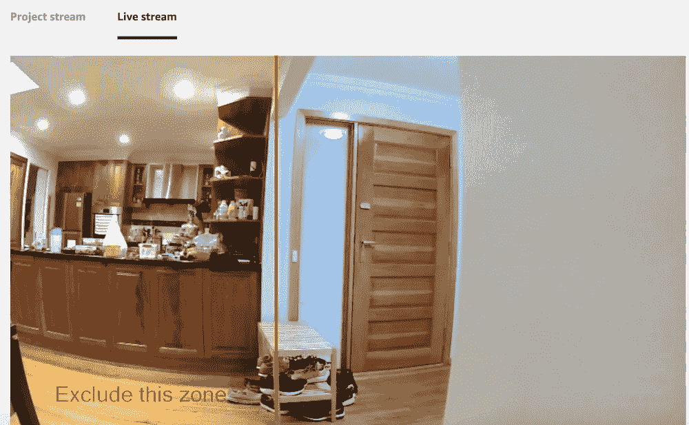

Mother In Law Avoidance Zone

再次运行该系统一整天，显示厨房长椅后面不再有婆婆！

# **检测合适的人**

我的下一个挑战是添加面部识别功能，并且只记录白纬玲或我自己的图像。只是澄清一下，并不是说我需要使用这个系统来推荐我穿的衣服，而是这样我就可以很容易地测试这个系统，而不用一直烦她在镜头前摆姿势。

我真的想在边缘做面部识别，以节省成本。然而，经过进一步的调查，这似乎很难。一个合适的面部识别系统需要大量的 GPU，这会给已经很慢的系统增加大量的处理时间。目前，我的面部/人物检测系统以 1 FPS 的速度运行。任何比这更慢的速度都会降低捕捉的机会。一个更简单的面部识别系统，如这里描述的对我不起作用，因为它只能识别正面脸。

有了以上，我决定在云端做面部识别。我设置了另一个 lambda 函数，当我的图像记录器中有一个新条目时，它将被触发。这个 lambda 函数将调用 AWS Rekognition —面部识别来识别人。如果该人被识别为本人或白纬玲，则创建 Postgres 数据库条目。这个 Postgres 数据库就是我们一直在说的衣服日记。拍摄图像时的时间、温度和天气状况(晴天、雨天、阴天)以及被识别的人的姓名也被存储为条目的一部分。当前的温度和天气是通过给气象局打一个 RSS feed 电话获得的。最后，图像也将被复制到另一个 S3 桶，作为一个公共图像服务器，将通过我的移动应用程序访问。这样，我可以确保只有受限的图像集是公开可用的，将来我甚至可以添加额外的检查，以确保没有敏感图像是公开可用的。

使用 AWS Rekognition 面部识别非常简单。我只需要创建一个包含我希望系统识别的人脸的人脸集合。对于每张脸(我自己和白纬玲)，我需要调用 IndexFace 将它们添加到集合中。点击[此处](https://docs.aws.amazon.com/rekognition/latest/dg/API_IndexFaces.html)了解更多相关信息。检查一张脸是否在集合中就像[制作一个名为](https://docs.aws.amazon.com/rekognition/latest/dg/faces-detect-images.html) l 的 API 一样简单

# 打造时尚日记 App

这是第一阶段最令人兴奋的部分，因为最终我将能够在移动应用程序上可视化服装日记。我们都是 iPhone 用户，所以手机应用程序必须在 iPhone 上运行。现在有很多方法来构建移动应用程序，比如使用 PhoneGap 这样的 HTML5 框架，Ionic 和 Xamarin 这样的交叉开发框架，或者直接使用 XCode。然而，作为一名 iOS 开发者，我的首选是 XCode。

为了提供对我的 Postgres 服装日记的访问，我使用 lambda 函数构建了一个公共 REST API。用它来构建一个功能性 REST API 是如此简单，这给我留下了深刻的印象。传统上，您将花费大部分开发时间来处理基础设施和部署，例如编写 REST 应用程序框架、URL 路由、部署脚本等，而不是编写实际的 API 代码。如果您需要编写的 API 如此简单，就像我的情况一样，这种情况会更普遍。

最后，下面是整体端到端架构图。

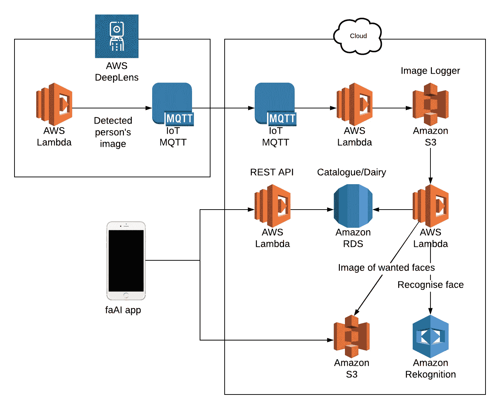

faAi architecture diagram

我设法在一天内完成了应用程序和 REST API，包括设计应用程序闪屏和图标:)如下所示的应用程序界面非常简单。一个可滚动的垂直列表，显示记录的白纬玲图像，按日期分组。天气(下雨，多云或晴天)图标和当天的温度是一个额外的好主意。我现在可以说这个系统已经开发完成了！作为一名经验丰富的软件开发人员，我知道下一个明显的步骤是 QA。

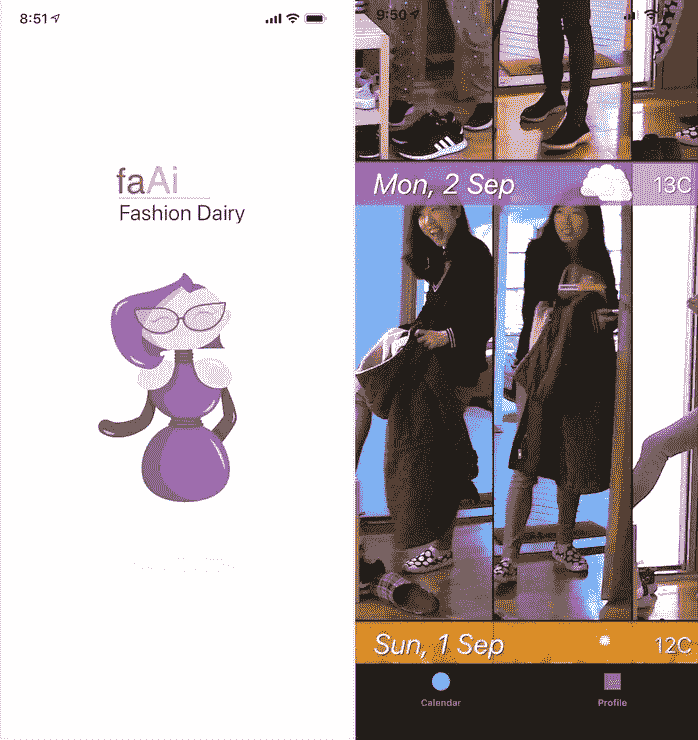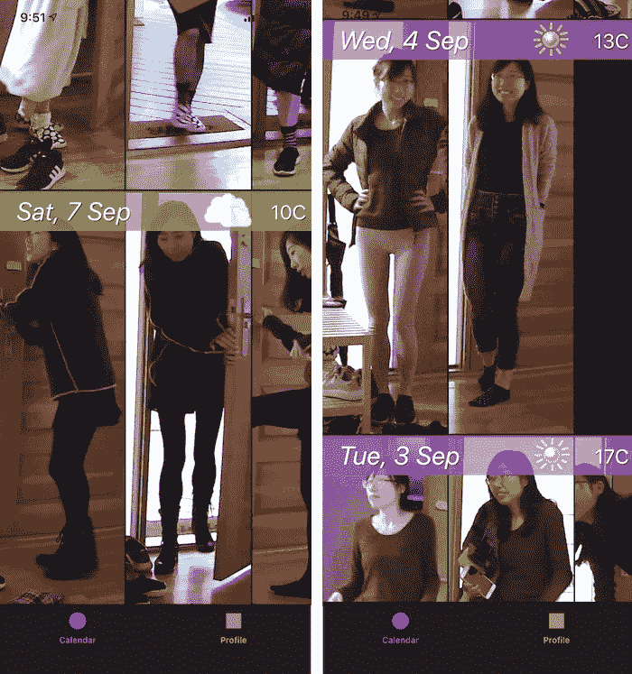

faAi app

# 质量保证

我整个星期都在运行这个系统，看起来它在正确地工作。我拍到了白纬玲进出房子的照片，没有一次误报！我还在她的手机上安装了应用程序，这样她就可以开始使用它并给我反馈。

尽管结果很好，但在下一阶段我还需要改进和增加一些东西。

## 更好的姿势检测

一半的图像是以非理想的姿势拍摄的。例如，当她走向换鞋台时，笨拙地侧着脸，抬起一条腿，抱着我们的孩子，或者穿着盖住她实际穿着的衣服的夹克。我还发现了一些例子，她实际上并没有走出家门，而是穿着睡衣站在门前。faAi 还不够智能，无论姿势的质量如何，只要检测到人脸，它就会拍照。

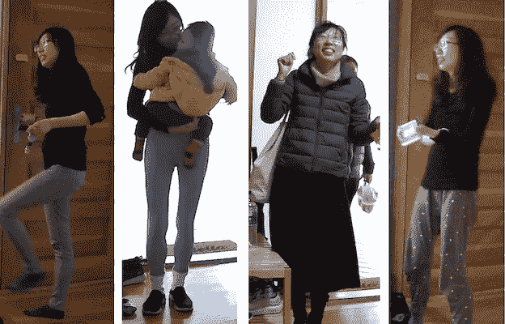

Non ideal pose captured by faAi

对于这个阶段来说，这并不是什么大不了的事情，因为我们的目标是拥有一个移动应用程序，让她可以浏览服装日记。她可以很容易地在脑海中过滤掉那些糟糕的姿势或无关的照片。为了解决这个问题，我需要一个更复杂的系统，我将在未来阶段尝试。目前，最简单的解决办法是让她脱下外套，面对镜头，在她出门或进屋时迅速摆好姿势，这样拍的前几张照片就不错了。

## 事件检测

这是我在这一阶段没有时间完成的任务，我将在下一阶段处理。了解她为什么要出门也有助于过滤掉不想要的捕捉。例如，当她出去扔垃圾的时候。

这就是现在，我很高兴一个里程碑已经被勾选，但是仍然有更多的挑战等待我去解决，以拥有一个完整的端到端系统。但是什么是没有挑战的生活呢？

阅读这篇博客的续篇，它讲述了我是如何教 faAi 识别布料的。