# 结合统计学习和机器学习解决回归问题

> 原文：<https://towardsdatascience.com/solving-regression-problems-by-combining-statistical-learning-with-machine-learning-82949f7ac18a?source=collection_archive---------6----------------------->

## 以 Airbnb 西雅图价格预测为例

Photo by [Ben Dutton](https://unsplash.com/@benjamiindutton?utm_source=unsplash&utm_medium=referral&utm_content=creditCopyText) on [Unsplash](https://unsplash.com/search/photos/airbnb-seattle?utm_source=unsplash&utm_medium=referral&utm_content=creditCopyText)

在数据科学领域，统计学习和机器学习通常被视为两个独立的阵营。第一个阵营的人通常更倾向于理解统计意义，而后者更关心模型预测性能。但实际上，这两种不同的方法在携手解决数据科学问题时是互补的。

大多数数据科学项目分为两大类——回归问题(当目标变量是连续的/数字的)或分类问题(当目标变量是离散的/分类的)。这篇文章将只关注如何一步一步地结合统计学和机器学习来解决回归问题。

线性回归通常是我们在任何数据科学课程中学到的第一个模型。它简单，直接，最好的是它可以产生可解释的系数。后来，我们可能已经学习了许多其他更复杂和更高性能的基于树的算法，如随机森林和梯度推进树等，它们可以解决回归和分类问题，但在功能的基本假设方面具有更大的灵活性和容差。

树族算法是如此之好，以至于它们成为我们的首选模型，但它们在某种程度上让我们变得更懒，因为它们在特征预处理方面需要很少的努力。然而，使用线性回归等基本算法为学习如何选择和处理数据提供了很好的机会，我认为这是一项比运行模型本身更重要的技能。

# 目标

在这篇文章中，我将指导你使用 Kaggle 的最新版本的 Airbnb 西雅图数据集来完成一个回归项目。它面向具有回归算法基础知识的读者。其目的更多的是说明当您获得一个没有任何明确目标或方向的数据集时的整个工作流程，您需要定义自己感兴趣的问题并找出解决问题的路线图。

该项目的主要问题是:

1.  使用西雅图个别房源的可用信息预测 Airbnb 房源价格。
2.  探索影响西雅图 Airbnb 房源价格的重要因素。

像任何典型的数据科学项目一样，我对刚才提出的问题的解决方法将遵循下面的流程图。这是一个遍历所有步骤的迭代过程，而不是一个单向隧道。

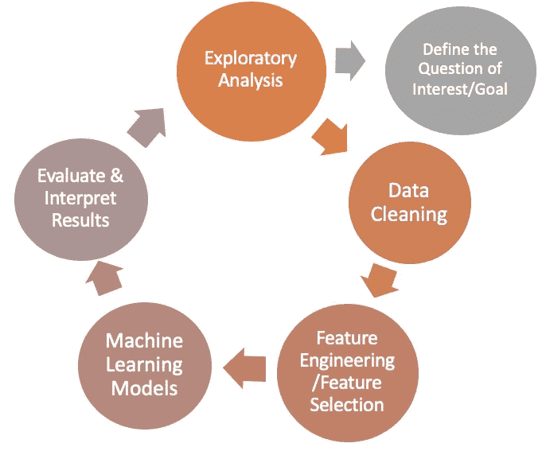

data science project workflow

# 数据集概述

首先，我们来看看数据。Kaggle 上有 3 个数据集:

**Listing.csv:** 包含关于地点、主持人和平均评论分数的属性的综合列表

**Calendar.csv:** 包括列表 id 以及每天的价格和可用性

**Review.csv:** 包括列表 id、审阅者 id 和详细注释

对于这个项目，由于我的目标是预测上市价格，我将只使用上市数据集。评论数据集对于情绪分析来预测上市评级非常有用，但我将把这部分留给我未来的帖子。

列表数据中总共有 93 列。用数据帧头调用很难一次检查所有的列，所以我将按数据类型将它们分开，并分块检查。

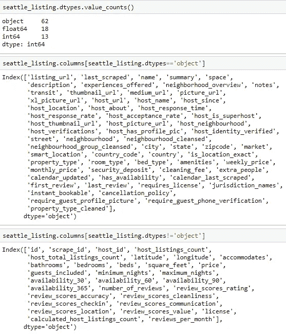

透过柱子，一些东西引起了我的注意。首先，有几个应该是数值的特性目前在“对象”数据类型中，如'周 _ 价格'，'月 _ 价格'，'安全 _ 存款'，
，'清洁 _ 费用'，'额外 _ 人'等。这是他们现在的样子。我将在后面的数据清理步骤中把它们转换成数字。

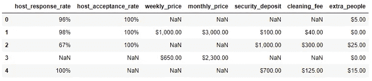

current string format of some numerical features

我还意识到两个特性组可能包含非常相似的信息——一个是关于列表邻域，另一个是关于评论评级。让我们一个一个地检查它们。

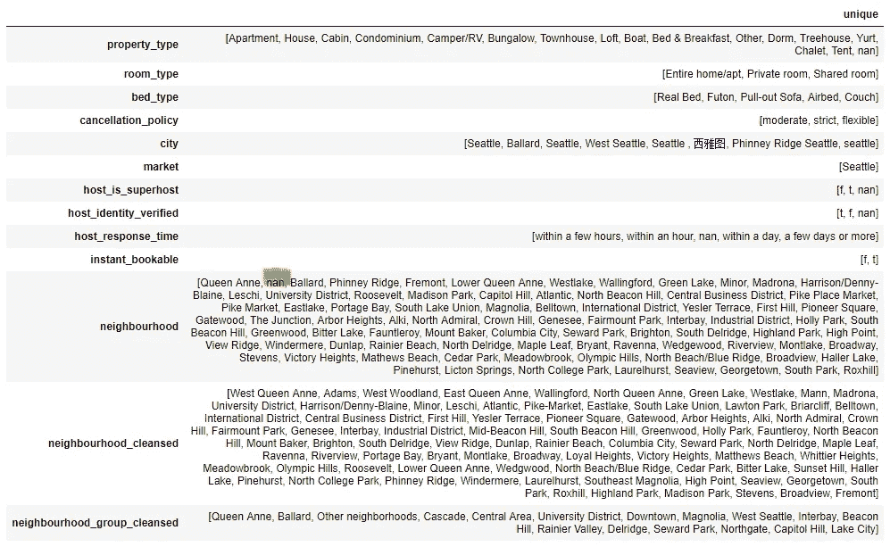

unique values of some categorical features

看起来“neighbourhood _ cleansed”和“neighborhood”几乎相同，只是后者包含 NaN，而前者不包含。我将放弃“neighborhood”列，而选择“neighbourhood _ cleansed ”,因为后者是一个更干净的版本，这样做不会导致任何信息丢失。

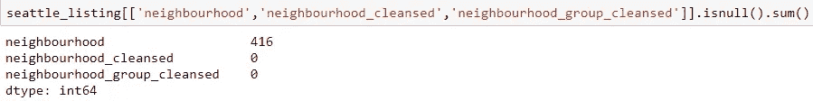

NaN count of the neighborhood feature group

对于审核功能组，“审核分数评级”似乎是其他 6 个单独评级类别的加权总和。我认为该功能组中可能存在很强的共线性，因此我可以只使用总体评级来表示组中的其他部分。我想以后验证这个理论。

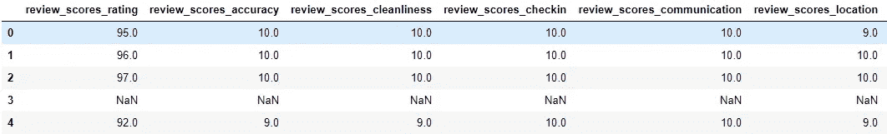

# 探索性分析

**1.1 超级主持人总是比 Airbnb 的普通主持人收视率高吗？超级主机的收费也和普通主机不一样吗？**

我想验证的第一个假设是普通主机和超级主机之间评论评级和价格的差异。下面的 violin 图表显示了仅超级主机和普通主机以及所有主机组合之间的评论得分和列表价格分布。

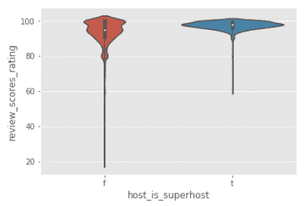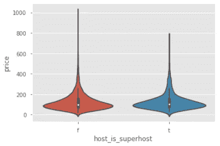

评论评分显示了超级主机和普通主机之间的明显区别——大多数超级主机的评分都在 90-100 左右，相比之下，普通主机只有 61%的评分超过 90，这是由于较低评分中的长尾效应。另一方面，价格分布对于两种类型的主机似乎是相同的，除了来自常规主机的一些罕见的极高价格异常值。

**1.2 按街坊划分，不同物业类型的挂牌均价是多少？**

数据集中的原始属性类型相当分散。我整理了一下，把它们分成 4 大类。从下面的柱状图中，我们可以了解不同社区和不同物业类型的平均挂牌价格的差异。

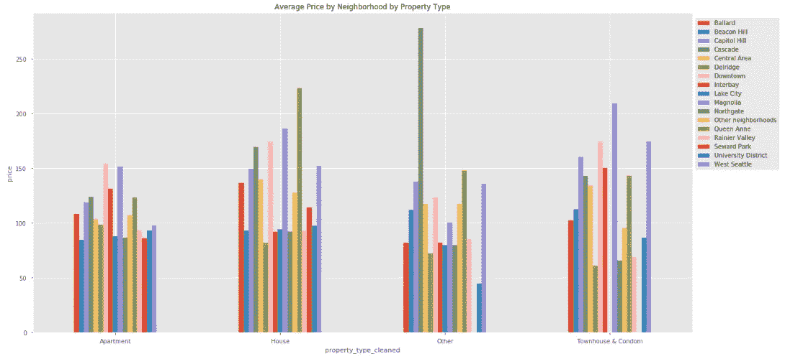

与其他三个房地产群体相比，不同社区的公寓价格差异似乎要小得多。在所有的社区中，市中心和木兰区通常是最受欢迎的房产类型中最贵的——公寓、房子、联排别墅和避孕套。

这张图表也证实了社区和房产类型肯定会对挂牌价格产生影响。

**1.3 评审特征组之间是否存在多重共线性？**

我将它除以 10，使“review_scores_rating”达到与该组中其他功能相同的 1-10 等级。这是它们的分布是如何相互重叠的。他们看起来都严重右倾。

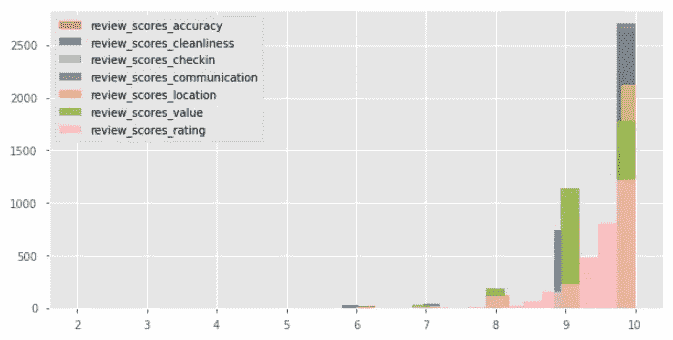

review feature groups histogram

为了进一步检验我的共线性理论，我认为最简单的方法是运行一个简单的线性回归，看看“review_scores_rating”是否可以用 rest 6 review 特征的一个线性方程来表示。

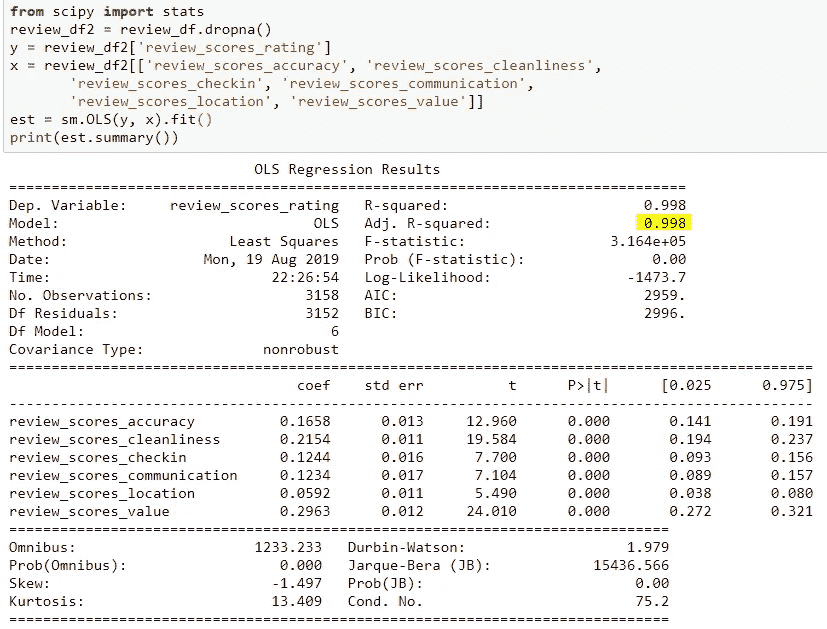

显然，答案是肯定的。因此，我可以确信，我可以使用总体评级来表示其他评级，而不会丢失太多信息，并减少线性模型中的多重共线性。

# 简单的数据清理和功能选择

因为我的目标是预测列表价格并理解普通主机和超级主机之间的区别，所以我只想包括与列表和主机相关的属性。以下是我决定保留的功能。

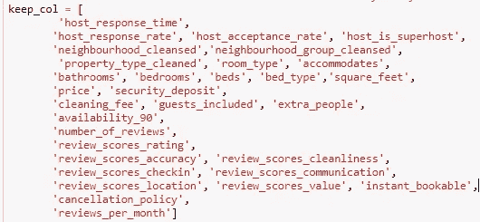

**数字特征**

正如我们在探索性分析中发现的，一些数字列目前都是字符串格式。下面的那些列应该通过从值中去掉“%”和“$”符号转换成浮点类型。

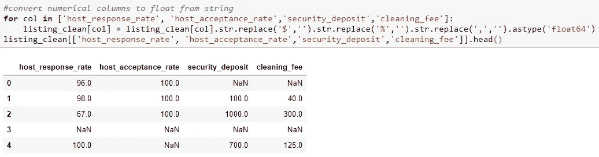

经过一个简单的清理步骤，现在他们看起来像数字。

现在，数字特征已经处理好了，让我们来看看相关热图。

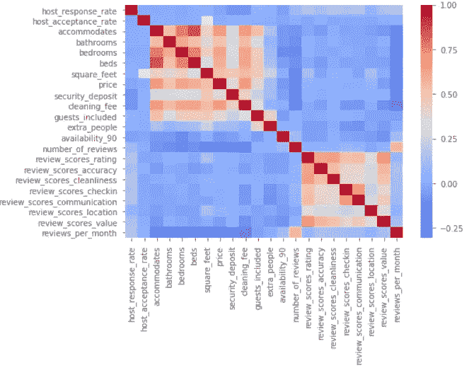

显然，热图中有两个主要的相关组。一组是关于设施的列表，比如卧室、浴室的数量，可以容纳的人数等等。我想保留这个组中的所有特征，因为它们都告诉了关于列表本身的基本信息。另一个相关组是关于复习分数的，我们之前已经讨论过了。我决定只保留一个总体评价分数“review_scores_rating ”,并删除其余的评价列。

**分类特征**

在我对所有分类变量进行虚拟编码并将特征的数量增加三倍之前，我想看看它们在解释标价的可变性方面有多有效，以决定我是否要将它们全部用于模型。这一步是可选的，但我发现当数据集包含许多具有几十个级别的分类特征时，这一步特别有用。

您可能已经从其他关于 Medium 的文章中了解到三种特征选择技术:使用统计测试的过滤方法、使用机器学习算法(如 LASSO 和 Random Forest)的包装方法和嵌入方法。

因为我想测试连续目标变量的分类特征，最简单的统计过滤方法是 ANOVA 测试。对于那些像我一样对哪种统计检验可以用于什么类型的数据感到困惑的人来说，这是一个非常有用的参考。

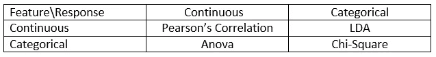

[source: Analytics Vindhya](https://www.analyticsvidhya.com/blog/2016/12/introduction-to-feature-selection-methods-with-an-example-or-how-to-select-the-right-variables/)

下面的代码遍历数据中的每个分类特征，并根据针对目标变量“价格”的双向 ANOVA 测试计算 F 统计量和 P 值。

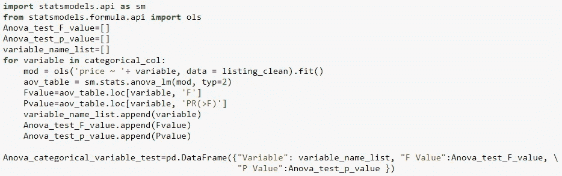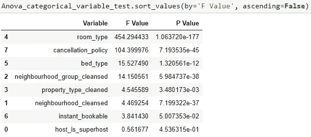

ANOVA test results for categorical features

**F 统计量的定义(AVONA) =** **总体均值的组间方差/样本均值的组内方差。**

如果 P 值高于 0.05(显著性水平的经验法则)并且 F 统计接近 1，这意味着组内(每个分类水平内)价格的方差与组间(不同分类水平之间)方差相同，因此我们可以说分类特征独立于连续变量(在这种情况下，价格)，并且它不具有任何预测能力，因为分类水平之间没有观察到的价格方差。

相反，f 检验统计值越高，分类变量的不同级别之间的平均价格差异越大，分类特征能够解释的价格方差越大，其预测价格的能力就越强。

显然，从上面的 ANOVA 测试结果来看，我们可以首先排除底部的两个特征，因为它们的 P 值太高，不具有统计显著性。同样给定他们的小 F 统计，我们可以得出结论，在两个水平`host_is_superhost`和`instant_bookable`之间有非常小的价格变化。

此外，还有两个与`neighbourbood`相关的特性。从上面的探索性分析可以明显看出，邻里关系会影响挂牌价格。但是由于除了`neighborhood_cleansed`处于更细粒度的级别之外，它们基本上包含非常相似的信息，所以我想只保留其中的一个。F9 统计给出了一个非常清晰的选择思路。我会留着`neighbourhood_group_cleansed`，因为它的 F 分更高。

完成要素选择后，让我们看看数据集中缺失的值。

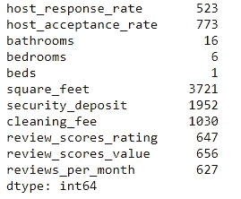

count of missing values

有超过 97%的 NaN 值，所以我将放弃它。对于其余的数字特征，我稍后将在机器学习管道中估算 NaN 值，以避免测试集中的数据泄漏。最后一步是将分类特征转换成虚拟变量。现在数据集已经准备好了，让我们直接进入建模。

# 机器学习

**模型 1:原始价格的线性回归**

首先，我想从最简单的模型——线性回归开始，看看在不对特征进行任何处理的情况下，基线会是什么样子。

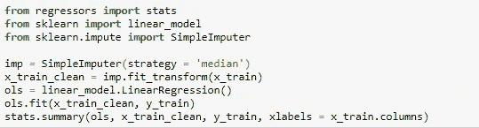

我使用方便的回归软件包来获得模型系数 P 值。

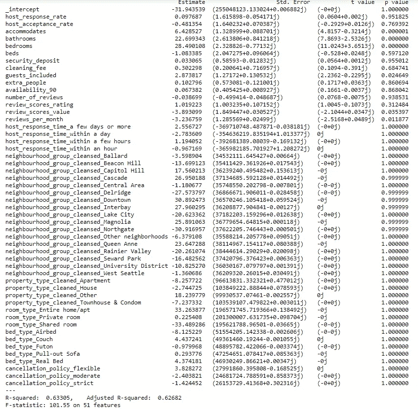

在没有任何特征标准化的情况下，训练集的调整后的 R 平方约为 0.62。但是如果我们看一下 p 值，几乎所有的 p 值都太大，没有统计学意义。仅有的几个有改进想法的特性<0.05 are “accommodate”, “bedroom”, “bathroom” and “reviews_per_month”. That means only these couple variables contribute to the model performance even if most features have large coefficients.

**现在有 51 个特征，不包括目标变量。由于我在一开始就亲自挑选了这些功能，所以我认为与上市价格相关的功能只是基于我的直觉，但我不能确定这是不是真的。为了确保线性模型不会被一些通常会导致过度拟合的不相关特征“分散注意力”,我将对线性回归模型应用正则化，以惩罚大的系数来换取更简单的模型，从而在缺乏足够训练数据的情况下减少方差。**

**L1 套索正则化具有防止过拟合和特征选择的优点，这是因为其惩罚项的性质倾向于在最小化成本函数 SSE 的过程中将不太相关的特征的系数权重收缩为零。此外，假设我们有一个小数据集(整个数据集中只有 3818 个列表)，我还希望在训练期间利用交叉验证来使模型在泛化性能方面更加健壮。**

**最后但同样重要的是，数据集包含在很大范围内变化的数字要素。所以我需要在训练测试分割和运行模型之间做两个预处理步骤。首先，用中位数填充数值变量中缺失的值。第二，规范价值观。有了 sklearn pipeline，这些连续的步骤可以合二为一。**

****模式二** : **套索回归原价****

**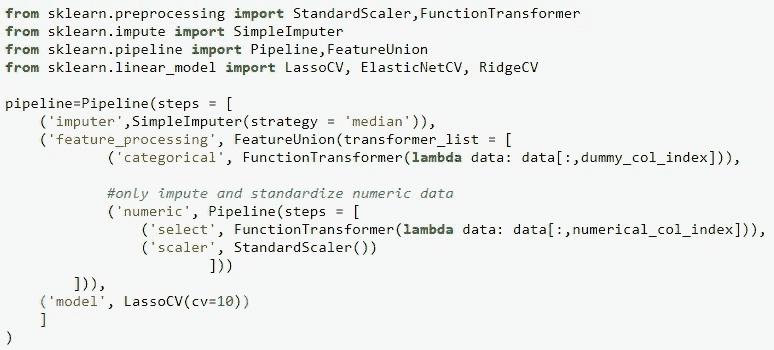**

**LASSO regression model pipeline**

**请注意，这一次我只标准化了数字特征，没有改动虚拟变量。我区别对待它们的原因是，我不仅关心预测的准确性，而且希望以后以直观的方式解释虚拟变量的系数。如果你的目的只是预测，不在乎系数的可解释性，可能就不需要单独对待了。**

****M1 模型性能**用 R 平方衡量:**

**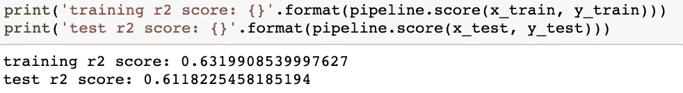**

**r 平方是用来衡量拟合优度的。它是模型中自变量解释的因变量方差的比例。**

**和上次线性回归差别不大。但我对系数更好奇。**

**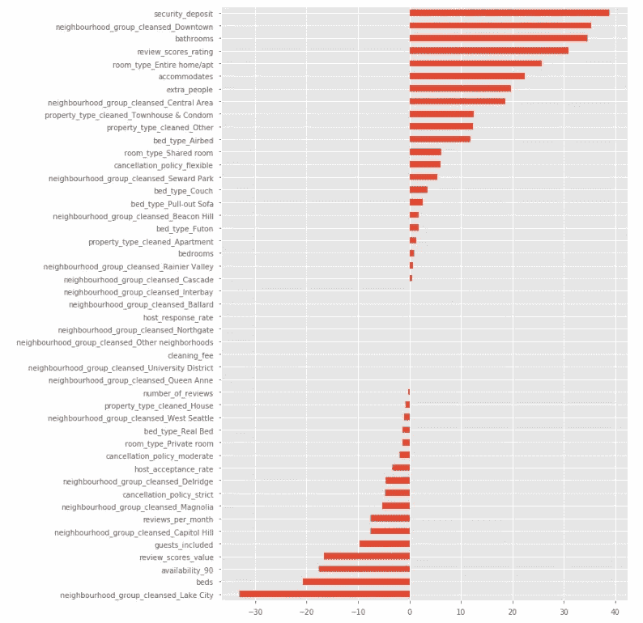**

**Lasso regression coefficients**

**显然，LASSO 已经有效地将一些特征系数推到了零，就像中间的那些。**

****M1 系数解读****

**由于训练数据中的所有数字特征都已标准化，因此任何数字特征中的 1 个单位变化都不再是它们的原始比例，而是由标准偏差决定的。我们没有标准化分类变量，所以它们的变化单位是不变的。**

**因此，我们可以说，如果列表容纳的人数增加 1 个标准差(~ 2 人)，列表的价格将平均增加 23 美元，其他一切保持不变。或者，如果评论分数等级增加 1 个标准(100 分中的 6.6)，价格将平均上涨 27.5 美元。就分类变量而言，市中心一个房源的平均价格比其他地方的类似房源贵 33 美元。**

****模型 3** : **套索回归对数转换价格****

**现在我们来看看目标可变价格的分布。很明显是长尾形状。自然对数变换可以使其服从正态分布。这对于使数据中的模式更易解释和帮助满足推断统计的假设都是有价值的。**

**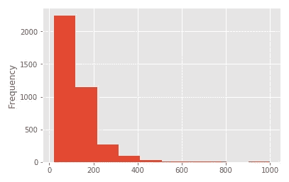****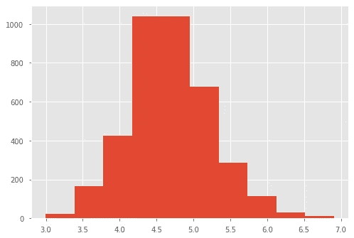**

**left: original price, right: log-transformed price**

**再次运行相同的管道，但这次是在 np.log(y_train)上。**

**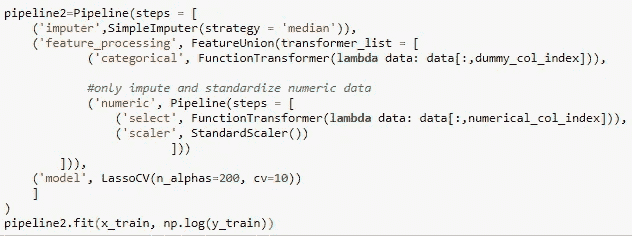**

****M3 车型性能**:**

**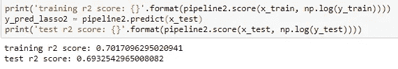**

**测试集性能提高了 12%,因此目标变量的对数变换确实有助于预测。**

**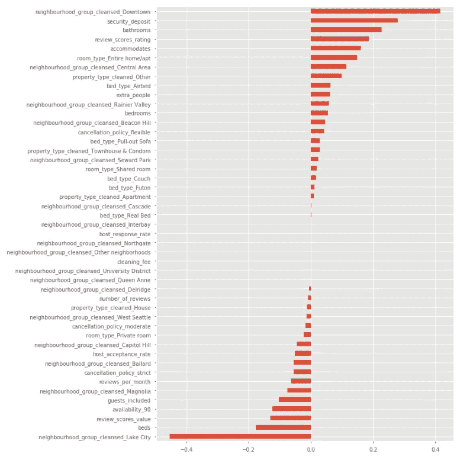**

****M3 系数解读****

**我们以这种形式拟合模型:Log(Y) ~ scaled(数值变量)+虚拟变量。对数转换变量的一般解释如下:X 增加 1 个单位将导致(exp(系数)-1)*100%。**

**由于数值数据是标准化的，1 单位仍然意味着 1 标准差。以“容纳”为例，浴室数量每增加 1 std(约 0.6 个浴室)，挂牌价平均会提高 24% ((exp(0.22)-1)*100%)。**

**图表底部的特征湖城区域与价格负相关程度最高。如果一个列表在湖城地区，价格将比非湖城地区平均低 36% ((exp(-0.45)-1)*100%)，保持其他一切不变。**

**关于标准化自变量或因变量背景下的系数解释的更多细节，我推荐阅读这两篇文章[第一篇](https://www3.nd.edu/~rwilliam/stats1/x92b.pdf)、[第二篇](https://stats.idre.ucla.edu/other/mult-pkg/faq/general/faqhow-do-i-interpret-a-regression-model-when-some-variables-are-log-transformed/)。两者都非常详细地提供了极好的解释。**

****模型 4** : **对数转换价格的随机森林回归量****

**由于线性模型没有产生非常令人满意的 R 平方结果，我想切换到基于树的模型，因为预测值和价格之间可能没有线性关系。**

**对于基于树的模型，我不需要标准化特征，因为决策树仅基于“信息增益”或“杂质(熵)减少”来决定最佳分割，缩放特征不会对树模型分割产生任何影响。我将在对数转换价格上拟合随机森林回归器，用 GridSearchCV 与以前的模型进行性能比较，以找到其最佳参数。**

**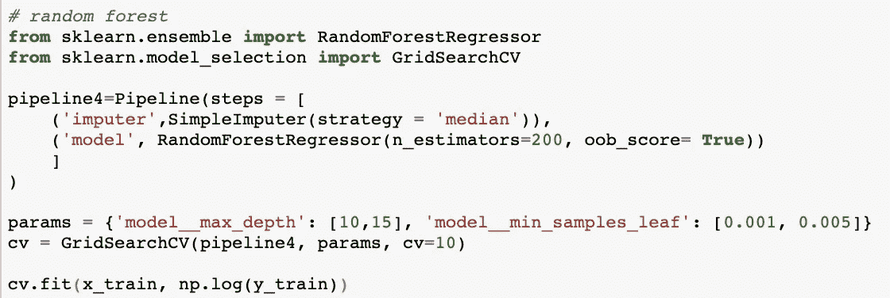**

****M4 车型性能****

**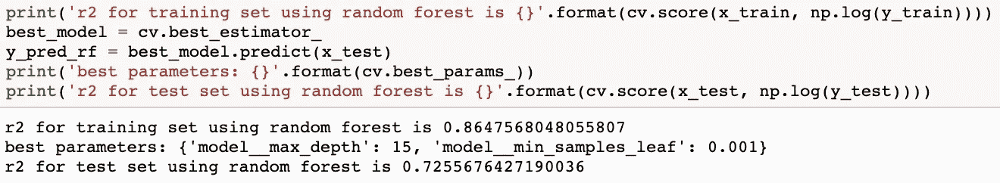**

**在相同的对数转换价格下，测试集的 R 平方得分从 LASSO 的 69%提高了 3%。**

**下面的残差与拟合值图显示了预测价格与实际价格的差距。不幸的是，残差看起来并不是随机分散在蓝线周围的。有些异常值与实际值有很大的误差。**

**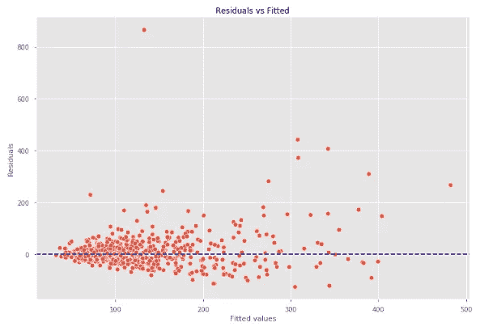**

****M4 随机森林特征重要性****

**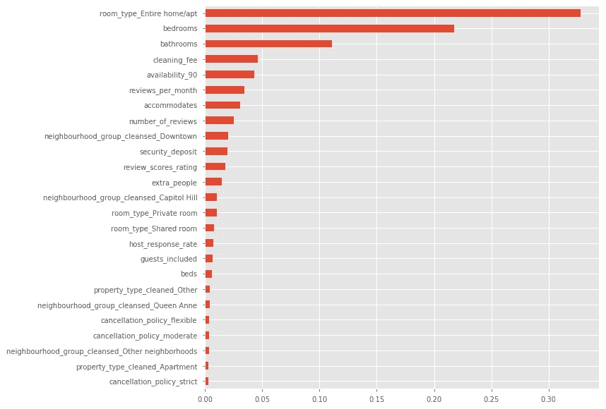**

**随机森林模型发现了一组不同的最重要的特征，特别是房间类型、卧室和浴室是三个主要特征。我们来看看房型是如何影响价格的。**

**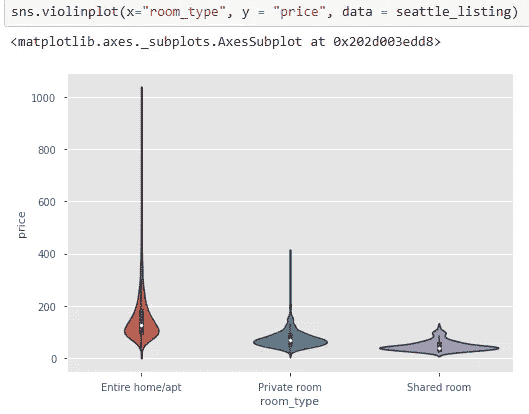**

**列表中的 3 种房型有明确的定价等级，平均价格遵循以下顺序:合租房**

# **最后的想法**

**在几次尝试不同的模型后，测试集中的 R 平方分数仍然不高于 0.8。我认为这可能是由几个原因造成的，最大的原因是数据样本太小(只有 3000 左右)。用这么小的样本量很难得出一个通用的模式，这也导致了随机森林的训练集中的过度拟合。**

**解决这个问题的一个方法是获取更多其他城市的 Airbnb 房源数据，以增加数据样本。当收集到足够的数据时，我还可以尝试运行梯度推进树模型以获得更好的预测准确性。**

**统计学习和机器学习是解决回归问题不可或缺的两个部分。虽然机器学习为我们提供了更复杂的预测模型，但统计测试在特征选择、多重共线性检测以及判断回归系数的统计意义方面非常有用。作为数据科学家，我们应该非常了解双方。**

**感谢阅读！由于学习从未停止，随着迭代的进行，我将不断更新这篇文章，提供更多的结果。敬请关注。**