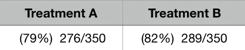
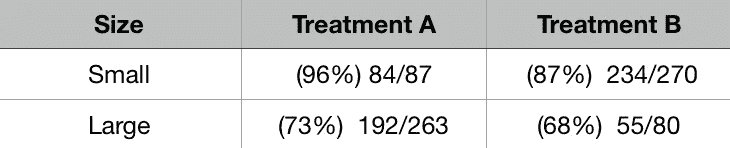
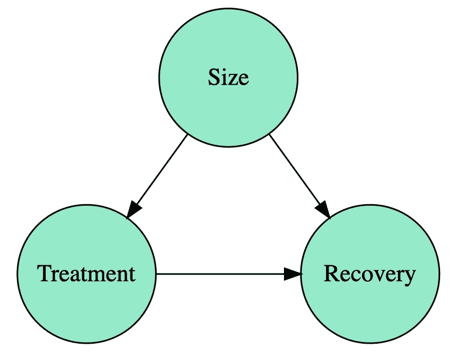
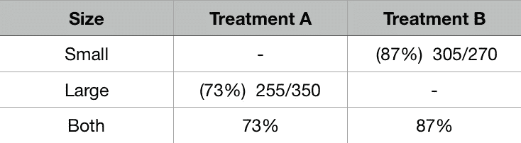
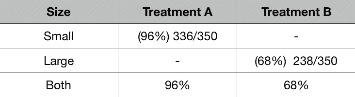
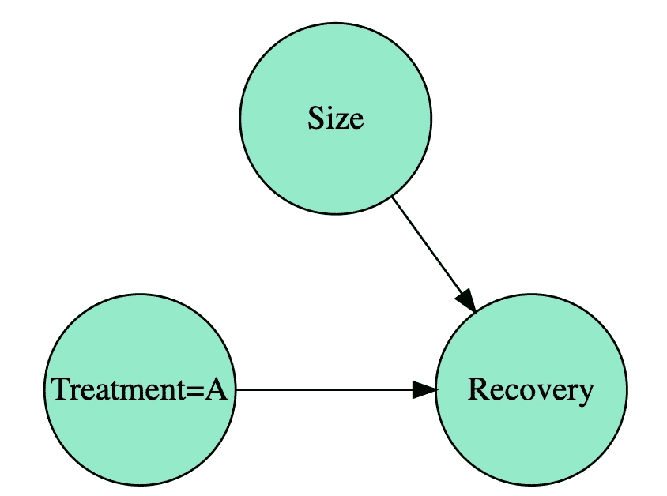
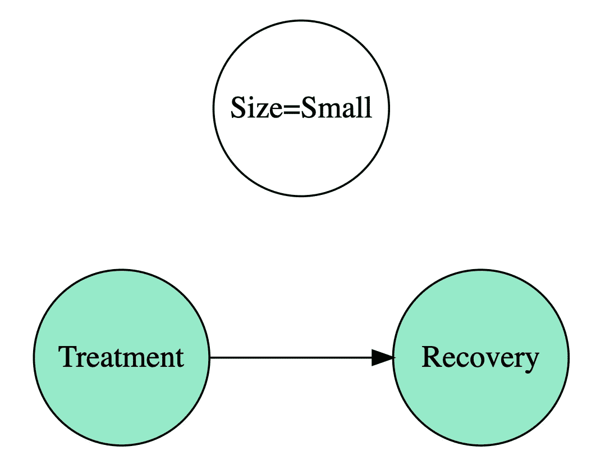
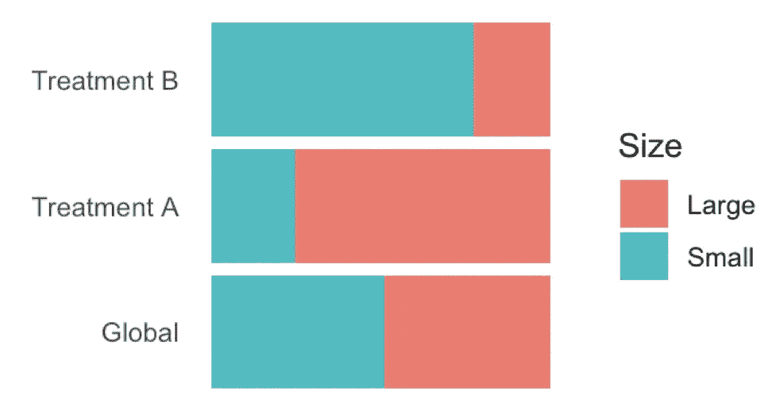
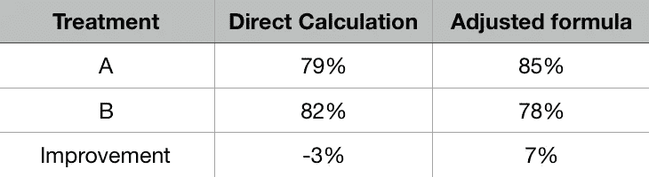
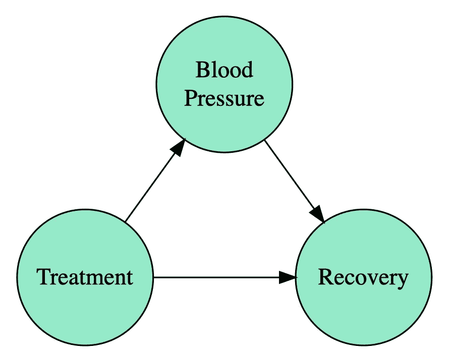

# 解决辛普森悖论

> 原文：<https://towardsdatascience.com/solving-simpsons-paradox-e85433c68d03?source=collection_archive---------8----------------------->

## [偶然的因果推断](https://towardsdatascience.com/tagged/casual-causal-inference)

## 理解因果推理中的一个关键玩具例子

这是因果推理和数据科学系列文章的第四篇。前一个是[“观察不干预”](/observing-is-not-intervening-9fbd22679f44)。

辛普森悖论就是一个很好的例子。起初，它挑战了我们的直觉，但是如果我们能够适当地剖析它，它给出了许多关于如何处理观察数据(不是通过精心设计的实验获得的数据)的分析的想法。它出现在许多数据分析中。我们将用众所周知的肾结石的例子来说明。这里解释的技术可以在 Pearl 等人的“统计学中的因果推断:初级读本”中找到。

# 肾结石的例子

在医院里，一位医生正在处理肾结石。她有两种治疗方法，比如 A 和 B。她将两种方法各占一半(A 组 350，B 组 350 ),并测量每种治疗方法的成功率。结果可在下表中找到:

显然，治疗 B 是最好的。工作完成了，她可以回家了。但是……等等！她知道她有更多的信息，想看一看，以防万一…她也有宝石的大小，也许这些信息是相关的。然后她想出了这张表:

嗯……对于小石头 A 更好，对于大石头 A 更好，但是聚合 B 更好？！搞什么@#*！！

# 这是怎么回事？

然后她回忆起病人是如何被挑选出来的。一旦新病人来了，她就对他们的结石有了猜测。治疗 A 是进行某种手术，而治疗 B 基本上是给他们吃药。她知道给大结石吃药丸效果更差，所以疑难病例被分配到治疗 a。这个过程使得治疗比较更加困难！

使用图表，我们可以显示如下数据过程

Data generation process

大小影响治疗任务和康复的机会。这被称为**混淆**，因为你不能从恢复的大小来区分治疗的效果。

# 极端群体分配

为了理解任务如何影响我们的结论，想象一下这两个*组成的*极端情况:

1.  a 只收到大石块，而 B 只收到小石块
2.  颠倒过来

Case 1

Case 2

正如你所看到的，将所有困难的情况分配给 A，会使 A 看起来效率最低，而将所有困难的情况分配给 B，会使 B 看起来效率最低。有道理！

# 干预

我们要回答的问题如下:如果医院必须选择*只有一种治疗*，会是哪一种？

正如我们在之前的帖子[“观察不是干预”](/observing-is-not-intervening-9fbd22679f44)中看到的，这可以用一个图表来表示，这个图表代表我们想要知道的分布。

Intervening on treatment

这种分布会对我们给每个人 A 治疗的情况做出反应。对一个变量的干预是通过去除它相对于它的先行变量(它所依赖的那些变量)的依赖性来定义的。因果推断中的主要问题是，我们是否可以仅从数据生成分布中获得信息来对这种新的介入分布进行推断。

# 调整公式

诀窍如下:如果我们把注意力集中在小结石上，那么所有恢复的效果都可以从治疗中得到解释，所以我们可以测量它的有效性

Conditioning on small size stones

我们可以对大石块做同样的事情。但是我们怎么把这两个量结合起来呢？如果大小不影响治疗分配的话，就按照他们被分配的方式。这意味着我们使用结石大小的全球分布，而不是使用治疗分配的分布。

Distribution of sizes

正如你所看到的，大小石头的数量相当，而每种处理的大小分布不均匀。

把这个过程写下来我们就得到所谓的**调整公式**。

P(R | A)= P(R |小，A) * P(小)+P(R |大，A) * P(大)

可以看出(虽然不简单),这个公式正是我们要寻找的:计算介入图中的恢复概率，但是只使用从数据生成图中获得的数据。

可以对治疗 B 进行同样的操作，然后比较结果。

我们从最初的“更好的 B”3%上升到“更好的 A”7%！！

# 好吧，那么，让我们总是调整！

没那么快…有些情况下调整会带来错误的结论。在上面的例子中，为了测量治疗的效果，大小变成了一个“嘈杂的东西”,我们想要去除它的影响。现在换个角度思考。想象一下你有某种疾病的治疗方法。此外，你知道(因为你测量它)影响病人的血压。同时，你知道(因为你在职业生涯中见过很多次)血压也影响你康复的机会。在这种情况下，您将以这种方式生成数据

现在治疗有直接的方式和间接的方式影响你的恢复。但你对两者都感兴趣！你不想从中去除任何影响。这个想法是，在这种情况下，你不需要应用任何调整，因为直接测量会给你正确的数量。或者等价地，如果你干预治疗(回想一下，这意味着消除对治疗原因的依赖)，你会得到同样的图，所以你什么也不用做！

# 结论

这个简单的例子给了我们关于如何分析观察数据中的因果关系的有力结论。

1.  数据本身不会说话:直接计算可能会得出错误的结论
2.  更多的数据并不能解决问题:你可以增加病人的数量，但仍然会得到同样的悖论！
3.  相关性是不够的:相关性是一个对称函数，而因果性不是。后者具有明确的方向性。
4.  不同的模型导致不同的结论:根据不同的情况，我们必须应用或不应用调整公式，因此有不同的结论。这只是用图表来论证的！
5.  图表是一个很好的交流工具:我们已经在"[使用图表中看到了！](/use-causal-graphs-4e3af630cf64)“我们再次确认！